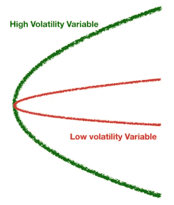
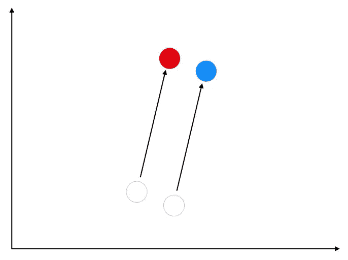
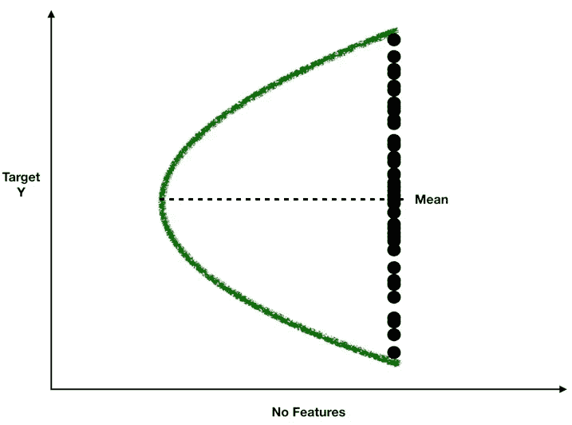
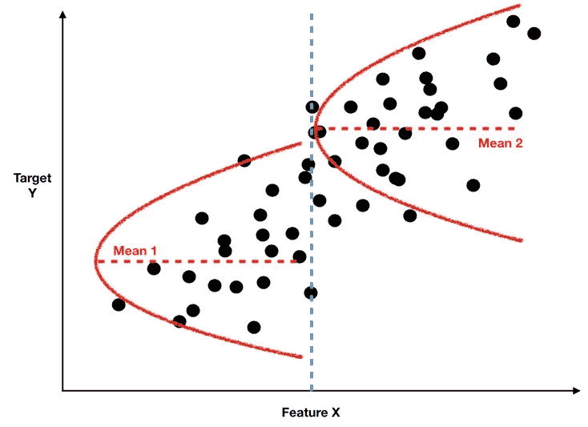
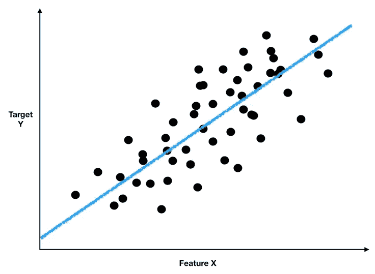
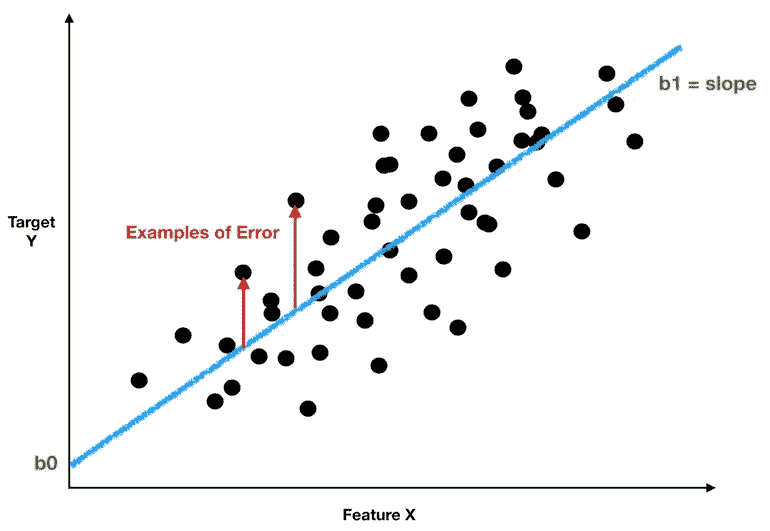

# 了解线性回归

> 原文：<https://towardsdatascience.com/understanding-linear-regression-94a6ab9595de?source=collection_archive---------7----------------------->


照片由[德鲁·比默](https://unsplash.com/@drew_beamer?utm_source=medium&utm_medium=referral)在 [Unsplash](https://unsplash.com?utm_source=medium&utm_medium=referral) 上拍摄

## 数据科学的主力

尽管近年来流行更复杂和更奇特的模型，但线性回归仍然难以击败，因为它具有通用性、稳健性和可解释性。

这是一个简单但功能强大的模型，只需完成工作。如果你想进入定量领域，你需要了解它是如何工作的。

# 线路拟合

线性回归基本就是直线拟合。它会问问题— **“最符合我的数据的直线方程是什么？”**好看又简单。

一条线的方程式是:

```
Y = b0 + b1*X
```

目标变量 y 是我们试图建模的东西。我们想了解(也就是解释)它的变化。在统计学中，方差是不确定性的度量。这是一种价值在它的平均值附近波动的趋势。



波动性的可视化(图形由作者创建)

左图说明了这一点。绿色变量具有很高的方差，因此在其平均值(圆锥的中心)周围有很大的不确定性圆锥。红色变量具有较低的方差。在对变量一无所知的情况下，当猜测红色变量的值时，我们会对自己不会太离谱的能力更有信心。

**但是在数据科学和统计学中，我们通常不担心方差，我们只担心无法解释的方差。也就是说，如果我们能找到一些其他的变量(特征变量，X ),来解释 Y 的大部分变化，那么我们是好的。**

有了这样一个特征变量，如果有人问我对 Y 的预测，我只需要查找 X 等于什么，我就可以合理地确定 Y 会是什么。Y 的大部分变化已经通过引入 x 得到了解释。

# 相关特征有助于解释差异

那么为什么直线拟合能帮助我们解释方差呢？想想这条线的方程代表什么。它定义了 X 和 Y 之间的关系。通过将 X 乘以 b1 并与 b0 (b0 + b1*X)求和，我们可以根据给定的 X 值来预测 Y。



正相关的事物往往会一起移动(作者创建的图形)

**当然，这只适用于 X 和 Y 相关的情况(正相关或负相关)。**相关性衡量两个事物一起运动的趋势(或者在负相关的情况下彼此相反)。比如人的身高和体重是正相关的。你越高，体重越重。

所以直线拟合允许我们从已知的 X 值来推断未知的 Y 值，这要归功于 X 和 Y 之间的相关性。

我们用线性回归方程中的 X 变量来解释 Y 的方差。通过以这种方式解释方差，我们实际上减少了方差——解释方差是我们不再需要担心的方差。

***关键的假设是 X 变量是容易测量的，容易理解的，并且它们本身不是一个谜。*** 一个常见的建模错误是使用本身无法实时观察到的变量来预测某事。用未来的数据预测未来的模型是不好的。

让我们看看这个过程是如何进行的。当我们从一个 Y 变量开始时，我们所知道的只是它的分布。在下图中，所有的方差(绿色圆锥)都是无法解释的，我们对 Y 的未来值的最佳猜测是它的平均值。



仅 Y 变量(由作者创建的图形)

现在，假设我们发现了一个与 y 正相关的特征变量 X。下图显示了 X 如何帮助解释方差。我们可以根据 Y 的 X 值将 Y 的观测值分成两部分。对于较低的 X 值，Y 的期望值为平均值 1，方差近似为左边的红色圆锥。对于较高的 X 值，Y 的期望值为平均值 2，方差近似为右边的红色圆锥。



特征 X 有助于解释 Y 的一些变化(图形由作者创建)

**注意通过这种方式分割，方差(红色圆锥)相对于原始绿色圆锥有所减少。我们对 Y 的新预测，或者是均值 1，或者是均值 2，这取决于 X 是什么，比我们以前的天真预测(Y 的均值)要精确得多。**

但是为什么要在两个分段上停下来呢？如果我们画更多的蓝色垂直虚线，将数据分成更多的桶，我们可以解释更多的差异，并产生更精确的预测。

这就是线性回归的作用。**实际上，它绘制了大量的垂直线，将数据分成许多微小的片段。这最大化了解释的方差和我们预测的精确度。**



线条拟合(作者创建的图形)

# 普通最小二乘法(OLS)

让我们快速了解一下线性回归如何找到最佳拟合线。虽然有一个解析解，但你可以把它看作一个优化问题。线性回归算法想要:

```
Find the values for **b0** and **b1**that **minimizes the sum of squared errors.**
```

**误差是数据(黑点)和蓝线**之间的距离——在下图中，红色箭头表示误差。我们平方误差，因为它可以是正的，也可以是负的。



OLS 可视化(图形由作者创建)

既然我们知道误差是实际观察值(Y，黑点)和我们的预测值(蓝线)之间的差异，我们可以更详细地写出我们的优化问题:

```
Find the values for **b0** and **b1**that **minimizes the sum of squared errors.**Where squared error for observation i
= **(Yi - (b0 + b1*Xi))^2**And the sum of squared error is just the sum of 
(Yi - (b0 + b1*Xi))^2 for all observations.
```

为了计算误差平方和，我们取一个黑点和蓝线之间的每一个垂直距离，对它们求平方，然后求和。找到使误差平方和最小的 b0 和 b1 值，就能得到最佳拟合线。

## 回归参数

参数(b0，b1 等。)、**被称为贝塔**，这种回归是很重要的。在我们之前的例子中，我们只有一个特征变量。但是假设我们有三个特征变量:

```
Y = b0 + b1*X1 + b2*X2 + b3*X3
```

*   **b0** 是 Y 轴和蓝线之间的截距，告诉我们当所有特征变量都为 0 时 Y 的期望值。
*   **b1** 告诉我们，当保持 X2 和 X3 不变时，改变 X1 如何影响 y
*   **b2** 告诉我们，当保持 X1 和 X3 不变时，改变 X2 如何影响 y
*   **b3** 告诉我们，当保持 X1 和 X2 不变时，改变 X3 如何影响 y

**解释贝塔系数的一个关键假设是，你可以保持其他特征变量不变。**在某些情况下，很难在不改变一个特性的情况下改变另一个特性。在这种情况下，我们希望包括这些交互效应(另一篇文章的主题)。

# r——量化解释的差异量

最后，我们想弄清楚我们能够解释多少原始方差(因为目标是解释，因此减少方差)。

我们可以通过计算 R:

```
R^2 = 1 - (residual sum of squares / total sum of squares)
```

残差(也称为误差)平方和与我们预测误差的方差(黑点和蓝线之间的垂直距离)成比例。预测误差是实际观测值和我们的模型预测值之间的差异。这是一种无法解释的方差的度量。

总平方和与我们试图解释的(Y 的)总方差成正比——它实际上是 Y 方差公式的分子。

残差平方和与总平方和的比率衡量运行线性回归后未解释的方差的比例。换句话说，它是不确定性的比例，我们不能用线性回归使其消失。

**因为 R 是 1 减去该比率，所以它可以被认为是解释的方差的比例:**

```
**R^2** 
= 1 - (residual sum of squares / total sum of squares)
= 1 - proportion of variance unexplained
= **proportion of variance explained**Since: 
prop. of variance unexplained + prop of variance explained = 1
```

因此，如果在运行我们的回归后，我们看到 R 为 0.90，这意味着我们在模型中包括的 X 变量有助于解释 y 中观察到的 90%的方差。换句话说，我们成功地解释了我们感兴趣的变量周围的许多不确定性。

在以后的文章中，我们会做一些例子，看看当一些支持线性回归的假设被违反时会发生什么。在那之前，干杯！

[***如果你总体上喜欢这篇文章和我的写作，请考虑通过我在这里的推荐链接注册 Medium 来支持我的写作。谢谢！***](https://tonester524.medium.com/membership)

# **延伸阅读:**

[](/the-art-of-forecasting-d2a8806b7aa0) [## 预测的艺术

### 当我们试图预测未来时，到底发生了什么

towardsdatascience.com](/the-art-of-forecasting-d2a8806b7aa0) [](/understanding-logistic-regression-using-a-simple-example-163de52ea900) [## 用一个简单的例子理解逻辑回归

### 逻辑回归是进行分类的基本工具之一。作为未来的数据科学家，我…

towardsdatascience.com](/understanding-logistic-regression-using-a-simple-example-163de52ea900) [](/understanding-maximum-likelihood-estimation-mle-7e184d3444bd) [## 理解最大似然估计

### 这是什么？它是用来做什么的？

towardsdatascience.com](/understanding-maximum-likelihood-estimation-mle-7e184d3444bd)