# 使用奇异值分解理解线性回归

> 原文：<https://towardsdatascience.com/understanding-linear-regression-using-the-singular-value-decomposition-1f37fb10dd33?source=collection_archive---------32----------------------->

## 介绍奇异值分解以及如何用它来解决线性回归问题

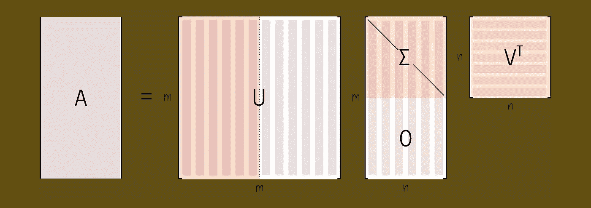

作者图片

# 介绍

解释线性回归的博客文章和教育材料非常常见。在大多数情况下，可能是因为大数据和深度学习偏见，这些教育资源中的大多数都采用梯度下降方法来拟合线、平面或超平面以适应高维数据。在本帖中，我们也将讨论如何解决线性回归问题，但是是通过不同的视角。更具体地说，我们将讨论线性代数最基本的应用之一，以及我们如何用它来解决回归问题。是的，我说的是奇异值分解。这种计算工具被用作解决无数问题的基础，包括使用 [PCA](https://en.wikipedia.org/wiki/Principal_component_analysis) 进行维度缩减，以及使用线性回归进行统计学习。

# 线性模型和线性方程组

通过线性代数的视角，回归问题简化为求解形式为 **Ax = b** 的线性方程组。这里， **A** 和 **b** 是已知的， **x** 是未知的。我们可以把 **x** 当做我们的模型。换句话说，我们想要为 **x** 求解系统，因此， **x** 是将 **A** 中的观察值与 **b** 中的测量值相关联的变量。

在这里， **A** 是一个数据矩阵。我们可以认为**和**的行代表同一现象的不同实例。它们可以代表提交给医院的单个患者的记录、正在出售的不同房屋的记录或不同人的脸部照片。作为补充，我们可以将矩阵 **A** 的列视为记录了 **A** 的行中每个实例的不同特征。在患者医院的例子中，这样的特征可以包括他/她到达医院时的血压，或者患者是否进行过外科手术。

另外，注意矩阵**和**可能有不同的形状。首先， **A** 可以是一个方阵。是的，这是非常不可能的(对于我们通常在数据科学中遇到的情况)，但在其他方面是可能的。

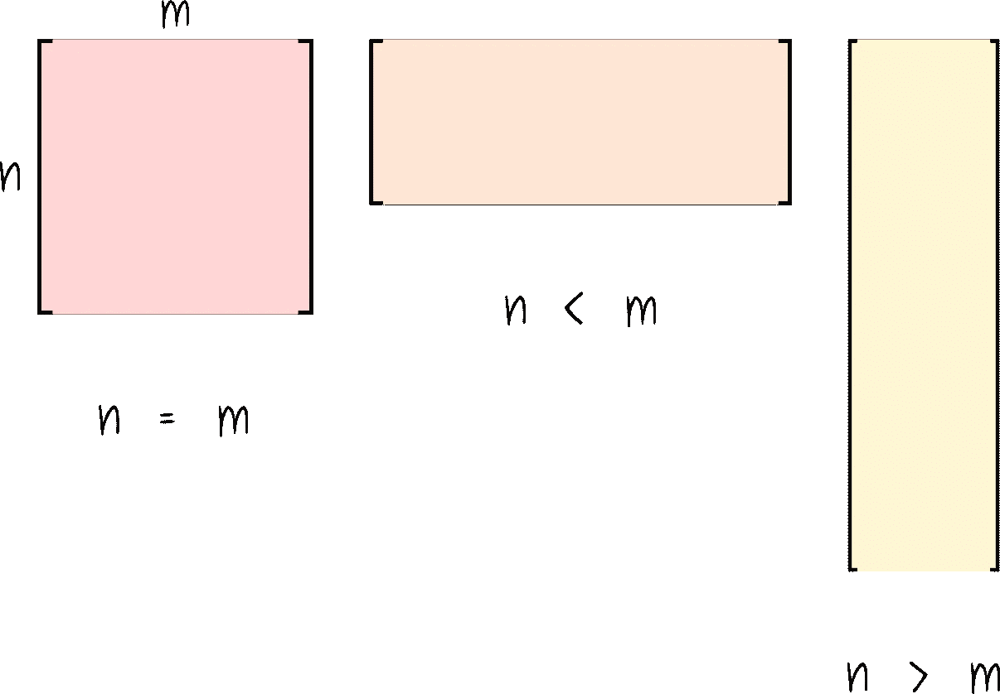

矩阵**和**可以具有不同的形状。可以平方。它可以又宽又矮，也可以又高又瘦——图片由作者提供

第二， **A** 的列数可以多于行数。在这个场景中， **A** 会有一个又短又宽的形状。最后，(这是数据科学中最常见的情况)，矩阵 **A** 呈现出又高又瘦的矩阵形式，行数比列数多得多。

> 但是我为什么要关心矩阵 A 的形状呢？

有趣的是， **A** 的形状将决定线性方程组是否有解，是否有无穷多个解，或者根本没有解。

先说无聊的案子。如果矩阵是平方的(行数等于列数)并且是可逆的，这意味着矩阵 **A** 具有满秩(所有列线性无关)，这就很好地解决了问题。

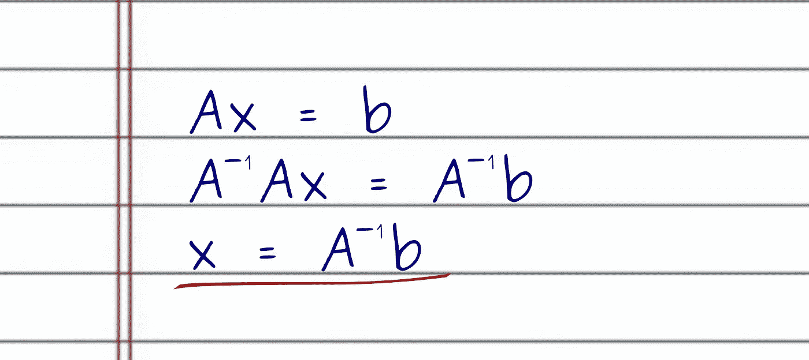

如果矩阵 **A** 是平方且可逆的，则方程组有解——作者图片

然而，如果矩阵的列数比行数多，我们可能会遇到有无穷多个解的情况。为了形象化这个奇怪的场景，想象一个 3 × 6 的矩阵，即 3 行 6 列。我们可以认为它有一个 3D 空间和 6 个不同的向量，我们可以用它们来跨越 3D 空间。然而，要跨越一个 3D 空间，我们只需要 3 个线性无关的向量，但我们有 6 个！这留下了 3 个相关向量，可用于制定无限多的解决方案。

最后，通过类比，如果我们有一个行数比列数多的矩阵 **A** ，我们可以将它视为试图用比我们需要的更少的向量来跨越一个非常高维的空间。例如，想象一个 6 行 2 列的矩阵。这里，我们有一个 6D 空间，但是我们只有两个向量来跨越它。不管我们怎么努力，在最好的情况下，我们只能在 6D 上跨越一个平面。这是至关重要的，因为如果向量 **b** 在 **A** 的列空间中，我们只有 **Ax = b** 的解。但是在这里， **A** 的列空间跨越了一个更大的 6D 空间上的 2D 子空间(一个平面)。这使得向量 **b** 在由 **A** 的列所跨越的子空间中的概率变得不可能。

为了形象化这种可能性有多大，想象一个 3D 空间和一个由两个向量构成的子空间(一个 3D 平面)。现在，想象你随机选择 3 个值。这将给你一个三维空间的点。现在，问问你自己:*我随机选择的点在平面上的概率是多少？*

尽管如此，在我们没有一个线性方程组 **Ax = b** 的解的情况下(或者我们有无穷多个解)，我们仍然想尽力而为。为此，我们需要找到最佳近似解。这就是奇异值分解发挥作用的地方。

# SVD 的简短介绍

奇异值分解或 SVD 的主要思想是，我们可以将任意形状的矩阵 **A** 分解成 3 个其他矩阵的乘积。

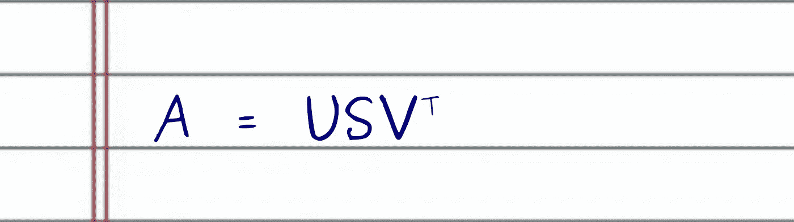

给定任意形状的矩阵，奇异值分解将 **A** 分解成 3 个矩阵的乘积: **U，σ**， **Vᵀ** — 作者图片

这里， **U** 是一个 *m × m* 的方阵，**σ**是一个形状为 *m × n* 的矩形矩阵， **Vᵀ** 是一个形状为 *n × n* 的方阵。

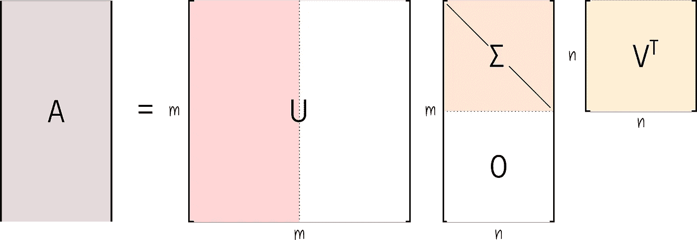

完整的奇异值分解矩阵——作者图片

矩阵 **U** 和 **Vᵀ** 有一个非常特殊的性质。它们是 ***酉矩阵*** 。拥有像 **U** 和 **Vᵀ** 这样的酉矩阵的一个主要好处是，如果我们将这些矩阵中的一个乘以它的转置(或者反过来)，结果等于单位矩阵。

另一方面，矩阵**σ**是对角的，它存储按相关性排序的非负奇异值。

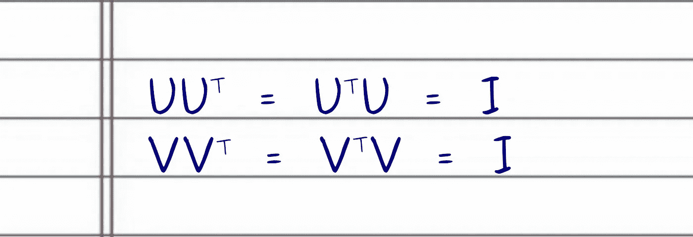

酉矩阵的性质——作者图片

注意，由于**σ**矩阵是对角的，只有第一 *n* 行对角值值得保留。事实上，**σ**的最后 *n* 行都是用 0 填充的。为此，通常只保留**σ**的第一个 *r × r* 非负对角线值，以及相应的 *r* 列和 **U** 和 **Vᵀ** 行。注意 *r = min(m，n)* 。这通常被称为经济(或紧凑)SVD，从这一点开始，我们将假设矩阵 **U** 、**σ**和 **Vᵀ** 来自经济过程。

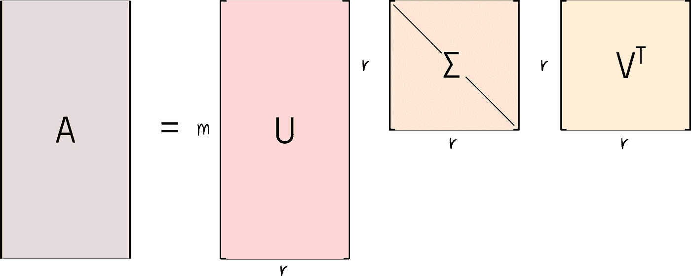

经济奇异值分解数据矩阵—作者图片

值得注意的是，经济 SVD 产生矩阵 **U** 和**σ**的形状变化(如果**σ**的对角线值之一为零， **Vᵀ** 也会发生形状变化)。如果**σ**的对角线值都是正的，因此 *r = n* ，我们丢弃 **U** 矩阵的右半部分( **U** 的正交补)，这给出了 **U** 一个矩形 *m × r* 的形状。更关键的是， **U** ，可能还有 **Vᵀ** ，现在都是半酉矩阵，也就是说只有 **UᵀU = VᵀV = I** 。

奇异值分解提供了一个基础，允许我们根据低秩矩阵近似来重构输入信号。让我说得更清楚些。如果我们将 **U** 的每一列与 **Vᵀ** 的相应行组合，并通过相应的 **σ** 值缩放所得矩阵，我们将得到 **A** 的最佳秩 1 近似，以最小二乘法表示。

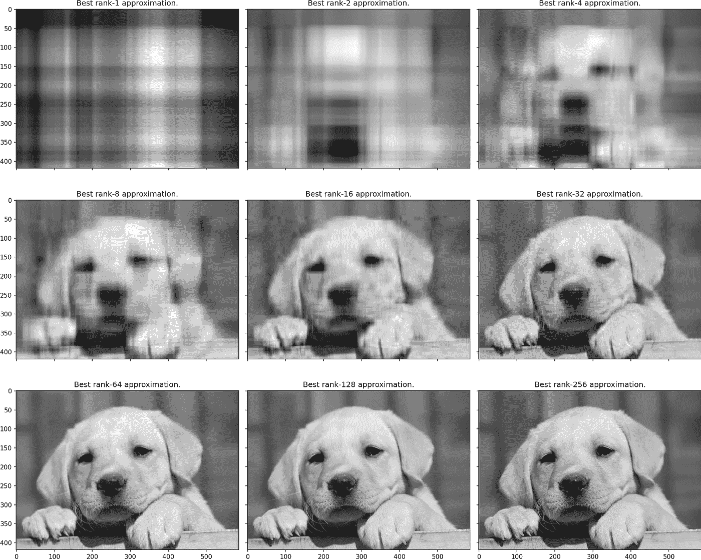

输入矩阵的秩 n 近似(一个图像)**一个**对于不同的秩-图像由作者提供

并且当我们继续将 **U** 的列与 **Vᵀ** 的行组合时，通过相应的 **σ** 进行缩放，我们得到数据矩阵 **A** 的下一个最佳秩 I 近似。事实上，这是奇异值分解的另一个优秀应用——数据压缩。但那是另一篇文章的主题。

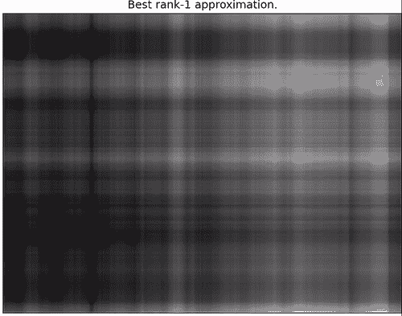

使用奇异值分解的 **U** 、**σ、**和 **Vᵀ** 矩阵进行图像重建。使用前 256 个奇异值，我们得到原始输入图像的最佳秩-256 近似(它可以在视觉上完美地重建原始图像)-作者图像

正如我们之前说过的，使用非方阵 **A** 的问题是我们不能求逆。这就是为什么我们不能像解方阵 **A** 那样解方程组的主要原因。然而，如果我们不能将矩阵 **A** 求逆，我邀请你问自己以下问题。

> 什么是最佳矩阵 **A⁺** ，当乘以 **A** 时，会尽可能接近单位矩阵 **I** ？

这个问题的答案解决了当方程组有无穷多解或无解时，寻找最佳可能解的问题。幸运的是，答案也在 SVD 中。

如果我们知道 SVD 总是存在(对于任何形状的矩阵)，并且通过组合 **U** 的列、 **Vᵀ** 的行和奇异值 **σ** ，我们可以几乎完美地重构原始输入矩阵，如果我们试图对 SVD 求逆会发生什么呢？

我就不多说了吧。原来近似解决问题**a⁺a**≈I 的最佳矩阵 **A⁺** 是 SVD 的逆。换句话说，A⁻的最佳近似值是 SVD⁻的最佳近似值。让我们跟着数学走。

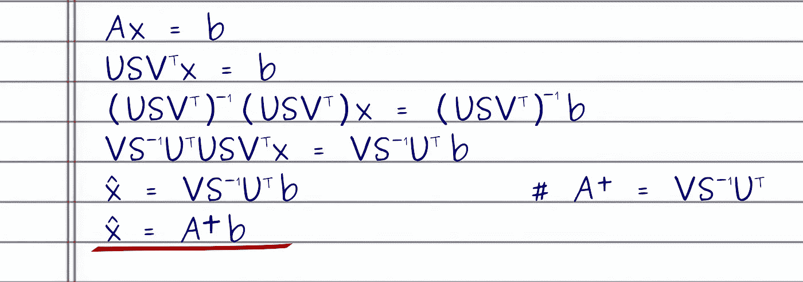

通过奇异值分解求 **A** 的伪逆。伪逆的 **A⁺** 是我们能得到的最接近作者不存在的 **A⁻ —** 的图像

首先，我们计算 **A** 的奇异值分解，得到矩阵 **USVᵀ** 。为了求解 **x** 的方程组，我需要将方程的两边乘以 SVD 矩阵的逆矩阵。幸运的是，现在很容易对 3 个 SVD 矩阵中的每一个求逆。为了求 3 个矩阵 **USVᵀ** 的乘积的逆，我取逆矩阵的乘积！

在对 **USVᵀ** 矩阵求逆后，如果我们仔细观察左边，我们可以看到大多数矩阵会疯狂地抵消，给我们留下最佳近似解 **x̂** 。注意，由于矩阵 **U** 是半酉矩阵，只有 **UᵀU = I** 成立。此外，如果(并且我们假设)所有奇异值都是非负的，那么 V **ᵀ** 连续成为酉矩阵。因此，为了反转 **U** 和 **Vᵀ** ，我们只需将每一个乘以它们的转置，即 **UᵀU = I** 和 **VVᵀ = I** 。

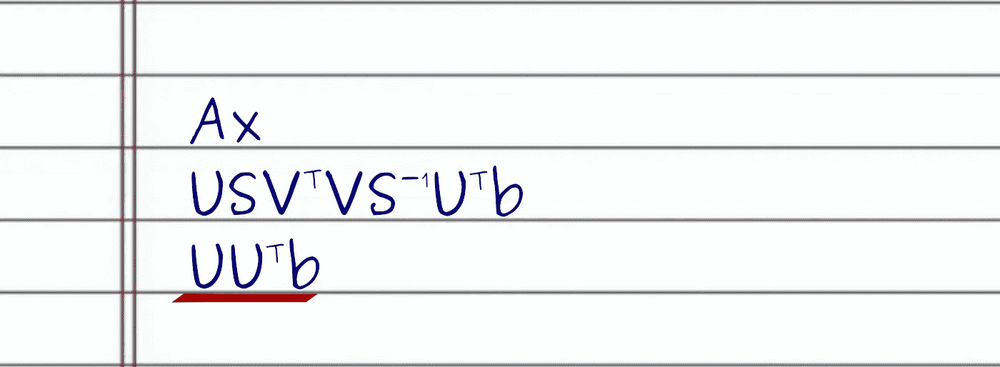

找到作者的 **b** — 图像的投影

如果我们更进一步，将我们的最佳解 **x̂** 代入 **Ax̂** ，我们将看到大多数矩阵也相互抵消，直到我们到达 **UUᵀ** 。我们之前说过， **U** 是半酉矩阵， **UUᵀ** 不是单位矩阵。相反， **UUᵀ** 是 **b** 在 **U** 的列(因此是 **A** 的列)所生成的子空间上的投影，这是最小二乘意义上的最佳近似解，即我们找到了最小二乘解 **x̂** = *最小值*(**ax-b**‖₂).

注意，如果 **A** 的列数多于行数，并且有无穷多个解，那么奇异值分解会选择具有最小 2 范数的解，即 **x̂** = *最小值*(**x̂**‖₂).

# SDV 线性回归

一旦我们建立了所需的 SVD 术语，我们就可以用它来寻找现实世界问题的近似解决方案。在这个例子中，我将使用[波士顿房价数据集](https://scikit-learn.org/stable/modules/generated/sklearn.datasets.load_boston.html)。房价数据矩阵 **A** 包含 506 行(代表单个房屋)和 13 列(每一列描述房屋的不同特征)。这 13 项功能包括:

*   按城镇分列的人均犯罪率
*   每个住宅的平均房间数
*   到五个波士顿就业中心的加权距离

你可以在这里看到[的完整描述](https://scikit-learn.org/stable/datasets/index.html#boston-dataset)。

我们希望预测**中值房价为** $1000。这些测量值是从 5 到 50 的真实值，它们代表我们的方程组 **Ax = b** 中的 **b** 向量。

通常，矩阵的行数比列数多得多。这意味着我们不能将 **A** 求反来找到 **Ax = b** 的解。此外，它大大降低了找到解决方案的可能性。事实上，只有当 **b** 是 **A** 的列的线性组合时，这样的解决方案才是可能的。然而，使用 SVD，我们将能够导出伪逆 **A⁺** ，以找到最小二乘法的最佳近似解— ***，这是向量 b 到由 a 的列所跨越的子空间上的投影。***

代码非常简单，结果非常好。事实上，它们是线性模型的最佳选择。

简单说明一下，请看上面 python 代码的第 9 行。在这一行，我在数据矩阵 **A** 中添加了一列全 1。该列将允许线性模型学习偏置向量，该偏置向量将向超平面添加偏移，使得它不穿过原点。

看看下面的训练和测试结果。

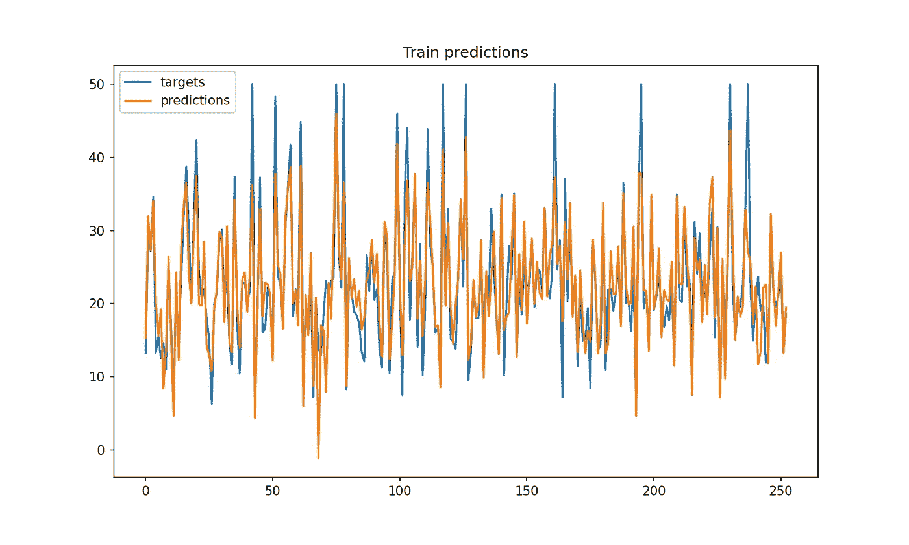

基于奇异值分解的线性模型的训练预测—图片由作者提供

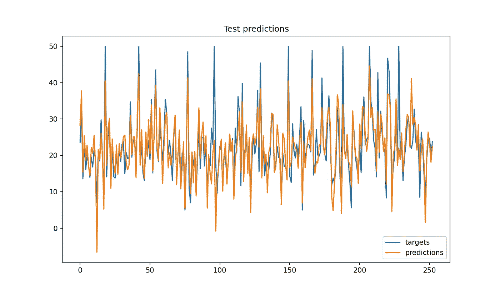

基于奇异值分解的线性模型的测试预测—图片由作者提供

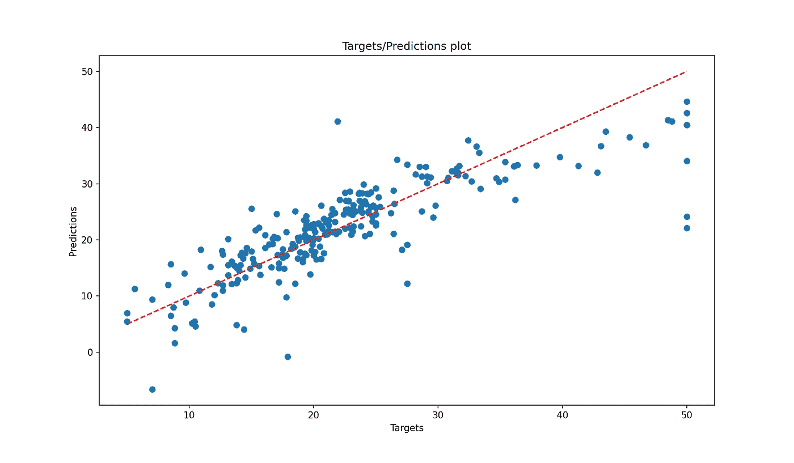

目标/预测图允许我们直观地评估目标值和模型预测之间的相关性。非常准确的预测使点非常接近虚线-图片由作者提供

**感谢阅读！**

*原载于 2020 年 10 月 12 日*[*https://sthalles . github . io*](https://sthalles.github.io/svd-for-regression/)*。*