# 理解逻辑回归

> 原文：<https://towardsdatascience.com/understanding-logistic-regression-81779525d5c6?source=collection_archive---------26----------------------->

## 这种方法的数学详细解释

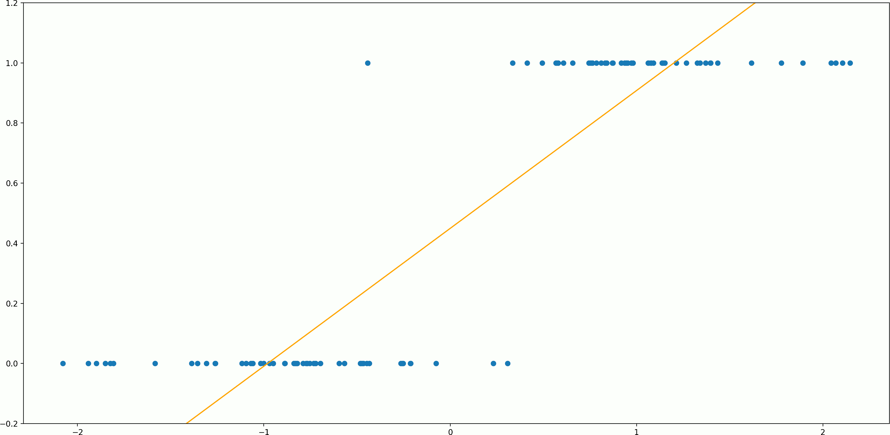

作者图片

什么是逻辑回归？逻辑回归只是将线性回归应用于只有 2 个输出的特殊情况:0 或 1。这个东西最常用于分类问题，其中 0 和 1 代表两个不同的类，我们想要区分它们。

线性回归输出一个范围从-∞到+∞的实数。我们甚至可以在 0/1 分类问题中使用它:如果我们得到一个> = 0.5 的值，将其报告为类标签 1，如果输出< 0.5，将其报告为 0。

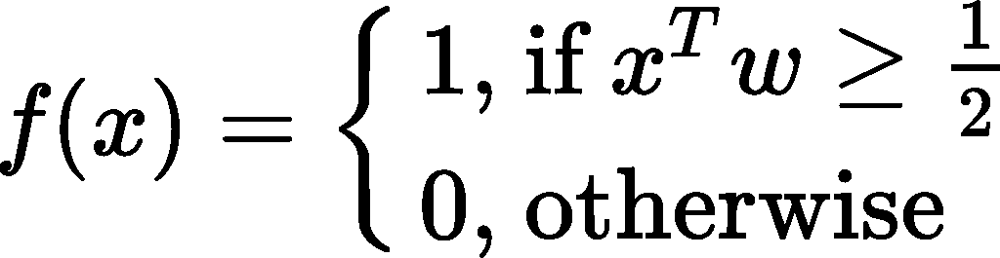

其中 x 是一个观察值的特征向量(加上偏差为常数 1 的分量), w 是权重向量。

但是，如果我们将回归线压缩成介于 0 和 1 之间的“S”形曲线，我们可以在准确性和可解释性方面获得稍好的结果。我们通过将 sigmoid 函数应用于线性回归模型的输出值来压缩回归线。

下面是 sigmoid 函数:

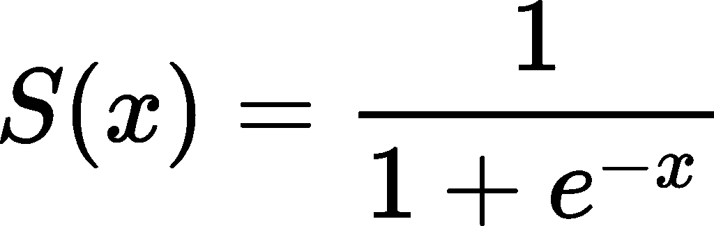

更确切地说，我们按如下方式计算输出:取输入的加权和，然后将这个结果数传递给 sigmoid 函数，并将 sigmoid 的输出报告为我们的逻辑回归模型的输出。

这一过程有助于我们获得稍好的准确性和输出的可解释性。如果我们的模型输出任何实数，如-5 或 7，这些数字实际上意味着什么？关于我们的两个类:0 和 1，我们能知道什么？

但是，当我们有介于 0 和 1 之间的输出时，我们可以把它们解释为概率。逻辑回归模型的输出是我们的输入属于标有 1 的类别的概率。我们模型输出的补充是我们输入属于标记为 0 的类别的概率。

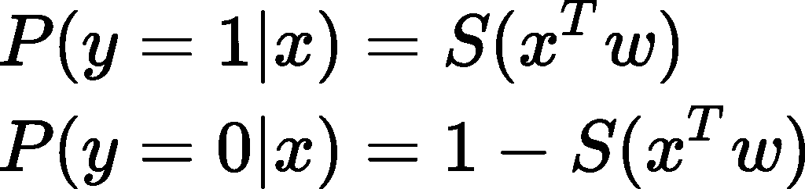

其中 y 是输入 x 的真实类标签。

好的。至此，我们已经看到了给定输入，逻辑回归模型如何获得输出。但是它的重量呢？它应该有什么样的权重才能做出好的预测？

我们的模型需要学习这些权重，它学习的方式是给我们的模型一个目标函数，然后它找到最小化或最大化这个目标的权重。

有许多方法可以得到一个目标函数，特别是当我们考虑在目标中加入正则项的时候。

在本文中，我们将只探讨两个这样的目标函数。

首先，让我们将逻辑回归模型写成如下形式:

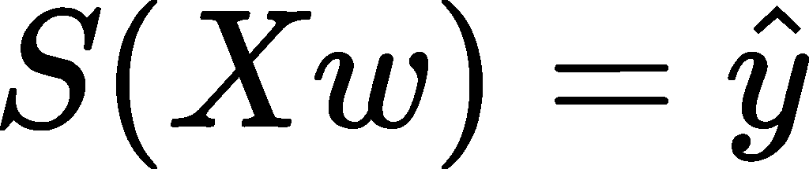

其中 X 是一个矩阵，以行的形式包含我们所有的观察结果，列代表特征。这是我们模型的输出，它是一个向量，包含对每个观察的预测。

让我们以下面的方式重写我们的逻辑回归方程:

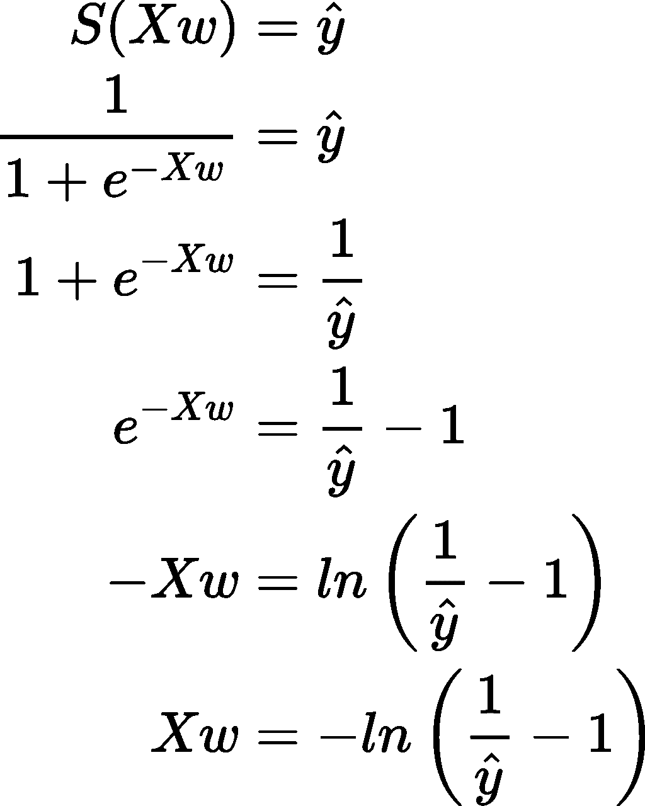

最后一行右侧的操作是基于元素的。

你在上面最后一行观察到了什么？如果我们将最后一个等式右侧的函数应用于逻辑回归的标签，并将该函数应用的输出视为新标签，则我们获得线性回归。因此，我们可以使用误差平方和作为损失函数，并找出使其最小的权重。我们可以通过使用封闭形式的公式或 SGD(随机梯度下降)来找到权重，您可以在以下关于线性回归的文章中了解更多信息:

 [## 了解线性回归

### 线性回归背后的数学详细解释

towardsdatascience.com](/understanding-linear-regression-eaaaed2d983e) 

以下是线性回归的闭合解和损失梯度(我们可以在 SGD 算法中使用):

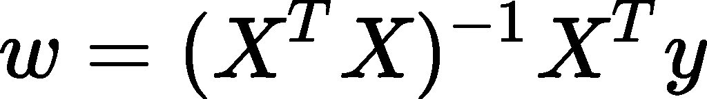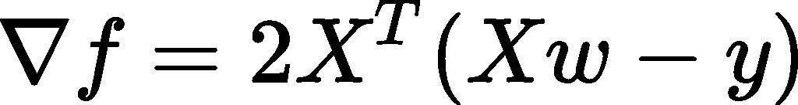

对于逻辑回归，我们只需将上述两个方程中的 y 替换为前一个方程的右侧:

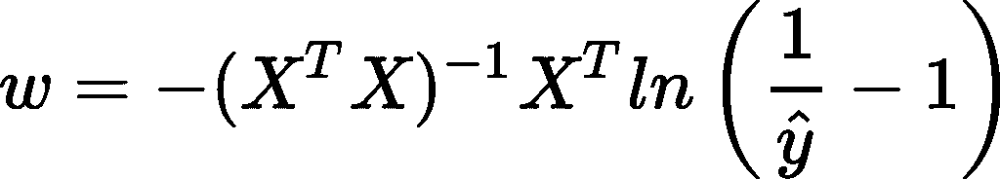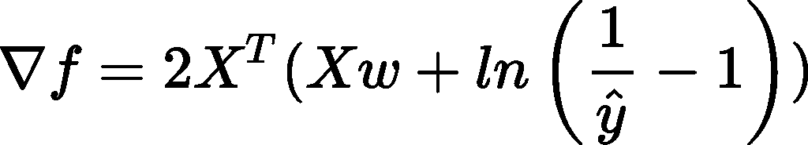

当我们应用这些公式时，我们为 y hat 提供了真正的标签。

因此，我们可以将逻辑回归视为线性回归的一种形式，并使用线性回归的工具来解决逻辑回归。好的。除此之外我们还能做什么？

我们可以利用逻辑回归的特性来提出一个稍微好一点的方法。逻辑回归有什么类型的输出？一种可能性。

当涉及概率时，一种方便的方法是最大似然估计。我们将找到在给定输入的情况下使标签的可能性最大化的模型的权重。

我们从写似然函数开始。可能性只是给定输入的标签的联合概率，如果我们假设观察是独立的，则可以写成每个观察的概率的乘积。

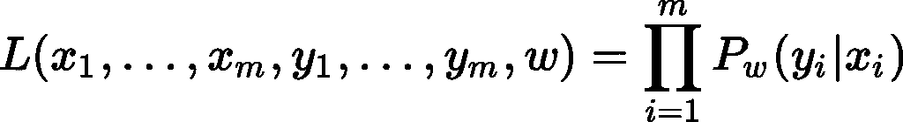

其中 m 是观察次数。

似然性是一切的函数:输入 x、真实标签 y 和权重 w。但出于我们的目的(相对于 w 最大化它)，我们将进一步将其视为 w 的函数。x 和 y 被视为我们无法更改的给定常数。

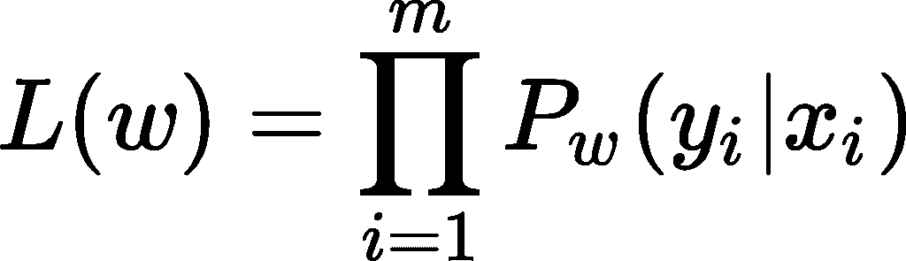

根据 yi 为 0 或 1，每个个体概率具有下列值之一:

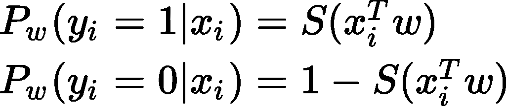

更简洁的写法是:

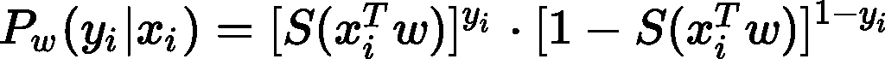

现在，我们在似然函数中替换这个量，简化它的 argmax，并过渡到矩阵符号:

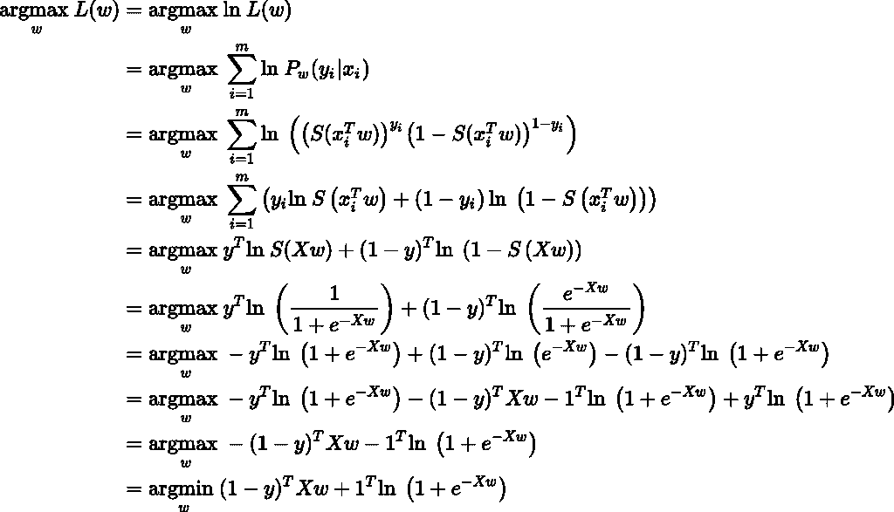

正如你在上面看到的，最大化权重的可能性和最小化最后一行的数量是一样的。这次找到一个封闭形式的解更加困难(如果可能的话)，所以我们能做的最好的事情是计算这个量的梯度:

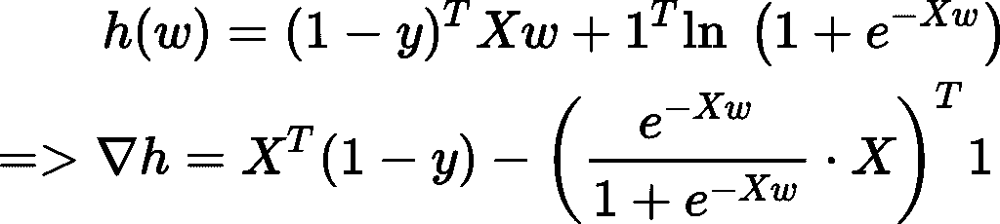

其中:上述部分中涉及的操作是基于元素的。X 前的点表示“将左边的列向量与矩阵 X 的每一列逐元素相乘”。上面的 1 是与 y 形状相同的列向量，用值 1 填充。

现在，上述梯度可以与基于梯度的优化算法(如 SGD)一起使用，以找到最佳权重。

在结束之前，让我们回顾一下我们在这篇文章中看到的一些东西:

*   什么时候可以用逻辑回归？答:当我们遇到二元分类问题时。
*   逻辑回归模型如何获得其输出？答:它计算其输入的加权和，然后将其传递给 sigmoid 函数。输出可以解释为概率。
*   我们如何找到模型的权重？答:我们可以摆弄标签，这样我们仍然可以使用线性回归，或者我们可以使用更适合它的东西，如 MLE。MLE 倾向于给出稍微好一点的结果。

这就是本文的全部内容。希望你觉得有用。

在接下来的两篇文章中，我将展示如何在 NumPy、TensorFlow 和 PyTorch 中实现逻辑回归。

 [## 如何用 NumPy 从头开始编写逻辑回归代码

### 学习逻辑回归的同时提高你的数字技能

towardsdatascience.com](/how-to-code-logistic-regression-from-scratch-with-numpy-d33c46d08b7f)  [## 如何用 TensorFlow 实现 Logistic 回归

### …没有你想象的那么难

medium.com](https://medium.com/nabla-squared/how-to-implement-logistic-regression-with-tensorflow-f5bf18416da1)  [## 如何用 PyTorch 实现逻辑回归

### 了解逻辑回归并提高您的 PyTorch 技能

medium.com](https://medium.com/nabla-squared/how-to-implement-logistic-regression-with-pytorch-fe60ea3d7ad) 

我希望这些信息对你有用，感谢你的阅读！

这篇文章也贴在我自己的网站[这里](https://www.nablasquared.com/understanding-logistic-regression/)。随便看看吧！