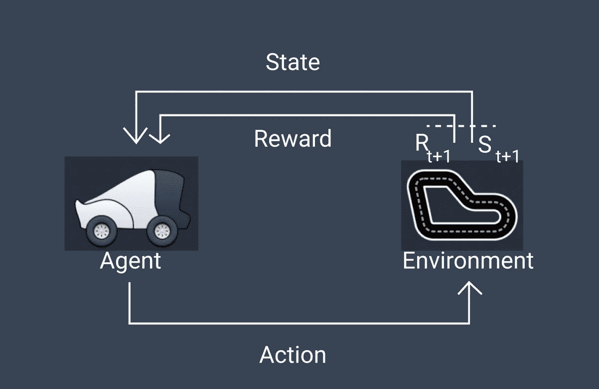
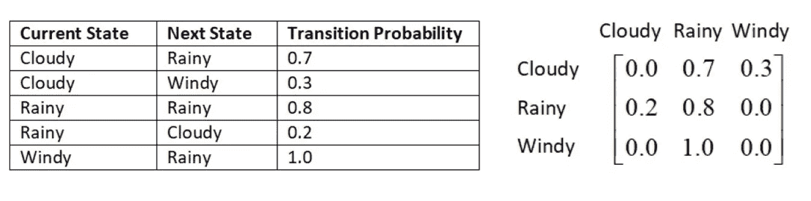
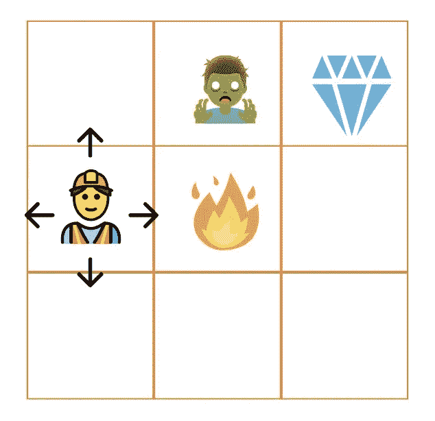
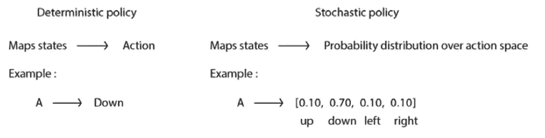
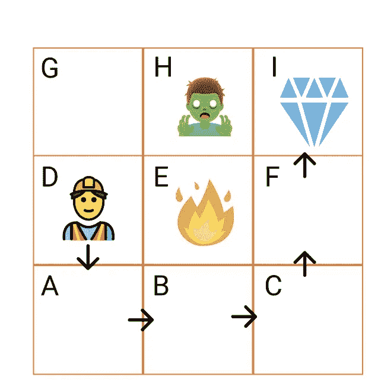

# 理解马尔可夫决策过程:强化学习背后的框架

> 原文：<https://towardsdatascience.com/understanding-markov-decision-process-the-framework-behind-reinforcement-learning-4b5166f3c5b4?source=collection_archive---------40----------------------->

## 了解强化学习中马尔可夫决策过程的概念

Alexander Schimmeck 在 [Unsplash](https://unsplash.com?utm_source=medium&utm_medium=referral) 上的照片

通过 AWS 和 Jakarta 机器学习，以有趣的方式继续我们了解强化学习的旅程。我们已经在第一篇文章中讨论了 AWS Deep Racer 和强化学习(RL)的基础知识。对于没有读过这篇文章或者想重读这篇文章的你，不要着急。您可以在这里再次找到它:

 [## AWS DeepRacer:强化学习的有趣方式

### 欢迎来到 AWS DeepRacer 之旅

towardsdatascience.com](/aws-deepracer-the-fun-way-of-learning-reinforcement-learning-c961cde9ce8b) 

现在，在这篇文章中，我们将讨论如何制定 RL 问题。要做到这一点，我们需要理解马尔可夫决策过程或众所周知的 MDP。

典型的强化学习过程。作者图片

MDP 是一个框架，可以用来制定 RL 问题的数学。几乎所有的 RL 问题都可以建模为具有状态、动作、转移概率和回报函数的 MDP。

那么，我们为什么需要关心 MDP 呢？因为有了 MDP，一个代理人可以得到一个最优的策略，随着时间的推移得到最大的回报，我们将得到最优的结果。

好了，我们开始吧。为了更好地了解 MDP，我们需要先了解 MDP 的组成部分。

# 马尔可夫性质

> 未来只取决于*现在*而不是过去。

这句话概括了马尔可夫性质的原理。另一方面，术语“马尔可夫性质”是指概率论和统计学中随机(或随机确定)过程的无记忆性质。

举个例子，假设你拥有一家餐馆，管理原材料库存。您每周检查库存，并使用结果来订购下周的原材料。这个条件意味着你只考虑本周的库存来预测下周的需求，而不考虑上周的库存水平。

# 马尔可夫链

马尔可夫链由遵循马尔可夫性质的状态序列组成。这个马尔可夫链实际上是一个概率模型，它依赖于当前状态来预测下一个状态。

为了理解马尔可夫性质和马尔可夫链，我们将以天气预报为例。如果当前状态是多云，那么下一个状态可能是下雨或刮风。在第一个状态到下一个状态的中间，有一个概率我们称之为跃迁概率。

天气链。作者图片

从上图来看，当前状态是阴天的时候，下一个状态 70%会下雨，或者 30%会刮风。如果当前状态是多风的，那么下一个状态有 100%的可能性是多雨的。那么当状态是阴雨的时候，有 80%的概率下一个状态会保持阴雨，有 20%会变成多云。我们可以将这些状态和转移概率显示为如下表格或矩阵:

转移概率表和矩阵

作为总结，我们可以说马尔可夫链由一组状态及其转移概率组成。

# 马尔可夫奖励过程

马尔可夫奖励过程(MRP)是马尔可夫链的扩展，增加了一个奖励函数。所以，它由状态，转移概率和奖励函数组成。

杰里米·蔡在 [Unsplash](https://unsplash.com?utm_source=medium&utm_medium=referral) 上的照片

这个奖励函数给出了我们从每个状态得到的奖励。这个函数将告诉我们在阴天状态下我们获得的奖励，在刮风和下雨状态下我们获得的奖励。这种奖励也可以是正值或负值。

# 马尔可夫决策过程

至此，我们已经看到了关于马尔可夫性质、马尔可夫链和马尔可夫报酬过程。这些成为马尔可夫决策过程的基础(MDP)。在马尔可夫决策过程中，我们有行动作为马尔可夫奖励过程的补充。

让我们来描述一下这个 MDP，他是一个矿工，他想在格子迷宫中得到一颗钻石。在这种情况下，矿工可以在网格内移动以获取钻石。

钻石猎人迷宫。作者图片

在这种情况下，我们可以描述 MDP 包括:

*   一组状态 **s ∈ S** 。这些状态代表了世界上所有可能的构型。在这里，我们可以将状态定义为机器人可以移动到的网格。
*   一个转移函数 **T(s，a，s’)**。这代表了 MDP 的不确定性。给定当前位置，转移函数可以是向下移动 80%，向右移动 5%，向上移动 15%。
*   一个奖励函数 **R(s，a，s’)**。这个函数显示了每一步获得了多少奖励。代理人的目标是最大化奖励的总和。一般来说，在每一步都会有一个小的负面奖励来鼓励快速解决问题，而在实现目标时会有大的奖励，或者在终止状态或进入像僵尸和火这样的障碍时会有大的负面奖励。
*   一组动作 **a ∈ A** 。代理可以采取的所有可能操作的集合。在这个例子中，动作是向上、向下、向左和向右。

在 MDP，我们还需要理解几个术语。

## 行为空间

行动空间是一个行动者为达到目标可以采取的行动。在我们的 miner 示例中，动作空间向上、向下、向左和向右移动。这种行动空间可以分为两种类型。第一个是离散动作空间，第二个是连续动作空间。

## 政策

在 MDP，代理行为被定义为一种策略。该策略告诉代理在每种状态下要执行的操作。开始时，我们需要初始化一个随机策略。然后，代理将继续学习，最优策略从迭代中产生，其中代理在每个状态中执行良好的动作，这使得累积奖励最大化。

该策略可分为两种类型:

*   **确定性策略**。给定特定的状态和时间，策略告诉代理执行一个特定的操作。
*   **随机政策**。这并不直接针对某个特定的动作。相反，它将状态映射到动作空间上的概率分布。

确定性和随机性策略的例子。作者图片

## 插曲

一个情节是代理从初始状态到最终状态或终止状态所采取的动作。例如，从当前状态进入最终获得钻石的旅程。矿工运动是 D > A > B > C > F > I。

插曲插图。作者图片

## 返回

在强化学习中，我们的目标是**最大化一集的累积回报**。这个奖励是代理收到的奖励的总和，而不是代理从当前状态收到的奖励(即时奖励)。这种累积奖励也称为**回报**。

代理可以通过在每个状态下执行正确的动作来最大化回报。它将在最优策略的指导下实现这一正确的动作。

## 贴现因素

在奖励最大化的过程中，我们需要考虑当下和未来奖励的重要性。因此，**贴现因子**开始起作用。这个贴现因子决定了我们对未来奖励和眼前奖励的重视程度。

折扣因子的值范围从 0 到 1。较小的值(接近 0)更重视眼前的回报，而不是未来的回报。另一方面，高价值(接近 1)给予未来回报比眼前回报更大的重要性。

例如，在比赛中，我们的主要目标是完成一圈。那么我们需要给予未来的回报比眼前的回报更重要。所以，我们需要使用一个接近 1 的折现因子。

# 结论

恭喜你！！

至此，我们已经涵盖了什么是马尔可夫性质、马尔可夫链、马尔可夫报酬过程和马尔可夫决策过程。这包括 MDP 的重要术语，如行动空间、政策、情节、回报和折扣系数。

总之，强化学习可以被表示为具有状态、动作、转移概率和奖励函数的 MDP。

# 文献学

 [## CS 188:人工智能导论，2020 年春季

### 本课程将介绍智能计算机系统设计的基本思想和技术。一个…

inst.eecs.berkeley.edu](https://inst.eecs.berkeley.edu/~cs188/sp20/)  [## 强化学习导论:马尔可夫决策过程

### 在一个典型的强化学习(RL)问题中，有一个学习者和一个被称为代理的决策者

towardsdatascience.com](/introduction-to-reinforcement-learning-markov-decision-process-44c533ebf8da)  [## 马尔可夫性质

### 在概率论和统计学中，术语马尔可夫性是指随机变量的无记忆性。

en.wikipedia.org](https://en.wikipedia.org/wiki/Markov_property)  [## 马尔可夫链

### 马尔可夫链是描述一系列可能事件的随机模型，其中每个事件的概率…

en.wikipedia.org。](https://en.wikipedia.org/wiki/Markov_chain)  [## 马尔可夫决策过程

### 在数学中，马尔可夫决策过程(MDP)是离散时间随机控制过程。它提供了一个…

en.wikipedia.org](https://en.wikipedia.org/wiki/Markov_decision_process) 

# 关于作者

Bima 是一名数据科学家，他总是渴望扩展自己的知识和技能。他毕业于万隆技术学院和新南威尔士大学，分别是采矿工程师。然后他通过 HardvardX、IBM、Udacity 等的各种在线课程开始了他的数据科学之旅。目前，他正与 DANA Indonesia 一起在印度尼西亚建立一个无现金社会。

如果您有任何疑问或需要讨论的话题，请通过 [LinkedIn](https://www.linkedin.com/in/bpratama/) 联系 Bima。