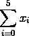
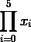
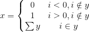
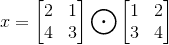
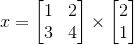

# 用代码理解数学符号

> 原文：<https://towardsdatascience.com/understanding-mathematical-symbols-with-code-5aa0c542644?source=collection_archive---------1----------------------->

## 当我们用我们最喜欢的语言来看时，求和、阶乘、矩阵等等都很简单


[来源](https://commons.wikimedia.org/wiki/File:Pure-mathematics-formulæ-blackboard.jpg)

对于任何有兴趣从事机器学习和数据科学职业或研究的人来说，有一天将会到来，那就是超越 python 库，跟随好奇心进入这一切背后的数学。这通常会把你带到一个庞大的、公开的论文集，详细说明它是如何工作的。你对核心数学理解得越深，你可能就越接近创造新方法的灵光一现。在第一张纸上，一切似乎都很好，直到你遇到这样的事情:


对于任何研究数学多年或从事机器学习数学层面工作的人来说，这样的等式可以被仔细解析为含义和代码。然而，对许多其他人来说，这可能看起来像象形文字。事实是，古代数学领袖似乎选择了最有趣的符号来描述相当直观的方法。结果是:方程和变量看起来比实际复杂得多。

我发现代码不仅可以用来写程序，也是一种全球公认的解释复杂事物的语言。当我在学习一切数据科学背后的数学时，我总是发现获得对数学的普遍理解的最好方法是编写代码片段来描述方程。最终，这些符号变得可以理解，几乎可以作为普通报纸上的文本阅读。在这篇文章中，我希望分享一些用代码描述数学是多么简单的例子！

# **求和与乘积**



求和符号是迭代数学中最有用和最常用的符号之一。尽管设计复杂，但实现非常简单，而且非常有用。

```
x = [1, 2, 3, 4, 5, 6]
result = 0for i in range(6):
    result += x[i]Output of print(result) -> 21
```

如上所述，这个符号所代表的只是一个从底部数字开始，在顶部数字范围内的 for 循环。底部设置的变量成为索引变量，每个循环的任何结果都被添加到一个总值中。不太常见的是，可以使用以下方法:



这个符号通常被称为乘积运算符，其功能相同，但不是将每个结果相加，而是相乘。

```
x = [1, 2, 3, 4, 5, 1]
result = 1for i in range(6):
    result *= x[i]Output of print(result) -> 120
```

# 阶乘

阶乘是“！”几乎存在于任何计算器上。对许多人来说，这一点可能更加明显，但编写一些代码来理解其中的机制仍然是值得的。

5!将表示为:

```
result = 1
for i in range(1,6):
    result *= i
Output of print(result) -> 120
```

# 条件括号



条件括号用于根据一组条件转移方程式的流向。对于编码人员来说，这只是常见的“如果”语句。上述条件可以表示为:

```
i = 3
y = [-2, 3, 4, 1]
result = 0if i in y:
    result = sum(y)
elif i > 0:
    result = 1
else:
    result = 0print(result) -> 6
```

如上所述，括号中每一行的正确符号指示了每条路径应该执行的内容。我在每个条件中添加了额外的“包含”符号，以增加更多的洞察力。如上所述，我们检查了 I 值是否在 y 列表中。认识到这一点后，我们返回了数组的和。如果 I 值不在数组中，我们将根据该值返回 0 或 1。

# 逐点和笛卡尔矩阵乘法

最后，我想快速介绍一些操作，这些操作通常是任何数据科学家通过他们最喜欢的语言库——矩阵乘法来完成的。最容易理解的形式是逐点操作。这简单地写成:



注意第一个要求是每个矩阵必须有相同的形状(即#行= & #列=)

其代码如下所示:

```
y = [[2,1],[4,3]]
z = [[1,2],[3,4]]
x = [[0,0],[0,0]]for i in range(len(y)):
    for j in range(len(y[0])):
        x[i][j] = y[i][j] * z[i][j]print(x) -> [[2, 2], [12, 12]] 
```

最后，让我们看看一个典型的矩阵乘法过程，最常用于机器学习。用复杂的术语来说，这个操作寻找每个主要行与每个次要列的点积。主要是以下要求:假设[#rows，# columns]→矩阵 i x j 需要#columns(i) == #rows(j) →最终乘积的形状为[#rows(i)，#columns(j)]

这可能看起来令人困惑，我最好的建议是看看 google images，看看这些需求的一些很好的可视化。



该等式的代码如下所示(使用 numpy 点方法):

```
y = [[1,2],[3,4]]
z = [[2], [1]]
# x has shape [2, 1]
x = [[0], [0]]for i in range(len(y))
    for j in range(len(z):
        x[i][j] = np.dot(y[i], z[:, j])
print(x) -> [[4],
             [10]]
```

这只是几个例子，但是对这个简单代码的理解可以让任何一个程序员去了解最初不吉利的数学世界。当然，为了提高效率，这些方法都可以合并，并且通常都有现成的库方法。用简单的代码编写这些代码的目的是为了看看当它们以真实操作的形式写出来时有多大意义。

*继续和我在* [*Twitter*](https://twitter.com/ianrowan29) *或者*[*LinkedIn*](https://www.linkedin.com/in/ian-rowan/)*上的对话！*

*在*[*https://www.mindbuilderai.com*](https://www.mindbuilderai.com)看看我目前在做什么

来源

[1][https://commons . wikimedia . org/wiki/File:Pure-mathematics-formula-blackboard . jpg](https://commons.wikimedia.org/wiki/File:Pure-mathematics-formulæ-blackboard.jpg)