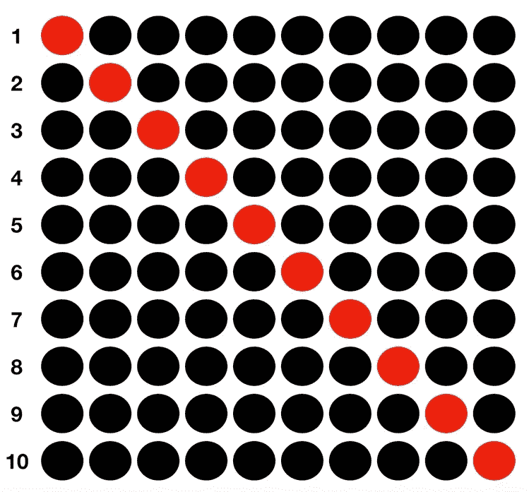
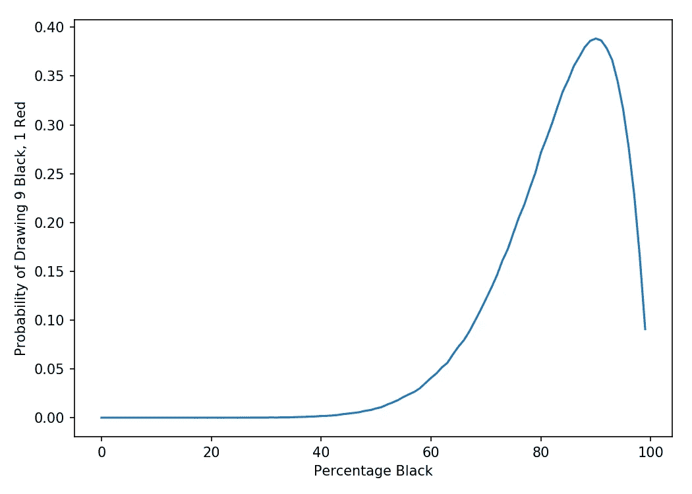
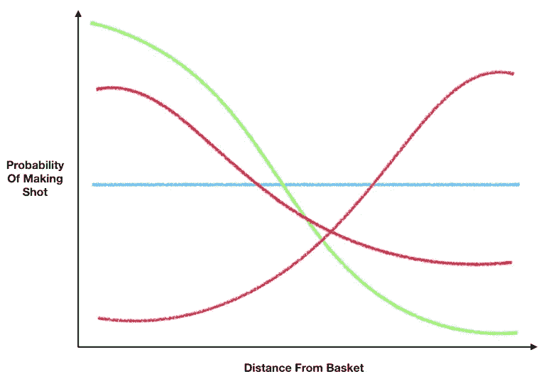

# 理解最大似然估计

> 原文：<https://towardsdatascience.com/understanding-maximum-likelihood-estimation-mle-7e184d3444bd?source=collection_archive---------4----------------------->


马库斯·斯皮斯克在 [Unsplash](https://unsplash.com?utm_source=medium&utm_medium=referral) 上的照片

## 这是什么？它是用来做什么的？

我第一次学习 MLE 的时候，我记得我只是在想，“嗯？”这听起来更哲学和理想主义，而不是实际的。但事实证明，MLE 实际上非常实用，是一些广泛使用的数据科学工具(如逻辑回归)的关键组成部分。

让我们来看看 MLE 是如何工作的，以及如何用它来估计逻辑回归模型的贝塔系数。

# MLE 是什么？

最简单地说，MLE 是一种估计参数的方法。每次我们拟合统计或机器学习模型时，我们都在估计参数。单变量线性回归有以下等式:

> Y = B0 + B1*X

我们拟合该模型的目的是在给定 Y 和 x 的观测值的情况下估计参数 B0 和 B1。我们使用普通最小二乘法(OLS)而不是最大似然法来拟合线性回归模型并估计 B0 和 B1。但是类似于 OLS，MLE 是一种在给定我们观察到的情况下估计模型参数的方法。

MLE 提出问题，**“给定我们观察到的数据(我们的样本)，最大化观察到的数据发生的可能性的模型参数是什么？”**

# 简单的例子

那是相当多的。让我们用一个简单的例子来说明我们的意思。假设我们有一个有盖的盒子，里面装着未知数量的红球和黑球。如果我们从有替换的盒子里随机选择 10 个球，最后我们得到了 9 个黑色的球和 1 个红色的球，这告诉我们盒子里的球是什么？

假设我们开始相信盒子里有相同数量的红色和黑色的球，观察到我们观察到的现象的概率是多少？

```
**Probability of drawing 9 black and 1 red (assuming 50% are black):**We can do this 10 possible ways (see picture below).Each of the 10 has probability = 0.5^10 = 0.097%Since there are 10 possible ways, we multiply by 10:Probability of 9 black and 1 red = 10 * 0.097% = **0.977%**
```



抽取 1 个红球和 9 个黑球的 10 种可能方法

我们也可以用一些代码来证实这一点(比起计算概率，我总是更喜欢模拟):

```
***In:***import numpy as np# Simulate drawing 10 balls 100000 times to see how frequently
# we get 9
trials = [np.random.binomial(10, 0.5) for i in range(1000000)]
print('Probability = ' + str(round(float(sum([1 for i\
                                              in trials if i==9]))\
                                   /len(trials),5)*100) + '%')***Out:***Probability = **0.972%**
```

模拟概率与我们计算的概率非常接近(它们并不完全匹配，因为模拟概率有方差)。

所以我们的结论是，假设盒子里有 50%的球是黑色的，那么像我们这样挑出尽可能多的黑球的可能性是非常低的。作为通情达理的人，我们会假设黑色球的百分比一定不是 50%，而是更高。那百分比是多少？

这就是 MLE 的用武之地。**回想一下，MLE 是我们估计参数的一种方法。问题中的参数是盒子中黑色球的百分比。**

> MLE 问这个百分比应该是多少，才能最大化观察到我们观察到的现象的可能性(从盒子里抽出 9 个黑球和 1 个红球)。

我们可以使用蒙特卡罗模拟来探索这一点。下面的代码块遍历一个概率范围(盒子中黑色球的百分比)。对于每种概率，我们模拟抽取 10 个球 100，000 次，以查看我们最终得到 9 个黑色球和 1 个红色球的频率。

```
# For loop to simulate drawing 10 balls from box 100000 times where
# each loop we try a different value for the percentage of balls 
# that are blacksims = 100000black_percent_list = [i/100 for i in range(100)]
prob_of_9 = []# For loop that cycles through different probabilities
for p in black_percent_list:
    # Simulate drawing 10 balls 100000 times to see how frequently
    # we get 9
    trials = [np.random.binomial(10, p) for i in range(sims)]
    prob_of_9.append(float(sum([1 for i in trials if i==9]))/len(trials))plt.subplots(figsize=(7,5))
plt.plot(prob_of_9)
plt.xlabel('Percentage Black')
plt.ylabel('Probability of Drawing 9 Black, 1 Red')
plt.tight_layout()
plt.show()
plt.savefig('prob_of_9', dpi=150)
```

我们以下面的情节结束:



抽取 9 个黑球和 1 个红球的概率

看到那座山峰了吗？这就是我们要找的。抽中 9 个黑球和 1 个红球的概率最大的黑球百分比值是其最大似然估计值— **我们的参数(黑球百分比)的估计值，最符合我们观察到的情况**。

因此，MLE 有效地执行了以下操作:

*   写一个概率函数，将我们观察到的概率与我们试图估计的参数联系起来:我们可以将我们的概率写成 ***P(9 个黑色，1 个红色|黑色百分比= b)***——假设盒子中黑色球的百分比等于 b，抽取 9 个黑色球和 1 个红色球的概率
*   然后我们找到使 ***P 最大化的 b 的值(9 黑 1 红|百分比黑=b)*** 。

从图片中很难看出，但是最大化观察我们所做的概率的黑色百分比值是 90%。似乎显而易见，对吗？虽然这个结果似乎明显是个错误，但支持 MLE 的潜在拟合方法实际上是非常强大和通用的。

# 最大似然估计和逻辑回归

现在我们知道了它是什么，让我们看看如何使用 MLE 来拟合一个**逻辑回归(** [**)如果你需要一个关于逻辑回归的复习，在这里查看我以前的帖子**](/understanding-logistic-regression-using-a-simple-example-163de52ea900) **)** 。

逻辑回归的输出是类别概率。在我之前关于它的博客中，输出是投篮的概率。但是我们的数据是以 1 和 0 的形式出现的，而不是概率。例如，如果我从不同的距离投篮 10 次，我的 Y 变量，即每次投篮的结果，看起来会像这样(1 代表投篮成功):

```
y = [0, 1, 0, 1, 1, 1, 0, 1, 1, 0]
```

而我的 X 变量，每次投篮离篮筐的距离(以英尺为单位)，看起来就像:

```
X = [1, 2, 3, 4, 5, 6, 7, 8, 9, 10]
```

我们如何从 1 和 0 到概率？**我们可以把每一次击球看作是一个二项分布的随机变量**的结果。[关于二项分布的更多内容，请阅读我之前的文章](/fun-with-the-binomial-distribution-96a5ecabf65b)。简单地说，这意味着每一次尝试都是它自己的尝试(就像扔硬币一样),有一些潜在的成功概率。**只不过我们不仅仅是在估算一个单一的静态成功概率；相反，我们是根据我们投篮时离篮筐有多远来估计成功的概率。**

所以我们可以把我们的问题重新架构成一个条件概率(y =投篮的结果):

> P(y |离篮筐的距离)

为了使用 MLE，我们需要一些参数来拟合。在单变量逻辑回归中，这些参数是回归 beta:B0 和 B1。在下面的等式中，Z 是投篮命中率的对数([如果你不知道这是什么意思，这里解释一下](/understanding-logistic-regression-using-a-simple-example-163de52ea900))。

> Z = B0 + B1*X

**你可以把 B0 和 B1 想象成描述距离和投篮概率之间关系的隐藏参数。**对于 B0 和 B1 的某些值，射击精度和距离之间可能存在强正相关关系。对其他人来说，它可能是微弱的积极的，甚至是消极的(斯蒂芬库里)。如果 B1 设置为等于 0，则根本没有关系:



不同 B0 和 B1 参数对概率的影响

对于每组 B0 和 B1，我们可以使用蒙特卡罗模拟来计算出观察到数据的概率。**我们模拟的概率是对于一组猜测的 B0，B1 值，观察到我们的精确投篮序列(y=[0，1，0，1，1，1，0，1，1，0]，给定离篮筐的距离=[1，2，3，4，5，6，7，8，9，10])的概率。**

> 对于给定的 B0 和 B1，P(y=[0，1，0，1，1，1，0，1，0] | Dist=[1，2，3，4，5，6，7，8，9，10])

通过尝试一组不同的值，我们可以找到使 **P(y=[0，1，0，1，1，1，0，1，1，0] | Dist=[1，2，3，4，5，6，7，8，9，10])** 最大化的 B0 和 B1 的值。这些将是 B0 和 B1 的最大似然估计。

显然，在逻辑回归和一般的 MLE 中，我们不会进行强力猜测。相反，我们创建了一个成本函数，它基本上是我们试图最大化的概率的倒置形式。这个代价函数与 **P(y=[0，1，0，1，1，1，0，1，1，0] | Dist=[1，2，3，4，5，6，7，8，9，10])** 成反比，和它一样，代价函数的值随着我们的参数 B0 和 B1 而变化。**我们可以通过使用梯度下降来最小化该成本函数，从而找到 B0 和 B1 的最佳值。**

但在精神上，我们对 MLE 一如既往地做的是询问和回答以下问题:

> 给定我们观察到的数据，使观察到的数据发生的可能性最大化的模型参数是什么？

**我在这篇文章中提到了以下文章:**

[*了解逻辑回归*](/understanding-logistic-regression-using-a-simple-example-163de52ea900)

[*二项分布*](/fun-with-the-binomial-distribution-96a5ecabf65b)