# 我写了一个 python 模拟器来帮我玩彩票

> 原文：<https://towardsdatascience.com/understanding-mega-millions-lottery-using-python-simulation-d2b07d30a7cc?source=collection_archive---------11----------------------->

## 我要多长时间才能赢得彩票？

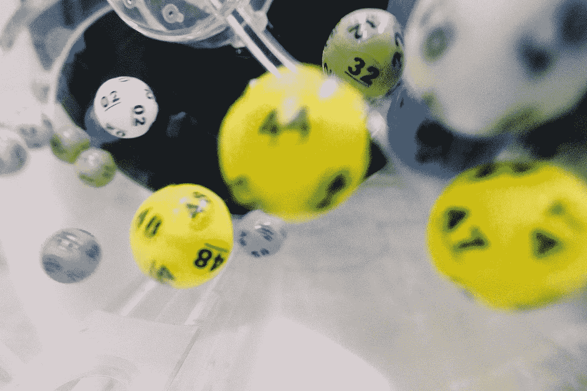

[来源](https://unsplash.com/photos/RSsqjpezn6o)

# 介绍

我在纽约长大，彩票是我家庭文化的重要组成部分。对我来说，一个冰箱看起来是不完整的，除非有一些刮刮乐或百万彩票粘在上面。每个假期或生日，我都会(现在仍然如此)收到刮刮乐彩票，上面还半开玩笑半威胁地写着“如果你赢了大奖，我就能分到一份！”

不管是好是坏，我最终搬到了阿拉巴马州，在那里彩票是非法的。这对我来说有点震惊，但我最终还是习惯了。然而，每当我拜访纽约的家人时，当我看到发光的广告牌时，当我看到每个加油站的原色标志在我脸上炸开时，当我听到我的家人定期在谈话中提起它时，我都会想起它对人们的吸引力。

总而言之，我一直对幕后的实际数字很好奇。我最终决定全力以赴，模拟百万富翁，为我思考这个问题的方式增加一些视角。

# 目录

*   百万规则复习
*   模拟是如何工作的？
*   3 次模拟运行和可视化的结果
*   结论

# 百万富翁规则

让我们从基础开始。怎么玩 Mega Millions，有什么规则？(如果您已经知道这一点，请随意跳过)

他们的[网站](https://www.megamillions.com/how-to-play)对此解释得很好。下面是一张图片，上面有说明和奖金细目以及相应的赔率。

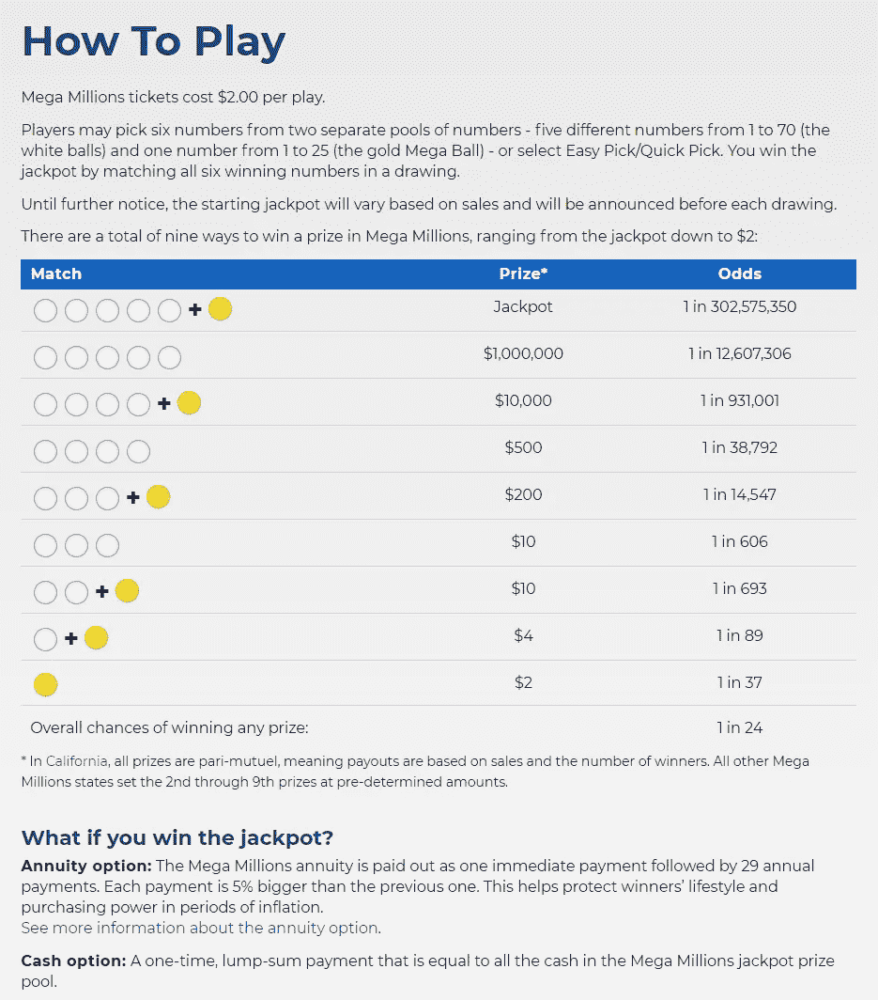

【https://www.megamillions.com/ 

花点时间仔细检查一下。是的，在最后一行，赢得百万球的 1/37 的赔率是正确的。这也让我困惑了一分钟。之所以不是 1/25(由于只有 25 个巨型球，你最初会假设是 1/25 ),是因为该奖励是专门针对你只赢得**巨型球而没有匹配任何白色球的情况。**

# 模拟是如何工作的？

其核心是 2 个随机数生成器和一个“while-loop”。模拟器继续一次又一次地产生随机数(复制 5 个白球和一个大球),直到它们匹配，也就是赢得头奖。在每次运行期间，都有 if 语句将较小的奖金加起来，这样我们就可以跟踪总的利润/损失。

## 假设进入:

*   每次抽奖你只需购买一张票(每周 2 张),你总是得到标准的 2 美元的 megaball 票
*   如果你中了头奖，你可以选择一次性现金
*   所有的收益计算都是税前的(在这些情况下，我们也没有考虑货币的时间价值)

## 见解:

*   将结果与 Mega Millions 网站上的数学概率进行比较很有意思
*   让你有能力说你“中了彩票”

## 查看下面的代码，或者如果你想了解更多细节，请访问我的 [**Github**](https://github.com/ahershy/Mega_Millions_Simulator/blob/master/Lucky%20Scenario%20MM.ipynb)

你可能已经注意到了，我把头奖设定为 197，000，000 美元。这不是武断的。我计算了过去 3 年的平均累积奖金。在模拟过程中，您可以随意尝试并改变头奖。

# 结果

数学上(如果你看了上一节的规则)，你应该每 302，575，350 次就中一次头奖。我运行了 3 次模拟器。让我们将这些运行与统计平均值进行比较。

> 有用的类比:如果你掷骰子 6 次，理论上你应该掷出一个‘6’。然而，我们都知道你可以在第一次尝试中掷出 6 分。或者你可以在 20 次之后掷出 6。彩票中奖也一样。仅仅因为你玩了 3.02 亿次彩票，并不保证你会赢一次。你可能会赢上千次。或者你可能要尝试十亿次才能赢。这就是这些场景有趣之处。你永远不知道会有什么结果。

说了这么多，还是看结果吧！

# 场景 1 —幸运:2500 万次播放— 244，744 年

如果你每次抽奖(一周两次)买一张彩票，在这种情况下，你需要 244，744 年才能赢得头奖...而这是极其幸运的！请看下面的获奖数量分类:

## 播放数量:

下面显示了 2500 万次播放中获得的哑弹和奖品类型的分布。

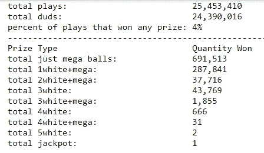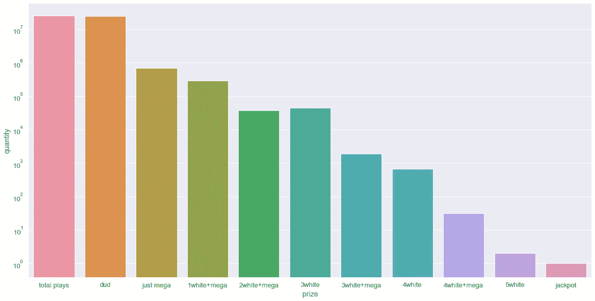

原木检尺

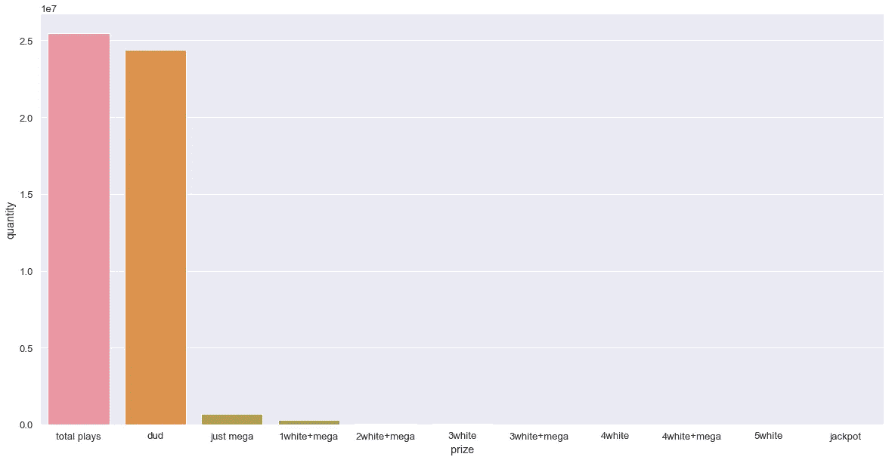

线性标尺

## 利润/损失:

在你赢得头奖的前一天，你可能会损失 5000 万美元…但是，所有这些年都会有回报，因为一旦你赢了，你将立即领先 1.5 亿美元！(我排除了你在那段时间里从那 5000 万英镑中获得的利息收益…如果你认为你可能不会领先的话)

> 有趣的是，我们注意到彩票支付的中彩金额最少。

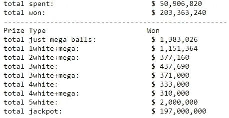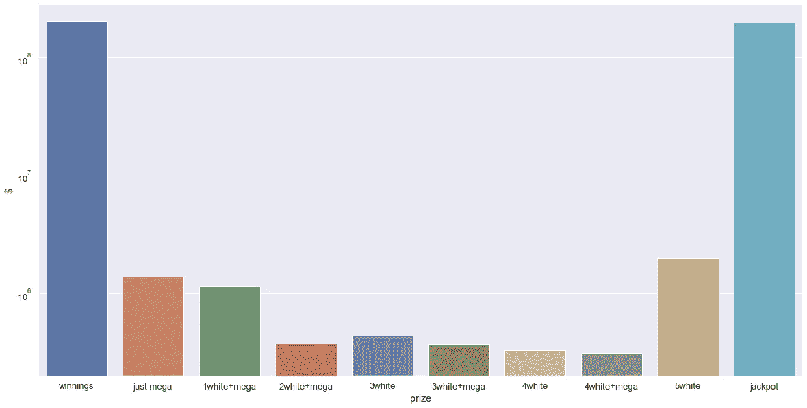

原木

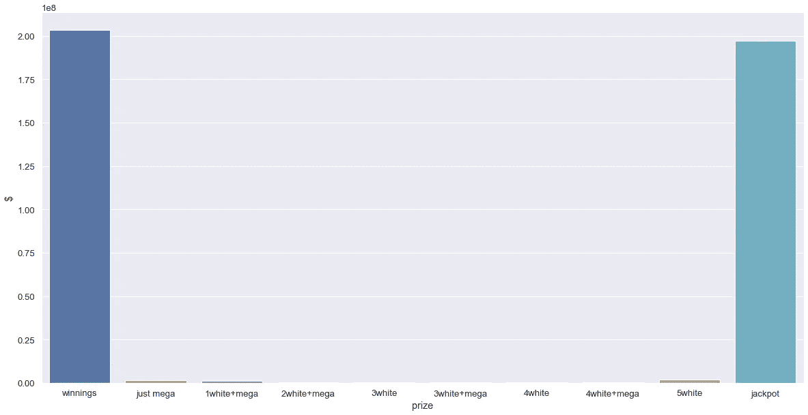

线性的

此场景的中奖票(如果您想在真实场景中试试运气):

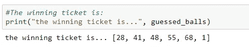

# 场景 2—平均:3.16 亿次播放—3，038，461 年

## 播放数量:

下面显示了 3.16 亿次播放中获得的哑弹和奖品类型的分布。这是你能得到的统计平均值。如果你每次抽奖(一周两次)都买一张彩票，那么你要花 3，038，461 年才能赢得头奖。这是最有可能的情况，也是你在玩彩票时应该期待的…

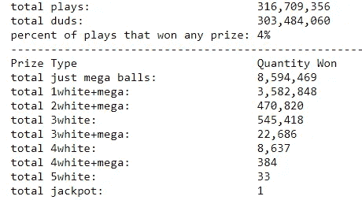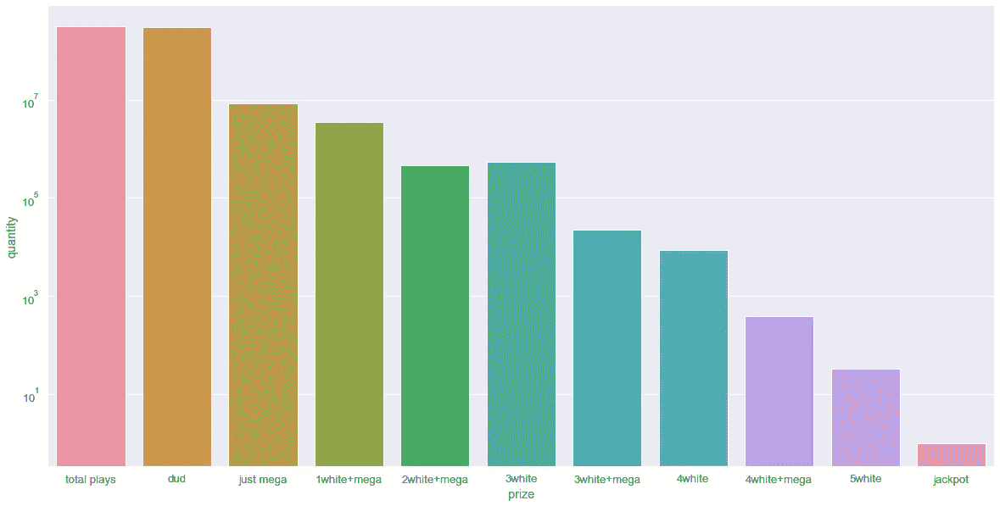

原木

线性的

## 利润/损失:

在你赢得头奖的前一天，你会损失 5.46 亿美元…不幸的是，即使你赢了 300 多万年，你仍然会损失 3.49 亿美元…

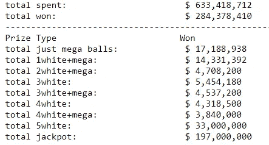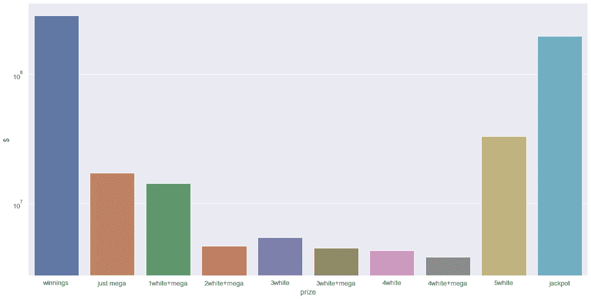

原木

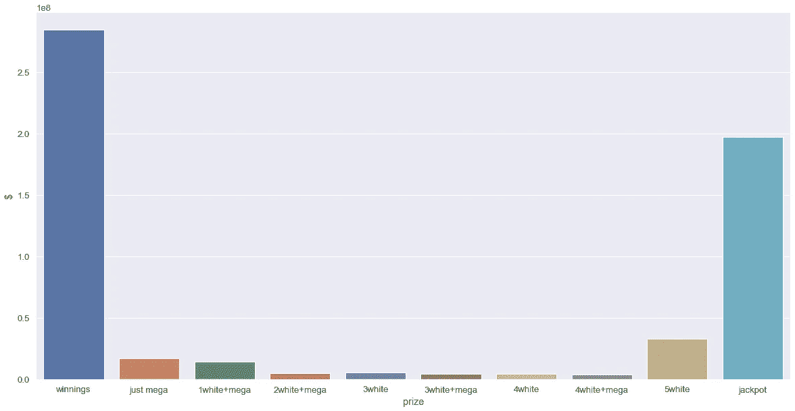

线性的

# 场景 3——不吉利:4.51 亿次播放——434.19 万年

最后，我想我应该给你们展示一下这个不幸的场景，让你们看看这些数字。这些图表看起来与上面的场景几乎相同。

## 量

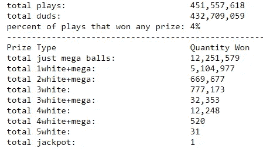

## 利润/损失:

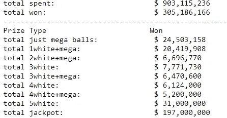

# 结论

彩票中奖的可能性极小。如果你想要赌博的刺激而没有输钱的头痛，下载这个模拟器@ my [GitHub](https://github.com/ahershy/Mega_Millions_Simulator/blob/master/Lucky%20Scenario%20MM.ipynb) 自己试试。如果你想在真实的事情上测试你的运气，你可以预计它需要大约 300 万年才能赢得头奖(假设你每周买 2 张票)。

但是！如果你决定长期玩下去，并且无论如何都坚持参与，那么在第一个一百万年里，你有大约 1/3 的机会赢得头奖(因此是有利可图的)。如果你在第一个 100 万年中了奖，累积奖金将会超过门票的花费…所以还是有希望的！

【https://andrewhershy.medium.com/membership】考虑通过我的推荐链接加入 Medium:

如果您觉得这很有帮助，请订阅。如果你喜欢我的内容，下面是我做过的一些项目:

[*Excel vs SQL:概念上的比较*](/excel-vs-sql-a-conceptual-comparison-dcfbee640c83)

[*优步点评文本分析*](/uber-reviews-text-analysis-11613675046d)

[*简单线性 vs 多项式回归*](/linear-vs-polynomial-regression-walk-through-83ca4f2363a3)

[*随机森林比 Logistic 回归好吗？*(一比较)](/is-random-forest-better-than-logistic-regression-a-comparison-7a0f068963e4)

[*基尼指数 vs 信息熵*](/gini-index-vs-information-entropy-7a7e4fed3fcb)

[*用 Python 中的逻辑回归预测癌症*](/predicting-cancer-with-logistic-regression-in-python-7b203ace16bc)

[*从头开始计算 R 平方(使用 python)*](/r-squared-recipe-5814995fa39a)