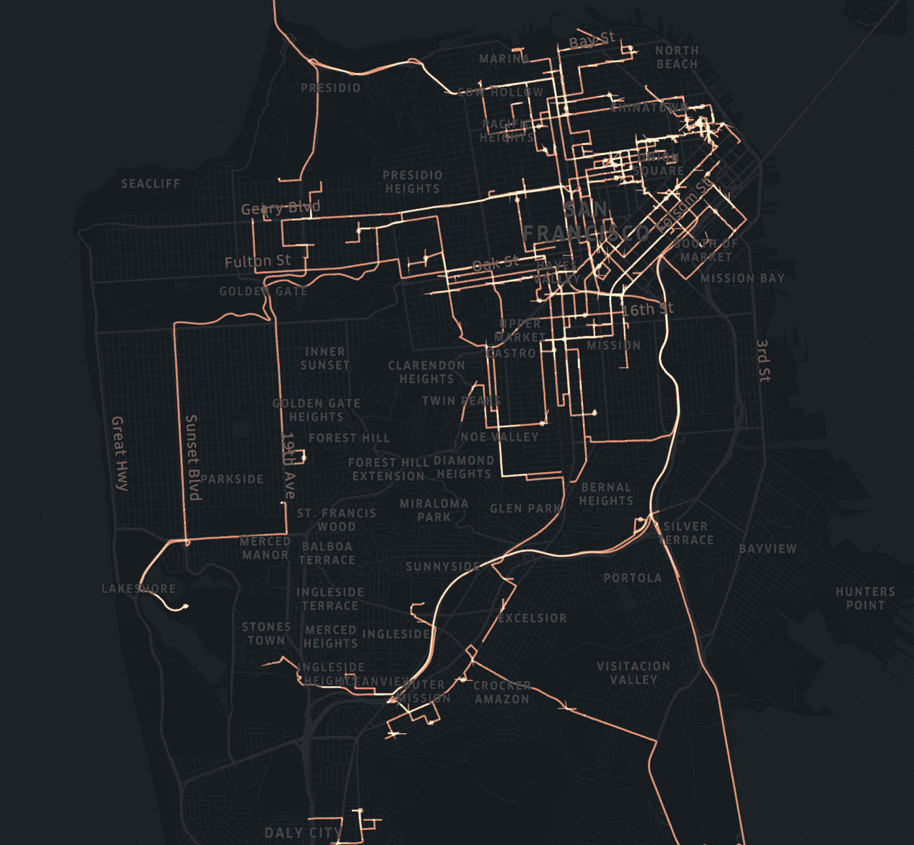
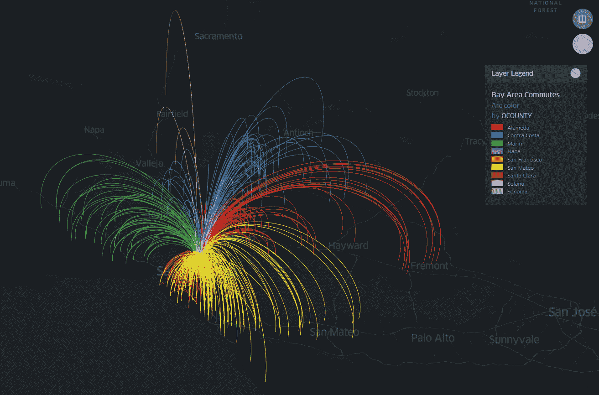
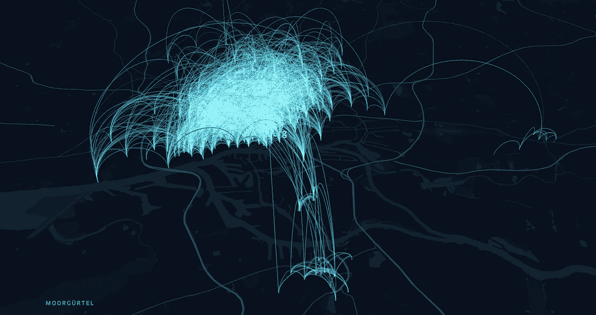
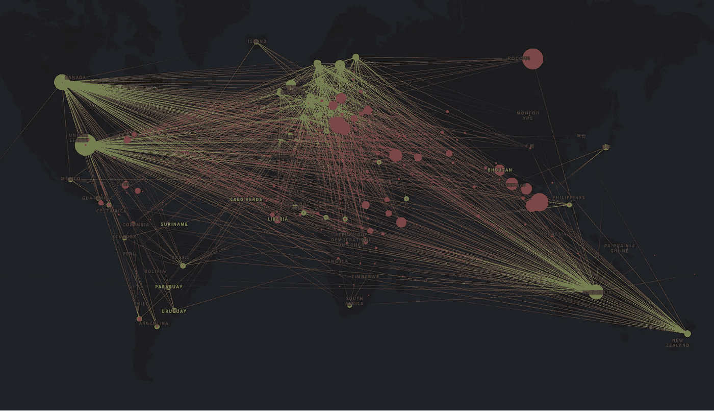
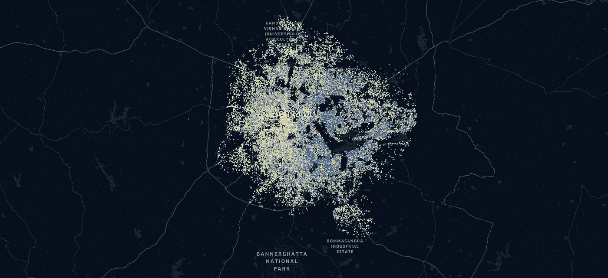

# 使用地理空间数据了解微观移动模式

> 原文：<https://towardsdatascience.com/understanding-micro-mobility-patterns-using-geospatial-data-1116a4550337?source=collection_archive---------44----------------------->

## 位置不是关于一个点，而是关于一条线！

根据出行频率给路线涂上颜色。来源:Kepler.gl

> 我的用户如何在这个城市移动？他们去哪里了？这个城市的“流”是什么样子的？这在一天中是如何变化的？

这些是我们经常从用户(主要是微移动公司或按需公司)那里听到的问题。如果你是一家微型移动公司(拼车、打车、拼车),这些问题也在你的脑海中，这篇文章应该可以帮助你解决其中的一些问题。

# 什么是移动性分析？

到目前为止，我们已经讨论了主要以两种方式执行地理空间分析:

*   **静态点:**分析关于不动的静态实体的指标或事件。*例如，分析从一个车站出发的车次或这家餐厅的平均准备时间。*

要了解更多信息，请查看:

 [## 在地理空间上优化静态定位的性能

### 对于一个公司来说，静态位置是他们的业务实体，不会移动久而久之。例如，对于一个…

blog.locale.ai](https://blog.locale.ai/optimizing-the-performance-of-static-locations-geospatially/) 

*   **聚合:**当我们在处理某个地点和时间发生的事件时，使用地理空间聚合系统，如 hexbin 或 geohash。*例如，将一个城市的订单聚合到六边形网格上。*

**#旁注**:如果你想了解更多关于网格的内容，请查看:

 [## 空间建模花絮:Hexbins vs Geohashes？

### 如果你是一个像优步一样的两度市场，你会迎合数百万通过你的司机请求搭车的用户…

blog.locale.ai](https://blog.locale.ai/spatial-modelling-tidbits-honeycomb-or-fishnets/) 

然而，为了理解行程中两个事件之间的度量*，运动分析非常有用。*

# 根据各种参数分析行程

在分析行程时，我们应该关注以下特征:

*   **出发地:**行程从哪里出发？*例如，在早上，当用户前往他们的工作地点时，行程的最后一英里很可能从住宅区或公交车站或地铁站附近开始。*
*   目的地:旅程的终点是哪里？*同样，在晚上，用户大多会回家。*

此起点的目标点。来源:Kepler.gl

*   **路径:**用户最常走的路线或路径是什么？最有价值的用户走哪些路径？如果有多种方式可以到达一个目的地，用户会选择哪种方式？*例如，如果你是一家拼车或拼车公司，这也应该有助于你分析哪些是你最常去的路线，以获得最大数量的用户。*
*   **距离:**出行的平均距离是多少，它是如何随时间变化的？长途旅行从哪里始发？短途到哪里结束？*例如，很多去海滩的旅行都是长途的，而且是在周末。此外，它们源自市中心。*
*   **所用时间:**行程的平均时间是多少，随着行程起点的不同，平均时间会有怎样的变化？短途旅行是否也会因为所经过的路线而花费大量的旅行时间？
*   **重复性:**百分之多少的行程是重复行程？有多少用户是重复用户？
*   旅行可以有几个自己的特点。例如:你从旅行中获得多少收入？他们盈利吗？用户最不安全的路线有哪些？

# 通过分析运动数据获得的见解

你能从运动分析中获得什么额外的见解？

## 流动

流量分析(或网络分析)是为了了解城市在一天的不同时间甚至历史上是如何运动的。

*例如，对于一家“最后一英里”配送公司，研究流程显示，配送合作伙伴开始向市中心移动，到了晚上，他们开始搬出去，因为他们大多数人住在郊区。但他们需要向内发展，因为这是他们获得订单最多的地区。*

我们通常用弧线或线条来表示流动(并利用时间来理解其时间模式)。Arcs 图层有助于我们了解城市中最常去的出发地和目的地以及它们之间的距离。弧线不会显示两点之间的路径。下图显示了奥斯汀市的流量历史分析。

显示水流的 3d 弧线。来源:Kepler.gl

显示整体流程的另一种方式也可以使用线条，这些线条只是弧的视觉表示。

显示航线的线图层。来源:Kepler.gl

## 顶部 O-D 对

只是从上一点外推，当你研究流量的时候，你也可以识别出哪些是顶级的起止点。了解最常见的起点-目的地对使得重新分配变得很容易。你可以随时让你的车辆(或司机)在这些地点待命。这也应该有助于拼车公司鼓励在这些地点搭车。

## 闲置点

旅行中有哪些车辆或乘客空闲的地方？对于微移动公司来说，这是一个非常重要的分析。他们的自行车没有被利用的每一分钟都在损失金钱。他们中的大多数都是按每公里收费的。空闲点的一些分析点是:

*   **何时:**出行中车辆闲置的时间是否有规律可循？*例如，下午在热点旅游地点附近。*
*   **特点:**多少辆自行车一起经常出现在那个闲置地点？有多少独特的旅行？有多少独立用户？
*   **持续时间:**车辆怠速多长时间？*比如，在医院外面或者三个小时，直到电影结束。*
*   **频率:**车辆多久怠速一次？有时间或季节的模式吗？
*   **到最近车站的距离:**如果自行车应该在一个车站，空闲点离那个位置有多远？

## 军团

出行次数最多的用户是哪些人？你的超级用户有什么共同点？他们平均花多少时间旅行？他们旅行了多远？他们去哪里了？

要了解什么样的人物角色对你的产品和什么样的用例有最大的效用，必须对你的超级用户有深入的了解。

## 极端值

异常值有助于您了解运动数据中的异常情况。有多少人去市郊？*例如，在很多情况下，我们观察到人们跨越国界(这是非法的)。在这种情况下，对一个用户或一次旅行的透彻理解就变得相当有洞察力。*

这个用户去了哪里？为什么？他总是走这些路线吗？在这些情况下，拥有一个特定用户或行程的详细视图是很重要的。

电网方面的供需。来源:Kepler.gl

## 需求-供给

供需分析是优化资产利用的关键(从而减少闲置时间)。

*   **下一个需求时间**:当旅行正在进行时，目的地的需求是什么样的？如果乘坐的目的地实际上是一个需求不足的地方，你的车辆可能会在那里闲置很长时间，或者乘坐者将不得不返回而没有乘坐。
*   **兴趣点:**另一个非常有趣的分析是分析运动如何受到不同兴趣点的影响，如学校、大学、商场或旅游目的地。
*   外部事件:分析不同的外部事件，如下雨、大型音乐会、体育比赛、抗议活动如何影响你公司的需求和供应也是很有见地的。

# 现场运动分析

在[场所](http://locale.ai)，我们正在建立一个“运动”分析平台，使用用户、车辆或乘客的地理空间数据。供应和运营团队在微移动中监控现场情况，并做出更多战术决策。产品和分析团队可以使用它来进行历史分析，并做出更具战略性的决策。

> 为了帮助您更快更好地分析运动，我们已经建立了模型，可以根据您旅行中的 pings 自动创建路径。

我们的使命是为每一家收集位置数据的公司带来与优步和 Grab 相同水平的粒度分析。我们希望按需公司的业务团队能够在一分钟内获得运营洞察力，而不是几个小时或几周之后！

要了解我们的工作，请查看:

 [## 让基于位置的实验成为我们 DNA 的一部分

### “我们在亚马逊的成功取决于我们每年、每月、每周、每天进行多少次实验。”——杰夫…

blog.locale.ai](https://blog.locale.ai/making-location-based-experimentation-a-part-of-our-dna/)  [## 使用地理空间数据进行移动分析的产品

### 是什么让实时位置数据的分析与众不同？

towardsdatascience.com](/a-product-for-movement-analytics-using-geospatial-data-2aa95b18d693) 

*如果你想获得试玩，可以在* [*LinkedIn*](https://www.linkedin.com/in/aditi-sinha-6b774ba9/) *或*[*Twitter*](https://twitter.com/aditi1002)*上与我取得联系或者访问我们的* [*网站*](https://blog.locale.ai/understanding-micro-mobility-patterns-using-geospatial-data/locale.ai) *。*

*原贴* [*此处*](https://blog.locale.ai/understanding-micro-mobility-patterns-using-geospatial-data/) *。*