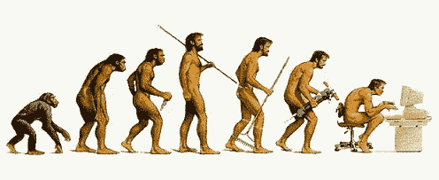
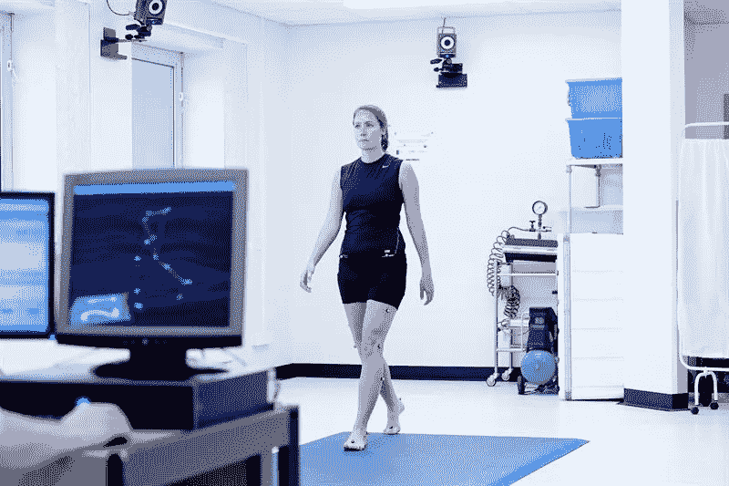
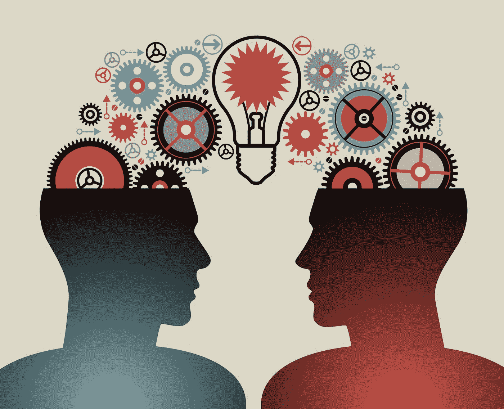
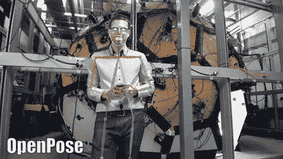

# 理解机器学习中的运动分析

> 原文：<https://towardsdatascience.com/understanding-motion-analysis-in-machine-learning-f504e9987413?source=collection_archive---------12----------------------->

## 一篇关于运动分析基础知识以及如何利用机器学习来解决这一计算机视觉相关任务的简短文章。

# 介绍

运动分析是一项简单的任务，你和我每天都在做，不用花太多心思。我们的基本人类生理学已经从我们原始祖先的视觉能力进化到我们今天的感知检测和分析水平。

图片来自[http://glenferriessc.com.au/how-good-is-your-posture/](http://glenferriessc.com.au/how-good-is-your-posture/)

短语“运动分析”是自我描述的；通俗地说，这是对物体如何在环境中移动的理解。

*但是让我们用更专业的术语来描述运动分析*

> 运动分析是对物体运动和轨迹的研究。

现在我们对什么是运动分析有了一个概述，但是它用在哪里呢？

运动分析可以应用于各种行业和学科。在医疗相关机构中，运动分析被用作观察行动障碍患者运动的非侵入性方法。

在视频监控中，运动分析用于视频跟踪和面部识别。

人类受试者的步态分析

运动分析是一项总体任务，可以分解为许多部分。

*   **物体检测**
*   **物体定位**
*   **物体分割**
*   **跟踪**
*   **运动检测**
*   **姿态估计**

提到的每一个组件都是一个值得注意的领域，需要另一篇介质文章。一些研究工作已经进入了有效解决每个部分的方法的探索。

我就不赘述了，只是对一些组件进行必要的说明:**物体检测**、**运动检测、**和**姿态估计**。本文将主要讨论它们与运动分析的关系，以及机器学习在其中的应用。

# 物体/人检测

这里的关键词是'**检测'。为了能够理解和进行身体分析，我们首先必须在为分析提供的数字内容(图像序列)中检测身体。**

*我们来给物体检测下一个合适的定义:*

> 作为计算机视觉任务的对象检测被定义为从图像或序列图像(视频)中的特定类别中识别感兴趣的对象的存在。

对象检测的任务通常包括在感兴趣的对象的实例周围示出边界框，并识别检测到的对象所属的类别。在特定的场景中，我们专注于识别图像中的一个对象；在其他一些情况下，我们对多个检测对象感兴趣。

图片来自 ImageNet 大规模视觉识别挑战赛([https://www . semantic scholar . org/paper/ImageNet-Large-Scale-Visual-Recognition-Challenge-Russakovsky-Deng/e 74 f 9 b 7 f 8 EEC 6 ba 4704 c 206 b 93 BC 8079 af 3d a4 BD](https://www.semanticscholar.org/paper/ImageNet-Large-Scale-Visual-Recognition-Challenge-Russakovsky-Deng/e74f9b7f8eec6ba4704c206b93bc8079af3da4bd))

有几个对象检测应用蓬勃发展的场景示例，例如视觉搜索引擎、人脸检测、动作检测、ariel 图像分析、行人检测和手势识别

通常，使用机器学习技术，有两种实现对象检测的主要方法，第一种是从头开始设计和训练网络架构，包括层的结构和权重参数值的初始化等。

第二种方法是利用 [*迁移学习*](https://en.wikipedia.org/wiki/Transfer_learning) 的概念，并在开始对定制数据集进行训练之前，利用在大型数据集上训练的预训练网络。

图片来自[https://talentculture.com/](https://talentculture.com/)

第二种方法消除了第一种方法所伴随的时间过长的缺点，第一种方法是从头开始训练网络所花费的时间要多得多，并且与采用预先训练的网络相比，需要付出更多的努力。

让我们退一步，观察作为计算机视觉任务的物体检测及其这些年的发展。在引入卷积神经网络来解决对象检测之前，传统的机器学习技术被用来识别图像中的对象。

诸如在 2005 年左右引入的[*【HOG】*](https://hal.inria.fr/inria-00548512/document)的方法使用组合 HOG/ [SIFT(尺度不变特征变换)](https://en.wikipedia.org/wiki/Scale-invariant_feature_transform)来基于图像梯度的归一化局部直方图识别图像内的兴趣点。

结果是生成仿射不变的 HOG 描述符，并在引入了[*【SVM(支持向量机)】*](https://en.wikipedia.org/wiki/Support-vector_machine) 的检测链中使用，以基于 HOG 描述符检测感兴趣的对象。这项技术对于一般的检测场景(如行人检测)工作得相对较好，并且在与 MIT 行人数据库进行比较时产生了完美的结果。

> 应当注意，对象检测可以进一步分解为对象分割。对象分割算法和技术产生对象存在的高亮像素作为输出，而不是边界框；下面的链接提供了一个用于对象分割的方法示例:

 [## 屏蔽 R-CNN

### 我们提出了一个概念上简单、灵活、通用的对象实例分割框架。我们的方法…

arxiv.org](https://arxiv.org/abs/1703.06870) 

# 运动检测

关于*运动检测*的快速说明。

> 运动检测是对包含运动对象的图像进行图像处理的过程，该图像处理技术能够通过差分方法或背景分割来跟踪运动，其中通过丢弃图像的静止部分以隔离运动部分来提取图像内的运动特征。

这种技术主要依赖于对图像中像素强度的观察来确定该像素是否属于背景类别。通过识别帧或图片之间的像素强度的进展，可以在强度有显著变化的地方推断出运动。

运动检测是运动分析的一个基本方面，因为需要运动检测来确定对什么和在哪里进行分析。

更重要的是，计算机视觉和机器学习技术已经将运动检测的要求从受控环境中的硬件监控设备降低到仅需要摄像机来进行检测和进一步分析的最先进的算法。

# 姿态估计

> 姿态估计是从图像或图像序列中导出身体的重要身体部分和关节的位置和方向的过程。

姿态估计的输出是图像内身体姿态配置的 2D 或 3D 刚性表示。用于运动分析的基于姿态估计解决方案的应用的输出通常是由算法生成的图像，该图像以某种形式或方式描绘了原始图像内感兴趣对象的重要身体部位和关节的位置

来自[https://github.com/CMU-Perceptual-Computing-Lab/openpose](https://github.com/CMU-Perceptual-Computing-Lab/openpose)的 Gif

姿态估计已经在计算机视觉中得到发展，并成为一个独立的突出领域。姿态估计与计算机视觉和机器学习中的其他研究领域的关系，例如对象检测、跟踪和运动分析，鼓励了各种解决姿态估计的技术的发展。

我要谈一点技术问题。

为解决姿态估计而设计的早期方法提出了基于组件或实现模块化解决方案的技术。一些解决方案最初从具有静止背景的图像中分离出人的轮廓，然后估计关节和四肢的位置。

其他解决方案提出的技术也是基于阶段的解决方案，其涉及检测和提取视频序列或图像序列中代表人类的 2D 图形，然后基于 2D 图形和轨迹生成 3D 姿态估计。

在我看来，我仅仅触及了这个主题的表面，但至少如果你已经做到了这一步，你已经对运动分析及其子组件有了一些了解。

在以后的文章中，我将深入探讨所提到的运动分析的一些组件，并包括一些代码，说明如何在实际应用中实现它们。

**如果你喜欢像这样的信息丰富的文章，请随时关注我，一旦我将来发布类似的文章，你会得到更新。**