# 理解朴素贝叶斯算法

> 原文：<https://towardsdatascience.com/understanding-na%C3%AFve-bayes-algorithm-f9816f6f74c0?source=collection_archive---------10----------------------->

## 概率分类器

图片由 [Riho Kroll](https://unsplash.com/photos/m4sGYaHYN5o) 拍摄，Unsplash

朴素贝叶斯是一种分类算法，是基于贝叶斯定理的概率分类器。在进入朴素贝叶斯的复杂性之前，我们首先理解贝叶斯定理。

## 贝叶斯定理

贝叶斯定理说，如果事件 B 已经发生，那么我们可以求出事件 A 给定 B 的概率
数学上，贝叶斯定理表示为

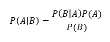

其中 P(B)！= 0 (!=指不等于)
P(A|B) —事件 A 给定 B 的概率(称为后验)
P(B|A) —事件 B 给定 A 的概率(称为似然)
P(A) —事件 A 的概率(称为先验)
P(B) —事件 B 的概率(称为证据)

例如，如果我们有一个查询点 X (d 维布尔向量)，我们必须预测它属于两个类中的哪一个(Y)。**给定 X，如何计算 Y 的概率？**

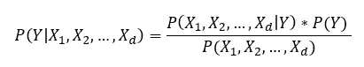

## 上述表示中的问题

想想如果我们有上面的公式，可以有多少种组合。x 是 d 维布尔向量，2^d 向量 x 的可能组合，2 用于输出(2 类分类)。对于 P(X1，X2，…，Xd|Y)，总的组合是 **2^(d+1)** ，这是巨大的，并且在真实世界的场景中是无效的。

图片由 Unsplash 的 Andrea Piacquadio 提供

朴素贝叶斯通过做一个假设来处理这个问题。

# 朴素贝叶斯

**假设** — **输入向量中的每个特征有条件地独立于其他特征。**

数学上。

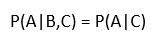

它说明给定 c，A 有条件地独立于 B。

这有什么帮助？

分子，即 P(X1，X2，…，Xd|Y)*P(Y)，等价于联合概率模型，可以表示为 P(X1，X2，…，Xd，Y)。然后我们可以用条件概率展开它。

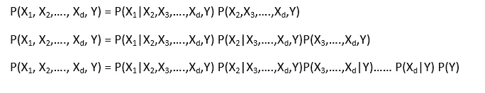

在应用条件独立性的假设时，它可以写成

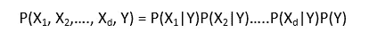

因此，使用条件独立的概率公式为

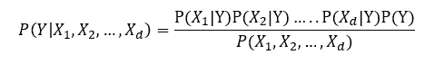

优点是，当假设条件独立时，我们只需找到 P(X1，X2，…，Xd|Y)的 **(2d+2)值**，**(与 2^(d+2 相比明显较少)** (2^(d+1)和 P(Y)的 2 个值。

如果我们有两个类，给定一个查询点(X)，我们可以得到类 1 P(Y=1|X)和类 0 P(Y=0|X)的概率。基于 MAP 判定规则(最大后验概率)来决定分配给查询点的类别，即，给定 X (P(Y|X))时具有较高概率的类别。

## 例子

根据天气、温度和风力等特征，预测天气条件是否适合打网球。

x =[前景，温度，多风]
Y =[是，否]

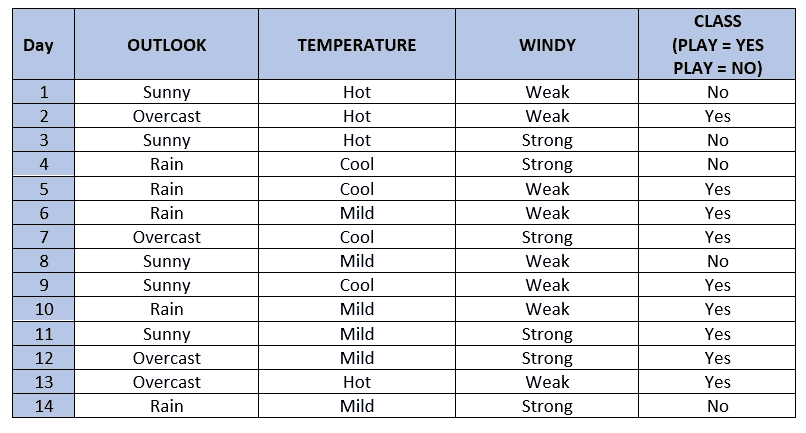

作者图片

由于朴素贝叶斯遵循条件独立，我们将为 X 中的所有 I 和 y 中的 j 计算 P(Xi|Yj)

我们将计算可能性表。

**表 1**

Outlook P(Outlook|class)-其中 Outlook 可以是**阴天、雨天和晴天**，而 class 可以是**是和否**

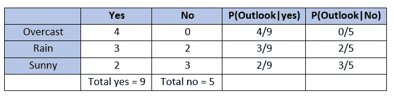

**表 2**

温度 P(温度|等级)-其中温度可以是**热、温和、冷**，等级可以是**是和否**

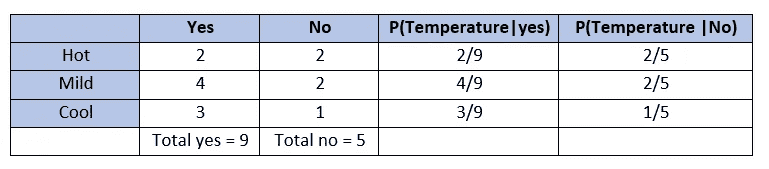

**表 3**

Windy P(Windy | class)——其中 Windy 可以是**强和弱**而 class 可以是**是和否**

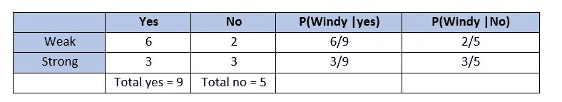

先验知识是:P(类=是)= 9/14
P(类=否)= 5/14

**那么如果我们有一个查询点，如何计算它属于哪个类呢？**

给定一个查询点 **X' =【晴、凉、强】**

我们计算 P(class=Yes|X ')和 P(class=No|X ')

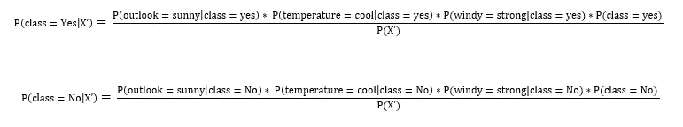

p(X’)是一个常数项，它等于

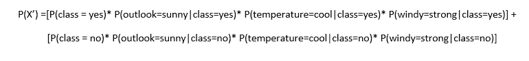

从可能性表中，我们得到公式中所需的值

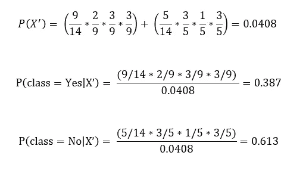

由于类别'**否'**给定 X '的概率高于类别**'是'**给定 X '，查询点属于类别**'否'。**

## 优势

1.  朴素贝叶斯算法还可以通过比较给定查询点的所有类的概率来执行多类分类。
2.  nave Bayes 算法在大数据集上是高效的，并且空间复杂度较小。
    运行时间复杂度为 O(d*c ),其中 d 是查询向量的维数，c 是类别总数。空间复杂度也是 O(d*c ),因为我们只存储每个特征相对于类的可能性，即 P(Xd|Yc ),其中 d 是特征，c 是类。所以总的组合是(d*c)。
3.  朴素贝叶斯在诸如垃圾邮件过滤和评论分类等文本分类问题上工作得相当好。

有不同类型的 NB，例如**高斯朴素贝叶斯**，它在处理连续数据时效果很好，**多项式朴素贝叶斯**，它通过使用文档中每个词的频率来进行文本分类。另一种类型是**伯努利朴素贝叶斯**，它只在特征采用两个值(0 和 1)时有效，类似于二进制单词袋模型中的值。

## 结论

朴素贝叶斯是一种分类算法，它基于贝叶斯定理和条件独立性假设。由于时间和空间复杂度较低，它在要求低延迟的实际应用中工作得很好。

感谢阅读！