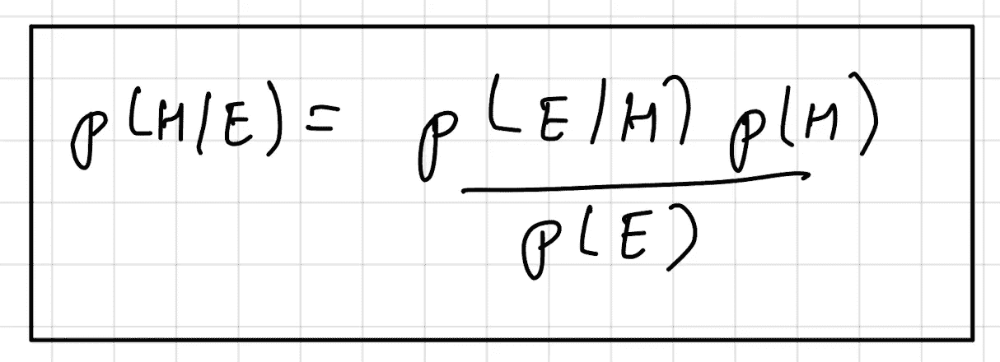
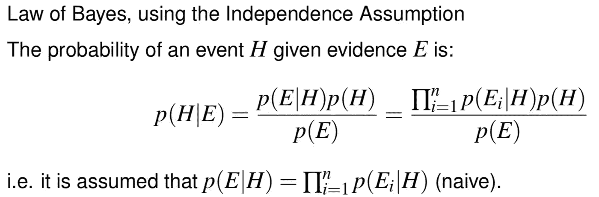
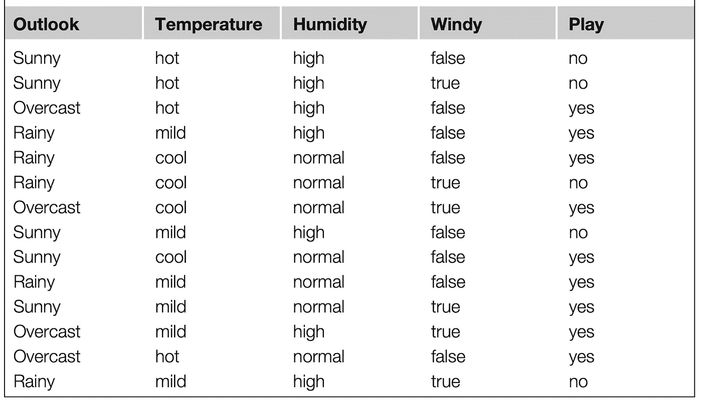
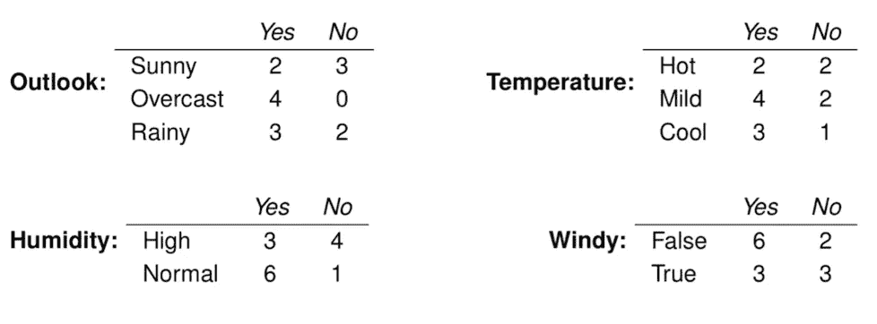

# 理解朴素贝叶斯分类器

> 原文：<https://towardsdatascience.com/understanding-naive-bayes-classifier-46385aca47ec?source=collection_archive---------30----------------------->

## 有多个例子

凯文·Ku 在 [Unsplash](https://unsplash.com/s/photos/machine-learning?utm_source=unsplash&utm_medium=referral&utm_content=creditCopyText) 上的照片

在的[监督学习(分类)](/basics-of-supervised-learning-classification-d26c00d80100)的背景下，朴素贝叶斯或者更确切地说贝叶斯学习作为评估其他学习算法的黄金标准，同时作为一种强大的概率建模技术。

在这篇文章中，我们将从概念上讨论朴素贝叶斯分类器的工作原理，以便它以后可以应用于现实世界的数据集。

在许多应用中，[属性集和类变量](/journey-into-data-mining-3b5ccfa5343)之间的关系是不确定的。换句话说，即使一个[测试记录](/data-preprocessing-in-data-mining-machine-learning-79a9662e2eb)的属性集与一些训练样本相同，它的类标签也不能被确定地预测。这种情况可能是由于有噪声的数据或某些影响分类的混杂因素的存在而出现的。

例如，考虑根据一个人的饮食和锻炼频率来预测这个人是否有心脏病风险的任务。尽管大多数饮食健康、经常锻炼的人患心脏病的几率较小，但由于遗传、过度吸烟和酗酒等其他因素，他们仍有可能患心脏病。确定一个人的饮食是否健康或锻炼频率是否足够也需要解释，这反过来可能会给学习问题带来不确定性。

B 贝叶斯学习是一种为[属性集](/journey-into-data-mining-3b5ccfa5343)和类变量之间的概率关系建模的方法。为了理解朴素贝叶斯分类器，首先需要理解的是**贝叶斯定理。**

贝叶斯定理是从**贝叶斯定律**中推导出来的，它规定:

给定证据 E，事件 H 的概率为:

在哪里，

P(E/H)是事件 E 发生的概率，假设 H 已经发生，

P(H)是事件 H 的先验概率，

P(E)是事件 E 的先验概率

上面的公式及其组成部分看起来非常专业，会让第一次学习它的人感到害怕。为了更好地理解，我们来看一些例子:

**示例:电子邮件—** 电子邮件总数:100，垃圾邮件:25，无垃圾邮件:75

*a) 20 封垃圾邮件包含“购买”一词，5 封垃圾邮件不包含“购买”一词*

**问】**如果一封电子邮件包含“购买”一词，那么它是垃圾邮件的概率有多大？

**解答:**问题要求我们确定 P(垃圾/购买)。按照上面提到的公式，事件 H 是邮件是‘spam*’*，事件 E 是它包含了‘buy’这个词。给定示例中的数据，它可以在数学上/概率上写成:

p(垃圾邮件)= 25/100，

p(无垃圾邮件)= 75/100，

p(购买/垃圾邮件)= 20/25，

p(买入)= 25/100

使用贝叶斯定理，P(垃圾邮件/购买)可以计算为:

P(垃圾邮件/购买)= [P(购买/垃圾邮件)* P(垃圾邮件)] / P(购买)

p(垃圾邮件/购买)= [20/25 * 25/100] / 25/100

p(垃圾邮件/购买)= 20/25 = 0.8

*b) 15 封垃圾邮件包含“便宜”一词，10 封垃圾邮件不包含“便宜”一词*

**问】**如果一封邮件包含“廉价”一词，那么它是垃圾邮件的概率有多大？

**解答:**问题要求我们确定 P(垃圾/便宜)。按照上面提到的公式，事件 H 是邮件是‘spam*’*，事件 E 是它包含了‘廉价’这个词。给定示例中的数据，它可以在数学上/概率上写成:

p(垃圾邮件)= 25/100，

p(无垃圾邮件)= 75/100，

p(便宜/垃圾)= 15/25，

p(便宜)= 25/100

使用贝叶斯定理，P(垃圾邮件/廉价邮件)可以计算为:

P(垃圾邮件/便宜)= [P(便宜/垃圾邮件)* P(垃圾邮件)] / P(便宜)

p(垃圾邮件/便宜)= [15/25 * 25/100] / 25/100

p(垃圾/便宜)= 15/25 = 0.6

*c) 12 封垃圾邮件包含“购买&便宜的”字样，0 封垃圾邮件不包含“购买&便宜的”字样*

如果一封电子邮件包含“买便宜的”字样，那么它是垃圾邮件的概率有多大？

**解答:**问题要求我们确定 P(垃圾/买&便宜)。按照上面提到的公式，事件 H 是邮件是‘垃圾邮件*’*，事件 E 是包含‘便宜买&字样。给定示例中的数据，它可以在数学上/概率上写成:

p(垃圾邮件)= 25/100，

p(无垃圾邮件)= 75/100，

p(买&便宜/垃圾)= 12/25，

p(廉价购买)= 12/100

使用贝叶斯定理，P(垃圾邮件/购买&便宜)可以计算为:

P(垃圾邮件/廉价购买)= [P(廉价购买/垃圾邮件)* P(垃圾邮件)] / P(廉价购买)

p(垃圾邮件/廉价购买)= [12/25 * 25/100] / 12/100

p(垃圾邮件/廉价购买)= 1

它告诉了我们什么？

**解决方案:**我们得到的信息是，如果电子邮件包含单词“buy”，则该电子邮件是垃圾邮件的概率为 80%。

→这是标准的贝叶斯定理，但是天真因素在哪里呢？在概率中，两个事件 A 和 B 的条件概率写为:

P(A/B) = P(A 交点 B) / P(B)

当我们认为两个事件 A 和 B 是相互独立的时候，天真因素就出现了，这就把上面的符号修改为:

P(A/B) = P(A) * P(B)

如果我们把独立性的天真假设应用到例子的***【c)***部分，会有什么变化？让我们深入研究并确定。

**垃圾邮件:25 封**

20 包含“购买”— 20/25

15 包含“便宜”——15/25

→有多少包含“买便宜的”？

P(买&便宜/垃圾)= P(买)* P(便宜)

p(购买便宜的/垃圾邮件)= (20/25) * (15/25) = 12/25

如果是垃圾邮件，包含(计数)“购买便宜”的电子邮件是(12/25) * 25 = 12

**无垃圾邮件:75 封邮件**

5 包含“购买”— 5/75

10 包含“便宜”——10/75

→有多少包含“买便宜的”？

P(购买&便宜/没有垃圾邮件)= P(购买)* P(便宜)

p(买便宜的/没有垃圾邮件)= (5/75) * (10/75) = 2/225

包含“购买和便宜”的电子邮件是(2/225) * 75 = 2/3

P(买入&便宜)= (12 + (2/3)) / 100 的总概率

**现在，电子邮件是垃圾邮件但同时包含“buy & cheap”的概率是多少？**

P(垃圾邮件/廉价购买)= [P(廉价购买/垃圾邮件)* P(垃圾邮件)] / P(廉价购买)

p(垃圾邮件/购买和便宜)= [12/25 * 25/100] / (12 + (2/3)) / 100

p(垃圾邮件/购买和便宜)= 18/19 = 0.947

上面的例子在数学上可以写成:

现在，我们已经建立了贝叶斯定理和朴素假设的基础，让我们通过一个例子来看看如何在机器学习中使用它作为分类器:

以下是我们将使用的数据集:

威滕、弗兰克和霍尔的数据挖掘

在这个特定的数据集中，我们总共有 5 个属性。其中 4 个是[自变量](/journey-into-data-mining-3b5ccfa5343)(天气、温度、湿度、风力)，一个是我们将要预测的[因变量](/journey-into-data-mining-3b5ccfa5343)(玩耍)。这是一个二元分类问题，因为因变量具有布尔性质，包含是或否。

由于这是非确定性的或者更确切地说是概率性的方法，因此该模型没有[学习](/basics-of-supervised-learning-classification-d26c00d80100)。

我们将对一个实例进行分类

*x* = <前景=晴朗，温度=凉爽，湿度=高，风=真>

为了计算这个，我们需要目标变量 *Play* 的先验概率

实例总数为 14，其中 9 个实例的值为 *yes* ，5 个实例的值为 *no* 。

p(是)= 9/14

p(否)= 5/14

按照目标变量，自变量的分布可以写成:

为了对实例 *x，*进行分类，我们需要计算*播放=是*和*播放=否*的最大可能性，如下所示:

*播放的可能性=是*

P(*x*/是)* P(是)= P(晴/是)* P(凉/是)* P(高/是)* P(真/是)* P(是)

*活动的可能性=否*

P(*x*/否)* P(否)= P(晴/否)* P(凉/否)* P(高/否)* P(真/否)* P(否)

由于天真的独立假设，各个属性的概率会成倍增加。

计算上述等式所需的值为:

p(晴天/是)= 2/9

p(酷/是)= 3/9

p(高/是)= 3/9

p(真/是)= 3/9

和

p(晴/否)= 3/5

p(冷/否)= 1/5

p(高/否)= 4/5

p(真/否)= 3/5

P(*x*/是)* P(是)=(2/9)*(3/9)*(3/9)*(3/9)*(9/14)= 0.0053

P(*x*/否)* P(否)=(3/5)*(1/5)*(4/5)*(3/5)*(5/14)= 0.0206

> 0.0206 > 0.0053
> 
> **分类—无**

## 朴素贝叶斯的利与弊

**赞成者**

*   预测一类测试数据集简单快捷。
*   朴素贝叶斯分类器与其他假设独立的模型相比表现更好。
*   与数值数据相比，它在[分类数据的情况下表现良好。](/journey-into-data-mining-3b5ccfa5343)
*   它需要较少的训练数据。

**缺点**

*   如果测试数据集中的一个实例有一个在训练期间不存在的类别，那么它将赋予它“零”概率，并且不能进行预测。这就是所谓的**零频率问题。**
*   它也被认为是一个坏的估计。
*   它仅仅依赖于独立性预测假设。

我将免费赠送一本关于一致性的电子书。在这里获得你的免费电子书。

感谢您的阅读。我希望阅读这篇文章的人对朴素贝叶斯有所了解。

如果你喜欢阅读这样的故事，并想支持我成为一名作家，可以考虑[报名成为一名媒体成员](https://tarun-gupta.medium.com/membership)。每月 5 美元，你可以无限制地阅读媒体上的故事。如果你注册使用我的链接，我会赚一小笔佣金，不需要你额外付费。

 [## 加入我的推荐链接-塔伦古普塔

### 作为一个媒体会员，你的会员费的一部分会给你阅读的作家，你可以完全接触到每一个故事…

tarun-gupta.medium.com](https://tarun-gupta.medium.com/membership) 

你可以在这里阅读我的更多帖子:

 [## 标记故事列表的快速链接—感谢您的访问

### 我也有一份以快节奏出版为目标的出版物。读书成为作家。

tarun-gupta.medium.com](https://tarun-gupta.medium.com/thank-you-for-visiting-my-profile-9f708062c75e)