# 理解神经网络

> 原文：<https://towardsdatascience.com/understanding-neural-networks-c5557cfef5b3?source=collection_archive---------53----------------------->

## 对神经网络架构的深入理解

在我之前的文章中，我简要讨论了深度学习以及如何开始使用它。如果你还没有看过那篇文章，请在这里[阅读](https://medium.com/@ayushparhi7/deep-learning-the-state-of-the-art-88153e69a602)，对深度学习和机器学习有一个直观的认识。

如果你已经看过了，那就开始吧！

由[大卫·伊斯坎德尔](https://unsplash.com/@diskander?utm_source=medium&utm_medium=referral)在 [Unsplash](https://unsplash.com?utm_source=medium&utm_medium=referral) 上拍摄

# 感知器

感知器？！你们中的一些人可能已经知道了。无论如何，感知器是神经网络的结构构建模块。就这么简单。通过形成层来组合许多感知机最终成为深度神经网络。感知器架构可能看起来像这样:

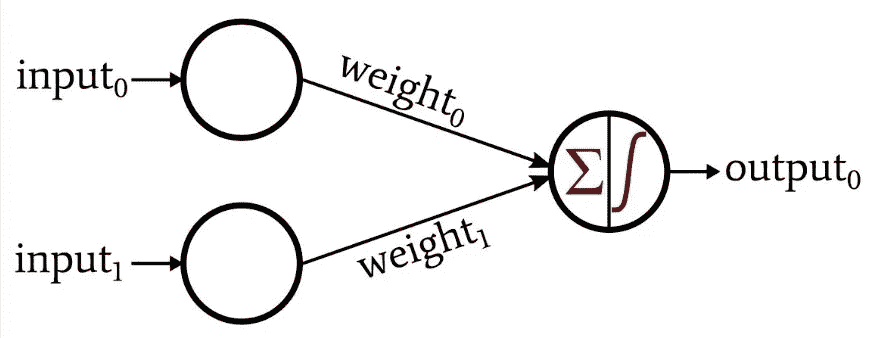

感知器模型。来源:[关于电路的一切](https://www.allaboutcircuits.com/uploads/articles/how-to-perform-classification-using-a-neural-network-a-simple-perceptron-example_rk_aac_image1.jpg)

这里，总共有两层:输入层和输出层。但是，在机器学习的世界中，开发人员不认为输入是一个层，因此他们会说，“这是一个单层感知器模型”。所以，当有人说，“我已经建立了一个 5 层的神经网络”，不要把输入算作一层。那么，这个感知机模型是做什么的呢？如上图所示，我们有 2 个输入和一个带有 sigma 和积分符号的单个节点，然后是输出。该节点计算两个数学表达式以给出输出。首先，它取输入加上一个偏差的加权和，然后该和通过一个**非线性**激活函数。稍后，激活函数产生预测输出。这整个过程在神经网络中称为前向传播。

请看这张图片:

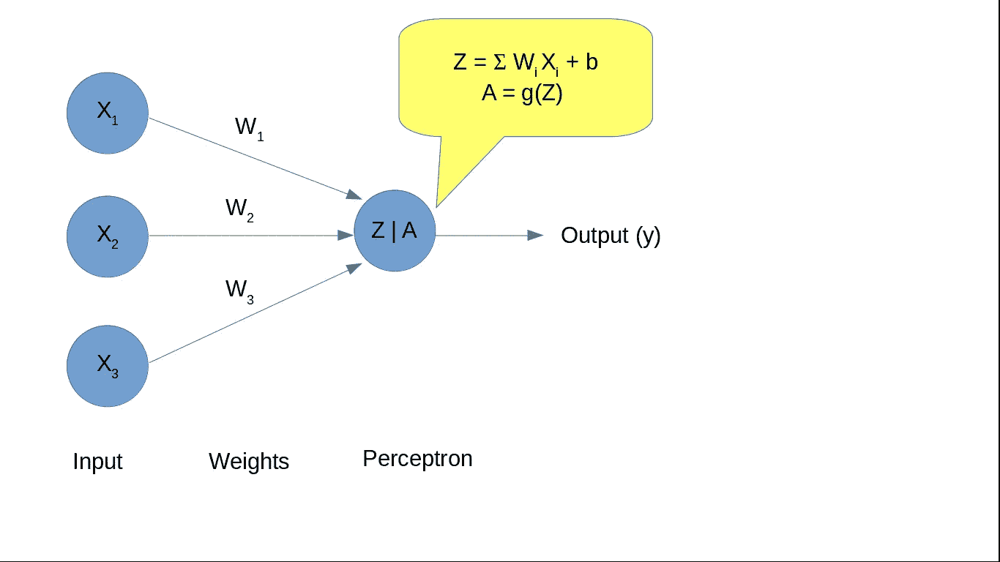

感知器计算。

正向传播的灵感来自逻辑回归。如果你知道逻辑回归算法，这可能看起来很熟悉，但如果你不知道逻辑回归，这是没有必要的。权重(W)和偏差(b)是由神经网络“训练”的参数，所谓“训练”是指它们被设置为精确值，使得损失最小。

输出(上图中的“y”)是神经网络做出的预测。实际值和预测值之间的差异称为神经网络的损耗。但事情没那么简单。我们取预测值和实际值之间的差，而不是直接差。让我们明白我想说什么。

# 损失和成本函数

在继续之前，您应该知道的一件事是，预测值计算神经网络的损失，而神经网络是通过计算“Z”来计算的，Z 取决于“W”和“b”。最终，我们可以说损失取决于“W”和“b”。因此,“W”和“b”应设置为损耗最小的值。明确地说，**神经网络总是最小化损失，而不是最大化精度**。

当解决一个深度学习问题时，数据集是巨大的。例如，假设我们要构建一个图像分类器，对猫和狗的图像进行分类(你可以将其视为“Hello World！”计算机视觉的:)。所以为了训练神经网络，我们需要尽可能多的猫和狗的图像。在机器学习中，一只狗或一只猫的形象被认为是一个**“训练例子”**。为了训练一个好的神经网络，我们需要大量的训练样本。损失函数是针对单个训练示例计算的损失。所以，实际上我们为神经网络的训练优化的是**成本函数**。成本函数可以定义为针对每个训练示例单独计算的所有损失的平均值。

让我们假设有“m”个训练例子。那么成本函数就是:

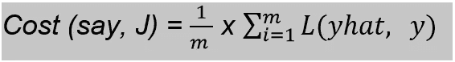

我们把一个神经网络的损耗取为:
损耗(比方说，L) =预测值(比方说，yhat) —实际值(比方说，y)

由于神经网络的损失取决于“W”和“b ”,所以让我们仅针对“W”来绘制上述损失函数(为了简单起见，如果我们将“W”和“b”都考虑在内，我们必须绘制 3d 图，这将很难理解概念。此外，偏差“b”用于将激活函数向左或向右移动，就像公式中的截距线)
图可能看起来像这样:

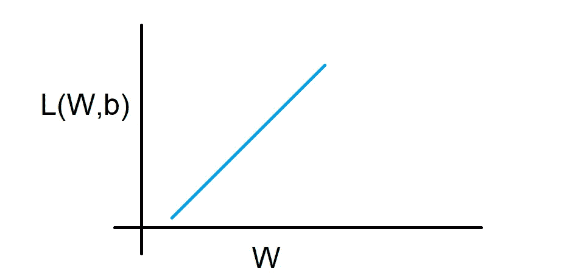

这将是一条直线

这个损失函数的问题是，它是一条直线，不可能使用优化算法(如梯度下降)来优化损失函数(在下一节中告诉你)。现在，要明白损失函数应该是一条具有全局最小值的曲线。

后来研究人员又想出了另一个损失函数:

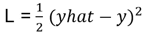

这称为“**均方误差损失**”，用于回归类问题。此外，对于一个训练示例，这似乎是一个公平的等式。它是一条抛物线。但是对于“m”个训练示例，即，对于成本函数，将是具有许多局部最小值的波状曲线。我们想要一个碗状曲线或凸状曲线来优化成本。

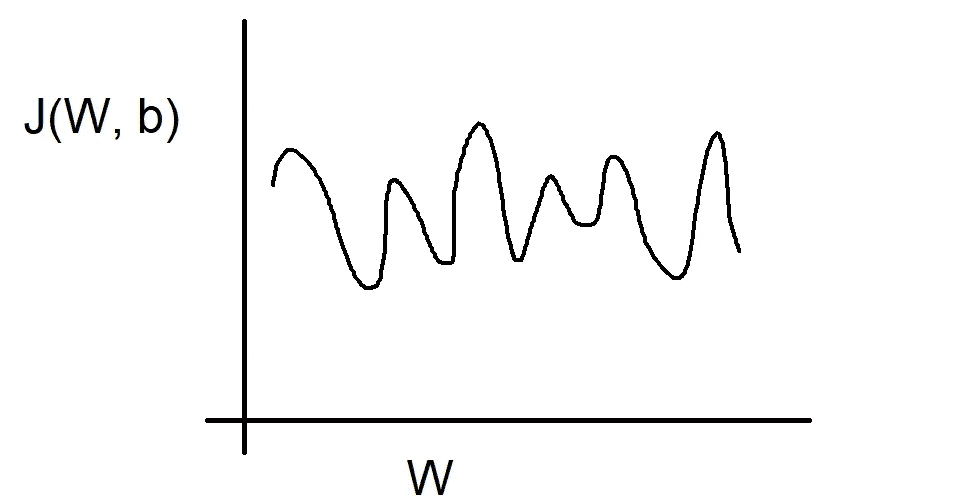

有许多局部极小值的波状曲线

所以，后来我们得到了一个公认的损失函数方程:

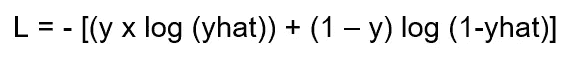

这个方程被称为“**交叉熵损失**，它被广泛用于深度学习中的分类问题。

上述等式的成本函数如下所示:

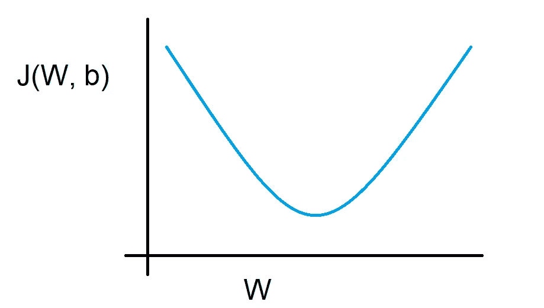

凸形曲线。

现在我们知道了如何计算神经网络的成本，让我们了解如何优化成本函数以获得更好的性能。

# 反向传播:训练神经网络

反向传播是神经网络构建中最重要的任务。这是对神经网络进行实际训练的过程。这是一项计算量很大的任务。事实上，它是神经网络中整个计算过程的三分之二。在前向传播中，我们看到了如何计算神经网络的成本。在反向传播中，我们使用这个成本来设置“W”和“b”的值，使得它可以最小化神经网络的成本。
一开始，我们将权重(W)和偏差(b)初始化为一些随机的小数字。随着模型的训练，权重和偏差会随着新值而更新。这种更新是在一种叫做**梯度下降的优化算法的帮助下完成的。**

在数学中，梯度意味着斜率或导数。下降意味着减少。所以通俗地说，梯度下降就是斜率递减。熟悉微积分有助于理解梯度下降。还记得我说过我们需要一个凸形代价函数来进行优化吗？原因是在下降过程中，我们不会陷入局部极小值。如果成本函数是波浪形的，它有机会停留在它的一个局部极小值，我们将永远不会有成本的全局最优值。

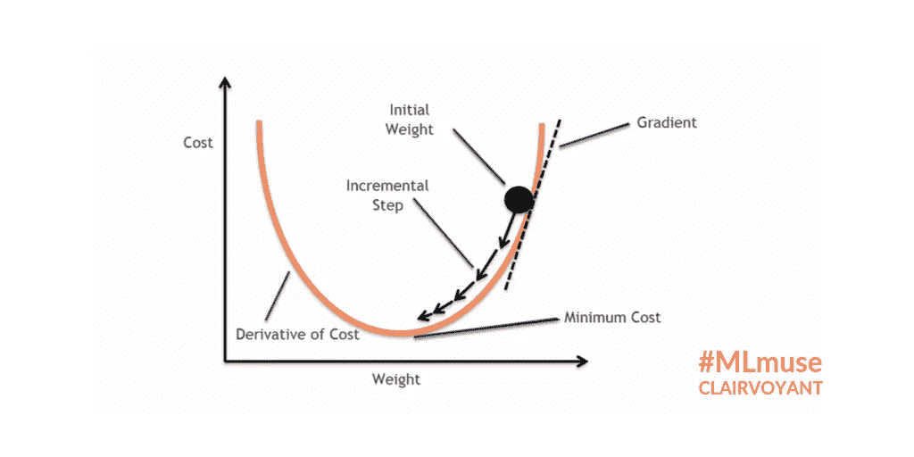

梯度下降算法的图形表示。

梯度下降算法的上述表示可以帮助你理解它。

在梯度下降算法中，我们分别计算计算成本相对于权重和偏差的导数。

让我们考虑一个简单的感知器模型，它有两个输入:

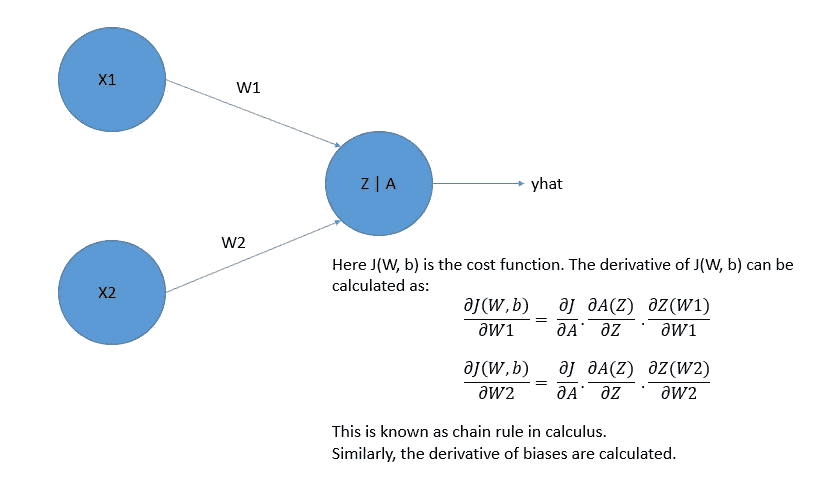

计算权重的梯度。

那么权重被更新为:

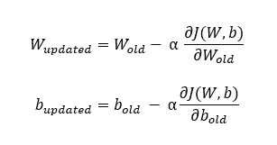

上式中的α称为神经网络的**学习速率**。这是一个**超参数**，稍后我会告诉你更多的超参数。现在，把它当作一个常数。

权重和偏差将被更新，直到成本函数达到其全局最优值。这样我们得到的预测输出误差会更小。

一次正向传播和一次反向传播一起被计为训练的 1 次迭代或**时期**。深度学习实践者必须在训练模型之前设置历元的数量(另一个超参数)。

# 深度神经网络

到目前为止，我们一直在研究感知器模型，处理感知器模型非常容易。但是当我们深入网络时，事情就变得很糟糕了。

现实世界中的问题有大量的输入特征，每个输入特征都有自己的权重和偏差，根据问题，模型中有许多隐藏层，每个隐藏层都有许多计算 Z 和 a 的节点。训练过程与我之前描述的相同，但它会重复神经网络中存在的节点数。

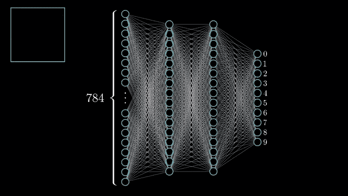

深度神经网络的训练。来源: [Gfycat](https://gfycat.com/activecourteousamericanindianhorse-mathematics-3b1b)

在上面的 GIF 中，你可以猜到一个神经网络的复杂性和实现它的高计算要求。

让我们总结一下到目前为止我们学到的一切:
1。正向传播期间:
-初始化权重和偏差。
-计算每个节点的 Z 和 A。
-计算整个模型的成本。
2。反向传播期间:
-使用梯度下降优化成本。
-分别计算关于权重和偏差的成本梯度。
-更新参数(W & b)
3。重复步骤 1 和 2，直到成本函数达到其全局最优值。

我希望我在整篇文章中表达清楚了，并且你很好地理解了这些概念。如果没有，欢迎在评论中提问。还有，在评论里给你宝贵的建议，我好改进我的文章。

也可以建议你想学习深度学习领域的什么课题。

感谢大家抽出宝贵的时间阅读本文。