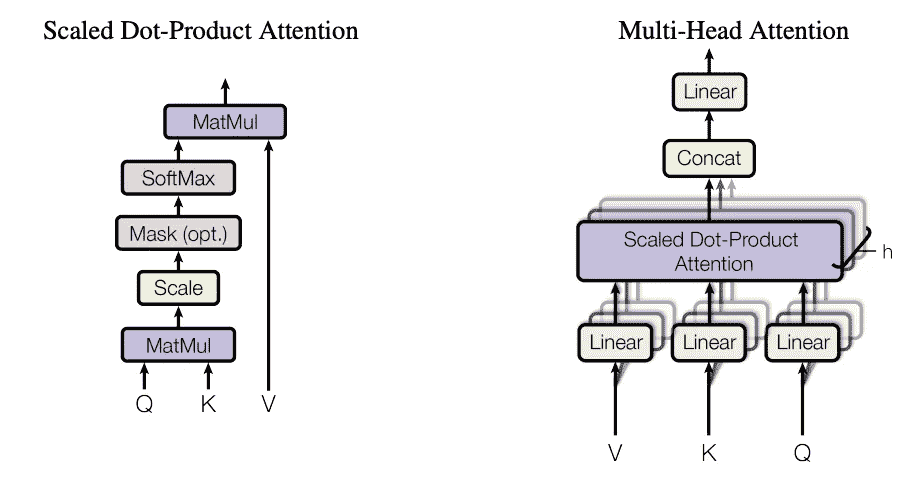

# 理解自然语言处理:人工智能如何理解我们的语言

> 原文：<https://towardsdatascience.com/understanding-nlp-how-ai-understands-our-languages-77601002cffc?source=collection_archive---------14----------------------->

## 让我们来一次自然语言处理的进化之旅…

> “语言是文化的路线图。它告诉你它的人民来自哪里，他们将去哪里。”
> 
> —丽塔·梅·布朗

由 Google AI Research 提出，**B**I direction**E**N coder**R**presentations from**T**transformers(**BERT**)是一个**S**state**o**f**T**he**A**rt(**SOTA**)模型中的**N**natural**Google 以其先进的算法为我们提供了许多方便而强大的工具。随着自然语言处理领域的前沿研究，谷歌搜索和谷歌翻译是几乎每天都在使用的两大服务，并且几乎成为我们思维的延伸。**


机器人看书，图片来自[莎士比亚牛津奖学金](https://shakespeareoxfordfellowship.org/shakespeare-by-the-numbers-what-stylometrics-can-and-cannot-tell-us/robot-reading-books/)

在本文中，我们将了解 NLP 的发展以及它是如何变成今天这个样子的。我们将首先浏览机器学习之前的 NLP 简史。之后，我们将深入研究神经网络的进展及其在自然语言处理领域的应用，特别是神经网络中的**R**e current**N**eural**N**网络( **RNN** )。最后，我们将走进 SOTA 的模型，如[**H**A**T**N**网络(**韩** )**](https://www.cs.cmu.edu/~./hovy/papers/16HLT-hierarchical-attention-networks.pdf) **和**B**I 方向**E**N 编码器 **R** 代表从 **T** 变压器( **BERT****

# **自然语言处理简史**

> **“学习另一种语言不仅仅是学习相同事物的不同词汇，而是学习思考事物的另一种方式。”**
> 
> **——弗洛拉·刘易斯**

**NLP 领域的第一个想法可能早在 17 世纪就有了。笛卡尔和莱布尼茨提出了一种由通用数字代码创建的字典，用于在不同语言之间翻译文本。凯夫·贝克、阿塔纳斯·珂雪和乔安·约阿希姆·贝歇耳随后开发了一种基于逻辑和图像学的明确的通用语言。**

**1957 年，诺姆·乔姆斯基发表了《句法结构》。这部专著被认为是 20 世纪语言学中最重要的研究之一。该专著用短语结构规则和句法树构建了一个正式的语言结构来分析英语句子。"无色的绿色想法疯狂地沉睡."根据相结构规则构造的名句，语法正确但毫无意义。**

****

**“无色的绿色想法疯狂地沉睡”，图片来自 [steemit](https://steemit.com/steemiteducation/@rasamuel/colorless-green-ideas-sleep-furiously)**

**直到 20 世纪 80 年代，大多数 NLP 系统都是基于复杂的手写规则。直到后来，由于计算能力和可用训练数据的增加，机器学习算法开始发挥作用。最著名的机器学习算法之一是 RNN，一种基于神经网络的架构。随着用机器处理自然语言的需求不断增加，新的模型近年来一直在快速迭代。伯特是现在的 SOTA，也许几年后会被取代，谁知道呢？**

**我们刚刚复习了英语和西班牙语等拉丁词根语言的历史。其他语言如汉语、印地语和阿拉伯语则完全不同。英语可以用一套简单的规则来描述，而汉语不同，它的语法极其复杂，有时模糊得无法用逻辑元素来定义。**

****

**Example of Chinese Paragraphs, Image from [智经研究中心](http://www.bauhinia.org/index.php/zh-CN/analyses/461)**

**汉语语法的复杂性和现代机器是基于逻辑电路的事实，也许是为什么流行的编程语言通常是英语的原因。过去曾有过几次用中文编写程序语言的尝试，如[易](http://www.dywt.com.cn/)和[燕文](https://github.com/wenyan-lang/wenyan)。这些语言非常类似于我们日常使用的编程语言，如 Basic 和 c。这些尝试并不能证明中文是一种更好的编程语言。**

**不同词根的语言之间的翻译也更加困难。手语到我们日常语言的翻译也遇到了许多障碍。我猜这就是我们试图建造巴别塔所要付出的代价。为了惩罚试图建造这座塔的人类，据说上帝决定通过让我们说不同的语言来分裂人类。**

****

**巴别塔，图片来自 [iCR](https://www.icr.org/article/what-happened-at-tower-babel/)**

**但随着时间的推移，我们克服了无数的障碍，走到了现在。随着技术的进步，语言障碍越来越不成问题。我们完全可以购买下面视频中的翻译棒，预订我们的日本之旅，而不需要事先了解任何日语。**

**NLP 算法也在许多其他领域帮助我们，例如自动字幕、用户体验研究、可访问性，甚至这篇文章的写作，因为如果没有[语法](https://app.grammarly.com/)的帮助，我的英语会很糟糕。现在，让我们深入那些令人敬畏的技术背后的计算机算法。**

# **抽象语法树、上下文无关语法和编译器**

> **"无色的绿色想法疯狂地沉睡."**
> 
> **—诺姆·乔姆斯基**

**我们现代化的软件产业是建立在自然语言处理的基础上的。语法树的应用之一是我们的编译器。如果没有它，我们将不得不处理机器代码，而不是像 Python 和 JavaScript 这样简单易学的编程语言。想象一下用二进制机器指令来编码我们的机器学习算法，yuck…由诺姆·乔姆斯基发明，**A**bstract**S**yntax**T**REE(**AST**和**C**ontext-**F**REE**G**rammar(**CFG**)被用来描述和分析我们用来编码的编程语言。**

> **警告:下面的例子是出于教育目的而简化的。如果你真的想知道编译器到底是如何工作的，请参考更专业的文档。**

## **抽象语法树**

**编译器使用 CFG 来解释以人类可读编程语言编写的代码。它将分解代码的逻辑，并从中解释出递归逻辑。为了理解代码是如何分解成递归逻辑的，最好将流程表示为 AST。下面是从代码中构造出的 AST 的图示。**

****

**抽象语法树解释一行代码**

## **上下文无关语法**

**CFG 用于描述输入语言和输出标记之间的转换规则。在定义编译器的文件中，它通常以如下所示的方式编写:**

```
if_stm   : expr = left_bkt cond_stm right_bkt
cond_stm : expr = expr and_stm expr    |
                  expr or_stm expr     |
                  not_stm expr         |
                  num less_than num    |
                  num greater_than num
num      : var | const 
```

**这些 CFG 基本上定义了 if 和 condition 语句的规则。例如，一个条件语句可以是多个条件语句(“expr”表示其本身，在本例中为“cond_stm”)与 and 语句(“and_stm”，在代码中表示为“&&”)，或者是由“>”或“ Wikipedia 等比较器连接的简单数字，更多关于编译器的信息，如著名的另一个编译器(YACC)可以在[这里找到](http://dinosaur.compilertools.net/yacc/)。**

# **自然语言处理的神经构建模块:单词嵌入、RNN 和 LSTM**

> **“模仿人脑的复杂性，受神经启发的计算机将以类似于神经元和突触通信的方式工作。它可能会学习或发展记忆。”
> —纳耶夫·阿尔·罗德汉**

**高级 NLP 算法是用各种神经网络构建的。我在我的 [Alpha Go 文章](/understanding-alphago-how-ai-thinks-and-learns-advanced-d70780744dae)中对神经网络有更详细的解释，包括与神经网络相关的历史。神经网络是[有向无环图](https://en.wikipedia.org/wiki/Directed_acyclic_graph)由人工神经元的连接层组成。输入图层中的值逐层传播到输出图层。这些基于神经科学家如何看待我们大脑工作的模型在最近几年显示出了一些竞争性的表现。**

****

**人工神经网络的前向传播**

## **单词嵌入**

**神经网络以及其他机器学习模型通常以数字向量的形式接受输入。但是我们的英语单词不是数字。这就是为什么我们有单词嵌入。单词嵌入指的是将单词和短语从词汇表转换成数字向量的语言建模和特征学习技术。一个例子可能是用神经网络在数千个段落中运行，以收集哪些单词更经常与另一个单词一起出现，从而给它们更接近的值。**

**一个著名的单词嵌入模型集合可能是 Word2vect。该模型基于浅层神经网络，并假设段落中彼此接近的单词也共享相似的语义值。下面是解释它的视频。**

**理解 Word2Vec，视频来自 [Youtube](https://www.youtube.com/watch?v=QyrUentbkvw)**

## **递归神经网络(RNN)**

**RNN 是神经网络的一种变体，最擅长处理顺序数据。声波、股票历史和自然语言等数据被认为是连续的。RNN 是一种神经网络，在处理顺序数据的过程中，输出被反馈到网络中，允许它也考虑过去的状态。**

**在我们的自然语言中，句子的上下文并不总是由单词的上下文来表示。例如，“其他评论者认为食物很棒，但我认为不好”这句话有两个积极意义的词(棒极了)。人工神经网络对序列没有任何线索，只是总结一切，但 RNN 能够捕捉句子中的倒装句，如“但是”和“不是”，并根据它进行调整。**

****

**安正在处理一个句子**

****

**RNN 处理了一句话**

## **长短期记忆(LSTM)**

> **"如果不忘记，根本不可能活着。"**
> 
> **― **弗里德里希·尼采****

**在 RNN 句子处理的例子中，您可能想知道为什么大多数单词都是不相关的。这正是我们需要 LSTM 的原因。LSTM 引入了一个“忘记层”，它决定应该保留或忘记的信息，使模型在大量数据下更容易训练。LSTM 有三种单元状态，即遗忘状态、更新状态和输出状态，每种状态有不同的用途。**

****忘记状态****

**在遗忘状态期间，LSTM 将从输入和先前状态中检索信息。然后使用 sigmoid 函数σ来决定是否应该忘记之前的状态。sigmoid 函数将输出 0 到 1 之间的值。通过将它与前一状态的输出相乘，它将决定前一状态的多少应该被遗忘。**

****

**LSTM 忘记状态**

****更新状态****

**在更新状态期间，LSTM 将尝试更新状态值。一个超正切函数 *tanh* 将柔和地强制该值位于 0 和 1 之间，这样它就不会累积成一些疯狂的数字。另一个 sigmoid 函数用于确定有多少将被添加到单元状态中。**

****

**LSTM 更新状态**

****输出状态****

**最后，单元格状态将由另一个超正切函数处理。然后使用一个 sigmoid 函数来确定将有多少输入到输出中。**

****

**LSTM 输出状态**

**更多关于 LSTM 及其数学训练的详细解释可以在这里找到。**

# **文本分类:与韩**

**恭喜你！我们终于走到了像韩和伯特这样的模式。我们先讨论韩，并不是因为一个模型优于另一个，只是因为韩更容易理解，可能有助于伯特的理解。由大学和微软研究院在 2016 年提出的，韩证明了它在文本分类方面的能力。能够对 Yelp 评论等文本进行分类有助于各种领域，如用户体验研究和支持票证管理。**

**我们先从说起，它是韩的基石。不要担心，它与我们在上一节中学习的 LSTM 非常相似。在此之后，我们将能够了解韩的建筑。**

## **门控循环单元(GRU)**

****

**GRU，图片来自[喧闹](https://www.bustle.com/articles/95190-is-gru-in-minions-heres-why-the-despicable-me-supervillain-isnt-the-focus-of-the-new)**

> **“我开玩笑的！虽然是真的。反正过得好。”**
> 
> **— GRU**

****GRU** 代表**G**ate**R**e current**U**nits。与 LSTM 相比，它们的功能较弱，但模型更简单。然而，在某些情况下，会比表现得更好，这一点我们在了解韩的时候会讲得更多。这就是为什么研究人员通常对这两种设备都进行实验，看哪一种效果最好。**

****

**GRU 解释道**

**GRU 通过 sigmoid 函数使用输入和先前状态来做出所有决定。总共有 2 个决定:**

1.  **第一个决定是前一个状态是否将与输入状态合并。**
2.  **第二个决定是这个混合状态(或普通输入状态)或前一个状态是否会进入下一个状态并作为输出。**

**更多关于 GRU 的变体及其详细的数学模型可以在[这里](https://arxiv.org/pdf/1701.05923.pdf)找到。**

## **分层注意网络**

> **在由单词、句子、段落和故事组成的大军中，字母表中的每个字母都是坚定忠诚的战士。一个字母掉了，整个语言都变得含糊不清。”
> ——**维拉·拿撒勒****

**传统的 RNN 和 LSTM 很难解释大量的文本，其中一些关键词彼此相距很远。这就是为什么 HAN 的注意机制从上下文向量 *u* 中生成重要性权重α的原因。这个重要性权重然后被用于选择性地过滤掉值得关注的输出。**

**韩运用两个主要层次对文本进行分类，即词层和句层。字向量首先被送入由双向 gru 组成的编码器。双向 GRU 就是方向相反的 gru 堆叠在一起。然后，输出用于计算注意力和上下文向量，输出将被输入到句子层的编码器中，以经历类似的过程。最终的输出向量将被相加并馈入 softmax 层。**

****

**分层注意网络(韩)解释说**

**关于韩的详细解释，其数学细节及其在 Yelp 评论上的表现，请参考[原文](https://www.cs.cmu.edu/~./hovy/papers/16HLT-hierarchical-attention-networks.pdf)。**

# **语言理解:变压器和伯特**

**最后，我们做到了如题所示。为了充分理解这一节，我们可能必须理解广泛的数学推理。这些可以在[变形金刚](https://arxiv.org/pdf/1706.03762.pdf)和[伯特](https://arxiv.org/pdf/1810.04805.pdf)的原始论文中找到。在本文中，我们将只讨论基本架构。**

## **编码器-解码器架构**

**首先，让我们看看编码器-解码器的架构。在机器翻译中，经常使用编码器-解码器结构，因为源文本和目标文本并不总是一一匹配。编码器首先用于从输入消息产生输出值，解码器将利用该输出值产生输出消息。**

****

**利用编码器-解码器架构进行翻译**

## **变压器**

> **“你需要的只是关注”**
> 
> **—变压器原始论文的标题**

**2017 年，来自谷歌的研究人员提出了一种完全基于自我关注的架构。自我关注意味着模型通过解释输入来自行决定关注，而不是从外部获取关注分数。**

**有 3 种不同类型的向量，查询向量 Q、密钥向量 K 和值向量 v。这些向量可以被理解为数据搜索机制。**

1.  **查询(Q)是我们寻找的那种信息。**
2.  **Key (K)是查询的相关性。**
3.  **值(V)是实际输入。**

****

**缩放的点积注意&多头注意，图片来自[变形金刚](https://arxiv.org/pdf/1706.03762.pdf)原纸**

**缩放的点积注意力首先将 Q 和 K 相乘，然后在图中所示的一些转换之后将其与 V 相乘。多头注意力将从缩放的点积注意力中检索到的头连接起来。Mask 用于过滤掉一些值。这个机制解释起来有点复杂，[这里的](http://jalammar.github.io/illustrated-transformer/)是一篇对注意力机制提供更详细解释的文章。**

**转换器是基于多头注意力的编码器-解码器架构。由于转换器使用简化的模型，不再考虑像 RNN 这样的位置信息，因此输入嵌入和位置嵌入都应用于输入，以确保模型也捕捉位置信息。添加& Norm 是[剩余连接](https://arxiv.org/pdf/1909.04653.pdf)和[批量规格化](https://en.wikipedia.org/wiki/Batch_normalization)。前馈只是简单的前馈神经网络重塑向量。**

****

**变形金刚模型架构，图片来自变形金刚的[原文](https://arxiv.org/pdf/1706.03762.pdf)**

## **变压器的双向编码器表示(BERT)**

**2018 年，来自谷歌的研究人员推出了一种名为 BERT 的语言表示模型。BERT 模型架构是一个多层双向变压器编码器。构建框架有两个步骤——预训练和微调。**

1.  **预训练:在预训练期间，模型在不同的预训练任务中根据未标记的数据进行训练。**
2.  **微调:在微调过程中，首先用预先训练的参数初始化 BERT 模型，然后使用来自下游任务的标记数据微调所有参数。**

****

**BERT 预训练和微调程序，图片来自 BERT 的[原文](https://arxiv.org/pdf/1810.04805.pdf)**

**模型在微调后提前了 [11 个 NLP 任务](https://github.com/google-research/bert)的 SOTA。有关 BERT 的模式详情，请参考[原始文件](https://arxiv.org/pdf/1810.04805.pdf)。**

# **话说到最后…**

**我计划写关于自然语言处理和计算机视觉的文章。因为我已经在我的[上一篇文章](/understanding-alphago-how-ai-thinks-and-learns-advanced-d70780744dae)中写了关于卷积神经网络的内容，所以我决定先写一些关于递归神经网络的内容。还有更多关于卷积神经网络的内容，我已经在我的[计算机视觉文章](/understanding-cv-how-ai-sees-our-world-a977b90bf612)中阐述过了。我还打算写关于生成模型和自动化机器学习的文章。人工智能领域有无数的奇迹，跟随我在遥远的未来看到更多！**