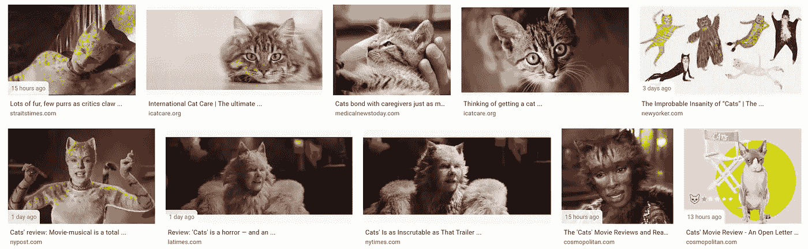
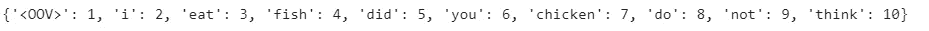
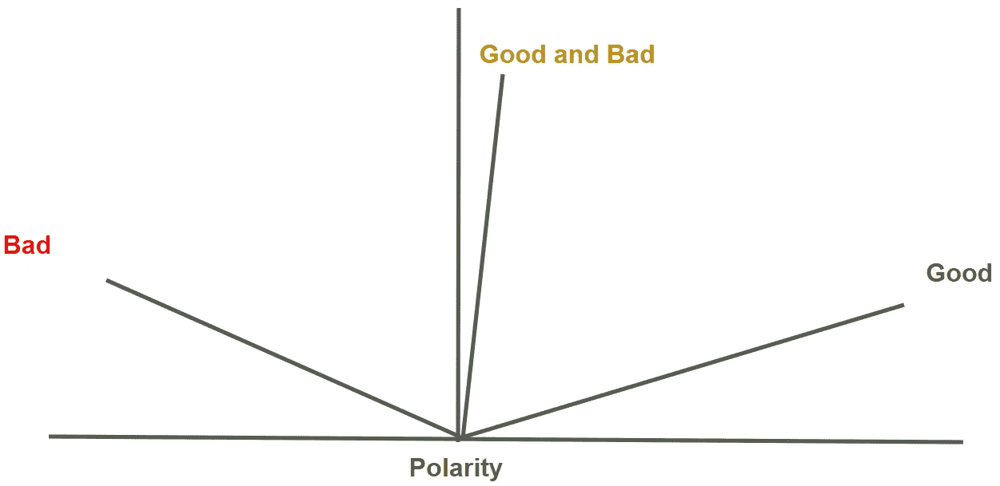

# 理解自然语言处理技术

> 原文：<https://towardsdatascience.com/understanding-nlp-techniques-and-machine-learning-2fdbe78922f2?source=collection_archive---------34----------------------->

## 我给有抱负的数据科学家的简单教程

## 快速理解基本文本分析和 ML 的方法

NLP 源简介 [Unsplash](https://unsplash.com/photos/2OCh8tuNsBo)

> “从一个人和什么样的人交往，你就可以知道他是什么样的人。”——约翰·弗斯

# 什么是自然语言处理？

> **自然语言处理(NLP)** 通过模拟人类理解文本的方式，帮助计算机理解文本。

由于近年来的数据增长，NLP 发展迅速。尤其是随着 Twitter、脸书和谷歌在搜索引擎或个人人工智能助理中处理非结构化数据的兴起。越来越多的自然语言处理的应用获得了巨大的普及。

# 自然语言处理的应用和问题

## 谷歌搜索图片

我对“猫”这个词的搜索

> 考虑一下谷歌搜索猫的图片。你指的是什么猫？

有这么多猫。在“猫”戏剧表演中有变异猫。你有卡通猫。你说的是哪一个？

*   当我说“**一只可爱的猫**”时。显然我想要那些小猫。
*   当我说“**猫秀**”的时候。显然我想要的是**变异猫**。

“**可爱**”和“**秀**”这样的相邻词进一步说明了我想要的。这是评估 NLP 性能的上下文。

## 谷歌助手

想想 Google Home Mini，你只需花 50 美元就能买到。它理解查询上下文吗？

> 想象一下，你的小女儿在她的作业项目“好的，谷歌，定义一闪一闪的小星星”上问谷歌 Home Mini。
> 
> Google Home 不应该聪明到知道这是一首歌的歌名吗？

## 情感分析

> 想象一下，你想预测唐纳德·特朗普(Donald Trump)在上次总统选举中击败希拉里·克林顿(Hillary Clinton)。

你能从推特上的普遍情绪预测一下吗？每位总统候选人的满意度如何以及如何？

 [## 2019 年印度尼西亚大选的推特故事(Pemilu)

### 在印尼总统选举中，佐科维和普拉博沃成为最受关注的候选人，他们代表着…

towardsdatascience.com](/the-twitter-tale-of-indonesian-election-2019-pemilu-fb75cd084a32) 

## 话题分析

> 想象一下你的硕士/学士班论坛:很难从所有这些信息中提取出什么是重要的。

你能建立一个模型，潜在地提取所有的关键主题，并基于此过滤帖子吗？

 [## 使用 Python Dash、文本分析和 Reddit API 自动生成常见问题

### 问题陈述

towardsdatascience.com](/auto-generated-faq-with-python-dash-text-analysis-and-reddit-api-90fb66a86633) 

> 自然语言处理变得越来越普遍和重要。潜力是巨大的，现在世界各地都在使用。

# NLP 为什么难——歧义和上下文？

> NLP 最大的敌人是歧义，而 NLP 最大的朋友是上下文——文森特·塔坦

## 想想我们在日常生活中是如何使用词汇的。

> “你为什么这么沮丧？玩得开心拉！
> 
> “怎么了？

对我们来说，这些话的意思似乎非常清楚。`“r u”`代表`“are you”`,`“what’s up”`是一种常见的美国非正式问候语。

然而，这些句子中有歧义。`“What’s up”`字面回答应该是`“The sun is up”`而不是`“I am good, thank you”`。隐藏的上下文使我们很难向计算机解释这些句子的确切意思。

大多数时候，我们假设听者会根据我们对世界的了解和共同的背景来填补很多空白。

> 我们在哪里？
> 
> 我们在做什么？
> 
> 我们对彼此了解多少？

有趣的是，我们不知道意义是如何从我们大脑中的单词中产生的。但这一切对我们来说都很容易。

这就是为什么我们需要机器学习和 NLP 技术来让计算机从文本语料库中识别这些规则和上下文。

## 科拉布

在这节课中，我们将使用 Colab 来完成整个教程。随意打开这个直接跑。这个 colab 展示了 NLP 的一个简单应用。

 [## 谷歌联合实验室

### 编辑描述

colab.research.google.com](https://colab.research.google.com/drive/1nEumwX8cxppopls-73LbAxOf7j1u7Odr?usp=sharing) 

# **如何理解“我爱冰淇淋？”**

来源 [Unsplash](https://unsplash.com/photos/Nl7MKI6SBqM)

想象你问你的女儿们喜欢吃什么。其中一个孩子回答说:“我喜欢冰淇淋！”你能猜出他们是兴奋地微笑还是皱眉吗？

如果我给你看“我的冰淇淋”这个词，你能做到吗？你怎么知道这孩子是不是皱着眉头？

为了回答这个情感分析问题，让我们将 NLP 分解为以下基本原则:

1.  **记号化**:把每个单词分解编码成一个句子。
2.  **序列**:按照特定的顺序映射记号，形成句子/序列。
3.  **嵌入**:在多维图中表示记号，提供向量聚合，提供商业洞察(情感分析)。

## 标记化

> **记号化**将文本分解成计算机可以理解的记号和索引。

我们将讨论如何通过标记来理解单词。考虑一下`FRIED`这个词。我们可以用 ASCII 数字来表示这些字母。但是`FIRED` 也有相同的字母，但是由于顺序不同，单词也不同。

好吧，那我们就用单词来代替。在文本`“I love my dog”`中，我们可以对每个单词`→ 1[I], 2[love], 3[my], 4[dog]`进行编码。我们将看一下实现令牌化的代码

Tokenizer API 已经删除了所有感叹号和标点符号，以便快速获得单词标记。

首先，我们需要标记来自 Keras 的 API。然后我们可以创造句子。`Num_words` 此处参数表示要保留的字数。在这种情况下，我们将保留在语料库中出现的 100 个最频繁的单词。

如果分词器在 **word_index** 中找到不存在的单词怎么办？然后我们需要指定词汇(OOV)标记中的**，它将单词标识为**索引 1** 。**

词的标记化和索引化

恭喜你。您刚刚将这些令牌编入了训练索引！

## **排序**

**排序**表示单词序列中的句子及其各自的索引。我们使用`tokenizer.texts_to_sequence` 将语料库翻译成序列中的标记。

顺序很重要，因为单词的顺序很重要。“我爱鱼”和“鱼爱我”有不同的语义和语法错误。句子的顺序决定了哪个词是这个意思的宾语或主语。

这将对标记进行排序，并填充剩余的标记空间，以匹配最长序列的维度。这些对于在嵌入/情感分析期间运行数学运算非常重要。

测序的结果

**注意，我们可以从这里提取几个索引:**

*   **0 →** 在较短的句子上填充以匹配较长的句子
*   **1 →** OOV(不在词汇表中)。这些是 word_index 标记中没有的词汇
*   **> 1 →** 在标记化 word_index 中找到的单词的索引

填充允许我们标准化每个语料库的长度。这使得使用 numpy 运行多个操作并为神经网络(NN)训练做准备变得更加容易。

## 把...嵌入

> **嵌入**将输入投影到多维表示空间。例如，我们可以将下列单词投射到极性子空间。

嵌入:在维度空间中绘制单词

让我们在多维空间里画出每个单词。然后当我们想要有组合的意思时。我们可以将这些向量组合在一起，生成统一向量。

例如,`good` 被认为是正面情绪，而`bad` 被认为是负面情绪。但是如果你在同一个句子中使用`good` …和`bad` …的话(例如:我认为你的文章是`good`，但是你的笔迹是`bad`，那么情感是中性的。

通过 Tensorflow 和 Keras 的实验，我们可以用嵌入作为输入来训练神经网络。有了这个 colab 笔记本，你可以实验做[卡格尔问题](https://www.kaggle.com/rmisra/news-headlines-dataset-for-sarcasm-detection)并运行代码。

# 额外收获:NLP 的进一步挑战

这在自然语言处理中有更多的应用。我希望这个简单的教程能激起你探索如何处理单词和语言的兴趣。

语法和词汇很复杂。我们需要更多的技术来衍生我们的特征和更好地标记。

*   **Lemma** :应该表示的唯一单词。例如，在英语中我们有不同的时态。Run、ran 和 running 指的都是同一个词，即 run。汉语有不同意思的单词组合。如魏(危)纪(机)→危机
*   **词性标注**:单词记号是独立的意义单位。这可以是动词、词缀、前缀、名词等。例如`run` 是动词，但`running` 可以是形容词(如`running` 竞赛)
*   **分块**:从词性标注中识别实体的提及。它将单词/标记分组为块
*   **共指**:链接一节中提到同一实体的词。奥巴马和罗姆尼谈到了他的童年。这里的`his` 指的是什么？

# 最后的想法

总之，我相信这些基本的自然语言处理在你的第一次探索中很容易实现。我们了解到:

1.  **记号化**:把每个单词分解编码成一个句子。
2.  **序列**:按照特定的顺序映射记号，形成句子/序列。
3.  **嵌入**:在多维图中表示记号，提供向量聚合，提供商业洞察(情感分析)。

请随意看看您是如何在 DNN 框架(如 Tensorflow 和 Keras)中实现它的。

一如既往，如果你有任何问题，请通过 Linkedin 联系我。如果时间允许，我很乐意回答你的问题。

索利·德奥·格洛丽亚

# 参考

*   斯坦福大学的自然语言理解(NLU)
*   劳伦斯·莫罗尼的《NLP 零到英雄》

# 关于作者

文森特用 ML @ Google 对抗网络滥用。文森特使用高级数据分析、机器学习和软件工程来保护 Chrome 和 Gmail 用户。

除了在谷歌的工作，Vincent 还是《走向数据科学媒体》的特约撰稿人，为全球 50 万以上的观众提供有抱负的 ML 和数据从业者的指导。

在空闲时间，文森特在佐治亚理工学院攻读硕士学位，并为铁人三项/自行车旅行进行训练。

最后，请通过 [**LinkedIn**](http://www.linkedin.com/in/vincenttatan/?source=post_page---------------------------) **，** [**Medium**](https://medium.com/@vincentkernn?source=post_page---------------------------) **或** [**Youtube 频道**](https://www.youtube.com/user/vincelance1/videos?source=post_page---------------------------) 联系文森特