# 了解目标检测和 R-CNN。

> 原文：<https://towardsdatascience.com/understanding-object-detection-and-r-cnn-e39c16f37600?source=collection_archive---------11----------------------->

## 让我们看看什么是目标检测，并详细了解基于 CNN 的区域提议。

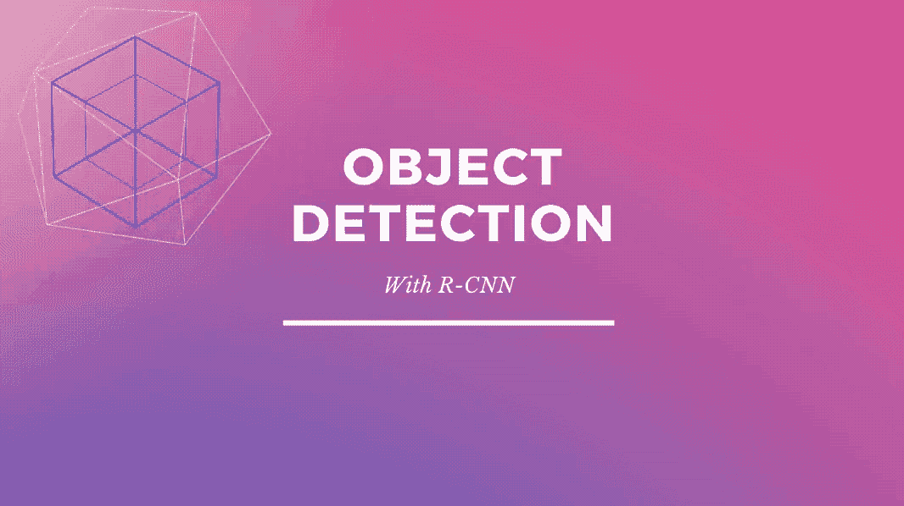

使用 Canva 设计

最近，我们看到机场和火车站试图通过摄像头检测人们是否保持社交距离，戴上口罩。这些是由摄像机捕捉的实时视频，其中存在持续的运动。我们还看到了开发自动驾驶汽车的研究，这种汽车需要检测道路上的障碍，并相应地驾驶。这一切是如何发生的？

这就是**物体检测**发挥作用的地方。让我们了解对象检测是如何工作的，我们还将学习 R-CNN 的概念。 **R-CNN** 是目前已有的和最流行的架构如更快的 RCNN 和掩码 RCNN 的前身。去年， **FAIR** (脸书人工智能研究)开发了一个全功能框架，名为 **Detectron2** ，它建立在这些最先进的架构、**更快的 R-CNN、**和 **Mask R-CNN** 之上。

在深入这个概念之前，我希望您熟悉一些概念，如卷积神经网络和标准架构。阅读[此处](https://en.wikipedia.org/wiki/Convolutional_neural_network)了解更多。

# 分类

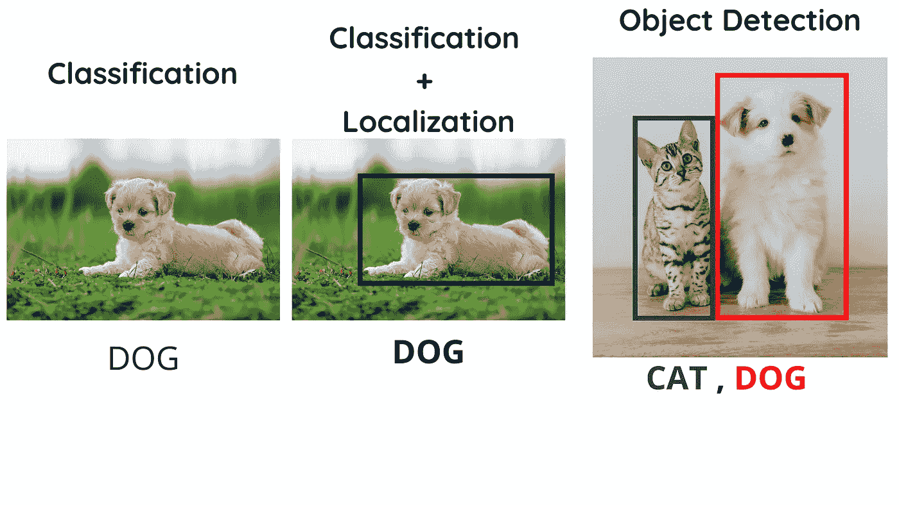

使用 Canva 设计

分类只是将图像标记到其各自的类别，而定位指的是围绕主题的边界框。目标检测指的是单个图像中的许多这样的实例(分类+定位)。在进入 R-CNN 之前，让我们先来看看地区提案的概念是如何被处理的，以及如何引导他们进入 R-CNN 的。

# 分类管道

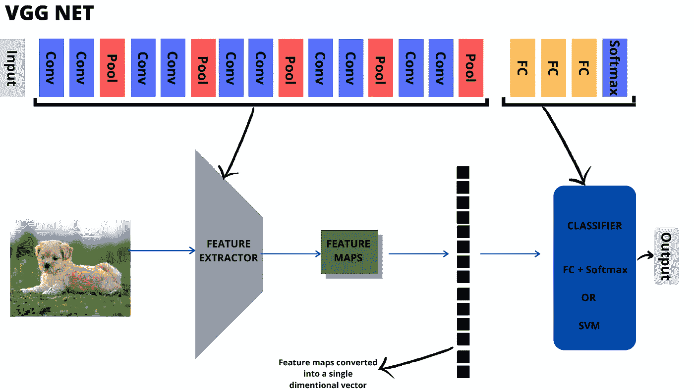

使用 Canva 设计

在任何标准 CNN 架构中，如 VGG 网或亚历克斯网，卷积层和池层共同充当特征提取器。下面的全连接层和 softmax 层充当分类器。SVM 也可以用来代替这种完全连接的层+ Softmax。特征地图被拉伸成一维向量，并被馈送到完全连接的层。

# 本地化

现在，对于本地化部分，考虑每个图像只有一个对象。这里，我们还需要一个模型来预测边界框的坐标。为此，我们需要一个带有 L2 损失的回归模型(大多数情况下是 L2，但在一些异常情况下也会用到 L1)。因此，除了目前的分类管道，我们需要附加一个回归模型来预测边界框。可以将相同的特征映射馈送到该回归模型，并且在分类器的情况下，代替单个 softmax 输出层，我们现在需要四个结果。四个结果是表示边界框的坐标。

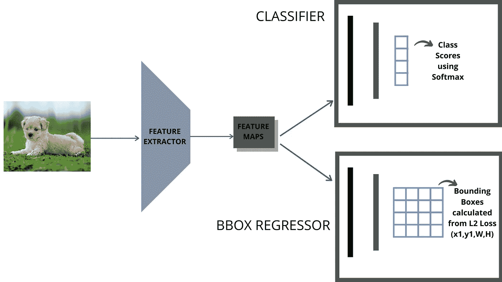

使用 Canva 设计

# 目标检测

现在，谈到对象检测，这里的情况是，在单个图像中可能有多个对象，并且这随图像而变化。我们事先不知道确切的人数。唯一的选择是扫描图像的所有可能位置。现在，想想在这样的图像上检测的想法。

我们可以考虑在这里使用**滑动窗口**技术，就是这样工作的。

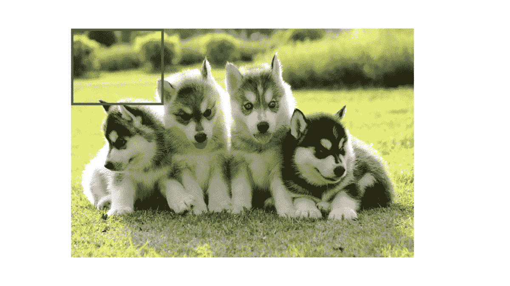

使用 Canva 设计

使用这种技术，我们可以得到图像的所有可能的部分，然后把它输入到上面显示的网络中。然后，网络会查看图像的每个部分，如果识别出其中的任何潜在特征，就会决定作物中是否有物体。如果是，它给出边界框。这样，通过使用相同的网络，我们将能够检测图像中的对象。

但是对于标准架构，如 AlexNet 和 VGG Net，输入的大小是有限制的。裁剪后的图像不能直接输入网络。裁剪后的图像必须按网络接受的输入尺寸进行缩放。这整个过程被认为是预处理阶段(滑动窗口+裁剪+调整大小)。

如果你观察敏锐，你可能会注意到图像中的所有对象不需要有固定的大小来适应我们的滑动窗口。因此，固定大小的窗口不能解决这个问题。要么必须采用不同尺寸的窗口，要么必须在保持窗口尺寸固定的情况下将图像缩放成不同的尺寸。实验发现，使用图像的六个不同尺度足以定位图像中的大多数对象。因此，后者通常比前者更受青睐。在较小尺度的图像中检测到较大的物体，而在较大尺度的图像中检测到较小的物体。这个概念被称为**形象金字塔。**

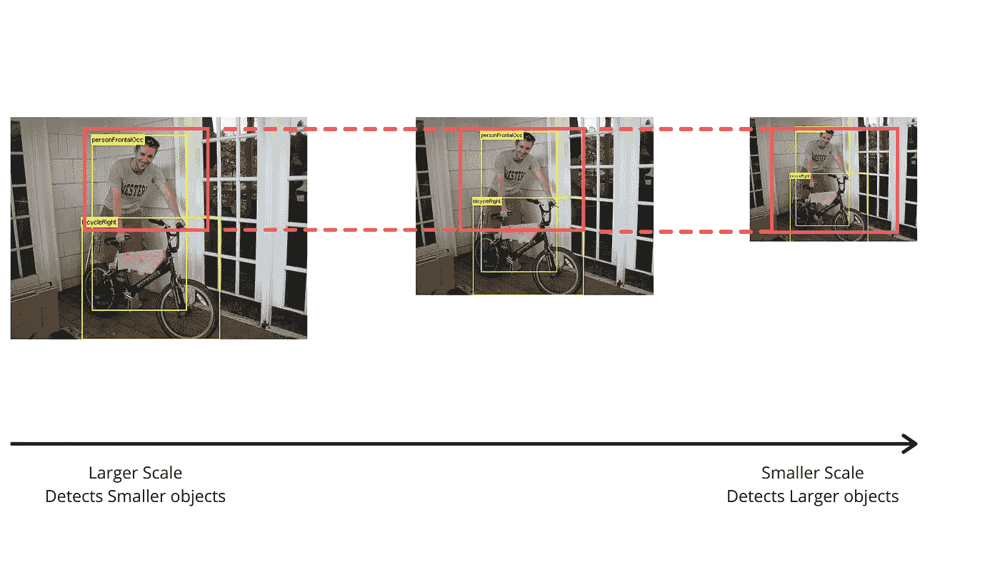

使用 Canva 设计

在这里，自行车和人的大小是不同的。你可以看到这个人不完全适合滑动窗口。为此，通过使用图像金字塔的概念，我们可以将图像调整到不同的尺度，在第三个尺度上，我们可以找到窗口内的人。然后，通过使用边界框回归器，我们可以将窗口的大小与地面实况相匹配。由于自行车与人相比是一个较小的物体，所以它可能在第一个或第二个位置被检测到。此外，请注意，该人也可能在其他尺度下被部分检测到，但置信度得分通常会更低，边界框也不会那么准确。

因此，这些是在输入端执行对象检测所需的额外预处理步骤。虽然我们已经使用滑动窗口和图像金字塔以及定位网络解决了对象检测的问题，但是这仍然将我们引向另一个问题。由于我们是在图像的所有位置以不同的比例裁剪图像补丁，所以我们最终会有大量的建议只针对单个图像。由于 CNN 的处理非常密集，这将是一个昂贵的操作。**那么，我们如何解决这个问题呢？**

我们可以使用一些区域提议算法来避免对网络的不必要的输入，而不是使用作为强力技术的滑动窗口方法。一些流行的区域提议技术包括*颜色对比、边缘框、超像素跨越、选择性搜索*等。在所有这些中，**选择性搜索**和**边缘框**被发现更加有效。选择性搜索也称为**类别不可知**检测器。

> **类别不可知**检测器通常用作预处理器，产生一系列有趣的包围盒，这些包围盒很有可能包含猫、狗、汽车等。

显然，我们需要在类别不可知的检测器之后有一个专门的分类器来真正知道每个包围盒包含什么类别。虽然 R-CNN 不知道特定的区域提议方法，但我们使用选择性搜索来实现与先前检测工作的受控比较。

# 选择性搜索

选择性搜索使用层次聚类来获得各种区域建议。

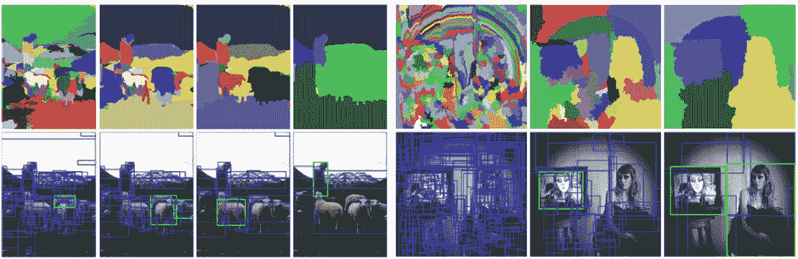

[目标识别的选择性搜索 J. R. R. Uijlings，K. E. A. van de Sande，T. Gevers，a . w . m . smulders](https://staff.fnwi.uva.nl/th.gevers/pub/GeversIJCV2013.pdf)

首先，它将像素非常紧密地分组，然后像素根据相似的颜色、纹理和成分合并成一个像素。在更高的层次上，我们通过裁剪出不同的小块从图像中得到一组区域建议，如最后一栏所示。

# R-CNN

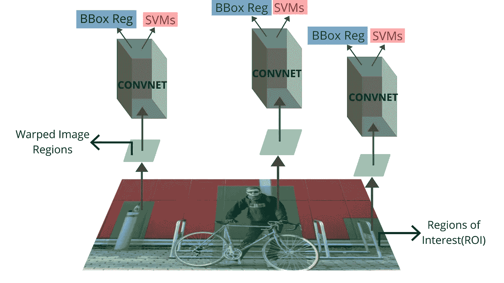

使用 Canva 设计

由于我们将地区提案与 CNN 合并，因此被称为 **R-CNN** 。由于诸如 VGG 网/亚历克斯网之类的本地化网络仅接受固定大小的输入，并且所有的区域提议可能都不是该大小，所以裁剪后的图像必须被扭曲成网络可接受的大小。

> 一开始 R-CNN 给出的准确率是 44%，有点低。但几经变化，提高到 66%。让我们看看精确度是如何提高的。

第一个架构不包括 BBox 回归器，因为他们认为这是不必要的，因为输入已经是裁剪后的图像。

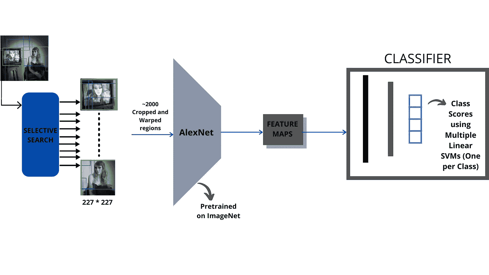

使用 Canva 设计

使用上述架构，我们将获得 44%的精确度。使用的 AlexNet 是在 ImageNet 数据集上预先训练的，该数据集包含大约 1400 万张图像和 1000 个类别。但是为什么即使是在如此庞大的数据集上训练，我们得到的准确率也是如此之低？

这是因为 ImageNet 数据集中的图像具有特定的纵横比，而网络从选择性搜索中接收到的裁剪和扭曲图像具有不同的纵横比。这意味着，在一般情况下，网络会认为一个人的形象会是又高又瘦。但是，当我们将区域方案扭曲到所需的尺寸时，图像会被拉伸，其纵横比会受到干扰。这说明了准确性的一些损失。

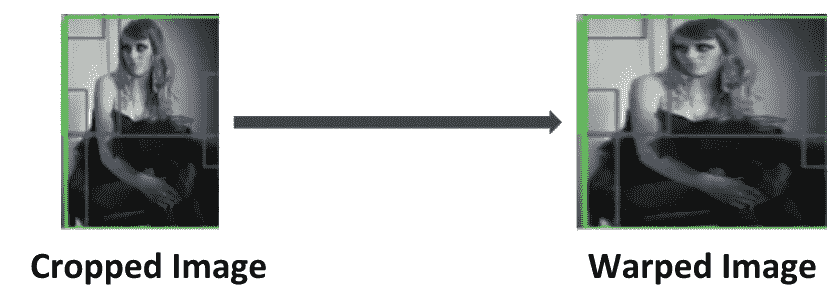

使用 Canva 设计

如前所述，您可以查看两幅图像的纵横比。扭曲的图像看起来被拉伸了。这样，扭曲的图像看起来很不自然，扭曲了图像的纵横比。因此，为了解决这个问题，提出了用区域建议对网络进行微调。但是，该训练阶段包括 softmax 分类器而不是 SVM，并且损失函数将是**交叉熵**损失。要把握交叉熵背后的核心直觉，可以在这里阅读[我之前的文章](/entropy-cross-entropy-and-kl-divergence-explained-b09cdae917a)。为一个类分配一个 SVM，并且使用存储的特征映射离线训练 SVM。每个 SVM 都通过为该类提供正确和错误的建议来接受训练。

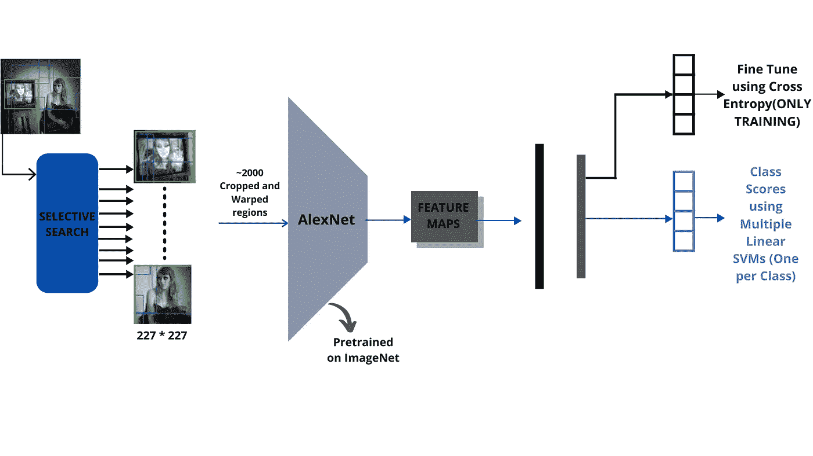

使用 Canva 设计

因此，当我们微调网络时，我们会更新卷积层和全连接层中的权重。这导致精度提高了 10%，导致 **54.2%** 。之后，还通过实验发现，包括边界框回归器导致了更好的准确性，因为它比以前更准确地收紧了边界框。它只包括一个完全连接的层，而不是两个。这导致精度进一步提高，达到 **58.5%** 。使用 VGG 网代替更深的 AlexNet 导致了 R-CNN 的最佳性能模型，其准确度为 **66%** 。

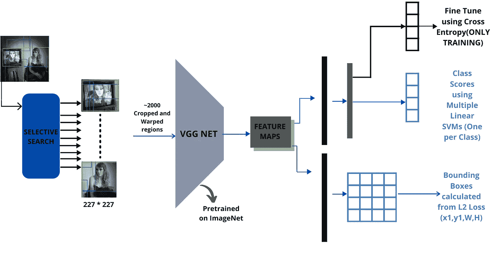

使用 Canva 设计

这是一个 R-CNN 的高层图表。此外，许多改进和实验是通过包括和移除完全连接的层来完成的，包括和不包括微调。观察到当微调时，更多数量的权重在完全连接的层中而不是卷积层中被改变，这是一个有趣的观察。

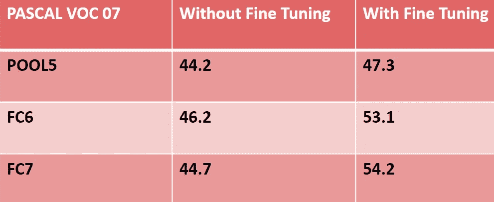

使用 Canva 设计

请注意，所有这些观察都是在 **PASCAL VOC 2007** 数据集上进行的，用于实验的架构是 Alex Net。

如果没有微调，即使我们添加完全连接的层，精度也不会有太大差异。这表明大部分精度是在卷积层本身中实现的，而完全连接的层几乎没有增加任何价值。需要考虑这一点，因为卷积层的模型大小大约为 **3.7 MB** ，而完全连接的层大约需要 **192 MB** 。我们可以想象排除 FC 层可以节省多少内存。然而，当我们根据地区提案对网络进行微调时，情况发生了变化。FC 层中的大多数权重都发生了变化，因此，我们可以看到准确性有了显著提高。此外，如果我们排除 FC7 层，我们会得到 53.1%的精度，仅比添加 FC7 层的精度低 1.1%。我们可以考虑去掉它，因为它占总模型尺寸的 **29%** 。但这不是强制性的，因为人们可以在时间、大小和准确性之间进行权衡。如果我们需要一个更精确的模型，并且我们有时间和空间，我们可以考虑将其用于关键应用，例如准确性更重要的医疗领域。

通过这个 R-CNN，我们避免了滑动窗口技术和图像金字塔的使用，但是我们得到了不同大小的区域建议。我们已经设法在不使用图像金字塔的情况下找到区域提议，但是每幅图像 2000 个提议太大，并且涉及巨大的计算。R-CNN 并不完美。它有一些缺点。

1.  它在测试时很慢，因为它需要为每个地区的提议运行一个完整的 CNN 转发过程。事实上，它比之前性能最好的型号**over feet**慢了 **9 倍**，该型号主要使用卷积运算代替 FC 层，并有效地使用了滑动窗口概念。
2.  它有一个复杂的多阶段训练管道(用于训练区域提议、训练 SVM 和 BBox 回归器的交叉熵)。

# 结论

我希望你已经理解了物体检测和 R- CNN 架构背后的原理。为了解决 R-CNN 的缺点，一年后**快速 R-CNN** 被提出，它比 RCNN 快 **146 倍。**更多关于**快、更快、**和**遮罩区域**的内容将在我接下来的文章中讨论。

> 编辑:你可以在这里 阅读这篇文章的下一部分，其中包括快速 RCNN 和更快的 RCNN [**。**](/understanding-fast-r-cnn-and-faster-r-cnn-for-object-detection-adbb55653d97)

如果你想联系，**在** [**LinkedIn**](https://www.linkedin.com/in/aakarsh-yelisetty-6b691b171/) 上联系我。

# 参考

1.  [https://arxiv.org/pdf/1312.6229.pdf](https://arxiv.org/pdf/1312.6229.pdf)
2.  [https://arxiv.org/pdf/1312.6229.pdf](https://arxiv.org/pdf/1312.6229.pdf)