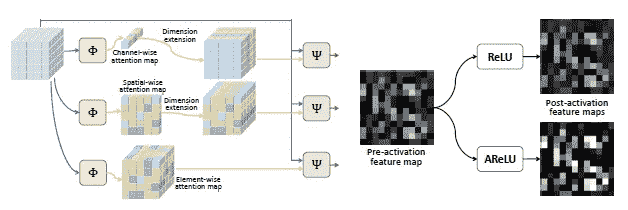

# 对 ARELU 的理解

> 原文：<https://towardsdatascience.com/understanding-of-arelu-attention-based-rectified-linear-unit-1da3a1d0be9f?source=collection_archive---------42----------------------->

## 卷积神经网络的聚焦良好、面向任务的激活

汉斯-彼得·高斯特在 [Unsplash](https://unsplash.com/s/photos/learning?utm_source=unsplash&utm_medium=referral&utm_content=creditCopyText) 上拍摄的照片

激活函数是神经网络的组成部分之一，对训练过程有着至关重要的影响。当开发大多数类型的神经网络时，校正的线性激活函数(即，RELU)已经迅速成为默认的激活函数，这是因为校正函数实现起来很简单，具有代表性的稀疏性，以及通过具有 1 的梯度斜率几乎完全避免了消失梯度的问题。

本文旨在通过将可学习的激活功能公式化为基于元素的注意机制，展示一个全新的视角。由此产生的激活函数 ARELU 促进了小学习速率下的快速网络训练，这非常适合于迁移学习，并且使网络训练更能抵抗梯度消失。

# ARELU 的配方

图 1:左图:用不同粒度的注意力地图说明了注意力机制。右图:在手写数字数据集 MNIST 的测试图像上使用 ReLU 和 AReLU 获得的激活前和激活后特征图的可视化。[ [图像来源]](https://arxiv.org/abs/2006.13858)

> 神经网络被认为是以一种简化的方式模仿人脑活动的一种努力。注意机制也是在深度神经网络中，试图实现选择性地专注于少数相关事物，而忽略其他事物的相同动作。

注意力可以说是当今深度学习领域最强大的概念之一，因为它指导网络学习输入的哪一部分对输出的贡献更大。具有不同粒度的注意力地图的一些注意力机制如下:

图 2:注意机制的类型

在所有的注意机制中，元素方面的注意是最细粒度的，因为特征量中的每个元素接收不同量的注意。因此，ARELU 被设计成使得对于网络的每一层，获得基于元素的注意力模块学习符号的注意力图，该注意力图基于其符号来缩放元素，从而导致正元素的放大和负元素的抑制。

# 对 ARELU 机理公式的理解

整个机制可以建立如下:

图 ARELU 激活的构建模块

## 元素式注意机制

等式(ii)中的调制器函数执行输入向量与注意力图的逐元素乘法。为了满足维度要求，如等式(I)所示，注意力图被扩展到输入向量的全维。

等式表 1:基于元素的注意机制

## 基于元素符号的注意

为了放大积极因素，抑制消极因素，注意力地图根据其在 ELSA 中的符号进行缩放。注意力由两个参数α和β决定，导致具有两个可学习参数的符号式注意力机制。

等式表 2:基于符号的基于元素的注意机制

## 基于注意力的校正线性单位

图 ARELU 可学习激活功能的解释

从等式(v)可以明显地证明，ARELU 放大了正元素，而相反，减小了负元素。

图 ARELU 阿海鲁激活后的初始状态

## 优化 ARELU 激活

优化包括误差函数的最小化。应用链式法则来最小化误差函数，对于等式(v)中的相应参数获得的梯度如下:

等式表 3:用于优化的 ARELU 可学习激活的导数

ARELU 激活能够在激活的输入上增加梯度，这使得避免梯度消失导致加速模型的训练收敛是合适的。对各种激活函数的比较研究表明，ARELU 在只有两个可学习参数的情况下表现最佳，并且对于不同的网络架构也是通用的。

图 6:在第一个时期之后，使用不同的优化器和学习速率，在 MNIST 上对 MNIST-Conv 进行五次训练的平均测试准确度(%)。我们将 AReLU 与 13 个不可学习的和 5 个可学习的激活函数进行比较。每个激活单元的参数数量列在可学习激活功能的名称旁边。对于不可学习的方法，最好的数字用蓝色粗体显示，对于可学习的方法，用红色显示。在表格的底部，我们用蓝色和红色分别报告了 AReLU 相对于其他不可学习和可学习方法的最佳改进。[ [图像来源](https://arxiv.org/abs/2006.13858)

> ARELU 官方 Pytorch 实现:[ [代号](https://github.com/densechen/AReLU/blob/master/activations/arelu.py) ] [ [论文](https://arxiv.org/abs/2006.13858) ]

# 结论

通过添加注意力和 RELU 模块来获得 ARELU，已经清楚地表明，通过引入每层不超过两个额外的可学习参数，显著地提高了大多数主流网络架构的性能。ARELU 不仅使网络训练不受梯度消失的影响，而且能够以较小的学习速率进行快速学习，使其特别适合迁移学习。

# 参考

陈，邓生，。"基于注意力的校正线性单元." *arXiv 预印本 arXiv:2006.13858* (2020)。