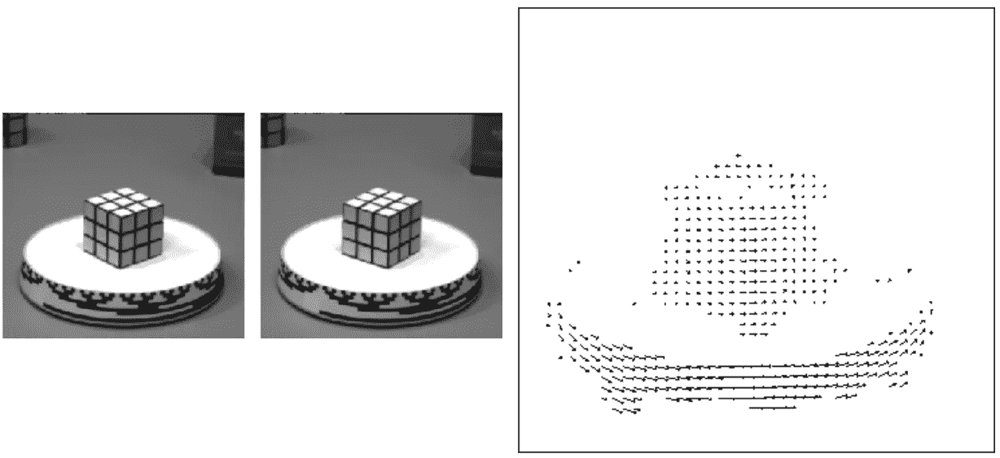
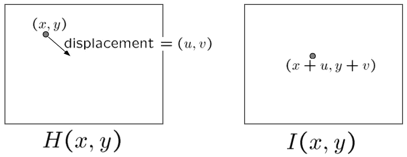
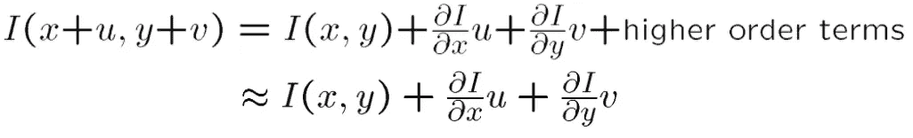
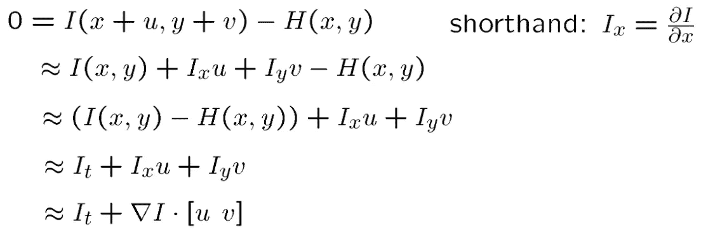
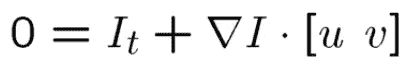
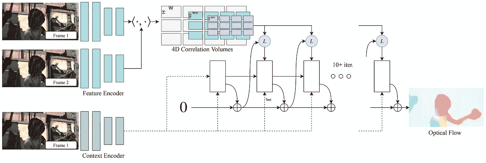
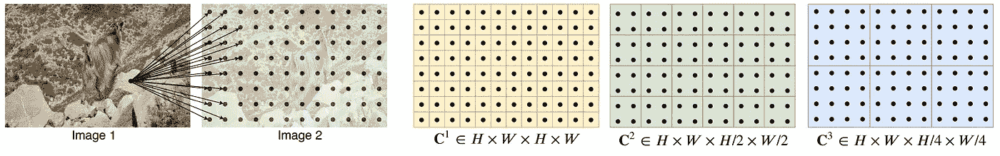
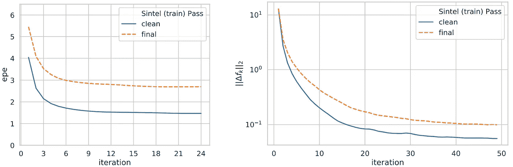
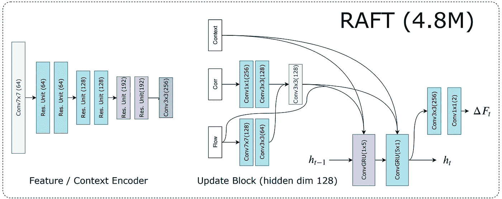
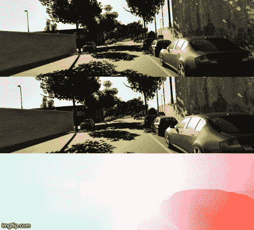

# 理解光流和 RAFT

> 原文：<https://towardsdatascience.com/understanding-optical-flow-raft-accb38132fba?source=collection_archive---------14----------------------->

## 如何以迭代方式使用多尺度相关性求解光流

([来源](https://arxiv.org/pdf/2003.12039.pdf))

计算机视觉中最重要的问题是对应学习。即给定一个物体的两幅图像，如何从两幅图像中找到该物体对应的像素？

主要针对视频的对应学习在目标检测和跟踪中有着广泛的应用。尤其是当视频中的对象被遮挡、变色、变形时。

## 什么是光流？

两幅图像的光流场

光流是两幅图像之间的矢量场，显示了如何移动第一幅图像中的对象的像素以在第二幅图像中形成相同的对象。它是一种对应学习，因为如果知道一个物体对应的像素，就可以计算出光流场。

## 光流方程和传统方法

两幅图像 H 和 I 之间的一点流

让我们采取最简洁的形式:两个图像之间的一点流。假设 H 中(x，y)处的像素流向 I 中的(x+u，y+v)，则光流矢量为(u，v)。

如何求解(u，v)？我们建立一些方程有什么约束吗？

首先，当 H(x，y) = I(x+u，y+v)时，让我们用泰勒级数分解 I(x+u，y+v):

I(x+u，y+v)的泰勒级数逼近

然后，舍弃高阶项，结合 H(x，y) = I(x+u，y+v):

光流方程的推导过程

最后，在极限情况下，当 u 和 v 变为零时，我们得到的光流方程为:

光流方程

**然而，在实际应用中，u 和 v 可能大或小，跨越几个到几十个像素，而不是零限制。因此，我们只能得到真实光流的近似。然而，如果 u 和 v 更接近于零，流场会更精确。**

在上面的等式中，未知数是 u 和 v，因为其他变量可以从 x，y 和时间维度的差异中计算出来。因此，一个方程中有两个未知数，无法求解。因此，在过去的 40 年里，许多研究者试图提供 u，v 的其他方程组，使其可解。其中，最著名的方法是[卢卡斯-卡纳德法](https://www2.cs.duke.edu/courses/spring19/compsci527/papers/Lucas.pdf)。

深度学习时代，能否用深度神经网络求解光流？如果可以，网络设计的意义何在？

答案是肯定的，这几年也有这方面的工作，效果越来越好。我将介绍一个代表作品叫做 RAFT，它获得了 ECCV 2020 最佳论文奖。

## 大量

RAFT，又称递归全对场变换，是一种迭代求解光流的深度学习方法。

筏子的网络结构([来源](https://arxiv.org/pdf/2003.12039.pdf)

如上所述，给定两幅图像，找到它们之间相同对象的对应像素对是核心。在深度学习中，一切都是基于潜在特征图，这带来了效率和准确性。因此，可以通过相关场提取相应的像素对。

两幅图像的多尺度相关性

相关性显示两幅图像中两个像素之间的关系。对于大小为(H，W)的两幅图像，它们的相关场的大小将为(H，W，H，W)，这称为 C1。如果我们把最后两个维度结合起来，我们会得到 C2 和 C3 等。对于图像 1 的像素，C1 示出了像素相关，C2 示出了与图像 2 的 2×2 像素相关，C3 示出了 4×4 像素相关，等等。这种多尺度方式可以帮助找到从小到大的位移，这对于具有大时间步长的视频中的光流估计是重要的。

对于图像 1 的每个像素，将其光流初始化为零，并在多尺度相关图中查找其周围区域，以搜索其在图像 2 中的对应像素。然后，估计图像 1 中的像素与其在图像 2 中搜索到的对应像素之间的光流。最后，根据估计的光流将图像 1 中的像素移动到新的位置，并且重复该过程直到收敛。**在这种迭代方式下，每次只估计一个步骤的流量，最终的流量就是它们的总和。**

损失和估计光流的收敛

## 关于 RAFT 的实现

([来源](https://arxiv.org/pdf/2003.12039.pdf))

RAFT 模型可以分为两部分:编码器和迭代器。编码器部分类似于编解码网络中的编码器，用于提取输入图像的潜在特征图。迭代器实现为 ConvGRU 模块，这是一种 RNN 结构，可以预测一系列流程步骤，并通过共享参数进行迭代优化。

此外，规范和激活层仅用于编码器。

## RAFT 的预测结果

预测光流图

我测试了作者提供的[源](https://github.com/princeton-vl/RAFT)，结果看起来不错。我用了一个 10 帧的视频剪辑。如上图，第一行是帧 0，第二行是帧 1~9，第三行分别是帧 0 和帧 1~9 之间的预测光流。结果表明，对于小时间间隔和大时间间隔的两个视频帧之间的光流可以平滑地预测。

## 参考

[一种应用于立体视觉的迭代图像配准技术，1981 年](https://www2.cs.duke.edu/courses/spring19/compsci527/papers/Lucas.pdf)

[RAFT:用于光流的循环全对场变换，2020](https://arxiv.org/pdf/2003.12039.pdf)

 [## 加入我的介绍链接-陈数杜媒体

### 阅读陈数·杜(以及媒体上成千上万的其他作家)的每一个故事。您的会员费直接支持…

dushuchen.medium.com](https://dushuchen.medium.com/membership)