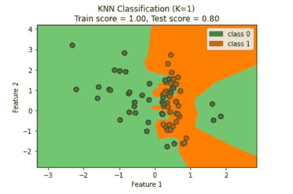
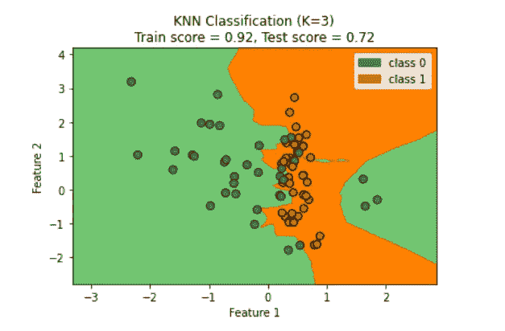
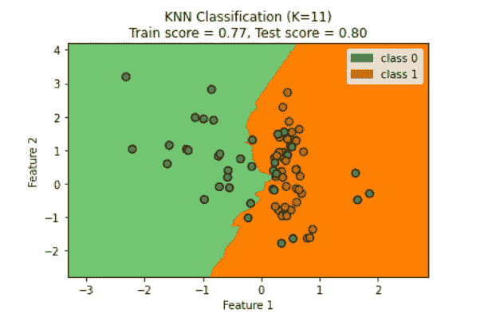
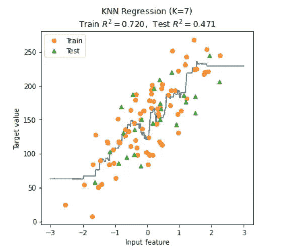
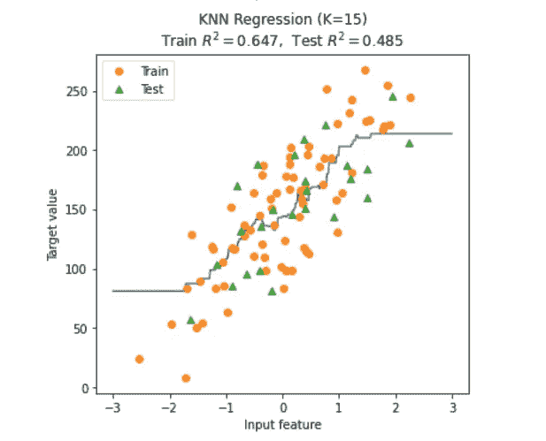
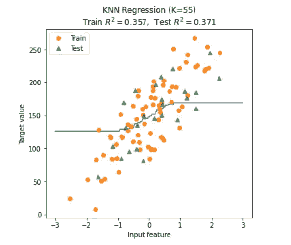

# 了解过度拟合和欠拟合

> 原文：<https://towardsdatascience.com/understanding-overfitting-and-underfitting-12c927e3b9ea?source=collection_archive---------47----------------------->

## 学会知道你的机器学习模型是过拟合还是欠拟合。

安迪·凯利在 [Unsplash](https://unsplash.com?utm_source=medium&utm_medium=referral) 上的照片

机器学习模型的真正有效性实际上取决于它在测试集数据上的表现。无论它在训练数据上做得多好，如果它在测试数据上表现不佳，该模型可能不太适合手头的任务。因此，在构建模型时，从性能角度来看，可能会发生三种情况:

1.  **模型过度拟合训练数据。**
2.  **模型对训练数据的拟合不足。**
3.  **该模型总体上非常适合该任务。**

总的来说，我们想要的模型只能达到上面提到的第三点。另外两点对于一个机器学习模型是不好的。但是，如果我们不够小心，在开发模型时，经常会面临这两个问题中的一个。在本文中，我们将讨论过度适应或适应不足的确切含义。

# 模型过度拟合

对于受监督的机器学习任务，我们希望我们的模型在测试数据上表现良好，无论是分类任务还是回归任务。这种在测试数据上做得很好的现象在机器学习术语中被称为对测试数据的**概括**。因此，一个模型对测试数据的概括越好，这个模型就越好。但事情并不总是这样。因为有时模型可能会遇到过度拟合训练数据的问题。

> 当一个模型在训练数据上表现太好，但在测试数据上表现很差时，这意味着该模型过度拟合了训练数据。

模型过度拟合有几个原因。但总的想法是，当我们试图用明显不足的训练数据来拟合一个复杂的模型时，模型往往会过度拟合训练数据。因为模型会尝试在训练数据样本中捕获更复杂的模式。通过这样做，它最终选择训练数据的每个小的局部变化，而不是选择数据样本的更全局的结构，这对于模型在测试数据上很好地一般化是绝对必要的。

现在让我们看一个使用 Python 的 Scikit-learn 的实际例子。

在这个 Python 脚本中，一个 ***K-NN*** 分类器是用不同的***K******(1，3，11)*** 的值训练出来的。该脚本将产生以下输出:

信用:[谷歌 Colab](https://colab.research.google.com/)

我们可以看到，当 ***K = 1*** 时，分类器对训练数据有 100%的准确率。但是测试数据的准确性明显较低。因为分类器对测试数据的概括不如对训练数据的概括，这意味着分类器可能过度拟合训练数据。然而，随着 ***K*** 的值增加 ***(K = 3，11)*** 分类器的准确度在训练数据上降低，但在测试数据上增加。这意味着当 ***K*** 增加时，分类器在测试数据上概括得更好。虽然这并不意味着如果我们不断增加 ***K*** ，测试数据的准确性也会不断提高。在某一点上，它将再次开始降低测试数据的准确性，对此我们必须小心。

# 模型欠拟合

正如我们已经讨论过的，当模型过度拟合时，它往往在训练数据上表现得太好。嗯，模型欠拟合是完全相反的。

> 当模型欠拟合时，它很可能在训练数据上表现很差。因此，该模型也不能很好地概括测试数据。

拟合不足的模型过于简单，甚至无法提取训练数据中存在的常见模式。因此，很明显，该模型在测试数据上的表现也会很差。下面的 Python 脚本为******【7，15，55】***的不同值训练了一个 ***K-NN*** 回归模型:***

*该 Python 脚本将产生以下输出:*

******

*信用:[谷歌 Colab](https://colab.research.google.com/)*

*这里我们使用了 ***R*** (r 平方)回归得分来衡量模型的性能。此 ***R*** 分数介于 0 到 1 之间，包括 0 和 1。 ***R*** 分数越高，模型越好。我们可以看到，当 ***K*** 从 7 增加到 15 时，训练分数降低但测试分数略有增加。然而，当 ***K*** 从 15 变为 55 时，列车得分明显下降。当 ***K = 55*** 时，表示模型欠拟合。结果测试分数也明显少于其他型号 ***(K = 7，15)*** 。*

# *非常合适*

*既然我们已经讨论了什么是过度适应和不适应，接下来合乎逻辑的事情就是问，*那么什么是好的适应呢！*确切地说，没有固定的标准来决定一个特定的契合度是好是坏。在理想情况下，我们希望模型在训练和测试数据上的误差都是 0%。但是说起来容易做起来难。所以我们能做的就是在训练机器学习模型时，在欠适应和过适应之间找到一个最佳平衡点。既不欠拟合也不过拟合并且对训练尤其是对测试数据都具有相当好的准确性的模型可以被认为是对手头任务的潜在良好适合。*

*希望你喜欢这篇文章。感谢阅读。*