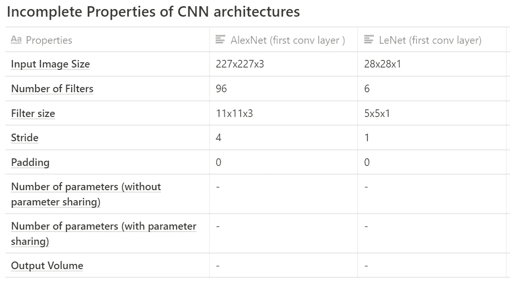
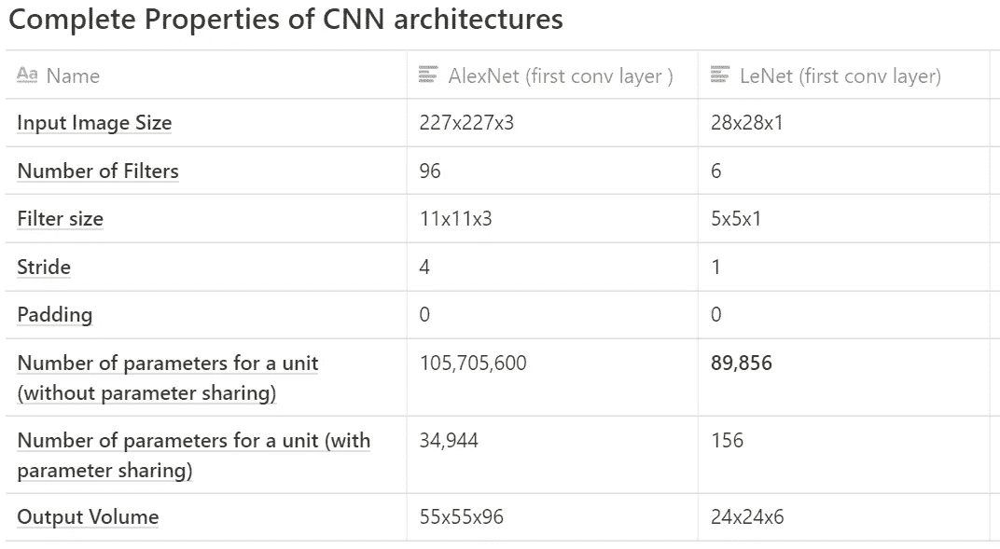

# 理解卷积神经网络中的参数共享(或权重复制)

> 原文：<https://towardsdatascience.com/understanding-parameter-sharing-or-weights-replication-within-convolutional-neural-networks-cc26db7b645a?source=collection_archive---------4----------------------->

## 技术和解释

## 参数共享或权重复制是深度学习研究中可以忽略的主题领域。理解这个简单的概念有助于更广泛地理解卷积神经网络的内部结构。

亨特·哈里特在 [Unsplash](/s/photos/machine-learning?utm_source=unsplash&utm_medium=referral&utm_content=creditCopyText) 上的照片

卷积神经网络(CNN)具有能够对通过网络馈送的图像的仿射变换保持不变的特性。这提供了识别图像中偏移、倾斜或轻微扭曲的图案的能力。

由于 CNN 架构的三个主要属性，引入了仿射不变性的这些特征。

1.  [局部感受野](/understand-local-receptive-fields-in-convolutional-neural-networks-f26d700be16c)
2.  **共享权重(参数共享)**
3.  空间子采样

在本文中，我们将探索**共享权重**并理解它们的目的以及它们在 CNN 架构中的优势。

> 这篇文章面向所有水平的练习机器学习或更具体地说深度学习的个人。

# 介绍

让我们首先在脑海中创建一个 CNN 中单个卷积层的图示。

由 [Clarisse Croset](https://unsplash.com/@herfrenchness?utm_source=unsplash&utm_medium=referral&utm_content=creditCopyText) 在 [Unsplash](/s/photos/machine-learning?utm_source=unsplash&utm_medium=referral&utm_content=creditCopyText) 上拍摄的照片

CNN 中的卷积层( *conv 层*)包含一组单元，也可以称为神经元。

conv 层还包括层内的几个过滤器，这是一个预定义的超参数。

层内的过滤器的数量指示由 conv 层创建的作为下一层的输入的激活/特征地图的输出体积的深度维度。

这些过滤器中的每一个都具有设定的宽度和高度，其对应于该层中单个单元的局部感受野。作用于输入数据的过滤器产生卷积层的输出，即特征图。

在 CNN 的训练阶段，滤波器内的权重值是可学习的。卷积层的输出维度具有深度分量，如果我们划分输出的每个片段，我们将获得特征图的 2D 平面。在单个 2D 平面上使用的滤波器包含由在同一平面上使用的所有滤波器共享的权重。

这样做的好处是，我们可以在输入数据的其他部分保持在输入数据的一部分中使用的相同特征检测器。

卷积层的输出是一组特征图，其中每个特征图是单元内的固定权重参数和输入数据之间的卷积运算的结果。

卷积神经网络层的一个基本特征是其特征图能够反映对通过输入层输入的输入图像进行的任何仿射变换。

因此，对输入数据进行的任何移动、倾斜或定向，要素地图都会提供一个输出，该输出会根据输入数据所受的量进行移动、倾斜或定向。

# 将理论付诸实践

本节的目标是揭示卷积神经网络中出现的权重共享的好处。

我们将在两种流行的 CNN 架构的第一卷积层中，推导出不具有权重共享和具有权重共享的可训练权重的数量: [LeNet](http://yann.lecun.com/exdb/publis/pdf/lecun-01a.pdf) 和 [AlexNet](https://papers.nips.cc/paper/4824-imagenet-classification-with-deep-convolutional-neural-networks.pdf) 。

## 下面是要采取的步骤:

1.  **获得 conv 图层的输出宽度**

(输入大小宽度—滤波器大小+(2 *填充)/步距)+ 1 =卷积层的输出宽度

2.**计算 conv 层内神经元/单元的数量**

3.**计算不带权重分配的训练参数(包括偏差)的数量**

4.**计算权重分配的训练参数数量(包括偏差)**

> 下表描述了来自 AlexNet 和 LeNet CNN 架构的信息将用于导出卷积层内的训练参数/权重的数量。

显示 CNN 架构的不完整属性的表格

## AlexNet

1.  **conv 图层输出宽度:**

*=((227–11)/4)+1*

*=****55****(conv 图层输出宽度)*

2.**conv 层内神经元/单位的数量**

*=输出高度*输出宽度*特征地图数量*

*= 55x55x96 (conv 输出音量)*

*=****29.04 万辆***

3.**conv 层内训练参数或权重的数量(无权重分配)**

*= 290400 *(11 * 11 * 3)+1 偏置)*

*=‭****105,415,600‬***

4.**具有重量共享的训练参数或重量的数量(具有重量共享)**

*= 96 *(11 * 11 * 3)+1 偏置)*

## = 34，944 重量

## LeNet

1.  **conv 图层输出宽度:**

*=((28–5)/1)+1*

*=****24****(conv 图层输出宽度)*

2.**conv 层内神经元/单元的数量**

*=输出高度*输出宽度*特征地图数量*

*= 24x24x6 (conv 输出音量)*

*=* ***三千四百五十六台***

3.**conv 层内的训练参数或权重的数量(没有权重共享)**

*= 3456 *(5 * 5 * 1)+1 偏差)*

*=‭****89,856‬***

4.**具有重量共享的训练参数或重量的数量(具有重量共享)**

*= 6 *(5 * 5 * 1)+1 偏置)*

## = 156 重量

显示 CNN 架构完整属性的表格

# 让我们一起来。

克林特·王茂林在 [Unsplash](/s/photos/connection?utm_source=unsplash&utm_medium=referral&utm_content=creditCopyText) 上拍摄的照片

很明显，通过参数共享，我们可以减少 conv 层中的权重数量。

参数共享用于网络内的所有 conv 层。

参数共享减少了训练时间；这是减少反向传播期间必须发生的权重更新次数的直接优点。

重申参数共享发生在从过滤器和来自 conv 层中的平面内的单元的输入数据之间的卷积结果生成特征图时。该层平面内的所有单元共享相同的权重；因此，它被称为权重/参数共享。

# 我希望这篇文章对你有用。

要联系我或找到更多类似本文的内容，请执行以下操作:

1.  订阅我的 [**YouTube 频道**](https://www.youtube.com/channel/UCNNYpuGCrihz_YsEpZjo8TA) 即将上线的视频内容 [**这里**](https://www.youtube.com/channel/UCNNYpuGCrihz_YsEpZjo8TA)
2.  跟我上 [**中**](https://medium.com/@richmond.alake)
3.  通过 [**LinkedIn**](https://www.linkedin.com/in/richmondalake/) 联系我

 [## 理解卷积神经网络中的局部感受野

### 想过为什么卷积神经网络中的所有神经元都没有连接起来吗？

towardsdatascience.com](/understand-local-receptive-fields-in-convolutional-neural-networks-f26d700be16c)  [## 机器学习硕士(不会)教你什么

### 关于攻读机器学习高级学位的常见误解

towardsdatascience.com](/what-a-masters-in-machine-learning-wont-teach-you-b84e5aac8837)