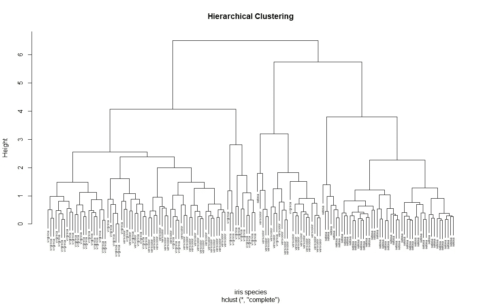
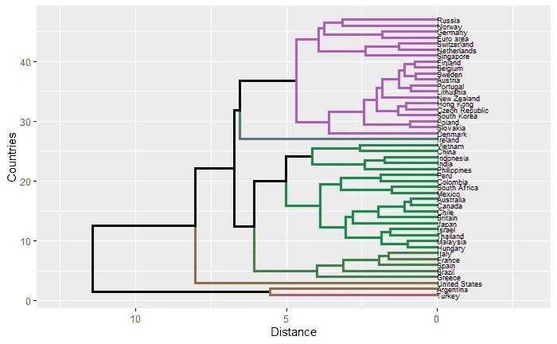
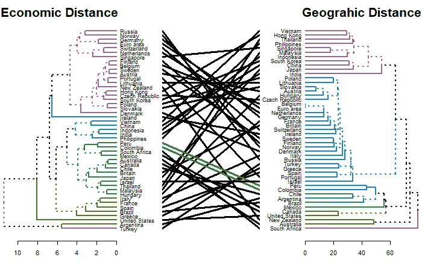

# 用机器学习理解全球经济模式

> 原文：<https://towardsdatascience.com/understanding-patterns-in-the-global-economy-with-machine-learning-120a6900194f?source=collection_archive---------25----------------------->

## 一种层次聚类方法


葆拉·梅在 [Unsplash](https://unsplash.com?utm_source=medium&utm_medium=referral) 上的照片

从很小的时候起，我们对世界的心理描绘就已经锚定在某种形式的全球地图上(就像上面的墨卡托投影)，任何两个组成国家的分离都是基于地理边界的。虽然两个国家可能在地理上相距很近，但在某个时间点上界定其各自经济体制的特征可能大相径庭。

例如，如果我们看看日本和中国，这两个被广阔的东海隔开的邻国，在 21 世纪初，我们会发现日本经济在“失去的十年”的后果中萎靡不振，这一时期的特点是股票和房地产价格泡沫的破裂，在未来许多年里削弱了增长和通胀。相比之下，中国在同一时期收获了 70 年代末开始的经济自由化的好处，并成为世界上增长最快的经济体之一。

这种对比再明显不过了，但它说明了一个重要的观点；要理解全球经济的状态和关系，我们必须比地理上的联系更深入。随着世界紧张地徘徊在衰退的边缘，这种理解的需要从未像现在这样切题。因此，我们在一种称为使用 r 的分层聚类的无监督机器学习算法的帮助下完成这项任务。

# 分层聚类


梅尔·普尔在 [Unsplash](https://unsplash.com?utm_source=medium&utm_medium=referral) 上的照片

分层聚类是一种无监督的机器学习算法，它基于公共属性将相似的观察值分组在一起。这些属性通常用距离度量来概括，如欧几里德距离、曼哈顿距离或相关距离。在第一种情况下，将两个最接近的点连接在一起以形成聚类，这重复发生，将最接近的点或聚类连接在一起，直到只剩下一个包含整个样本空间的大聚类。所得到的结构可以被可视化为如下的树状图:



为了实现这种理解经济的方法，我们采用定义每个经济状态的重要宏观经济变量的向量，并计算它们之间在欧几里得空间中的成对距离。我们称之为经济距离。直观地说，在这个框架中，彼此距离最近的国家/地区被认为在经济状况或发展方面是相似的。为了计算经济距离，我们将使用经济学人网站[](https://www.economist.com/economic-and-financial-indicators/2018/03/20/economic-and-financial-indicators)**中的一组“金融指标”。变量包括重要的宏观经济数据点，如增长、通货膨胀、失业、工业生产、通货膨胀、预算平衡。数据确实需要一些争论，清理后的 csv 文件可以在[这里](https://www.dropbox.com/sh/2h8im7p00h3xm2v/AADxwKKYkKw5L1oc5mjdmXQEa?dl=0)找到。在 R 中实现，如下所示:**

```
#Calling required librariesrequire(dendextend)##library for visualizing hierarchical Clustering
require(ggplot2) ##for plotting
require(maggritr) ##for the forward pipe operator %>% for nicer codeecon<-read.csv('fin_indicators0219.csv')#naming the rowsecon.df<-econ[,-1]
rownames(econ.df)<-econ[,1]#scaling variables for use in calculation of Euclidean distance econ.df.scaled<-scale(econ.df)#creating pairwise Euclidean Distance Matrixecon.dist<-dist(econ.df.scaled, method='euclidean')#creating hierarchical clustering objectecon.hc<-hclust(econ.dist)#plottingplot(econ.hc)#let's make it a little bit nicer
#by creating a dendrogram objectdend <- econ.hc%>%
  as.dendrogram %>%
  set("branches_k_color", k=10) %>% set("branches_lwd", 1.4)  %>% set("labels_cex", c(0.5)) ##arbitrary k value#now we plot using ggplot2ggd1 <- as.ggdend(dend)
ggplot(ggd1, horiz = TRUE, theme = NULL) +
  ylab("Distance")+
  xlab("Countries") +
  ylim(c(12.5,-3)) +
  theme_grey()
```

****

**截至 2019 年 2 月的经济聚类，虽然《经济学人》有更多的国家/地区，但为了便于计算，na 值被省略**

**通过直观的观察，我们可以很快发现地理并不一定是经济相似性的主要驱动力。虽然欧元区/欧元区内的国家似乎确实聚集在一起，但这是意料之中的。他们被一个单一的货币联盟和一系列允许金融和劳动力资本自由流动的条约所束缚。因此，摩擦的消除体现在一个更同步的经济状态，这是该地区的象征。然而，我们也知道这并不总是正确的，案例和要点是 2011 年的欧元主权债务危机，当时一些成员国无力再融资债务，威胁到欧盟的分裂。在这些情况下，我们可能会使用层次聚类来帮助确定这种情况何时开始发生，因为通过失业率和长期利率等指标的上升以及工业生产和增长的下降，风险国家开始与全球经济的其他部分脱离。**

**其他有趣的关系包括新加坡比法国、意大利或西班牙更接近瑞士。从我们对这两个国家的直观了解中，我们知道它们的相似之处在于它们经济的总体稳健性，以及它们作为各自地区金融和商业中心的声誉。土耳其和阿根廷离剩下的集群最远。这代表了两国在努力应对高通胀、高失业率和经济增长放缓时所面临的经济不确定性程度。**

# **与“基线”的比较**

****

**杰森·登特在 [Unsplash](https://unsplash.com?utm_source=medium&utm_medium=referral) 上拍摄的照片**

**为了测试按经济距离进行聚类是否会产生明显不同的结构，我们可以基于地理距离创建一个类似的层次聚类树图，并可视化聚类如何变化。**

```
#altering the sizing of labels and thickness of cluster lines of the #last dendrogram objectdend <- econ.hc%>%
  as.dendrogram %>%
  set("branches_k_color", k=10) %>% set("branches_lwd", 2.4)  %>% set("labels_cex", c(0.85))#reading in country by geo distance datacount.dist<-read.csv('country_dis.csv')rownames(count.dist) <- count.dist[, 1] ## set rownames
count.dist <- count.dist[, -1]#applying a root transformation to make reduce order of magnitude #for pleasant plotting, this still preserves relationships between #countriescdist<-as.dist(sqrt(count.dist))

c.hc<-hclust(cdist, method = 'single')dend2 <- c.hc%>%
  as.dendrogram %>%
  set("branches_k_color", k=10) %>% set("branches_lwd", 2.4)  %>% set("labels_cex", c(.85))#plot tanglegram to visually inspect differencestanglegram(dend, dend2, main_left = "Economic Distance", main_right = "Geograhic Distance", margin_inner = 6)
```

****

**不同的距离度量如何影响经济体之间的关系，资料来源:CEPII(geo data)，**

**上面的七巧板显示了随着距离度量的变化，国家和地区在等级中的位置是如何变化的。黑线表示它们的聚类结构已经发生了变化，而彩色线则相反。我们观察到，从一种方法转到另一种方法，只有秘鲁和哥伦比亚仍然聚集在一起(绿线)，这有效地表明，在试图理解全球经济时，经济距离产生了一个独特的和更丰富的表示。**

**虽然这种方法确实为我们提供了一个起点，但更有用的是能够查看集群如何以及是否随时间发生了变化。这种变化可以通过两种方式发生，一是通过总体等级聚类结构的扁平化，表明全球经济可能变得更加同步(宏观)或更好或更坏；二是通过组成国家之间的聚类(微观)。**

# **跨时间比较**

****

**照片由[乔丹·洛米保](https://unsplash.com/@jlcruz_photography?utm_source=medium&utm_medium=referral)在 [Unsplash](https://unsplash.com?utm_source=medium&utm_medium=referral) 拍摄**

**到目前为止，我们在分析中一直使用 2019 年 2 月的经济变量，现在我们为 2020 年 3 月的相同地区引入相同的变量集。我们将用另一个七巧板来想象这个。**

```
econ20<-read.csv('fin_indicators0220.csv')#naming the rowsecon.df20<-econ20[,-1]
rownames(econ.df20)<-econ20[,1]#scaling variables for use in calculation of Euclidean distanceecon.df.scaled20<-scale(econ.df20)#creating pairwise Euclidean Distance Matrixecon.dist20<-dist(econ.df.scaled20, method='euclidean')#creating hierarchical clustering objectecon.hc20<-hclust(econ.dist20)dend3 <- econ.hc20%>%
  as.dendrogram %>%
  set("branches_k_color", k=10) %>% set("branches_lwd", 2.4)  %>% set("labels_cex", c(.85))tanglegram(dend, dend3, main_left = "02/19", main_right = "03/20", margin_inner = 6)
```

****

**截至 2019 年 2 月 cs 03/20 的经济集群**

**这一次我们可以看到，在一年的时间里，全球经济格局发生了巨大变化，其中明显的混淆变量是 COVID19 的传播。仅有的仍然聚集在一起的国家是印度尼西亚、印度和菲律宾，它们通常被认为是新兴市场国家。通过研究，我们还发现，土耳其已经脱离了阿根廷，这是该国从一年前的货币危机中复苏的结果，而阿根廷仍是经济最不相似的国家，因为它徘徊在又一次违约的边缘。其他明显的观察结果包括，最相似的区域变得“更加接近”，这也可能是由于当前疫情局势造成的外部冲击，其影响波及全世界。随着全球各国继续抗击其蔓延，经济影响已经不分青红皂白。几乎所有受影响的地区都经历了增长收缩、消费减少、创纪录的失业率以及某种形式的货币或财政刺激。经济距离很好地涵盖了这些措施中的大部分。**

# ****结论****

**虽然层次聚类缺乏其监督学习对应物的预测能力，但它仍然是探索基础数据中的模式和结构的重要工具，这与经济距离相结合，在形成对全球经济的看法方面形成了强大、直观和可解释的框架，无论最终目标是社会、政策还是金融性质。**

****免责声明** : **本帖纯属个人观点和看法的表达。它不代表建议，也不反映我的雇主的观点。****