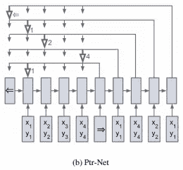

# 深度学习的指针网络

> 原文：<https://towardsdatascience.com/understanding-pointer-networks-81fbbc1ddbc8?source=collection_archive---------15----------------------->

这篇文章讨论了 Oriol Vinyals，Meire Fortunato 和 Navdeep Jaitly 的**“指针网络”**。这项工作提出了一种生成可变大小输出序列的神经架构，该输出序列是输入序列的标记/索引序列。因为输出序列的长度取决于输入序列的大小，所以它不能由基于 RNN 的序列到序列模型和神经图灵机来解决。指针生成器网络被应用于解决各种组合优化和组合搜索问题，例如著名的平面旅行商问题(TSP)、Delaunay 三角剖分、凸包问题和排序变长序列。指针网络现在还被应用于文本摘要问题，以从文档中提取句子，如在**“具有强化选择句子重写的快速抽象摘要”**中由延-陈春和莫希特·班萨尔所提到的。这些网络很好地概括了序列长度，超出了网络的训练。

指针网络可以说是由 **Bahdanau et al. 2015** 的注意机制衍生而来。为了理解指针网络，让我们首先理解序列对序列模型，基于注意力的模型序列对序列模型，然后最后是指针网络。

# 基于 RNN 的序列间模型:

在序列到序列模型中，我们使用两个 rnn(LSTM/GRU ),一个编码器编码输入序列，另一个供解码器产生输出序列。考虑一个具有四个点(P1、P2、P3 和 P4)的凸包的例子，如下图所示。

{图 1}:基于编码器(蓝色)、解码器(紫色)的序列对序列模型，用于具有四个点的凸包问题

在该图中，带有输入序列(*、【易】)*的蓝色方框代表编码器，紫色方框代表解码器。编码器的最后一个隐藏状态输出和“→”开始令牌被馈送到解码器模型的第一个时间步长。然后，对于下一个时间步长，来自前一个时间步长的输出连同上一个时间步长的隐藏状态一起被馈送，以产生当前时间步长的输出。在这种情况下，时间步长 T0 的输出["1"]，作为输入提供给下一个时间步长，以产生输出["4"]。从图中我们可以看到，输出序列完成的凸包将是["1 "，" 4 "，" 2 "，" 1"]。

{方程 1}:参数模型的条件概率方程(RNN)

在上面的等式中，Pi={P1，P2…Pn}是“n”个向量的序列，Ci={C1，C2…Cn}是从 1 到 n 的索引序列。在上面的图 1 中，“n”将是 4。

如等式 1 所示，RNN (LSTM/GRU)可用于模拟条件概率函数。RNN 在每个时间步长“I”被馈送 Pi，直到到达序列的结尾，其由“←”结束标记。

在这种类型的序列模型中，我们需要为序列的“n”长度的不同值训练单独的模型。

# 注意力网络

上面介绍的标准序列到序列模型通过采用上一时间步的隐藏状态，使用输入序列的固定表示来生成输出序列。固定描述限制了可以流经生成解码器 RNN 模型的信息量和计算量。因此，为了解决这个问题，Bahdanau et al. 2015 提出了注意力网络。在基于注意力的顺序模型中，通过给输入标记赋予权重，在解码器的每个时间步长形成上下文向量。通过将注意力权重乘以每个输入标记的隐藏状态表示并对它们求和来计算该上下文向量。有几种方法来计算注意力权重，如训练神经网络来并行计算序列到序列模型、点积和缩放点积的这些权重。

让我们将编码器隐藏状态表示为(e1，e2，e3 …，en)并将解码器隐藏状态表示为(d1，d2，d3 …)。，dn)。时间步长“I”的上下文向量的计算如下式 2 所示。

{等式 2}:上下文向量计算

这里，softmax 函数将长度为“n”的输入序列上的向量“u”归一化为输入序列的注意力权重。注意力权重乘以每个编码器隐藏状态“e”并求和以形成上下文向量。

关于注意力模型的更多细节可以从这篇博文中找到。

 [## 注意力网络

### 它们是自然语言处理、机器翻译和大多数最新技术(SOTA)领域的最新发展

towardsdatascience.com](/attention-networks-c735befb5e9f) 

在大多数顺序模型上，该模型的性能明显优于普通的顺序对顺序模型。但是它不适用于输出字典大小依赖于输入的问题。

# 指针网络

指针网络可以被认为是注意力模型的简单扩展(而不是缩减)。

{图 2}:图 1 中凸包问题的指针网络解。

在每个解码器时间步骤中，生成网络产生一个向量，该向量调制输入上基于内容的注意力权重。这些权重是通过采用字典大小等于输入序列长度的 softmax 运算来计算的。

在指针网络中，这些注意力权重/掩码不再用于计算下一时间步的上下文向量。这些权重被认为是指向输入序列的指针。具有最高权重的输入时间步长被认为是该解码器时间步长的输出。

{方程式 3}:指针计算

从等式 3 可以看出，对“u”的 softmax 运算不再用于计算上下文向量，以作为信息馈送给当前的解码器步骤。softmax 操作的输出指向具有最大值的输入令牌。

考虑解码器步骤的第一步的输出是“1 ”,如图 2 所示。然后，对于下一个时间步长，输入[*X1，Y1*]的相应输入令牌表示连同先前时间步长的解码器隐藏状态表示被馈送到网络，以计算当前时间步长的隐藏状态表示。当前步骤的输出是“4”，因此[ *X4，Y4* 进入下一步骤的输入。

应该理解，简单的 RNN 序列到序列模型可以通过训练直接指向输入目标索引来解决这个问题。然而，根据推论，这种解决方案并不考虑输出映射回输入索引的约束。如果没有这些限制，在更长的序列中，预测必然会变得模糊。

# 指针网络的应用

## 1)文本摘要

从实验中可以看出，结合了抽象和提取方法的研究论文比只使用一种方法训练的论文给出了更好的总结结果。

[图 3]:使用抽取和抽象的文本摘要。(论文最后引用。)

图 3 显示了通过结合提取代理和抽象的文本摘要算法的结构图。提取器使用指针网络从文档的完整句子集中提取一系列独特的句子。

## 2)凸包问题

在计算几何中，寻找有限数量的点的凸包是一项众所周知的任务，并且有几种精确的解决方案可用。为了使用完全数据驱动的方法来解决这个问题，实验发现指针网络比传统的 RNN 模型给出更好的结果。

[图 4]:凸包

在图 4 中，点序列 P[2，4，3，5，6，7，2]代表凸包的边界。指针网络以 P[1，2，3…10]为输入，Cp[2，4，3，5，6，7，2]为输出进行训练。由于输出指向输入序列的索引，指针网络模型提供了比其他神经网络模型更好的结果。

## 3) Delaunay 三角剖分

平面上 P 个点集的 Delaunay 三角剖分是这样一种三角剖分，使得每个三角形的每个外接圆都是空的；即在其内部没有来自 P 的点。

[图 5]: Delaunay 三角剖分

在上面的图 5 中，每组三个点[(1，2，4)，(1，4，5)，(1，3，5)，(1，2，3)]代表点集 P1 的三角剖分集。序列的顺序在这里并不重要；它只是按字典顺序写的。指针网络可以在这里被训练，因为我们知道索引的输入和输出序列。

## 4)旅行商问题

TSP 出现在理论计算机科学的许多领域，并且是用于微芯片设计或 DNA 测序的关键算法。琐碎的 TSP 问题是寻找恰好访问每个城市一次并返回起点的最短可能路线。假设两个城市之间的距离在每个相反的方向上是相同的。

[图 6]:旅行推销员问题

输入-输出对具有与凸包问题类似的格式。在一个平面中有“n”个不同的城市或点，我们必须在最短的时间内到达每个城镇。输入序列将是杂乱的“n”个点，没有任何顺序，输出序列将是相同点的有序序列，表示在最短时间内行驶。可以通过取“n”的不同值的输入和输出来训练指针网络。还发现指针网络甚至对于它没有训练过的“n”的那些值也能很好地推广。

# 引文

Oriol Vinyals，Meire Fortunato 和 Navdeep Jaitly 的指针网络

由延-陈春和莫希特·班萨尔用加强选择句子重写的快速摘要

# 有用的链接

 [## dev sisters/指针-网络-张量流

### 指针网络的张量流实现。支持多线程数据管道，以减少 I/O 延迟。训练一个…

github.com](https://github.com/devsisters/pointer-network-tensorflow)  [## shirgur/PointerNet

### 指针网络的 Pytorch 实现。通过在…上创建帐户，为 shirgur/PointerNet 的发展做出贡献

github.com](https://github.com/shirgur/PointerNet)  [## ChenRocks/fast_abs_rl

### 这个存储库包含我们的 ACL 2018 论文的代码:具有增强选择的快速抽象概括…

github.com](https://github.com/ChenRocks/fast_abs_rl)