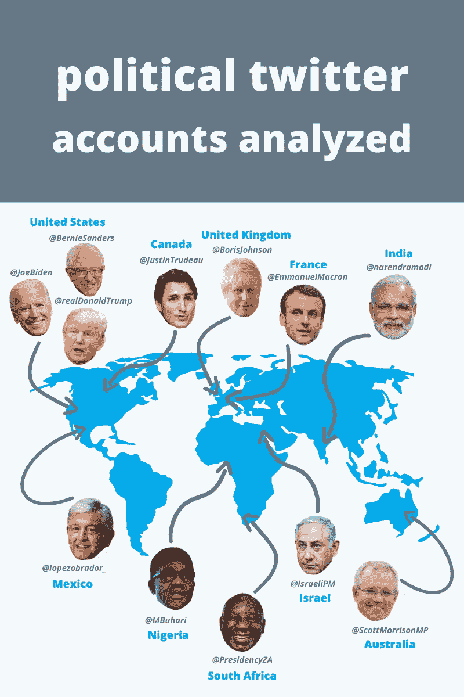
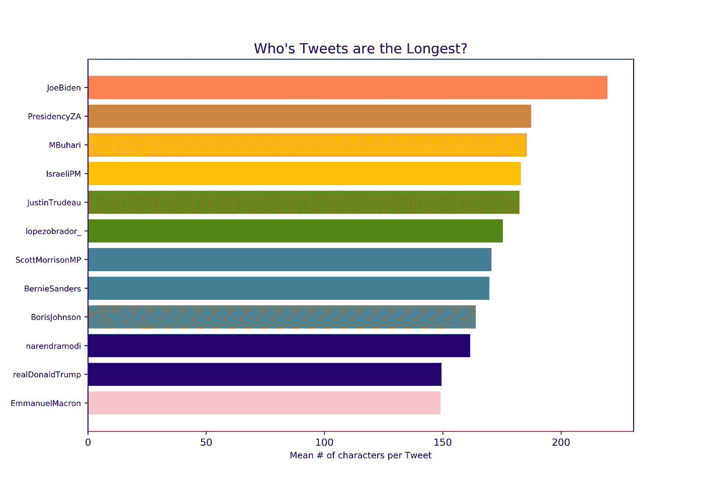
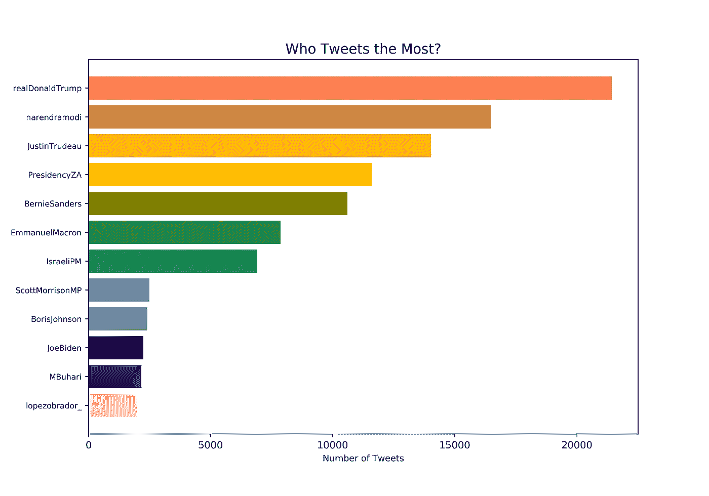
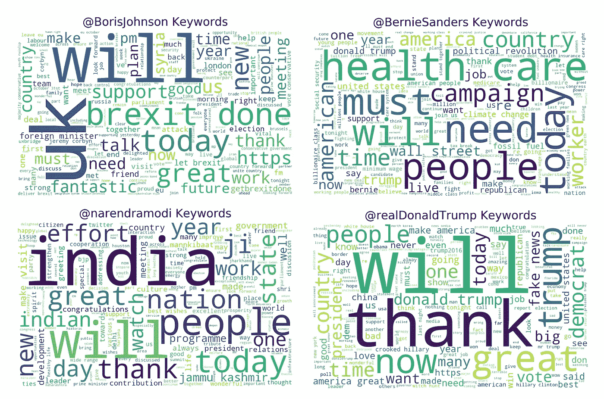
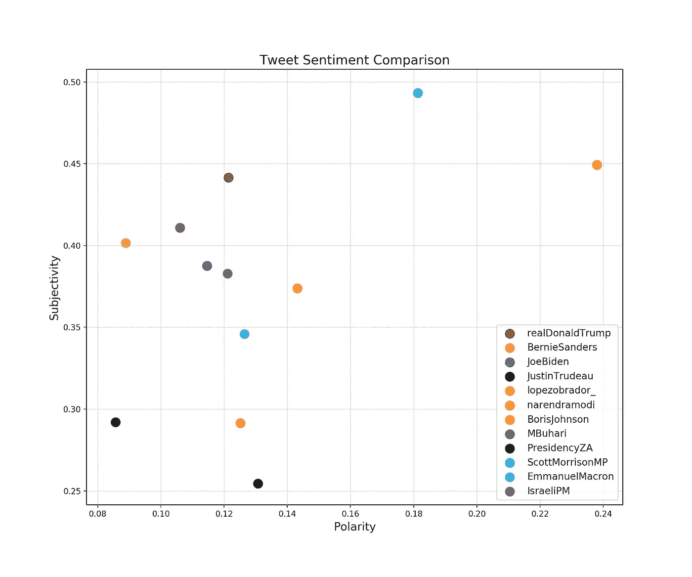
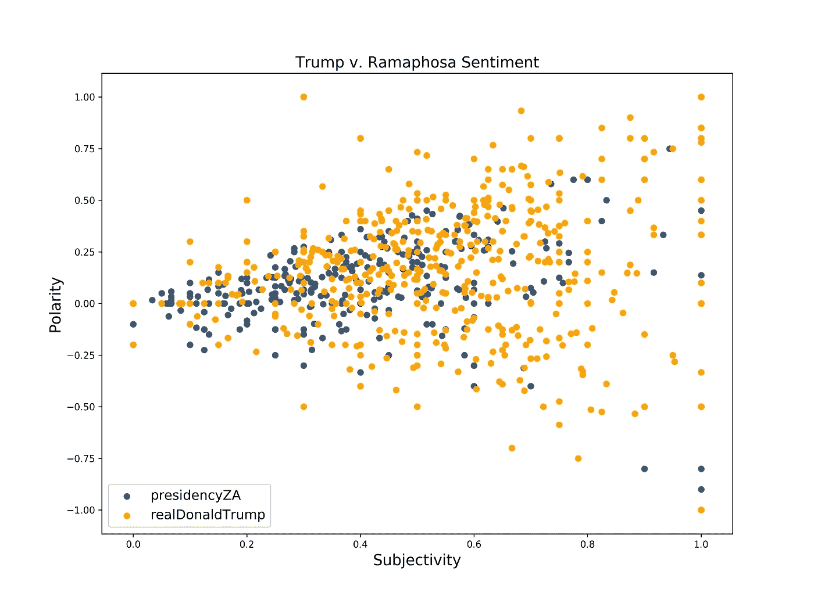
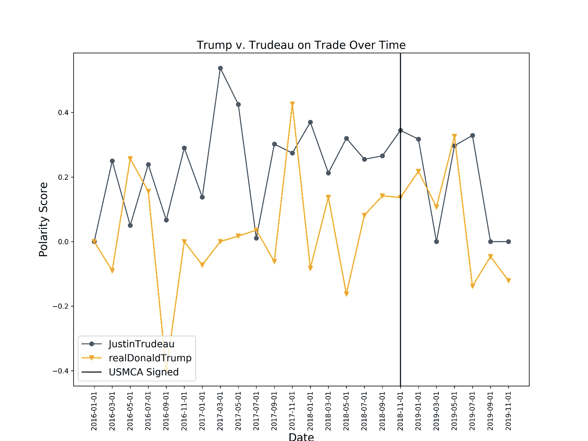
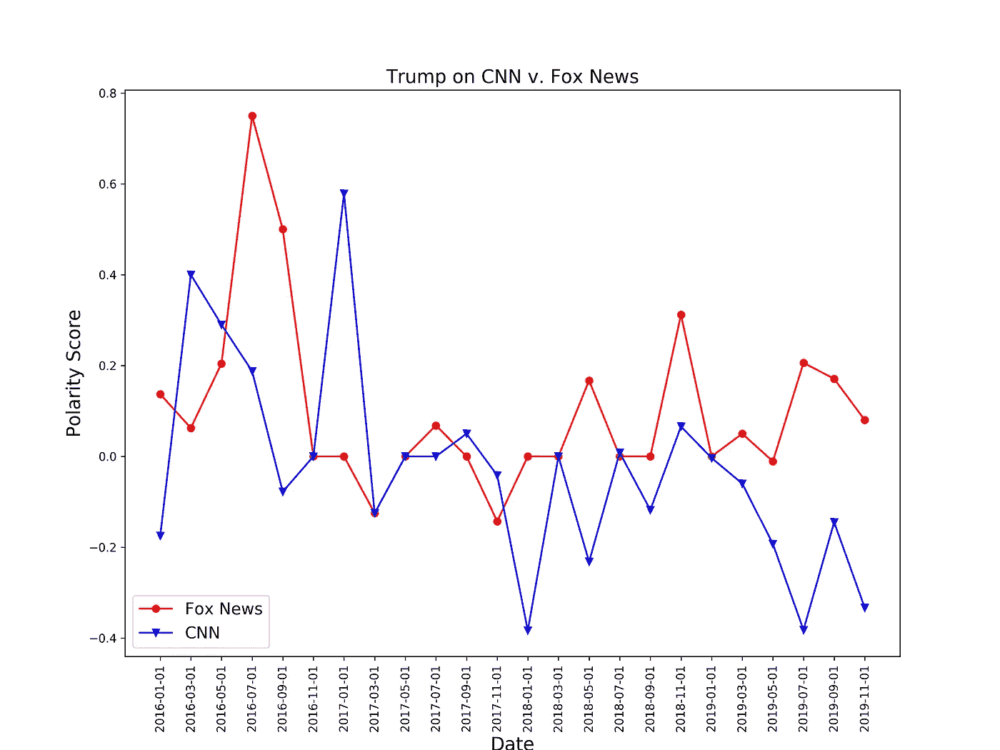

# 理解政治推特

> 原文：<https://towardsdatascience.com/understanding-political-twitter-ce3476a38377?source=collection_archive---------18----------------------->

## 利用推特情绪分析了解全球政治氛围。

邓肯·格拉布斯和梅根·曼迪

Kon Karampelas 在 [Unsplash](https://unsplash.com/s/photos/twitter?utm_source=unsplash&utm_medium=referral&utm_content=creditCopyText) 上拍摄的照片

当你想到政客和推特时，很可能会想到唐纳德·川普总统。自 2015 年开始竞选以来，特朗普因许多人所说的贬损、负面和有点煽动性的推文而臭名昭著。事实证明，即使只有 280 个字符，他也可以传达一系列的情感，“事实”，以及，信不信由你，观点。看看 NYT 的这篇文章，你会明白我们在这里的意思。说真的，甚至 [Vox](https://www.vox.com/2016/5/16/11603854/donald-trump-twitter) 也对此进行了研究，因为特朗普发了很多**推文**，他们可能真的*在那里*。

在过去的十年里，政治推特账户的使用量激增。如今，似乎每个政治领导人和他们的整个家庭都有一个 Twitter 账户，他们都觉得有必要在平台上与我们所有人分享他们的观点。事实上，许多领导人使用 Twitter 作为他们与公众沟通的主要方式，而不是地址或简讯。然而，这引起了一些有趣的问题。推文通常没有经过审查，当来自“个人”账户而不是“官方政府运营的通信”时，它们可能会非常两极分化和/或有问题。

所有这些让我们思考——我们能测量政治家和世界领导人在 Twitter 上的交流方式吗，那会是什么样子？

# **研究问题**

我们想调查世界各地不同的领导人是如何使用 Twitter 的。具体来说，我们围绕以下问题进行分析:

1.  在 Twitter 上，某些世界领导人/政治家总体上比其他人更积极吗？
2.  随着时间的推移，对某些组织/主题的看法发生了怎样的变化？某些领导人改变立场了吗？
3.  政治推特中使用频率最高的关键词是什么？这些在不同国家有什么不同？

# 数据

资料来源:梅根·曼迪

我们的第一步是收集数据。我们知道，我们希望在一段较长的时间内收集世界各地各种领导人的推文。我们决定主要关注在任的国家元首，尤其是如果这个国家不是说英语的话。考虑到这一点，我们登陆了世界上一些最大的经济和政治强国的 12 个账户，并查看了过去 5 年 ***的所有推文，从 2015 年 1 月 1 日到 2019 年 12 月 31 日。*** 我们选取了以下几位领导人进行分析: ***乔·拜登、伯尼·桑德斯、唐纳德·川普、贾斯廷·特鲁多、安德烈斯·曼努埃尔·洛佩斯·奥夫拉多尔、鲍里斯·约翰逊、埃马纽埃尔·马克龙、本杰明·内塔尼亚胡、穆罕默杜·布哈里、西里尔·拉马福萨、纳伦德拉·莫迪、斯科特·莫里森*** 。收集这么多数据绝非易事。首先，我们尝试了 Twitter 的本地 API，但很快意识到他们对一个人可以下载多少数据有非常严格的限制。经过一番研究，我们决定使用[优化的 Get Old Tweets 3 库](https://github.com/marquisvictor/Optimized-Modified-GetOldTweets3-OMGOT)。它作为 Twitter API 的包装器，允许几乎无限制的 tweet 下载，而且它已经用 Python 编写了！我们总共下载了超过 70MB 的原始推文数据，这些数据都可以在我们的[库](https://github.com/duncangrubbs/political-sentiment)中找到。

下载完数据后，我们专注于清理推文并翻译它们。我们用正则表达式删除了 URL、@标签和图片链接，并将所有推文规范化为小写。然后我们用[谷歌翻译 API](https://py-googletrans.readthedocs.io/en/latest/) 翻译非英语推文。

我们如何清理推文的代码和正则表达式

# 分析

首先，我们需要一些基线信息。我们测量了这 5 年间每位领导人发微博的次数，以及平均微博长度(以字符数表示)。唐纳德·特朗普发的微博最多并不奇怪，但我们惊讶地发现，平均而言，乔·拜登发的微博最长。虽然 Twitter 的每条推文有 280 个字符的限制，但几乎每位领导人的平均字符数都低于 200 个。看起来最常见的方法是多发布短推，少发布长推。

接下来，我们想看看最有影响力的英语客户使用的一些关键词。我们将这种分析局限于英语帐户，因为在翻译过程中，文本数据可能会发生很大变化，无法准确反映单词的用法。词云是一种很好的方式，可以很容易地将某些关键词在大量文本中突出出来。我们使用了 [WordCloud](https://pypi.org/project/wordcloud/) Python 库，通过输入原始推文数据来生成图像。

我们如何生成单词云的示例代码

使用翻译 API 翻译不同语言的示例代码

与其他领导人相比，特朗普提到自己的名字要多得多。莫迪和约翰逊非常频繁地提到自己的国家。

在收集了基线数据后，我们将注意力转移到了情感分析上，并决定使用 [TextBlob](https://textblob.readthedocs.io/en/dev/) Python 库。这为我们提供了每条推文的两个数据点， ***极性*** 和 ***主观性*** 。极性值的范围在-1 和 1 之间，其中分数 1 表示文本通常为正，分数-1 表示文本通常为负。主观性得分更容易理解，范围从 0 到 1，其中 0 分是客观或事实陈述，1 分更多地属于个人观点、情感或判断。TextBlob 使用训练有素的 NLP 模型来计算这一点，该模型使用来自各种来源的人类标记的文本数据。

首先，我们比较了 2019 年最后 6 个月世界领导人的平均情绪得分。这一时间限制是由于翻译中的瓶颈。虽然我们有所有领导者 5 年的原始推文数据，但由于 API 的限制，我们只能翻译 6 个月的推文。

6 个月期间(2019 年 7 月 1 日至 2019 年 12 月 31 日)的推文数据

上面我们可以看到 ***没有一个*** 的领导者平均极性小于 0，这是个好消息。平均而言，我们的领导在推特上发布积极的事情！也就是说，存在着广泛的主观性。记住 0 主观性是最低的，指的是事实陈述。虽然主观性得分高于 0 并不意味着说谎，但它们确实意味着该文本在陈述一种观点或个人信仰。莫里森、莫迪和特朗普在这一类别中都得分很高。相比之下，特鲁多、奥夫拉多尔和拉马福萨的平均主观性很低。

> “再过三天，新的一年。新的十年。可以肯定的是，未来十年，21 世纪出生的人将在国家进步中发挥关键作用。在今天的#MannKiBaat 活动中，我向印度的年轻人致敬，他们充满活力。”—纳伦德拉·莫迪

在所有世界领导人中，莫迪的极性最高。事实证明，他在推特上使用高度积极的方言来表达里程碑和未来的进展。

> “我们看到反犹太主义和仇恨犯罪在上升。我们看到一个小孩因为是拉丁人而被撞倒。我们见过有人因为是犹太人而被刺伤。我们看到有人因为是穆斯林而被攻击。如果有一个团结起来反对偏见和种族主义的时刻，那就是现在。”—伯尼·桑德斯

另一方面，伯尼·桑德斯的极性较低，经常以更加消极中立的语气在推特上谈论美国面临的困境。

# 特定比较

数据来自 2015 年至 2020 年 5 年间的 700 条推文

绘制特朗普总统和拉马福萨总统的极性与主观性展示了两位领导人推文之间的明显差异。特朗普在过去 5 年的主观性和极性涵盖了极性和主观性的整个范围。虽然有一群推文被认为是极性中性的，主观性居中，但他的大部分推文是主观性较高的。相反，Ramaphosa 的推文大多集中在 0-0.5 的主观性范围内，这意味着它们更接近客观。

我们决定围绕政治账户的某些关键词/组织扩展我们的情感分析。为了了解政治家们是如何讨论一个普遍话题的，我们选择了关键词“贸易”为了获得关于组织观点的更具体案例，我们查看了 Trump 如何在推特上发布关于福克斯新闻频道和 CNN 的消息。

在查看关键词“贸易”时，我们比较了贾斯廷·特鲁多和川普的数据。作为邻国的领导人，他们之间有着悠久的贸易历史，包括北美自由贸易协定和美国管理认证协会，加拿大和美国在这个问题上的情绪是一个有趣的对比。特鲁多稳步地在推特上以积极的态度谈论贸易；而特朗普在贸易方面通常是消极或中立的。虽然不可能确定每条推文的确切内容，但我们确保排除了提到中国和 T2 贸易的推文。此外，我们发现特朗普推文的积极倾斜趋势与 USCMA 的签署之间存在相关性，us CMA 是他上任后立即推动的北美自由贸易协定的替代物。

毫无疑问，福克斯新闻频道和 CNN 吸引了不同的政治派别。福克斯新闻频道倾向于保守派和共和党，而 CNN 倾向于温和派/自由派和民主党全国委员会。在分析特朗普对这两家媒体的看法时，他的观点有明显的区别。川普一直在推特上对福克斯新闻频道持中立到积极的态度，正如人们所料，然而他的推特几乎总是对 CNN 持中立到消极的态度。

# **问题与改进空间**

为了恰当地调查推特上 ***世界*** 领导人的情绪，选择一些用英语以外的语言发推特的政治家/国家元首(马克龙、洛佩斯·奥夫拉多尔、莫迪)是合乎逻辑的。然而，这带来了翻译的负担，由于对[谷歌翻译 API](https://py-googletrans.readthedocs.io/en/latest/) 的请求限制，翻译最终比预期的更加复杂。我们试图为至少 8 个不同的账户翻译平均 2MB 的 twitter 数据，但是我们只被允许每台电脑每天翻译大约 100KB 的数据…不太理想。我们通过减少账户数量，限制分析的时间范围，从而减少需要翻译的推文数量，并利用 VPN，解决了这个问题。

我们如何从更大的数据集中缩小推文的日期范围的代码

然而，障碍并没有就此结束——在分析之前清理推文被证明是极其困难的。在一条推文中出现的符号(如@或#)和图片的 URLs 链接之间，很难区分哪些要从推文中清除，哪些要保留。我们希望尽可能简单地分析推文，但我们不想在这个过程中影响情感分析的准确性。

我们承认这一分析有改进的余地。从数据本身开始，我们分析的用户都是人工选择的。这些用户中的一些人比其他人发的微博多得多，所用语言的差异都使分析变得复杂。随着推文翻译、分析的时间范围和数据量更加一致，我们可以在未来获得更精确的见解。

# **结论**

虽然我们的分析并不完美，但我们惊讶于从这些数据中可以获得如此多的洞察力。世界各国领导人在推特上表达的情绪存在明显的、可以解释的差异。无论是在贸易、政策还是世界大事上存在分歧，都可以通过推特情绪记录下来。如果有什么不同的话，这表明推特越来越多地反映了一个政治家真正的信仰，有时比任何其他来源都更具启示性。

*感谢阅读！如果你想查看所有的源代码或数据，你可以在 GitHub* [*这里*](https://github.com/duncangrubbs/political-sentiment) *查看。*