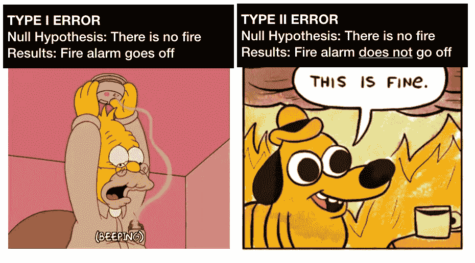
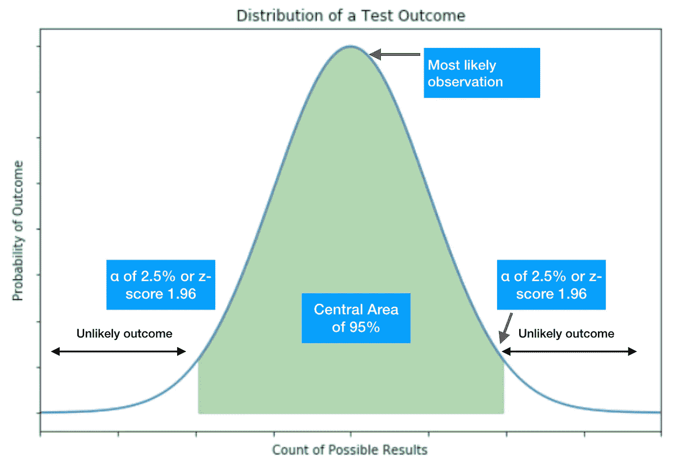
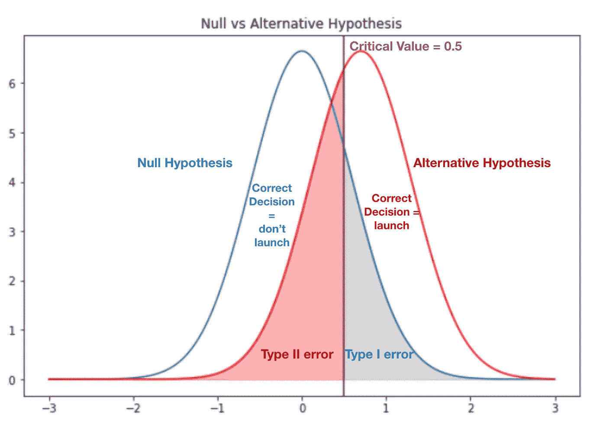
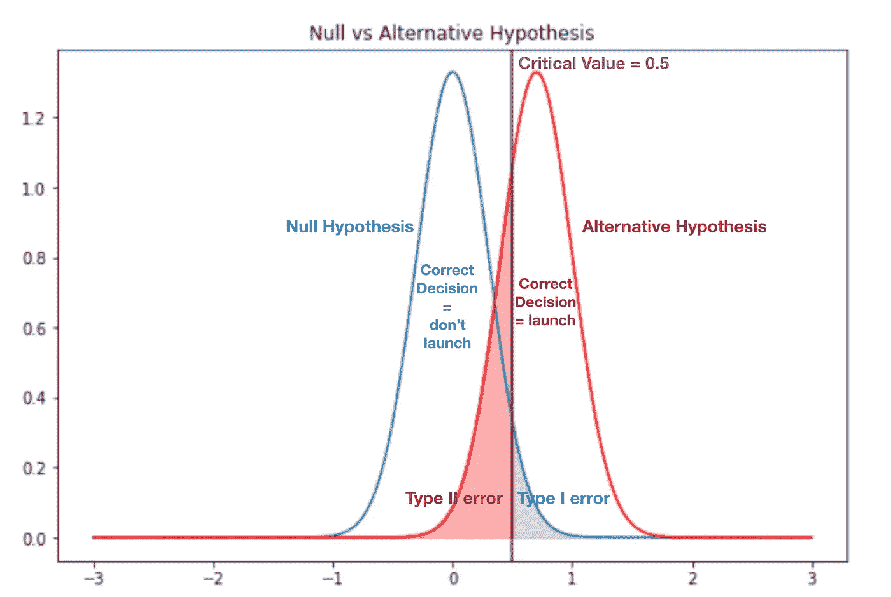
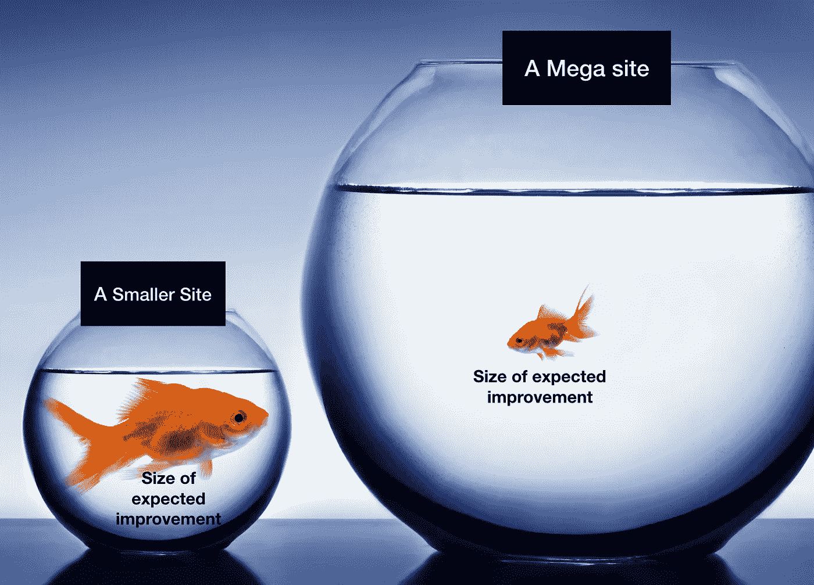
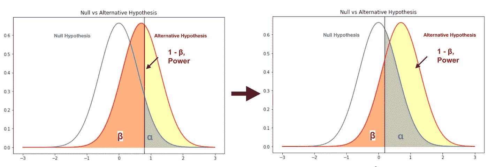
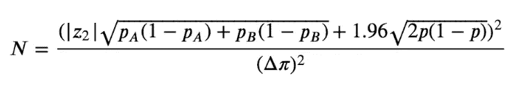
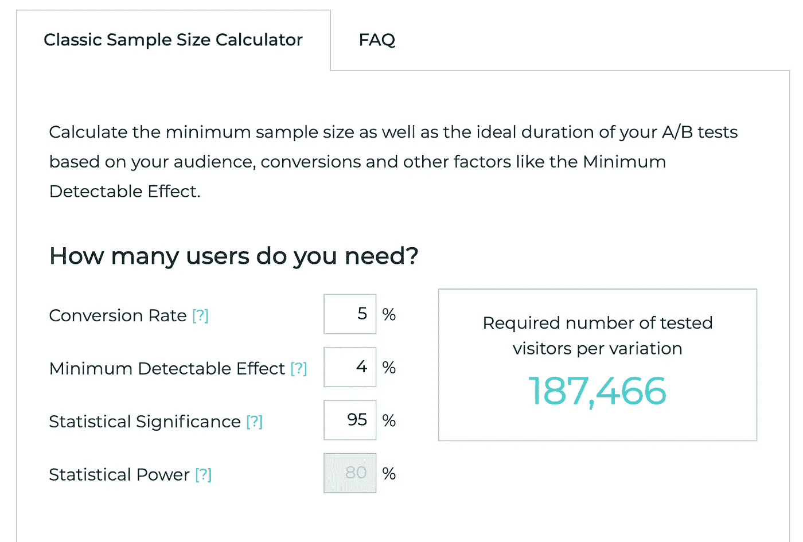
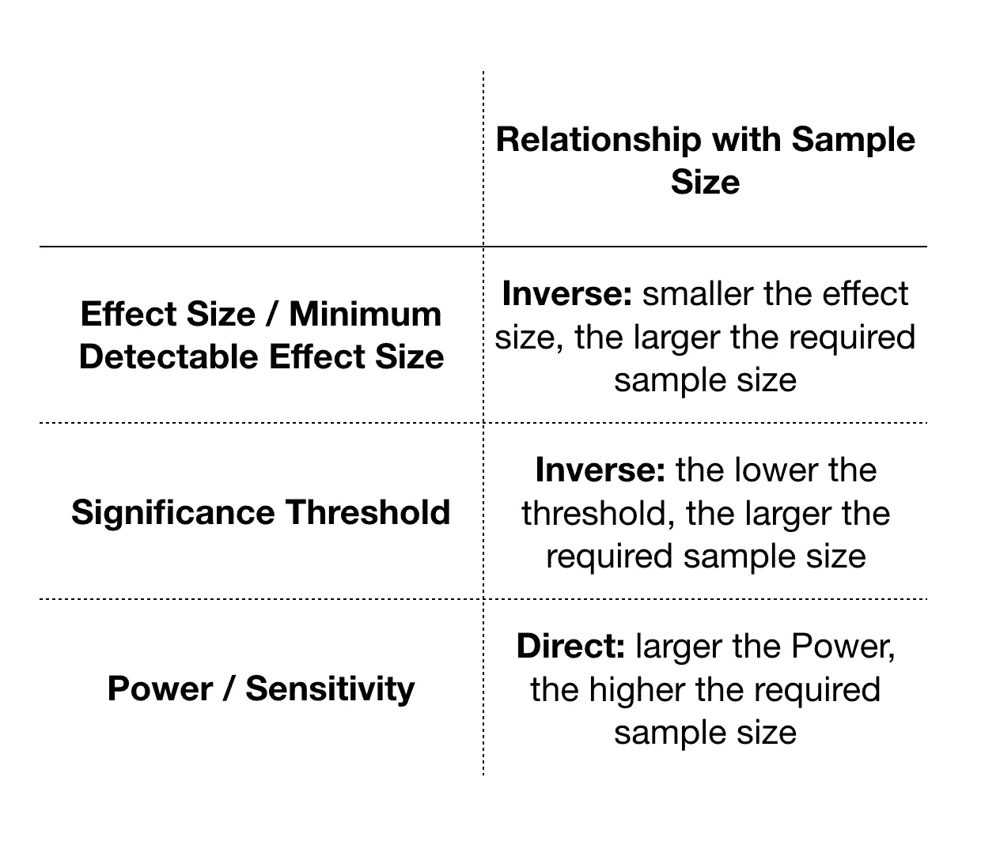

# 了解 AB 测试中的功耗分析

> 原文：<https://towardsdatascience.com/understanding-power-analysis-in-ab-testing-14808e8a1554?source=collection_archive---------1----------------------->

## AB 测试中你需要知道的统计基础知识的通俗易懂的解释

图片来源:[https://www.crazyegg.com/blog/ab-testing/](https://www.crazyegg.com/blog/ab-testing/)

你对你的产品有一个很好的想法，你知道它会增加转化率并带来商业价值。但是你能说服管理层吗？而且即使你自己也确信，你能量化你对这种确信的信心吗？

幸运的是，有了 AB 测试，你可以去掉很多猜测。或者至少你可以做一个量化的猜测，并确定你的猜测有多“可猜”。用统计学的术语来说:你可以测试你的想法真的很棒的假设，并为你看到的结果设定一个置信度。

如果你是一个产品所有者，对 AB 测试如何工作有一些大概的了解，并理解一些常见的应用和问题，会很有帮助。如果你自己运行测试，理解 AB 测试背后的基本统计和直觉在执行实验设计时是至关重要的，即使你有一个完全设置好的实验引擎。实验设计回答了以下问题:

*   我应该为我的测试收集多少数据？
*   我应该运行我的测试多长时间？
*   我的页面没有很多访问者——这在进行实验时有关系吗？

在这篇文章中，我将讲述 AB 测试背后的统计直觉，实验设计和一些简单的实际应用。让我们直接开始吧。

# 什么是 AB 检验，它与假设检验有什么不同？

**统计假设检验**是接受或拒绝原假设的程序，简称 H0。零假设表示关于总体参数的假设，被视为默认假设。举个例子:我们*认为*一枚硬币是公平的。如果把硬币抛 100 次，我们能确定这个假设是否合理吗？

假设这不是《盗梦空间》**中的梦，硬币最终会是正面或反面**

****AB 测试**是从总体中抽取两个随机样本，一个对照样本和一个变异样本，并确定这两个样本之间的差异是否显著。注意，有许多形式的实验(ABC 和多元测试)，但我们今天只讨论 AB 测试。**

**在本文的其余部分，我们将不断地使用术语控制和变体来进入 AB 测试的思维模式。**

# **了解术语:零假设，错误类型**

**现在让我们把它放在测试一个你想在你的网站上发布的新特性的背景下。你将有一个控制和变异版本的测试，其中变异样本有新的特点。以下是一些术语:**

*   **零假设，H0 是当你的设计变化不会对你的测试变化产生影响的时候。如果你没有拒绝零假设，你会表现得好像零假设是真的，你不应该推出你的新功能。**
*   ****替代假设，H1** 是零假设的替代假设，设计变更将对您的测试变化产生影响。如果你拒绝零假设，你接受替代假设，你应该推出你的新功能。**
*   ****第一类错误**:你拒绝了空值，当你不应该拒绝的时候。在网络世界中，这意味着你正在启动一个功能变化，而它实际上对转化没有积极的影响。你的成本就是开发的成本。**
*   ****第二类错误**:当您不拒绝 null，但实际上测试和控制之间存在正差异时。这是当你决定不推出一个新的功能，而实际上是有区别的。假设变化是积极的，您的净成本将是推出该功能的潜在成本减去开发成本。**

****

# **二项式和正态分布是如何涉及的？**

**为什么我们要用二项分布？在 AB 测试中，您试图确定变体中的成功数量是否与控制中的显著不同。一系列试验的成功次数(通常是转化或无转化结果)可以使用二项式分布进行充分测量，其中 X 轴是转化次数(或转化率), Y 轴是概率。**

**再补充一下，中心极限定理说，如果样本量足够大，那么分布将遵循**正态分布**。**

***什么才够大？一个经验法则是，如果样本量乘以概率(或转换率)大于 5，就应该遵循正态分布。***

**分布如下图所示，可以用平均值和标准差来表示。**

****

**现在，让我们把它带回控制和变异样本测试。**

**下图显示了控制分布和变量分布。对照将代表无效假设，而变异将代表替代假设。临界值区域线代表您拒绝零假设的点。为了说明的目的，我们可以说，如果 H1-H0 >= 0.5，我们将拒绝零假设(H1 是替代假设，H0 是零假设)。该变量的实际平均值为 0.7。**

**如果零假设是真的，你拒绝零假设，有可能你犯了第一类错误。这种可能性用灰色阴影区域表示。另一方面，如果零假设不成立，并且你没有拒绝零假设，那么你就有可能犯第二类错误。这个机会用红色阴影区域表示。**

****

**我希望上面的插图能给你一个更好的直觉，让你更自信地做出判断，变体是否真的与对照不同。让我介绍另一个例子来直观地说明样本量。**

**样本量越大，样本越有可能代表实际总体。用统计学的术语来说，你的标准差会更小，你的分布会更窄。下图具有相同的分布均值，但是标准误差更小，或者样本量更大。代表 I 型和 II 型误差的阴影区域变小。如果你拒绝零假设，你现在对不犯 I 型错误更有信心，因为你的样本量更大了。**

****

**这种分布有更多的样本，因此分布更窄**

**既然我们对样本大小和测试分布有了一些直觉，那么当我们谈论设计实验时要考虑的统计因素时，我们可以有更强的直觉。**

# **实验设计和功耗分析**

**当你设计一个测试时，你想要准备你的实验，以便你可以自信地对变异样本中的差异(或不存在差异)做出陈述，即使差异很小。如果你的网站每天有数百万的独立用户，那么即使 0.5%的转化率差异也会对你的收入产生重大影响。如果是这样的话，你要抓住它。**

**设计实验时，需要考虑四个统计因素:**

****1。最小可检测效果大小和转换率:**你想捕捉到什么样的效果，让实验物有所值？这是一个很容易通过衡量美元数额来回答的问题。当你将最小可检测效果乘以你的 N(用户总数)时，你将获得多少可测量的正面提升？例如，如果 1000 名额外顾客以平均 50 美元的购物篮结账，您将实现多少收入提升？**

**如果你是一家大型电子商务公司，每天有 1500 万独立访客访问你的商品页面，1%将对你的收入产生巨大影响。事实上，1%可能是一个很高的要求，因为你的网站可能已经通过许多产品开发进行了优化，以达到每天 1500 万用户。另一方面，如果你的网站每天只有 1000 次转换，那么 1%的提升就意味着 10 次额外的转换，这对你的收入来说是没有意义的。与此同时，如果特性变化解决了用户的一个明显的痛点，实现 10%或更多的提升可能是非常可行的。**

****

**效果大小关系到你的业务规模和客户的美元价值**

**在计算样本量时，转换率很重要。如果你网站的转换率是 30%，你不需要像你网站的转换率是 1%那样大的样本量**

****2。样本量:**你需要采集的样本量是多少？你的实验设计可能需要 100 万访问者，但是如果你的账户页面每天只有 5000 名访问者，那么是时候改变你的其他参数了。**

****3。显著性:**也称为 alpha，这是你在实验中检测到的差异是偶然的而不是来自实际差异的概率阈值。通常设置为 5%。**

**另一种说法是:如果测试中没有差异，你愿意在 5%的时间里犯第一类错误。**

****4。Power:** 也称为(1 -Beta)，可以解释为你的测试的强度，以检测你的变体中的实际差异。相反，Beta 是您的测试没有拒绝零假设的概率，而它实际上应该拒绝零假设。功率越高，第二类错误的概率越低。实验通常设置在 80%或 20%β的功率水平。**

**另一种说法是:如果测试中有差异，你愿意在 20%的情况下犯第二类错误。**

****功率分析**在给定其他 3 个部件的输入的情况下找到其中一个部件。**

**让我们重温一下我们熟悉的无效和替代假设分布，将它与我们迄今为止建立的直觉联系起来。给定固定的效应大小和样本大小，α和β成反比关系。你为你的实验设置的能量越多(beta 越小)，alpha 区域就越大——没有免费的午餐。**

****

**作为一名从业者，基于业务的性质，从一个实验到另一个实验，统计的显著性和功效通常是固定的。你对每个新实验的关注是你的样本量是否足以让你的实验检测到你所关心的效应大小。换句话说，你的实验所需的最小样本量是多少？**

**计算样本量的公式为:**

****

**其中:**

*   **p =平均转化率**
*   **pA =控制概率或转换率**
*   **pB =您计划检测的变异概率或转换率**
*   **|z2| =力量的绝对 z 值**
*   **1.96 =显著性为 5%时的 z 得分(双尾检验)**

**实际上，有很多在线计算器可以帮助你估计所需的最小样本量。[这个](https://www.abtasty.com/sample-size-calculator/)很好检验。**

****

**尝试使用计算器，看看改变统计因子的值如何影响所需的最小样本量。这种关系将遵循以下总结:**

****

**一旦你知道你的最小样本量是多少，你就可以评估你的网站是否有足够的流量来达到这个样本量，以及你应该进行多长时间的实验。**

# **最短时间**

**假设您能够为您运行的页面上的每个变体捕获 100 万访问者，而所需的样本量仅为 300 万。然后你需要运行你的实验 3 天并得出结论吗？你可以主张敏捷性和更快的启动，但这不是一个好主意。您希望您的样本能够代表您的总体，并且可以合理地假设周末的行为与工作日的行为非常不同。见鬼，周四的行为和周五的行为非常不同。因此，建议运行实验至少 2 周，最少运行 1 周。**

# **关闭**

**感谢阅读。我这篇文章的目标是帮助产品经理或被采访者(或者任何人，真的)清楚地谈论 AB 测试中的直觉。如果有不清楚的地方，请告诉我。**

**在接下来的文章中，我将介绍**

1.  **拒绝零假设和置信区间的计算，我们也将讨论 1 对 2 尾检验**
2.  **定义测试分析的度量和深度。**

**敬请关注！**

*****来源:*****

1.  **[机器学习掌握:Python 中统计能力和能力分析的温和介绍](https://machinelearningmastery.com/statistical-power-and-power-analysis-in-python/)**
2.  **[Udacity 关于 AB 测试的课程](https://classroom.udacity.com/courses/ud257)**
3.  **[Statsoft:设计实验，功耗分析](http://www.statsoft.com/Textbook/Power-Analysis)**
4.  **[www.biostathandbook](http://www.biostathandbook.com/power.html)**

***帖子原载于* [*我的个人博客*](https://www.paulynnyu.com/abtesting1/) *。***