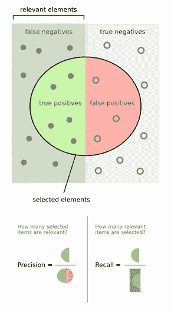
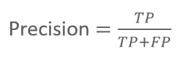
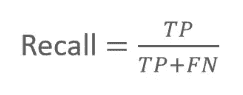
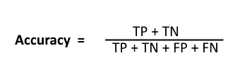
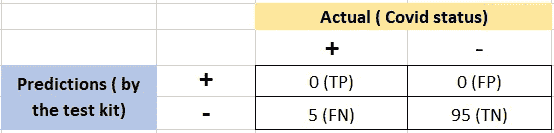

# 了解 COVID 测试的精密度、召回率和准确度

> 原文：<https://towardsdatascience.com/understanding-precision-recall-and-accuracy-with-covid-tests-c1c9e93bc92a?source=collection_archive---------33----------------------->

## 使用不平衡数据集并通过新冠肺炎测试的模拟示例理解混淆矩阵

在最近回顾我的基本统计学知识时，我开始深入研究混淆矩阵的概念。这一次，我手头有一个例子，不幸的是，在过去的 4 个月里(今天是 2020 年 7 月 5 日)，这个例子与新冠肺炎非常相关。我们将使用一个模拟的例子来帮助我们理解**准确性、**作为*不平衡数据集中的一个度量、*如何被**误导**。

## 方案

让我们假设一家公司发布了一个 COVID 测试套件，声称他们的测试在试运行中达到了“95%的准确率”。这个声明中有一个陷阱，组织没有在发布信中披露。该测试实际上并不是在内部进行医学检查，该套件被**装配**并默认将**每个人标记为“无 COVID”**。让我们看看如何确保我们不会被误导。

## 精确度、召回率和准确度是什么意思？

在我们继续之前，让我们快速看一下下图，它解释了术语**精度**和**召回**所代表的比率

[https://upload . wikimedia . org/Wikipedia/commons/2/26/precision recall . SVG](https://upload.wikimedia.org/wikipedia/commons/2/26/Precisionrecall.svg)

**精度**:给出我们的“真阳性”在“我们做出的所有阳性预测”中的比率

**回忆**:给出我们的“真阳性”在“所有实际阳性值”中的比率(*分母中的假阴性是我们* ***错误地*** *做出的阴性预测，实际上是阳性的*)

**准确性**:另一方面，是“我们所有的**正确**预测(包括正面和负面)”与“我们所有的预测(所有样本)”的比率

## 回到我们的场景

让我们回到我们在第一部分讨论的案例。该公司开发的测试套件声称准确率达 95%。我们发现，平均来说，100 个人中有 5 个人在试用测试中实际上是**COVID 阳性(我们认为这是我们在这里考虑的事实来源)。因此，该数据集是一个 [*不平衡数据集*](https://developers.google.com/machine-learning/data-prep/construct/sampling-splitting/imbalanced-data) (比例为 19:1)。**

请记住，默认情况下，检测试剂盒会将 100 名患者中的每一位标记为“非 COVID”。

下面我们来画困惑矩阵:

理解混淆矩阵中的值:

1.  我们**没有**任何真阳性( **TP** )，因为我们没有将任何人标记为“COVID 阳性”，我们**也没有**任何假阳性( **FP** )，因为我们没有对患者做出**任何**阳性预测(记得试剂盒被操纵)
2.  我们确实有一个假阴性( **FN** )，因为实际上是 COVID 阳性的 5 个人被标记为 COVID 阴性。我们还有一个真阴性( **TN** )，因为所有 95 个非 COVID 阳性的人都被“正确地”预测为“非 COVID”(参见 ***catch*** ？这就是准确性度量的来源)

让我们逐一计算这三个指标的值:

1.  计算**精度**:

准确度= (0 + 95)/ ( 0+95+0+5) = 95/100

如果我们只看准确性，这看起来像是测试套件的一个极好的创新，可以发布给更多的观众，但是等等，我们仅仅基于准确性度量来信任套件吗？让我们计算精度并回忆下一步

2.计算**精度**:

精度= (0+0)/(0) = N/A ( *不适用，以避免任何被零除的错误*

3.计算**召回**:

召回= 0/(0+5) = 0

4.我们还可以看一下 F1 的分数，它是精确度和召回率的加权平均值。

F1 得分= 2*(精确度*召回率)/(精确度+召回率)

在这种情况下，这相当于不适用，因为精度为不适用

## 结论:

精确度和召回率都告诉我们，试剂盒被操纵了，因为分数要么是 0，要么是 N/A，这就对测试提出了足够的质疑。对于不平衡的数据集，选择不正确的评估指标很容易被误导。

*延伸阅读*:

1.  在 [wiki 页面](https://en.wikipedia.org/wiki/Precision_and_recall)上，您可以进一步阅读大量关于精确度和召回率的其他指标。
2.  [https://machine learning mastery . com/tour-of-evaluation-metrics-for-unbalanced-class ification/](https://machinelearningmastery.com/tour-of-evaluation-metrics-for-imbalanced-classification/)
3.  [https://towards data science . com/what-metrics-we-should-use-on-unbalanced-data-set-precision-recall-roc-e2e 79252 aeba](/what-metrics-should-we-use-on-imbalanced-data-set-precision-recall-roc-e2e79252aeba)

*讨论测量测试准确度重要性的文章*

1.  [https://www.nature.com/articles/s41591-020-0891-7](https://www.nature.com/articles/s41591-020-0891-7)
2.  [https://www . CNN . com/2020/04/28/health/coronavirus-antibody-tests-terrible/index . html](https://www.cnn.com/2020/04/28/health/coronavirus-antibody-tests-terrible/index.html)

收到来自数据科学界的建设性反馈总是令人愉快的。请在下面发表您的评论，以帮助我们了解更多信息。

如果你觉得这很有用，请在 Medium 和 [LinkedIn](https://www.linkedin.com/in/karanambasht/) 上关注我。