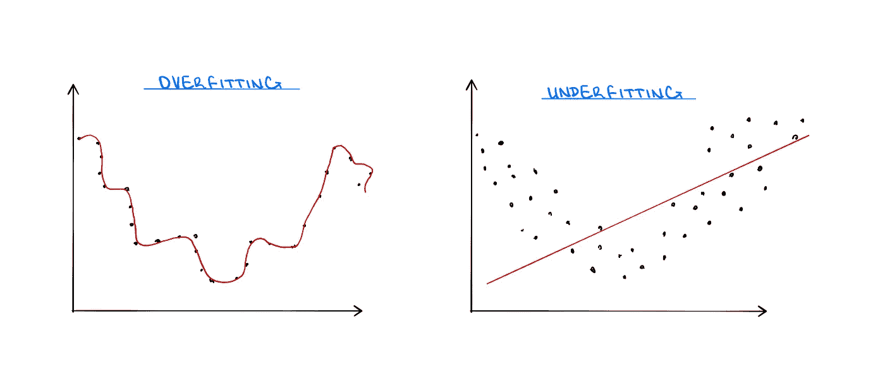

# 理解主成分分析

> 原文：<https://towardsdatascience.com/understanding-principal-component-analysis-ddaf350a363a?source=collection_archive---------22----------------------->

## 五氯苯甲醚的分解，何时使用，为什么有效

图片作者:特里斯特·约瑟夫

机器学习(ML)是人工智能(AI)的一个子集，它为系统提供了自动学习和根据经验改进的能力，而无需显式编程。ML 中采用的算法用于发现数据中的模式，从而产生洞察力并帮助做出数据驱动的决策和预测。这些类型的算法每天都被用于医疗诊断、股票交易、运输、法律事务等领域的关键决策。所以可以看出数据科学家为什么把 ML 放在这么高的基座上；它为高优先级决策提供了一个媒介，可以实时指导更好的业务和更明智的行动，而无需太多的人工干预。

为了学习，ML 模型使用计算方法来直接从数据中理解信息，而不依赖于预先确定的方程。这些算法用于确定数据中的模式，并开发出将输入变量 *x* 最佳映射到目标变量 *y* 的目标函数。这里必须注意，目标函数的真实形式通常是未知的。如果函数是已知的，那么就不需要 ML。

因此，其思想是通过对样本数据进行合理的推断来确定该目标函数的最佳估计，然后针对当前情况应用和优化适当的 ML 技术。

图片作者:特里斯特·约瑟夫

这个任务看起来很简单。找到一个使用 *x* 并输出 *y* 的函数能有多难？有时候，在特定的情况下，这很简单。例如，假设我们想预测一个人的收入，我们仅有的支持变量是每年工作的小时数和他们的头发颜色。他们的头发颜色可能不会对他们的收入有太大影响，但是工作时间会有影响。因此，预测收入的函数将工作小时数作为输入。搞定了。

但情况并非总是如此。由于变量之间的关系，开发能够产生准确预测的模型是相当困难的。在大多数“真实世界”场景中，有多个输入变量同时存在。每个输入变量都会影响输出变量，但它们也会相互影响，理解这些复杂的关系有助于构建更好的模型。尽管上述示例很简单，因为只有两个预测变量可供选择，而且其中一个似乎与场景无关，但变量选择和模型拟合是开发适当函数的关键部分。

图片作者:特里斯特·约瑟夫

模型拟合是指让算法确定预测因素和结果之间的关系，以便可以预测未来值。模型的预测值越多，模型就能从数据中学到越多。然而，样本数据通常包含随机噪声；这一点，加上模型中预测因素的数量，会导致模型学习数据中的错误模式。如果试图通过添加更少的预测器来应对这种风险，可能会导致模型无法从数据中获取足够的信息。这些问题被称为过拟合和欠拟合，目标是确定简单性和复杂性之间的适当组合。

那么，如何才能在简单和复杂之间找到这种平衡呢？如果存在如此多的变量，以至于不可能合理地理解每个不同变量之间的关系，这就特别困难。在这种情况下，想法应该是执行**维度缩减**。顾名思义，它涉及使用各种技术来减少数据集中的特征数量。

这可以通过两种主要方式实现:**特征排除**和**特征提取**。特征排除指的是仅保留“可用于”预测输出的变量，而特征提取指的是从数据集中的现有变量开发新特征。将特征排除视为简单地删除或保留可能包含在模型中的变量，将特征提取视为从现有变量中创建新的(希望更少)变量。

图片作者:特里斯特·约瑟夫

**主成分分析** (PCA)是一种特征提取方法，它以创建新特征的方式对变量进行分组，并允许丢弃不太重要的特征。更正式地说，PCA 是在一组数据中提供最大可变性的变量的线性组合的识别。

为了计算分量，这种方法利用线性代数中的元素(例如特征值和特征向量)来确定什么组合会产生最大方差。显式数学不在本文讨论范围内，但我会在文章末尾附上涉及这方面的建议材料。本质上，假设数据被绘制在图表上。PCA 方法将找到数据中沿每个轴(变量)的平均值，然后移动这些点，直到平均值的中心位于原点。

接下来，通过原点的直线将拟合数据，该直线使其自身和所有数据点之间的距离最小。确定最佳拟合线的另一种等效方法是绘制一条穿过原点的线，使投影点到原点的距离平方和最大化。这条线一旦确定，就被称为**第一主成分**。

图片作者:特里斯特·约瑟夫

初始线的斜率可以计算和处理，以产生最大化变化的最佳变量组合。即假设有两个变量，发现直线的斜率为 0.25。这意味着一个轴上每覆盖 4 个单元，另一个轴上就覆盖 1 个单元。因此，这两个变量的最佳组合是 4 部分*变量* *1* 和 1 部分*变量 2* 。

假设第一主成分不占数据集内变异的 100%，则可以确定**第二主成分**。这是指变量的线性组合，它使与第一个组合正交的所有其他线性组合中的可变性最大化。简单地说，一旦第一主成分被考虑，第二主成分使剩余的可变性最大化。如果我们再次假设有两个变量，并且第一主成分已经确定，则第二主成分将是垂直于初始最佳拟合线的线。

最后，每个主成分的变化量可以通过将每个成分的距离平方和除以样本量减 1 来确定。回想一下，这个想法是为了减少数据集的维度。因此，由主成分解释的变异的百分比可以通过将变异相加，然后除以总和而得到。如果发现第一主成分占数据内变化的约 90%,则理想的是进一步仅使用第一主成分。

图片作者:特里斯特·约瑟夫

虽然这很好，但 PCA 确实有一些问题。最主要的一点是，结果直接取决于变量的规模。如果一个变量因为比其他变量更大而看起来有更多的变化，这个变量将在主成分中占主导地位，并将产生不太理想的结果。类似地，主成分分析的有效性很大程度上受厚尾数据中出现的偏斜的影响。最后，PCA 可能很难解释，尤其是因为这种方法将变量混合在一起以最大化可变性。

尽管存在挑战，但 PCA 是一种可靠的特征提取和降维方法，应该用于理解超大数据集中变量之间的关系。

**参考文献:**

应用多元统计与 R，丹尼尔泽尔特曼

【youtube.com/watch?v=FgakZw6K1QQ 号

[dezyre . com/data-science-in-python-tutorial/principal-component-analysis-tutorial](https://www.dezyre.com/data-science-in-python-tutorial/principal-component-analysis-tutorial)

**其他有用的材料:**

[builtin . com/data-science/step-step-explain-principal-component-analysis](https://builtin.com/data-science/step-step-explanation-principal-component-analysis)

[machinelementmastery . com/calculate-principal-component-analysis-scratch-python/](https://machinelearningmastery.com/calculate-principal-component-analysis-scratch-python/)

[machinelingmastery . com/principal-components-analysis-for-dimensionality-reduction-in-python/](https://machinelearningmastery.com/principal-components-analysis-for-dimensionality-reduction-in-python/)

[geeksforgeeks.org/ml-principal-component-analysispca/](https://www.geeksforgeeks.org/ml-principal-component-analysispca/)

[youtube.com/watch?v=0SiRTlFcZRQ](https://www.youtube.com/watch?v=0SiRTlFcZRQ)