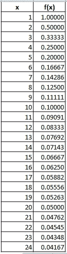
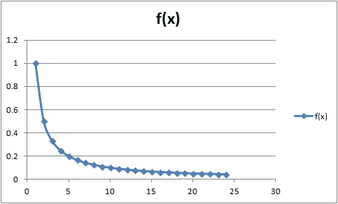
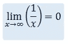
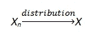
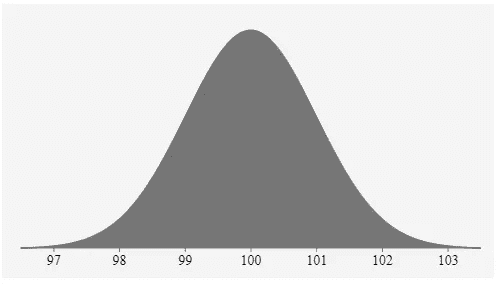
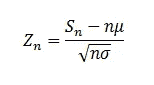

# 理解概率和统计:数据科学家的中心极限定理和收敛

> 原文：<https://towardsdatascience.com/understanding-probability-and-statistics-central-limit-theorem-and-convergence-for-data-scientists-653c53145400?source=collection_archive---------22----------------------->

## “理解概率和统计”系列的第二篇文章，解释收敛和中心极限定理(CLT)

数据科学领域围绕着概率和统计。特别是，收敛和中心极限定理(CLT)是每个数据科学家必须熟悉的一些最重要的概念。因此，本文旨在解释什么是随机变量的收敛性，这是一个在数学中大量使用的概念。此外，它提供了中心极限定理的概述。

概率与统计

如果你想从最基本的方面理解概率和统计的概念，请阅读下面的第一篇文章。它解释了概率的本质:

 [## 理解概率和统计:数据科学家的概率基础

### 为统计学家解释概率的关键概念

towardsdatascience.com](/understanding-probability-and-statistics-the-essentials-of-probability-for-data-scientists-459d61a8da44) 

# 1.文章目标

本文将概述以下关键部分:

1.  趋同是什么意思？
2.  什么是中心极限定理？

根据每个人的兴趣，本系列的下一组文章将解释连续随机变量的联合分布以及关键的正态分布，如卡方分布、T 分布和 F 分布。随后，下一篇文章将旨在解释统计和贝叶斯推理的基础，以及马尔可夫链和泊松过程。

> *这些文章的目标是向数据科学家简化概率和统计的概念。*

# 2.趋同是什么意思？

收敛的概念是一个非常重要的概念。在我们讨论收敛性之前，让我们先了解一下*极限*在数学中的含义。

**数学中的“极限”是什么？**

考虑这个函数: *f(x) = /x* ，其中 x 为正数。

如果我们取一系列值 0 < x ≤ ∞，并开始将它们代入函数 f(x ),那么我们将得到以下结果:

显示 x 的递增值和 f(x)的相应值的表格

我们可以看到，随着 x 的增大，f(x)减小。它暗示 x 和 f(x)彼此成反比。

如果我们将结果绘制成图表来可视化，那么我们会看到它形成了以下形状:

显示 x 和 f(x)的图表

我们可以看到，随着 x 的增加，f(x)越来越接近 0，尽管 f(x)从未接近 0。因此，我们可以得出结论，当 x 逼近∞时，f(x)的极限为 0。

当 x →∞，极限 f(x) = 0。

此外，y = 0 是 f(x)的渐近线，因为这条线越来越接近 0，但从未穿过 0。

这就是所谓的函数极限。

我们可以把 1/n 的极限写成:

当 x 达到无穷大时，1/x 达到 0

> 我们可以注意到 f(x)收敛于 0

极限在数学中用于简化复杂性。它可以近似一个函数。

收敛的概念可以用不同的方式来解释，重要的是要理解它的变体。

假设我们收集了两个随机变量 A 和 b 的数据样本，这两个变量可以是任何东西，比如股票的历史价格，甚至运动员训练的时间等等。

随机变量的样本具有抽样分布。

抽样分布是实际分布的近似值。为了简单起见，我们可以得出结论，随着样本量的增加，我们可以用极限来近似变量的分布。这是要记住的关键！

> 收敛的概念可以用样本的潜在概率来解释。

要注意的关键是，可以分析随机变量的概率，以评估随机变量是否收敛。

# 3.什么是中心极限定理？

在我解释中心极限定理(CLT)之前，我将试图打下一个坚实的基础，以便我们能容易地理解 CLT。

我们也考虑一下，我们想找出变量有多接近？

这里的*关闭*到底是什么意思？

*   是指计算两个变量各点的绝对差值吗？
*   或者，这是否意味着我们需要计算两个变量的分布，然后计算期望之间的差？
*   或者，这是否意味着我们需要计算两个变量之间的相关性。

让我们通过了解大数定律来理解它。

## 3.1 大数定律

本节解释了大数的概念。对于数据科学家来说，这是一个重要的概念。

这个概念很简单，理解起来非常重要。

首先，记住每个随机变量都有一个期望值(可能是算术平均值)，而且随机变量的每个样本都有其样本平均值。这两个均值可以不同，但它们彼此相关，我们希望样本均值尽可能接近随机变量的期望均值。当我们增加样本量时，我们就更接近预期的平均值。

简单来说，大数定律表明，随着实验次数的增加，样本的平均值将趋向于随机变量的期望值。

这给我们带来了大数定律的两个最重要的版本；弱大数定律和强大数定律。

**3.2 弱定律:**

假设我们有一个独立的随机变量序列。在这里，独立性的概念意味着第一个样本不会影响下一个样本，例如多次投掷硬币。

所有随机变量的平均值是相同的，并且它们的方差≤ v，其中 v < ∞。这意味着均值是一个常数，方差有一个上限。

该定律指出，随着样本数量增加到无穷大，样本均值以概率收敛到共同均值。

**3.3 强定律:**

强大数定律表明，当我们将样本大小增加到无穷大时，样本的期望值以概率 1 收敛到随机变量的期望值，而不仅仅是收敛到期望值。

> 记住，概率 1 表示一个事件确实发生了

因此，强大的大数定律表明，随着试验次数增加到无穷大，变量以概率 1 收敛到期望值:

> *P(lim n → ∞ Xₙ =μ) = 1*

另一方面，弱定律简单地说明概率收敛于一个公共 E(X)。

## 3.4 中心极限定理(CLT)

这就把我们带到了文章的核心。

我将尝试用三个容易理解的要点来解释中心极限定理的概念。这个概念在数据科学项目中大量使用，特别是在我们试图预测变量的项目中。

> 事实上，我们很容易将中心极限定理视为概率统计理论中最重要的概念之一。

**1️⃣ -** 要记住的第一点是，两个变量的分布可以收敛。当两个随机变量的分布接近时，那么这些随机变量也可以认为是接近的。这就是所谓的分布趋同。

如果随机变量序列 X *ₙ* 收敛于分布函数 F *ₙ* (x)那么序列分布的极限是:

我会多解释一点这一要点，因为理解它相当重要。

让我们假设我们取了一个随机变量序列，X1，X2，..，Xn。

让我们也考虑这些随机变量是相互独立的，并且是同分布的。而且它们的方差是有限的。随着随机变量样本数量的增加(n → ∞),样本总数的分布将收敛到一个共同的分布。

CLT 有助于我们理解这种常见的分布将是正态分布。

让我们考虑 Sn = X1 + X2 + … + Xn。那么 Sn 的分布将在 n * μ附近，方差将在 n* μ附近，其数量级为 n 的平方根

**2️⃣** —需要注意的第二点是，中心极限定理都是关于正态分布的。

草图显示钟形正态曲线

正态分布是一个需要理解的基本概念。这篇文章解释说:

 [## 想过为什么正态分布如此重要吗？

### 解释为什么高斯分布是如此成功和广泛使用的概率分布

medium.com](https://medium.com/fintechexplained/ever-wondered-why-normal-distribution-is-so-important-110a482abee3) 

基调指出样本均值的分布是正态的。为了解释这一点，考虑我们进行一项实验并收集一个随机变量的大量观察值。让我们把这些观察作为一个例子来参考。

随后，我们可以计算样本的平均值。

如果我们重复这个实验很多次，那么我们将开始收集大量的样本。然后，我们可以计算每个样本的平均值，并开始分析样本平均值的分布。

我们会注意到样本预期平均值的分布将由正态分布近似，这是一个非常重要的概念。

需要注意的关键是，随机变量必须相互独立，并且必须同分布。

3️⃣——最后要考虑的一点是，中心极限定理允许我们用正态分布来近似大量的分布。

上面的公式有助于我们标准化一个随机变量，因为我们实际上是减去平均值，然后用方差除每个样本，此外还考虑了标准误差。

为了进一步解释，如果随机变量存在，并且随机变量的每个序列具有有限的均值μ和方差σ，那么中心极限定理表明，如果我们标准化随机变量以确保均值为 0，方差为 1，那么当 n → ∞时，则分布收敛于正态分布，而不管单个随机变量样本的分布如何。

作为例子，这些独立的随机变量可以具有伯努利或泊松分布。它可能是右偏或左偏的，即使这样，随着样本的增加，分布也会收敛到正态。

> 我们增加的样本越多，分布就越接近正态分布。

一旦我们假设数据呈正态分布，我们就可以开始简化复杂的数据集，并开始近似合理的预测，但需要注意的关键是样本量应该很大(通常> 30)。

这就是为什么中心极限定理是概率统计学科中的一个中心概念的原因。

# 3.摘要

本文解释了什么是随机变量的收敛，并提供了中心极限定理的概述。

感谢您的阅读

这两个概念都是数据科学家必须了解的。

这一节为本系列的下一篇文章奠定了基础。

根据每个人的兴趣，本系列的下一组文章将解释连续随机变量的联合分布以及关键的正态分布，如卡方分布、T 分布和 F 分布。随后，本系列的文章将致力于解释统计和贝叶斯推理，以及马尔可夫链和泊松过程。