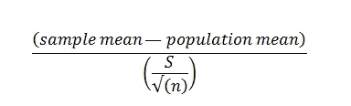
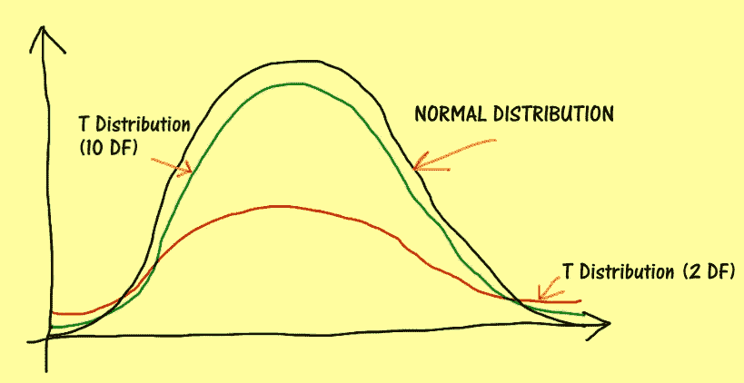
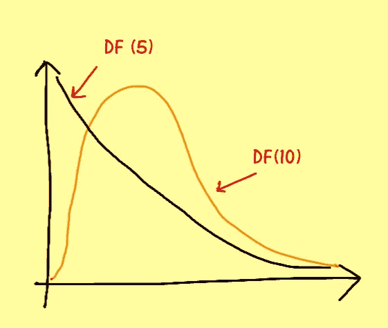
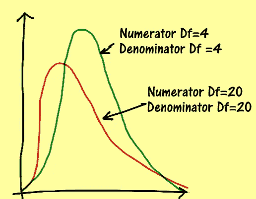

# 理解概率和统计:学生 t 分布、卡方分布和 f 分布

> 原文：<https://towardsdatascience.com/understanding-probability-and-statistics-chi-squared-student-t-and-f-distributions-e46b4f802707?source=collection_archive---------5----------------------->

## 处理数据和统计推断的数据科学家必须知道的话题

概率与统计

# 文章目标

本文旨在解释我推荐每个数据科学家都必须熟悉的三个重要分布:

1.  学生 T 分布

2.卡方分布

3.f 分布

所有这三个发行版彼此密切相关。我将尝试用一种简单的方式来解释这些分布。

# 1.学生 T 分布

本节将向读者介绍 Student-T 分布

Student-T 是需要理解的最重要的统计分布之一。它也被称为 t 分布。

Student-t 分布大量用于统计领域。特别是在样本量小和/或总体标准偏差未知的情况下。另外，分布曲线呈钟形也很重要。Student-t 分布可以帮助我们从样本中获取有意义的统计信息。此外，它还用于统计推断。

> 当我们没有一个大的样本集，大约 30 个观察值，或者当总体的标准偏差不可用时，使用 Student-T 分布

学生 T 被认为是统计学中最大的突破性分布之一。当总体的标准偏差未知时，它可用于推断较小样本的意义。这可以应用于大量的世界问题。

> 学生 t 分布是正态分布的近似值

如果我们绘制学生 t 分布图，它看起来很像一条钟形曲线。因此，学生 t 分布类似于正态分布。此外，t 分布的性质更接近正态分布。例如，分布的平均值是 0。

> 需要注意的最重要的一点是，student-t 分布比正态分布具有更厚的尾部。这意味着变量的离差更大。

最重要的部分是自由度，它总是 1 减去样本数。

让我们考虑从正态分布的总体中收集 N 个独立的观察值。我们可以通过应用以下公式将该分布转换为 student-t 分布:

我们需要做的是获得总体和样本均值以及样本的标准差。在上面的等式中，总体呈正态分布，具有均值 M 和标准差 S，具有 n-1 个自由度(df ),其中 n 是样本的大小。

> 样本越大，学生 t 分布越接近正态分布。t 分布的中位数是 0。
> 
> 随着自由度的增加，分布向正态分布收敛。这是根据中心极限定理。

该草图显示了正态分布和 Student-t 分布的概率分布曲线:

该示意图显示，当自由度增加时，t 分布的尾部变窄，分布曲线开始类似正态分布。

学生-t 围绕 0 对称。它的峰值比正态分布低，尾部更厚。这意味着样品中有更高的分散度。

现在要强调的是，如果我们假设我们的变量具有学生 t 分布，那么这意味着我们获得远离平均值的值的概率比我们使用正态分布产生的样本的概率要高。

# 2.卡方分布

本节将介绍卡方分布。它被读作凯平方分布。

平方这个词很重要，因为它意味着正态分布的平方。我也会在这篇文章中解释它的意义。

卡方是一个连续的概率分布。它在统计推断中也大量使用。当我们对置信区间及其标准差感兴趣时，我们利用卡方分布。

> 正如 student-t 分布一样，卡方分布也与标准正态分布密切相关。

让我们考虑收集 N 个(大于 1 的数)独立随机变量的数据，这些变量具有标准的正态分布。每个随机变量都有一个σ标准差。

> 如果我们对分布求平方并求和，那么分布的平方和将是具有 N 个自由度的卡方分布。

当我们平方正态分布时，卡方分布总是大于 0，因为所有的负值都是平方的。

> 值得注意的是，分布的平均值等于自由度。

每个随机变量被认为有 1 个自由度。

随着自由度的增加，分布将开始类似于标准的正态分布。然而，当我们对分布值求平方时，卡方分布总是向 y 轴的右侧移动，因为分布中不存在负值。随后，随着我们添加更多的随机变量，右偏度会降低。这又是由于中心极限定理。

> 方差和均值也随着自由度的增加而增加。

这张草图展示了卡方分布的样子:

这张草图显示了卡方分布。随着自由度的增加，该分布非常类似于正态分布。

曲线下的面积总是等于 1。

# 3.f 分布

本节将概述 f 分布的基础知识。

f 分布也是需要理解的最重要的统计分布之一。它与卡方分布密切相关，因此我在卡方分布之后解释了它。同样重要的是要注意 f 分布有两种不同的自由度。分子中的第一个自由度和第二个类型是分母自由度。

我们假设有两个独立的随机变量。第一随机变量 A 具有 dA 个自由度，第二随机变量 B 具有 dB 个自由度。让我们也考虑两个随机变量都有卡方分布。请记住，卡方分布是指随机变量具有正态分布，并且其值是平方的。

在它们的自由度上，分布的比率将具有自由度为 dA(分子)和 dB(分母)的 F 分布。

当我们想要评估两个样本的方差的变化时，使用 f 分布。如果我们看一下 f 分布图，随着自由度的增加，图表非常类似卡方分布。

此外，分布是右偏的。当我们增加分子的自由度时，右偏度会减小。f 分布的平均值= dB/dB-1。

我们可以注意到，分布曲线取决于自由度。它是正偏的，表明平均值大于中值。

理解统计学和概率是很重要的。如果您对这个主题和发行版不熟悉，请阅读这篇文章:

 [## 理解概率和统计:数据科学家的概率基础

### 为统计学家解释概率的关键概念

towardsdatascience.com](/understanding-probability-and-statistics-the-essentials-of-probability-for-data-scientists-459d61a8da44) 

# 摘要

本文解释了三种重要的统计分布:

感谢您的阅读

1.  学生 t 分布

2.卡方分布

3.f 分布