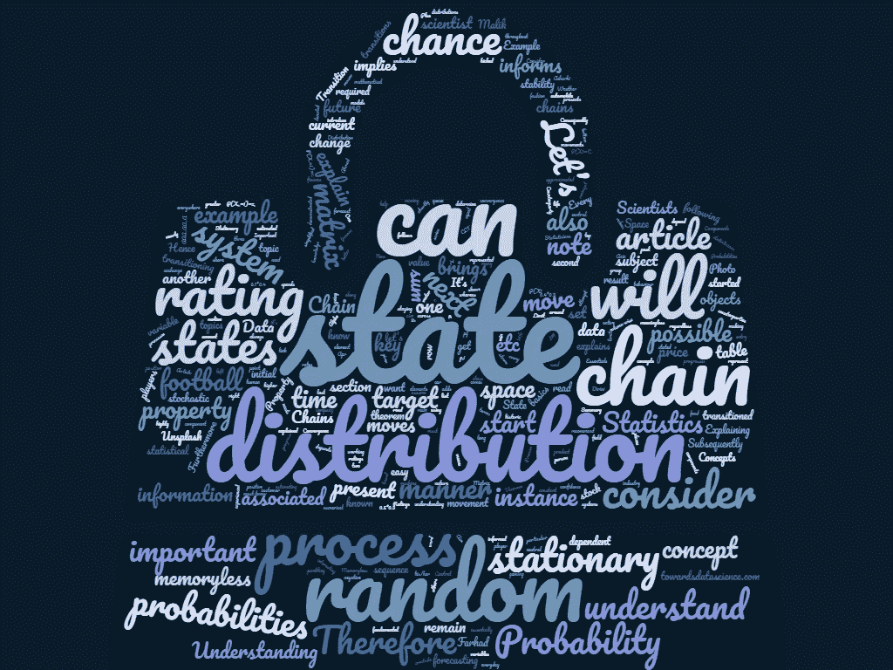
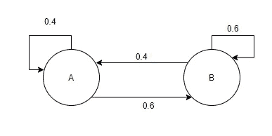
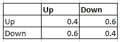
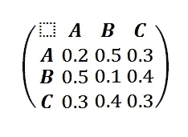
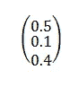
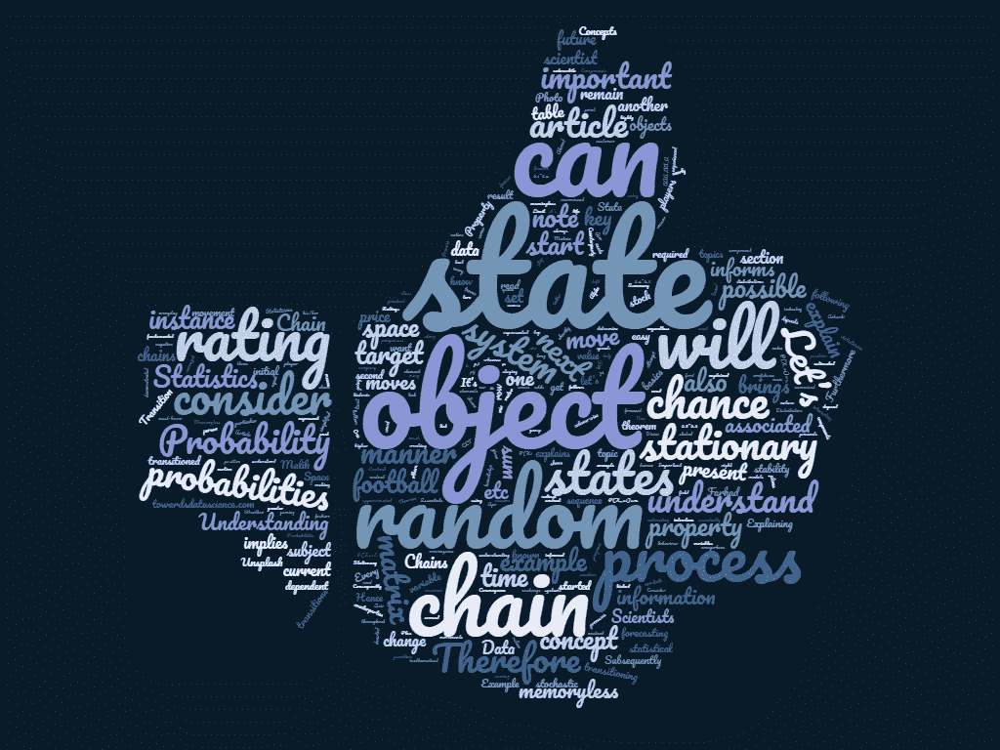

# 理解概率和统计:马尔可夫链

> 原文：<https://towardsdatascience.com/understanding-probability-and-statistics-markov-chains-ce5a6ece0042?source=collection_archive---------21----------------------->

## 为数据科学家解释马尔可夫链:概率和统计中最重要的概念之一

一旦开始研究统计模型，每个数据科学家都会遇到术语马尔可夫链和马尔可夫过程。这篇文章将以一种容易理解的方式解释马尔可夫过程的基本概念。

马尔可夫链广泛应用于金融、汽车、食品、游戏行业，在日常生活中几乎无处不在。因此，这是所有统计学家必须知道的话题。

> 天气、赌博、股票价格、人类行为都是马尔可夫过程。

概率与统计

# 文章目标

本文旨在解释以下关键主题:

1.  什么是马尔可夫过程？
2.  什么是马尔可夫链？
3.  马尔可夫链示例
4.  什么是平稳马尔可夫链分布？

照片由 [Ahmad Dirini](https://unsplash.com/@ahmadirini?utm_source=medium&utm_medium=referral) 在 [Unsplash](https://unsplash.com?utm_source=medium&utm_medium=referral) 上拍摄

# 1.什么是马尔可夫过程？

让我们考虑一个物体以随机方式运动。该对象可以是足球、正在下一步棋的棋手、汇率、股票价格、汽车运动、顾客在队列中的位置、在路上移动的人、足球场上的运动员等。

这些物体以随机的方式运动。因此，我们可以得出结论，对象在本质上是随机的。这些对象本质上代表了整个系统。有趣的是，所有这些系统都有马尔可夫属性。

## **什么是马尔可夫性质？**

如果一个物体以随机的方式运动，并且它的运动是无记忆的，那么这个物体具有马尔可夫性。

作为一个例子，让我们考虑我们的目标对象是一个被一群足球运动员踢来踢去的足球。接下来足球可以处于任何状态。例如，它可以向右或向左移动。如果我们的目标对象是一家公司的股票价格，那么接下来它可以得到任何数值，比如 0.999，1，2，3 等等。现在，我们在上面陈述了马尔可夫性质是无记忆的。这意味着物体未来的运动只取决于它现在的状态。这是需要理解的最重要的概念。

> 马尔可夫性质是无记忆的

这就给我们带来了马尔可夫链的概念。

# 2.什么是马尔可夫链？

让我们考虑一个物体以随机方式运动。因此，对象(或系统)的状态可以改变。这种变化被称为转换，并且每个转换都有与其他转换相关联的概率。

因此，这个数学系统可以从一种状态转换到另一种状态，而这种转换是基于概率的。

这个系统是一个随机过程的例子。让我们假设它可以处于状态 A 或 B。让我们还考虑当对象处于状态 A 时，它有 40%的机会保持在状态 A，有 60%的机会转换到状态 B，如下所示:

示例状态机

需要注意的关键是，该过程具有马尔可夫性质，这意味着它是无记忆的。因此，未来转移的概率不依赖于过去的状态。它们只取决于当前状态。这就是为什么我们认为它是无记忆的。

> 马尔可夫链是具有马尔可夫性质的随机过程

马尔可夫链表示物体的随机运动。它是一个随机变量序列 *Xn* ，其中每个随机变量都有一个与之相关的转移概率。每个序列也有一个初始概率分布π。

考虑一个可能处于三种状态之一的对象{A，B，C}。随后，该对象从状态 A 开始，可以转到另一个状态 B 或状态 C，依此类推。所有的状态 A、B、C 等都在状态空间中(所有可能状态的集合)。

照片由[阿齐兹·阿查基](https://unsplash.com/@acharki95?utm_source=medium&utm_medium=referral)在 [Unsplash](https://unsplash.com?utm_source=medium&utm_medium=referral) 上拍摄

## 马尔可夫链的组成部分

这给我们带来了马尔可夫链的两个主要组成部分:

## 1.1 状态空间

状态空间是随机系统可能处于的所有可能状态(位置)的集合。

例如，S 可以是{上，下}或{上，下}或{1.1，2.2，…}或{正，负，中性}或{AAA，AA，A，B，D，E..}等。

> 要注意的一点是，S 是状态空间，它是对象可能处于的所有可能状态的集合。

## 1.2 转移概率

第二部分是转移概率。转移概率是一个概率表。表中的每一项 I，j 都告诉我们一个物体从状态 I 跃迁到状态 j 的概率。

因此，将存在与需要等于或大于 0 的所有状态相关联的概率。另外，概率值之和需要为 1。

如果你想了解概率分布的基础知识，那么请阅读这篇文章，这篇文章解释了概率的基础知识。我向每一位数据科学家强烈推荐它:

 [## 理解概率和统计:数据科学家的概率基础

### 为统计学家解释概率的关键概念

towardsdatascience.com](/understanding-probability-and-statistics-the-essentials-of-probability-for-data-scientists-459d61a8da44) 

转移概率告诉我们对象可能处于的下一个状态及其相关概率。因此，对象的下一步移动仅取决于其当前值。

假设我们有一个转移概率矩阵:

上表显示，如果我们的目标对象处于正常状态，那么它有 60%的机会转换到正常状态，有 40%的机会保持正常状态。此外，如果目标对象处于按下状态，则有 60%的机会它将转换到按下状态，并且有 40%的机会它将保持在按下状态。

> 需要注意的关键是，只需要知道当前状态就可以确定未来状态的概率分布。其他任何历史信息都没有意义。

# 3.马尔可夫链示例

本节将使用一个简单易懂的例子来解释马尔可夫链的概念。

假设我们试图预测一系列交易对手的评级。每个交易对手都有当前评级。例如，交易对手 Alpha 可以具有评级 A 或 B 或 C。因此，{A，B，C}是状态空间中的状态。

我们已经得到了一个转移概率矩阵。这个矩阵也称为随机矩阵。转移概率矩阵告诉我们交易对手转移到另一个评级的概率。

交易对手评级状态空间= {A，B，C}

转换矩阵:

需要注意的是，行或列的概率之和是 1。

因此，如果一个交易对手的评级为 A，则有 30%的机会将其转换为 C 级，有 50%的机会将其自身转换为 B 级，而有 20%的机会保持 A 级。

随机过程也有一个概率分布，我将很快解释。

这给我们带来了一个重要的定理:

如果马尔可夫链是{Xn}并且具有状态空间 s，转移概率为{pij}，其初始概率分布为{ ᵢ} }那么对于作为 s 的元素的任何 *i* ，我们得到:

*p(x1 = I)=σμₖpₖi(s 的所有 k 个元素的总和)*

因此，让我们也考虑交易对手的当前概率分布如下:

*   对于评级为 A 的交易对手，该值为 0.5
*   对于评级为 B 的交易对手，该值为 0.1
*   对于评级为 C 的交易对手，该值为 0.4。

马尔可夫链的概率分布可以表示为行向量π，如下所示:

概率分布加起来是 1。

有了这些信息，我们可以开始更好地理解这个过程。随着时间的推移，我们可以开始估计物体处于特定状态的概率。例如，对于下一个评级为 C 的交易对手，我们可以对所有状态的当前概率分布和转移概率的乘积求和:

*P(X1 = C)=(0.5 * 0.3)+(0.1 * 0.4)+(0.4 * 0.3)= 0.31*

它通知我们，在大约 31%的情况下，该交易对手在一步后将获得评级 C。一旦我们有了这些信息，我们就可以更有把握地预测一个随机运动的物体。

# 4.什么是平稳马尔可夫链分布？

这就把我们带到了随机变量的稳定性。这是本文的最后一个重要部分。这一节将介绍马尔可夫链的平稳分布这一主题。

让我们考虑我们的目标随机过程需要被估计，我们想了解随机过程的稳定性。

我们知道马尔可夫链有一个概率分布。“静止”这个词意味着*主体*是不变的，我们知道我们的随机对象可以移动到任何可能的状态。这种情况下的主题是随机过程的概率分布，而不是随机对象本身。

> 因此，如果马尔可夫链的统计分布是稳定的，那么这意味着该分布不会随着时间的推移而改变。

因此，如果转移矩阵是 P，概率分布是π，那么马尔可夫链的平稳分布就是π = π * P

理解收敛性和中心极限定理是很重要的。每个数据科学家都必须知道这些概念。此链接以简单的方式解释了它:

 [## 理解概率和统计:数据科学家的中心极限定理和收敛

### 本文是“理解概率与统计”系列文章的第二篇。它侧重于 CLT 和…

towardsdatascience.com](/understanding-probability-and-statistics-central-limit-theorem-and-convergence-for-data-scientists-653c53145400) 

这是一个需要理解的非常重要的概念。它告诉我们，不管具有稳定概率分布的系统在开始时在哪里，随着时间的推移，系统处于某个状态的时间量将会接近它的概率分布。

此外，该链将总是具有与开始时相同的概率。

*随后，如果{Xₙ}是一个马尔可夫链并且它有一个平稳分布{πᵢ}那么如果 P(Xₙ=i)=πᵢ对于所有 I 那么 P(Xₘ=i)=πᵢ对于所有 I，只要 m > n.*

这些信息可以帮助我们预测随机过程。

# 5.摘要

本文解释了以下关键主题:

1.  什么是马尔可夫过程？
2.  什么是马尔可夫链？
3.  马尔可夫链示例
4.  什么是平稳马尔可夫链分布？