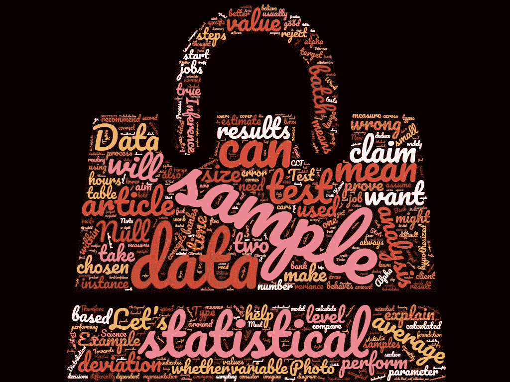
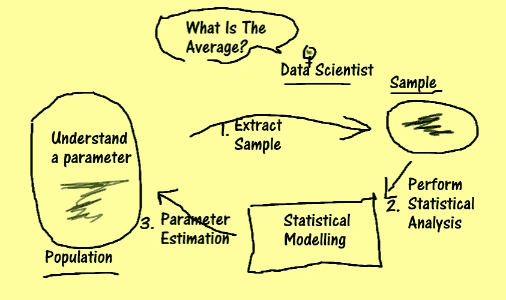
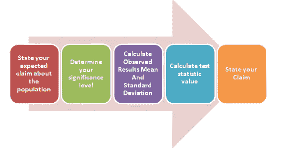
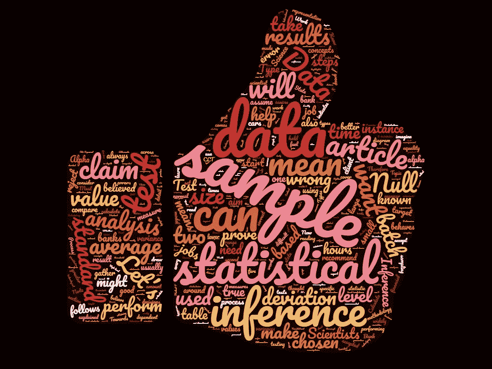

# 理解概率和统计:数据科学家的统计推断

> 原文：<https://towardsdatascience.com/understanding-probability-and-statistics-statistical-inference-for-data-scientists-fd05bde7d63?source=collection_archive---------16----------------------->

## 构成数据科学家工作基础的一个必须知道的话题

每一个数据科学家 ***都必须*** 熟悉统计推断的概念。因此，本文旨在提供一个统计推断的概述。它将以一种易于掌握和理解的方式，带你深入推断的统计世界。

一些科学家认为统计推断是统计学中最难的概念之一，彻底理解它确实可以帮助他们为他们的项目和团队增加重要价值。

> 我的目标是用简单的方式解释统计推断，以便每个人都能理解。



概率与统计

# 文章目标

本文旨在解释:

1.  统计推断是什么？
2.  理解统计推断过程
3.  测试统计—更大的图片和示例
4.  假设检验
5.  错误类型

# 1.统计推断是什么？

数据科学家通常花费大量时间来收集和评估数据。然后，使用数据分析技术，将这些数据用于推断结论。

有时观察到这些结论，并使用图表和表格轻松描述这些发现。这就是所谓的描述性统计。其他时候，我们必须探索一种未被观察到的方法。这就是统计推断的来源。

## 到目前为止一切顺利。现在让我们来理解它

描述性统计推断本质上是向用户描述数据，但它不会从数据中做出任何推断。推断统计学是统计推断的另一个分支。推断统计学帮助我们从样本数据中得出结论，以估计总体的参数。样本不太可能绝对真实地代表总体，因此，在得出总体结论时，我们总会有一定程度的不确定性。

例如，数据科学家可能旨在了解他们实验中的变量是如何表现的。收集该变量的所有数据(人口)可能是一项巨大的任务。因此，数据科学家从目标变量的总体中抽取一个小样本来代表总体，然后对这个小样本进行统计推断。

> 这些样本用于估计人口

数据科学家的目的是在知道存在一定程度的不确定性的情况下，从一个样本推广到一个群体。因此，这些分析有助于他们对整个数据群体做出判断。有时，数据科学家模拟样本，以了解人口的行为，并为此对变量的潜在概率分布做出假设。这就是为什么概率的概念被大量推荐给数据科学家的核心原因之一。

随后，关于人口的性质提出了许多假设和主张。接下来，使用统计模型从样本中推断结论，从而推断群体的特性。

下面的文章提供了对什么是概率分布的透彻理解，我强烈推荐每个人阅读这篇文章

[](/understanding-probability-and-statistics-the-essentials-of-probability-for-data-scientists-459d61a8da44) [## 理解概率和统计:数据科学家的概率基础

### 为统计学家解释概率的关键概念

towardsdatascience.com](/understanding-probability-and-statistics-the-essentials-of-probability-for-data-scientists-459d61a8da44) 

# 2.理解统计推断过程

这一节将帮助我们理解统计推断的过程。让我们假设数据科学家想要了解他们的目标变量的行为。他们可能有兴趣了解总体参数的行为。

*   例如，他们可能想要评估银行中所有部门的所有隔夜批处理作业是否在特定的时间范围内完成。
*   或者，他们可能想找到一个国家人口的平均身高。
*   或者，他们可能想了解企业是否获得了相同的利润，以及用户在特定事件之前或之后的行为是否有所不同，例如在新产品发布之后。
*   或者他们想证明某个关于人口的特定主张是错误的。

有时候收集一个群体的所有数据太困难了。因此，数据科学家从总体中准备他们的样本集。

例如，数据科学家想要了解的参数可能是总体的平均值或方差。他们从总体中提取样本，然后进行统计分析以估计总体参数。有时，他们会检查参数是否符合被认为是真实的特定值。

下图说明了这一过程:



从获取样本开始，然后进行统计分析

> 注意统计推断和抽样技术一样好

样本中总有一些噪声成分。**样本的标准差超过样本大小的平方根就是样本标准差**。这是样本相对于平均值的噪声/离差。这种测量是基于样本大小的。该公式表明，样本量越大，标准差的影响越小，样本值越接近总体值。如果我们增加样本量，那么最终样本将开始接近总体。我推荐阅读这篇解释什么是融合和 CLT 的文章。这些是数据科学家需要理解的重要主题:

[](/understanding-probability-and-statistics-central-limit-theorem-and-convergence-for-data-scientists-653c53145400) [## 理解概率和统计:数据科学家的中心极限定理和收敛

### 本文是“理解概率与统计”系列文章的第二篇。它侧重于 CLT 和…

towardsdatascience.com](/understanding-probability-and-statistics-central-limit-theorem-and-convergence-for-data-scientists-653c53145400) 

## 2.1 思考这个例子

作为一个例子，我们可以声称我们的目标变量遵循正态分布，其均值始终为零，方差为 1，等等。

因此，在收集了一个小样本后，我们开始在直方图中绘制 10 个区间内的值。从图表中，我们得出结论，由于产生了钟形曲线，数据遵循正态分布。从那里，我们可以开始估计样本的均值和方差，从而得出关于总体的推断。我们也可以开始从样本的置信概率分布中产生更多的数据。

但是我们有多大的信心呢？我们怎么能拒绝这种说法呢？或者有没有一种方法可以计算出这种说法，让我们可以确定？我们能通过量化的方法来证明吗？这就是统计推断的用武之地！

> 理解统计推断是至关重要的，因为它可以帮助我们更好地理解我们的统计选择


由[维多利亚·比尔斯伯勒](https://unsplash.com/@vicbils?utm_source=medium&utm_medium=referral)在 [Unsplash](https://unsplash.com?utm_source=medium&utm_medium=referral) 上拍摄的照片

样本可以被认为是一个随机变量，它有自己的概率分布、模式和趋势。

*我们可以收集大量样本，计算它们的均值、标准差和方差，以便更好地了解数据。*

检验统计的过程可以用来帮助我们作出经过计算的决定。在对样本进行实验之前，科学家们对预期的结果有一个概念。这通常是通过探索性数据分析收集的。

# 3.测试统计—更大的图片和示例

现在，从理论上，让我们回顾一下统计推断是如何工作的。

假设我们正在进行一个数据科学项目，我们的客户是一家大型金融机构。我将我们的客户称为银行 a。他们希望我们了解他们的隔夜批处理系统平均花费的时间是否与业内其他银行相同。客户希望使用我们的结果来了解他们今年是否需要在技术方面进行不同的投资。

我们还假设业内普遍认为，所有银行的隔夜批处理作业平均需要≤ 6 小时才能完成。

这是一个大数据问题。我们不可能走遍每一家银行，获得它们所有的批处理作业数据。这将是一项极其费时费钱的工作。我们可以想象我们的人口拥有多少数据。因此，第一步是收集不同银行的良好样本集。

以我们的例子为例，我们可以根据银行的交易规模将它们分类，并从每组的一个成员那里获取一年的批处理作业时间。

> 样本的选择应使其能最好地代表被测数据的总体。总是花时间思考取样技术
> 
> 假设分析的成功取决于所选样本的质量。

然后，我们声称银行 A 的隔夜批处理作业平均需要 6 个多小时才能完成。这是我们正在测试的假设。让我们证明它是对的。

在我介绍基础知识的时候，让我们先保持这个想法，然后我会回到这个话题上来。


由[约书亚·索蒂诺](https://unsplash.com/@sortino?utm_source=medium&utm_medium=referral)在 [Unsplash](https://unsplash.com?utm_source=medium&utm_medium=referral) 上拍摄的照片

***这让我想到了本文的第二个子主题——测试统计***

我们执行以下 5 个步骤来证明索赔:

1.  从陈述被广泛相信的主张开始，这就是所谓的零假设。
2.  在我们拒绝索赔之前，概述最低显著性水平/置信水平。这可能是 5%。这意味着我们相信大约有 5%的时间，我们的模型会产生不准确的结果。
3.  计算样本结果的平均值和标准差
4.  计算测试统计数据
5.  最后，基于结果，陈述选择的结果。



该图突出显示了五个步骤。我将在下面详细解释这五个步骤

> *选择的检验统计量取决于样本的分布和样本大小。*

下一节将详细解释每个步骤。

# 4.假设检验

## 1.陈述你的要求

任何测试都有两个假设:

1.  **零假设—** 什么是公认的真理，什么是我们想要检验的。这就是我们想要证明的错误。*对于我们的例子，批处理作业的平均完成时间少于或等于 6 小时。*
2.  **备选假设** —如果零假设不成立，我们需要接受什么。这是我们认为正确的。这是我们对银行的假设。*我们的假设是工作的平均时间大于 6 小时*。

注意，无效假设和替代假设不能同时为真。

***侧注*** *:这是一个单尾测试。单尾备择假设是单向检验。双尾备择假设检验是双向检验，统计学家感兴趣的是检查数据的相等性，例如某个值是否在某个范围内。*

## 2.确定你的重要性水平:

您的显著性水平表明您对样本和支持您的主张的方法有多大的信心。显著性水平被称为α。阿尔法的通常值是 1%或 5%。阿尔法值越低，意味着你对结果非常有把握。所选择的置信水平构成了风险管理信贷指标的基础。

> **Alpha** 是假设分析中的显著性水平。
> 详细来说，Alpha 是在零假设被拒绝之前，可以被**接受**的值的范围。
> 
> *是下限。*


## 3.计算测试统计

## 高级测试统计概述

我们可以选择 T、Z 或 F 统计。我将简要地解释它们。


照片由[诺德伍德主题](https://unsplash.com/@nordwood?utm_source=medium&utm_medium=referral)在 [Unsplash](https://unsplash.com?utm_source=medium&utm_medium=referral) 上拍摄

一旦选择一个样本来代表一个总体，就可以计算出它的均值和标准差。然后我们进行测试统计。

有许多测试统计数据，如 T、Z、F 等。

我强烈推荐阅读这篇文章，因为它深入解释了三个最重要的统计数据:

[](/understanding-probability-and-statistics-chi-squared-student-t-and-f-distributions-e46b4f802707) [## 理解概率和统计:卡方分布、学生 T 分布和 f 分布

### 处理数据和统计推断的数据科学家必须知道的话题

towardsdatascience.com](/understanding-probability-and-statistics-chi-squared-student-t-and-f-distributions-e46b4f802707) 

**T 统计量**用于检验两个小总体的均值相等。样本服从 Student T 分布，样本大小约为 30 个观察值。总体标准差未知。

*   **示例**:您有一个 10 辆汽车的样本，您想测量镇上所有汽车的平均油耗。你的假设是，汽车平均每天消耗 10 升燃料。让我们也考虑一下，你对这个方法有 99%的信心。然后，您可以将假设的平均值与样本平均值进行比较，并根据 99%的 t 分布表计算出是否需要拒绝零假设。

**Z 统计量**用于检验两个大总体的均值。样本服从正态分布，样本容量通常大于 30。总体标准差是已知的。

*   **例子**:假设你已经收集了一个 500 人的样本，来估计每天穿蓝色衬衫的平均人数。让我们也考虑一下，你对你的模型有 95%的信心。然后，您可以将假设的平均值与样本平均值进行比较，并根据 95%的 Z 分布表计算出是否需要拒绝零假设。


兰迪·法特在 [Unsplash](https://unsplash.com?utm_source=medium&utm_medium=referral) 上的照片

**F 统计量**用于比较两个总体的方差。变异是每个观察值与其组均值的偏差平方和除以误差自由度。

*   **例子**:你可以用 f 检验来比较你公司两个 IT 系统软件 bug 的可变性。

每一个测试统计都有自己的简单公式。为了简单起见，我不打算在本文中讨论这些公式。

计算结果时，会根据分布表中的值进行检查。请注意，结果取决于样本大小、标准偏差和样本均值。

我们可以使用 Python 执行测试统计。作为一个实例，要执行 T 检验，我们可以:

```
from scipy import stats
stats.ttest_ind(collection_one, collection_two)
```

从计算的结果，我们可以陈述结果。

## 5.陈述您的结果:

让我们假设我们从测试统计计算中计算出 0.50。现在，我们可以在概率分布表中查找我们选择的 alpha 为 95%的样本值。Z 分布表给出的值为 1.96。当 0.50 ≤ 1.96 时，我们必须接受零假设。

这意味着批处理作业确实在声称的 6 小时时间内完成，而我们的说法是错误的。这就是统计推断的工作原理。


照片由 [Aaron Burden](https://unsplash.com/@aaronburden?utm_source=medium&utm_medium=referral) 在 [Unsplash](https://unsplash.com?utm_source=medium&utm_medium=referral) 上拍摄

# 5.错误类型:

最后，我想介绍两种类型的错误。了解实验如何出错以及在哪里出错是很重要的。

## 类型 1 和类型 2

在我们陈述结果时，可能会出现两种类型的错误:

1.  **第 1 类错误:**零假设正确，但分析证明它是错误的。
2.  **第二类错误:**零假设是错误的，但分析无法证明它是错误的


[优 X 创投](https://unsplash.com/@youxventures?utm_source=medium&utm_medium=referral)在 [Unsplash](https://unsplash.com?utm_source=medium&utm_medium=referral) 上的照片

# 摘要

这篇文章解释了统计学领域最重要的课题之一。统计推断是每个数据科学家必须知道的话题。



感谢您的阅读

然后，文章解释了我们如何计算检验统计量和进行假设分析。

这些步骤可用于阐明假设是否正确。它有助于一个人做出有意识的规避风险的决定，并通过量化措施更好地理解我们的数据。