# 理解概率和统计…

> 原文：<https://towardsdatascience.com/understanding-probability-statistics-29a9137be2f2?source=collection_archive---------45----------------------->

## 数据和科学之间的桥梁！


迈克尔·泽兹奇在 [Unsplash](https://unsplash.com?utm_source=medium&utm_medium=referral) 上的照片

# **简介**

作为有抱负的数据科学家，我们都希望成为一名优秀的程序员，知道所有处理大量数据流的最新方法，但我们经常无法理解生成数据的随机过程、数据的分布及其相互依赖关系。我们都知道如何对数据进行高斯变换，但我们不清楚为什么它如此重要。

我们对概率统计中必须掌握的题目都没有一个清晰的概念。因此，当我们听到一个话题时，我们在互联网上搜索只会得到一大堆链接。就连我刚开始也面临同样的问题。所以我一直想创建一个简洁的文档来概述共同的主题，现在我们来了！

# **目录**

*   概率分布
*   协方差和相关性
*   大数定律
*   中心极限定理
*   参数估计和假设检验

# **概率分布**

当我们从 csv 文件中读取数据时，所有的列标题都让我们了解了某个特定列的内容。如果是“年龄”栏，那么我们知道这一栏中的所有值对应于不同人的年龄。在数学术语中，这个“年龄”被建模为一个变量，更具体地说是一个*随机*变量，因为产生不同人的年龄的过程是一个产生随机数的变化过程。每个随机变量都有自己的分布和一系列属性-

*   **支持**:分发的域。
*   **PMF/PDF** :实际概率分布。
*   **CDF:** 累积分布函数，它是分布值小于或等于特定值的事件的实际概率。因为是概率，所以范围在 0 到 1 之间。
*   **平均值**:观察值的加权平均值；又称*期待*。
*   **方差**:来自*的观测值的分布均值*；它的平方根叫做*标准差*。
*   **中位数**:分布的中间值。
*   **模式**:从分布中取样的频率值。

有两种随机变量-

1.  *离散的*随机变量，在掷硬币中可以有可数个值，如正面/反面，它们的分布可以用*概率质量函数(PMF)* 来描述。我们将在下面讨论离散随机变量:

*   二项分布
*   二项分布
*   几何分布
*   泊松分布
*   离散均匀分布

2.*连续的*随机变量取给定数字区间内的所有值，如年龄及其分布可以用*概率密度函数(PDF)* 来描述。我们将在下面讨论离散随机变量:

*   指数分布
*   连续均匀分布
*   高斯分布

# **伯努利分布**

可以认为是实验的模型，其结果是二元的，即头/尾、是/否等。结果以概率 *p* 为正，以概率 *1-p* 为负。

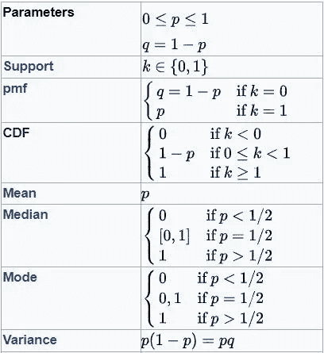

伯努利分布:重要的性质(来源:维基百科)

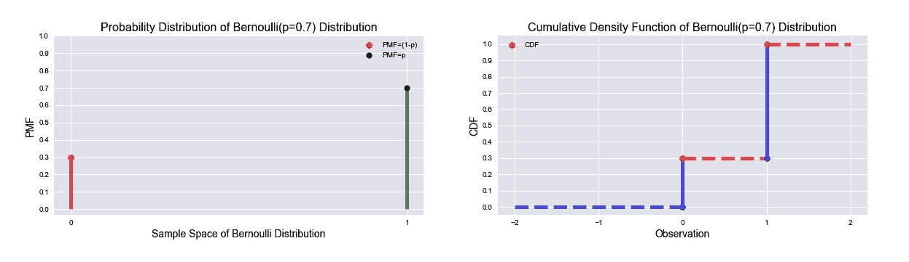

伯努利分布:PMF 和 CDF(来源:作者)

# **二项式分布**

这个参数为 *n* 和 *p* 的分布是*伯努利*分布的推广情况，其中 *n* 是随机实验的序列数， *p* 是每次实验中出现阳性结果的概率。我们可以把它想象成这样的实验:投掷一枚硬币 20 次，计算得到 9 个正面的概率，其中每次试验中正面的概率是 0.6。

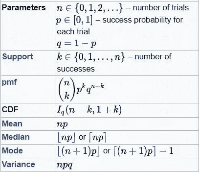

二项式分布:重要的性质(来源:维基百科)

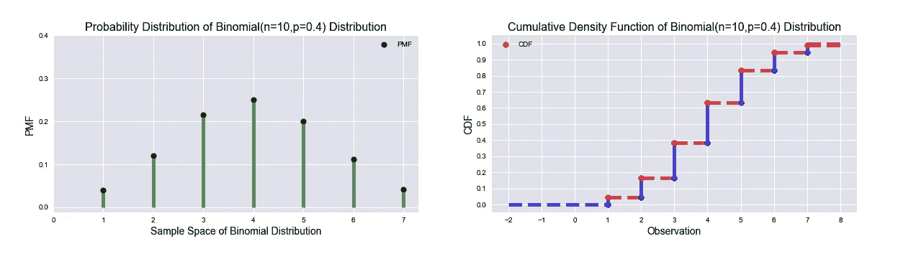

二项分布:PMF 和 CDF(来源:作者)

# **几何分布**

这种类型的分布是用成功的概率 *p* 来模拟*伯努利*试验的次数，直到第一次成功，就像投掷骰子多次直到第一次出现“1”一样。

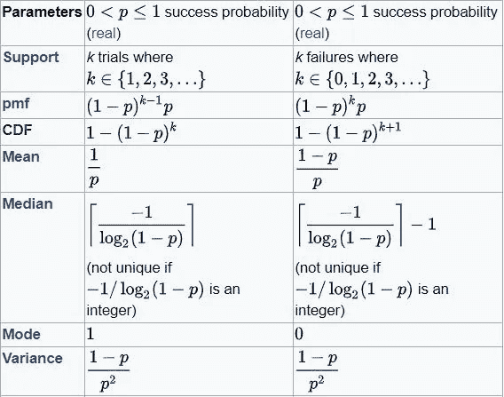

几何分布:重要的性质(来源:维基百科)

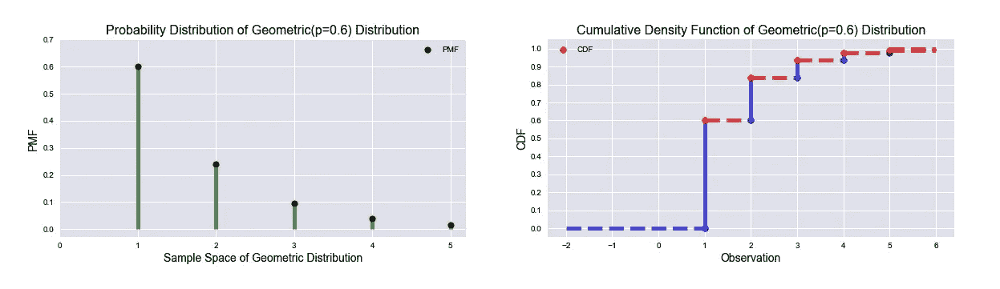

几何分布:PMF & CDF(来源:作者)

# **泊松分布**

这种分布是为了模拟给定数量的事件 *k* 在固定的时间或空间间隔内发生的概率，如果这些事件以已知的恒定平均速率λ发生，并且独立于自上次事件以来的时间。示例包括呼叫中心收到的电话数量或每天的电子邮件数量等。

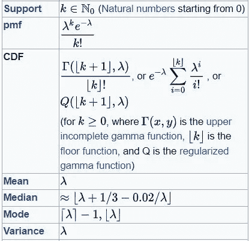

泊松分布:重要的性质(来源:维基百科)

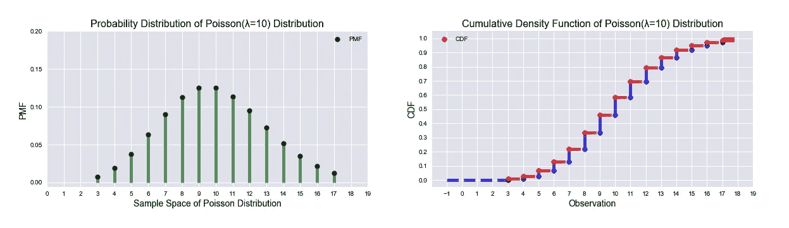

泊松分布:PMF 和 CDF(来源:作者)

# **离散均匀分布**

顾名思义，它用于模拟随机实验，其中 *a* 和 *b* (b≥ a)之间的所有离散结果都有相同的可能性，就像投掷公平骰子一样。

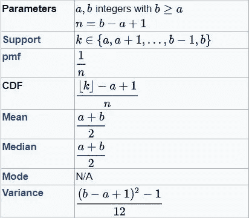

离散均匀分布:重要性质(来源:维基百科)

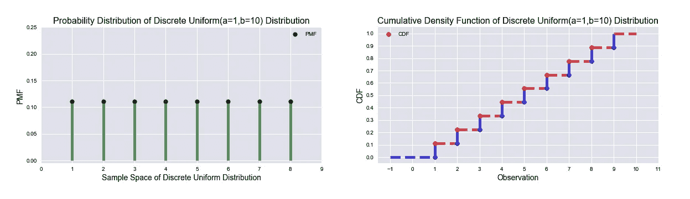

离散均匀分布:PMF 和 CDF(来源:作者)

# **指数分布**

它用于模拟事件以恒定的平均速率λ连续独立发生的过程之间的时间概率分布，例如从现在到地震发生的时间。
*指数*分布的一个重要性质是“*无记忆性*”，这可以解释为如果一个事件在 30 秒后还没有发生，发生至少需要 10 秒以上的条件概率就等于在初始时间后观察到该事件超过 10 秒的无条件概率。

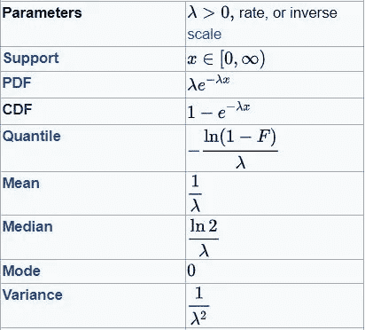

指数分布:重要的性质(来源:维基百科)

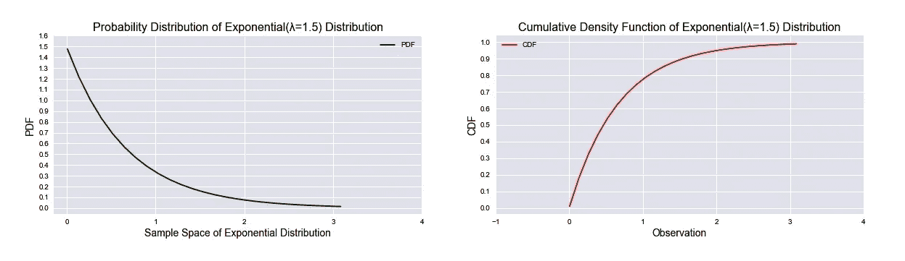

指数分布:PDF & CDF(来源:作者)

# **连续均匀分布**

它描述了一个实验，其中结果是连续的，即可以取最小和最大值之间的任何值，表示为 *a* 和 *b* 。其中一个例子可以是随机数发生器。

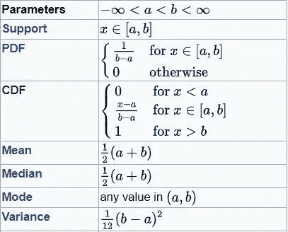

连续均匀分布:重要性质(来源:维基百科)

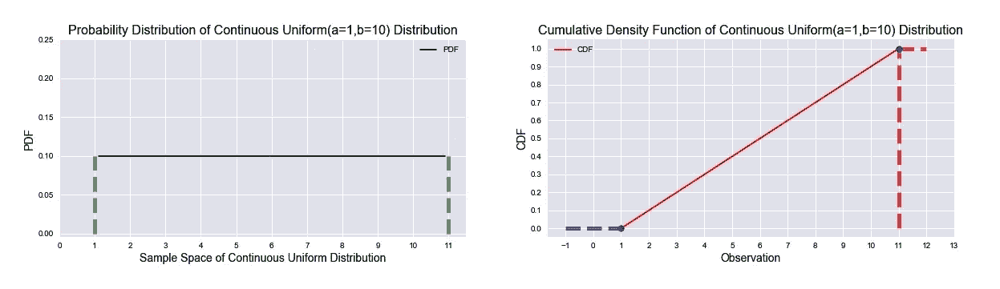

连续均匀分布:PDF & CDF(来源:作者)

# **高斯分布**

这种分布用于表示任何分布未知的实值随机变量。用均值 *μ* 和方差 *σ* 来表示。如果我们绘制一组推文中每条推文的字数，我们可以看到形状遵循一条'*钟形曲线*，并得出结论，分布是*高斯*或*正态*。我们将在后面看到为什么这种分布如此重要。

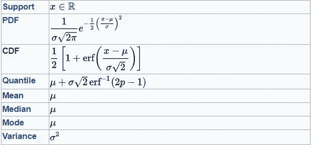

高斯分布:重要的性质(来源:维基百科)

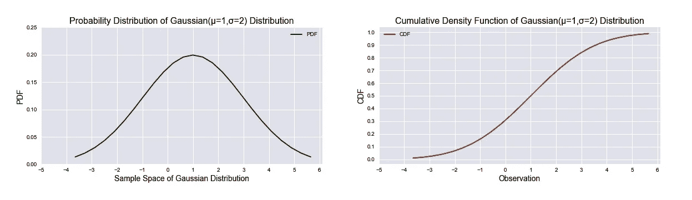

高斯分布:PDF & CDF(来源:作者)

# **协方差和相关性**

*协方差*测量两个独立随机变量的联合可变性，它们之间关系的强度由*相关系数*测量。如果*协方差*为 0，则 2 个随机变量是独立的，但反之不成立。

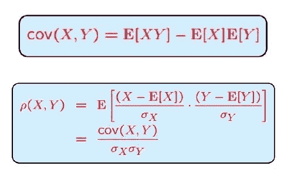

协方差和相关系数(资料来源:麻省理工开放式课程)

在我们的小示例中，我们使用“数据 1”生成“数据 2”，它们彼此相关，我们可以测量它们的 *Spearman 的* *相关系数ρ* ，其范围从-1 到+1，其中-1 表示最强的负相关，0 表示独立，而+1 表示最强的正相关。

输出将告诉我们这两个变量是正相关的。

```
data1: Mean=100.192; Variance=399.991
data2: Mean=50.199; Variance=500.785
Covariance between data1 and data2: 
 [[400.01063636 400.46496352]
 [400.46496352 500.81039823]]
Pearson Correlation Coefficient is 0.895 with p-value 0.000
```

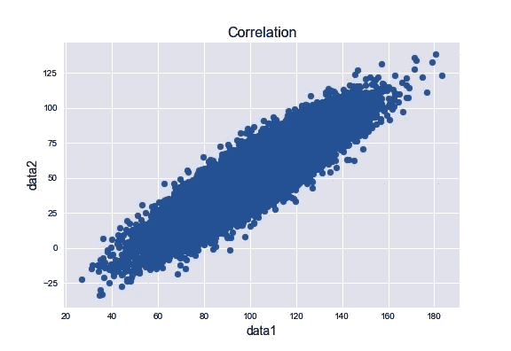

两个随机变量之间的相关性(来源:作者)

# **大数定律**

在统计学中，*大数定律(LLN)* 是一个定理，它表示如果我们多次进行相同的实验，那么实验结果的平均值应该接近真实平均值。 *LLN* 很重要，因为它保证了一些随机事件的平均长期稳定的结果，这就是为什么赌场即使在少数情况下赔钱，从长远来看也会赚钱的原因。

从数学上来说，如果同一个实验被执行 *n* ( *n* 非常大)次作为*独立且相同(i.i.d)* 的实验，那么结果的数字平均值将非常接近真实平均值 *μ* 。

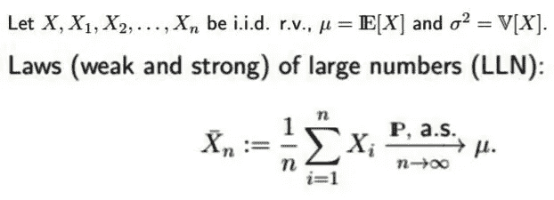

大数定律

因为在下面的例子中，正态随机变量的任何线性组合也是随机的，所以'*数据'*变量的真实平均值是 5 * 0 + 10 = 10。我们将看到，当 *n* 从 10 增加到 100，000 时，数字平均值将变得更接近真实平均值 10。

如果我们运行上面的代码，我们会看到这个。

```
Average when n=10 is    : 9.5142955459695
Average when n=1000 is  : 10.184099506736104
Average when n=10000 is : 10.039233155010294
Average when n=100000 is: 10.013670784412874
```

# **中心极限定理**

*高斯*分布的重要性来源于*中心极限定理(CLT)* 该定理指出，在某些条件下，一个均值和方差有限的随机变量的多次观测值的平均值本身就是一个随机变量，其分布随着样本数的增加而收敛于正态分布，即使原始变量本身不是正态分布。

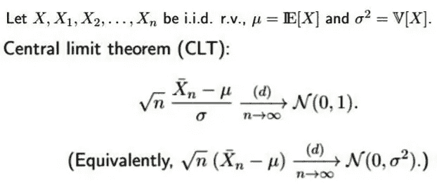

中心极限定理

如果我们在减去真实平均值并乘以 *√n* 后绘制居中样本平均值的直方图，我们可以形象地得出结论:分布为*高斯分布*，平均值为 0。

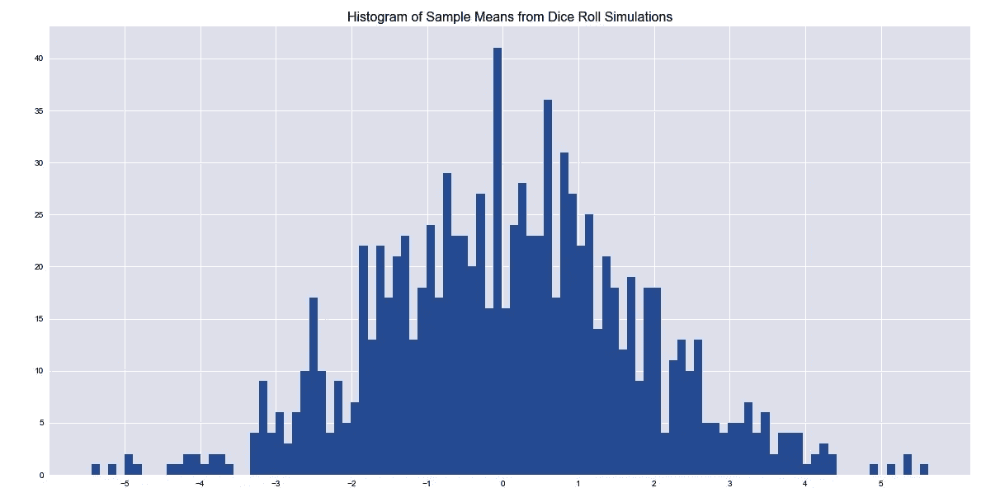

骰子滚动模拟的样本均值直方图(来源:作者)

# 参数估计和假设检验

一旦我们确定了一个分布，我们就需要根据它进行统计推断，并对看不见的数据进行假设和验证。有三个主要的过程-

1.  **估计**:识别描述我们分布的*参数*，了解其统计性质。
2.  **置信区间**:参数*的值的上下界*，计算*参数*的值保持在此范围内的置信度(概率)。
3.  **假设检验**:对我们的信念做出假设，并根据数据寻找接受/拒绝的证据。

# **置信区间**

*中心极限定理(CLT)* 的优点是对于大量的观测值，任何分布都收敛于*标准正态分布*。

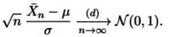

收敛于标准正态分布

上图中箭头的左侧称为实验的*检验统计量*，如果我们可以计算出*检验统计量(Z 得分)*，我们就可以明确地计算出这个*检验统计量*大于临界值的概率，相反，如果我们知道概率( *p 值*，我们就可以计算出临界值，因为在*标准正态*下不同临界值的概率很容易得到，称为 *Z*

对于固定的α ∈ (0，1)，如果 q_α/2 是 *N* (0，1)的(1α/2)-分位数，那么概率= 1α(如果 N 足够大(也称为*渐近*))，估计量的*置信区间*变成-

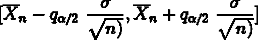

置信区间

输出是-

```
90 percent Confidence Interval is: 49.736, 50.870
```

# **假设检验**

假设我们掷一枚硬币，我们假设硬币是公平的，即正面的概率是 0.5。这个假设形成了关于实验的假设，这个基线假设称为*零假设 h0*。另一个假设是硬币是不公平的，我们称之为*替代假设 h1*。我们掷 200 次，得到 170 次正面。如果我们根据*中心极限定理*形成*检验统计量*，我们将得到-
(√200)((170/200)-0.5)/√( 0.5 * 0.5))= 9.89，大于 1.645——标准正态*分布的 95%分位数(假设α=0.05)。所以我们可以拒绝*零假设*，得出硬币不公平的结论。*

假设检验的第一类错误发生在 h0 被拒绝但实际上为真时，第二类错误发生在 h0 未被拒绝但 h1 为真时。

我们将讨论常见的假设检验及其目的，但在此之前，我们将讨论几个特殊的分布。

# **学生的 t 分布**

应用中心极限定理的假设是样本量很大。如果是小(< 30) then the distribution of the random variables will follow a *t*-分布而不是*高斯*分布。

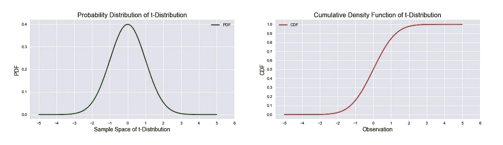

学生的 t 分布:PDF & CDF(来源:作者)

# **卡方分布**

具有 *d* 自由度的*卡方*分布(独立变量的数量)是 *d* 独立*标准正态*分布之和的分布。所以它的支持永远是*正*。它用于分布的*拟合优度*测试。

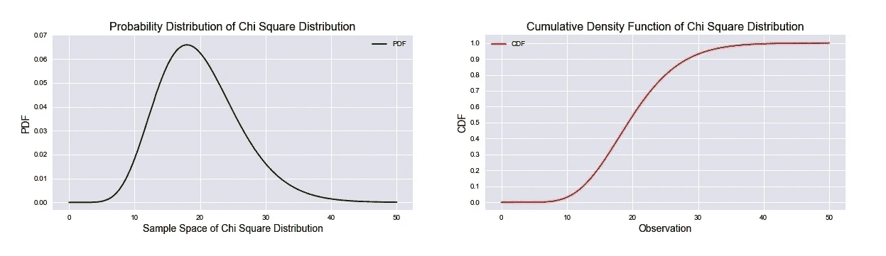

卡方分布:PDF & CDF(来源:作者)

# **学生的 t 检验**

*学生的 t 检验*是一种统计假设检验，其中*检验统计量*遵循 *t 分布*下的*零假设*。我们可以想一个例子，看看印度人的平均“身高”在统计上是否与德国人不同。由于两个不同国家的“身高”根据*中心极限定理*遵循*正态*分布，并且它们彼此独立，我们可以应用学生的 t 检验。

输出是-

```
Test Statistic=0.799, p=0.425
Same distributions (fail to reject H0)
```

# **配对学生的 t 检验**

假设我们测量几个人的血压，使用一些药物，一段时间后再次测量血压，以观察药物的影响。现在样本不是独立的，所以我们需要一个不同版本的 t 检验，叫做配对学生 t 检验。

输出是-

```
Test Statistic=0.783, p=0.434
Same distributions (fail to reject H0)
```

# **方差分析**

*ANOVA* 是当我们有两个以上独立随机变量时 *t 检验*的推广形式。*单向 ANOVA* 用于确定 3 个或更多独立随机变量的平均值之间是否存在显著的统计差异。我们可以直接使用*单向 ANOVA* 并计算 *F 统计量*，而不是运行成对 *t 检验*。
*如果随机变量是相关的，应进行重复测量 ANOVA* 。

我已经在上面的代码中展示了手动计算过程，输出是-

```
Test Statistic=9.265, p=0.002
Different distributions (reject H0)
==> Native Method To Show the Calculation Method <==
F Statistic: 9.264705882352942
```

# **卡方检验**

*卡方检验*是一种统计假设检验，属于*拟合优度*检验的范畴，其中*检验统计量*在*零假设*下预计遵循*卡方*分布，并用于检验分类变量的观察频率和预期频率之间是否存在统计上的显著差异。
使用*权变*表表示观察值，如以下代码所示，其中每个观察值都独立于其他观察值，并遵循*正态*分布。
卡方检验的一个典型示例是确定不同种族和年龄段人群之间的 COVID19 关系，其中不同种族可用作*偶然性*表的行，不同年龄段可用作列。

输出将是-

```
Observed Frequencies: 
 [[ 90\.  60\. 104\.  95.]
 [ 30\.  50\.  51\.  20.]
 [ 30\.  40\.  45\.  35.]]
dof=6
Expected Frequencies: 
 [[ 80.53846154  80.53846154 107.38461538  80.53846154]
 [ 34.84615385  34.84615385  46.46153846  34.84615385]
 [ 34.61538462  34.61538462  46.15384615  34.61538462]]
probability=0.950, critical=12.592, stat=24.571
Dependent (reject H0)
significance=0.050, p=0.000
Dependent (reject H0)
==> Native Method <==
Observed: 
 [[ 90\.  60\. 104\.  95.]
 [ 30\.  50\.  51\.  20.]
 [ 30\.  40\.  45\.  35.]]
Expected: 
 [[ 80.53846154  80.53846154 107.38461538  80.53846154]
 [ 34.84615385  34.84615385  46.46153846  34.84615385]
 [ 34.61538462  34.61538462  46.15384615  34.61538462]]
Statistic, dof:  24.5712028585826 , 6
```

# **常态测试**

这种类型的检验属于*非参数假设*检验，其中我们没有任何要检验的参数，而是检验观察值是否符合*正态*分布。

**Q-Q(分位数-分位数)图** 在这里，我们试图形象地测量观察值的潜在随机变量的*累积分布函数(CDF)* 是否遵循一个*正态*分布的 CDF，我们绘制一个分布的分位数图。如果它们有相同的 *CDF* ，那么我们应该看到一条从左下角到右上角的直线。

我们可以生成一些随机数据并查看其分布，稍后我们将看到其 *Q-Q* 图。

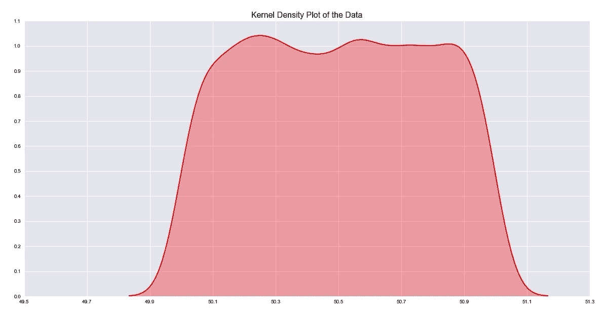

KDE 图的资料(来源:作者)

我们可以看到峰平尾重的“数据”不是正常的*。我们现在将看到它的 Q-Q 图，这也将证实我们的信念，即“数据”不是正态的，在尾部，样本分位数偏离理论分位数。*

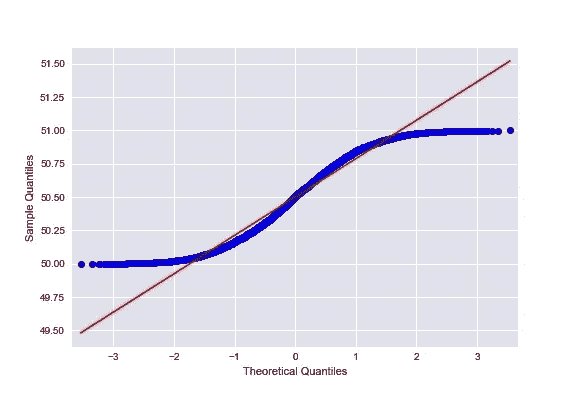

数据的 Q-Q 图(来源:作者)

**夏皮罗-维尔克检验|达戈斯蒂诺的 K2 检验|安德森-达林检验** 所有这三个都是*非参数*检验，测量我们样本分布的 *CDF* 与要检查的分布的 *CDF* 有多远。如果我们使用相同的“数据”变量，我们将看到这 3 个测试也将确认“数据”变量不是正常分布的。

输出将是-

```
==> Shapiro-Wilk Test <==
Statistic=0.955, p=0.000
Sample does not look Gaussian (reject H0)

 ==> D'Agostino's K2 Test <==
Statistic=4209.988, p=0.000
Sample does not look Gaussian (reject H0)

 ==> Anderson-Darling Test <==
Statistic, Critical Values: 55.542 [0.576 0.655 0.786 0.917 1.091]
15.000: 0.576, data does not look normal (reject H0)
10.000: 0.655, data does not look normal (reject H0)
5.000: 0.786, data does not look normal (reject H0)
2.500: 0.917, data does not look normal (reject H0)
1.000: 1.091, data does not look normal (reject H0)
```

# **结论**

筛选出常见的统计概念并用非常通用的术语解释它们确实是一项艰巨的任务，但我想试一试。如果你已经看完了整篇文章，那么我肯定能为你对概念的理解增加一些价值。如果您有任何建议和意见，请联系我的 [*LinkedIn*](https://www.linkedin.com/in/subhamoybhaduri/) 账号。我会带着另一个故事再来。敬请期待！

这篇文章的所有代码都可以在我的 [*GitHub*](https://github.com/SuBhaduri/Understanding-Probability-Statistics) 资源库中获得，也可以作为 [*Jupyter 笔记本*](https://nbviewer.jupyter.org/github/SuBhaduri/Understanding-Probability-Statistics/blob/master/Prob%20and%20Stat.ipynb) 获得。

[](https://www.linkedin.com/in/subhamoybhaduri/) [## Subhamoy Bhaduri -助理-项目-认知| LinkedIn

### 8.5 年卡和支付领域的工作经验，擅长商户收单业务。#专业知识…

www.linkedin.com](https://www.linkedin.com/in/subhamoybhaduri/)