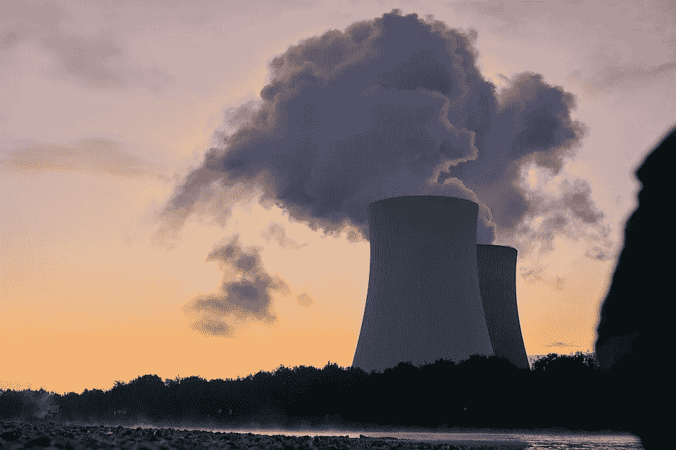
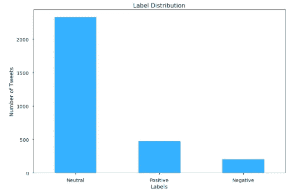
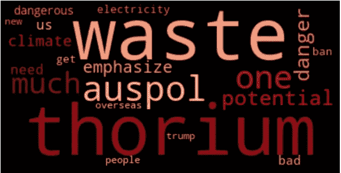
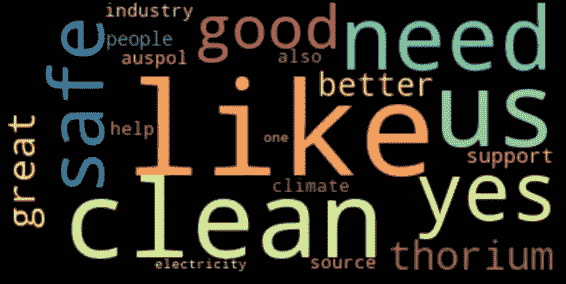
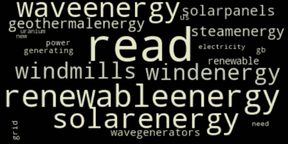
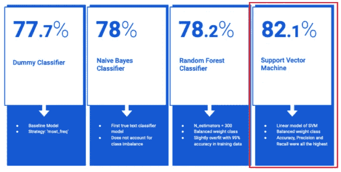
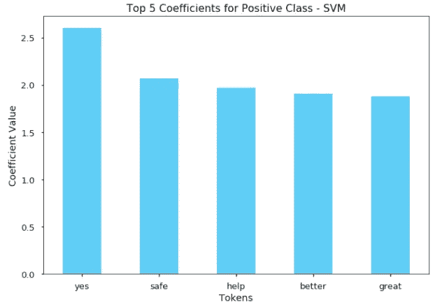
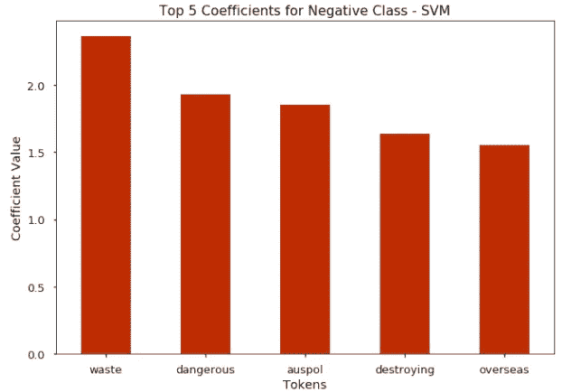
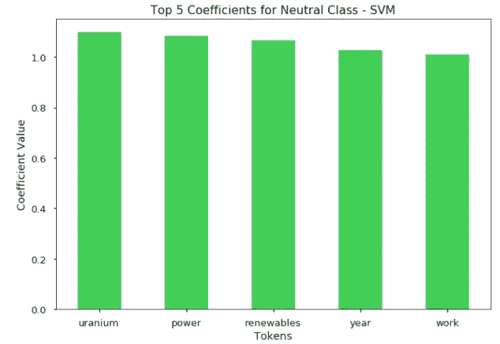

# 用 Twitter 了解公众对核能的情绪

> 原文：<https://towardsdatascience.com/understanding-public-sentiment-on-nuclear-energy-with-twitter-b1dbe65803fc?source=collection_archive---------72----------------------->

## 一个文本分类项目与[裘德布埃纳塞达](https://medium.com/u/8e08f4f70e18?source=post_page-----b1dbe65803fc--------------------------------)



来源:Pixabay

随着气候变化的影响变得越来越普遍，替代能源的必要性变得更加迫切。因此，围绕核能的讨论是不可能避免的，因为它是一个关键的竞争者，其效率是不可否认的。然而，核能已经成为一个分裂和两极分化的话题，因为如果没有适当的预防措施，其副产品可能对人类健康和环境产生毁灭性影响。

对于这个项目，我们想了解人们对核能的情绪是否容易被识别，以及它看起来像什么。在 Twitter 及其用户意见的帮助下，我们能够尝试这种分类。我们这个项目的目标是首先通过对推特上的情绪进行分类来了解公众对核能的看法，然后根据与每个情绪相关的关键词或主题提取价值。这对于公司和政策制定者来说都是非常有用的，可以围绕他们的受众所谈论的内容来优化和定制信息和策略。

# 数据

我们使用 Twint 从 Twitter 上随机抓取了 3000 条使用搜索词`Nuclear Energy`的推文。所有推文都来自 2020 年。下面是我们数据集中的一个 tweet 文本示例:

```
| Date: 2020-06-12 | Time 15:06:43 | Tweet: "It's dangerous to lift the prohibition on nuclear.  Radioactive waste containment isn't clean energy, it's an accident waiting to happen. Nuclear energy lobbyist should never be trusted, they'll lie to make a profit, even if it means cancer and birth defects for the people."
```

每条推文的情绪都在维德的协助下贴上了标签。这个项目中使用的三种标签分别是:**阳性、阴性**和**中性**。我们标记的推文的分布严重不平衡——大多数推文带有中性情绪，然后是积极情绪，然后是消极情绪。



标签分布，用 Seaborn 绘制

我们最初的 EDA 侧重于分析每个情感类的词频。在下面的单词云中，可以开始观察到不同类别之间在词汇上的明显差异。



负面推文中的前 20 个词



正面推文中的前 20 个词



中性推文中的前 20 个词

中性班的学生似乎肯定会选择更多的研究和信息主题。

# 数据处理和特征工程

由于我们只处理每条推文的文本数据，建模之前采取的清理和工程步骤是:

*   使用 NLTK 删除了英语停用词。
*   标点符号、链接和非字母字符也用正则表达式从推文中删除。
*   我们定制了我们的停用词列表，包括我们的搜索词和要从每条推文中删除的主题——“核能”、“核能”、“核能”和“能源”。
*   每条 tweet 都使用 NLTK 的 TF-IDF 实现进行了标记化、矢量化和小写转换。
*   在我们的 EDA 中使用了词频，但是我们的模型依赖于每个词的 TF-IDF 分数。

# 建模

为了对一条推文的情绪进行分类，我们训练并测试了以下模型——基线虚拟分类器(预测多数类)、朴素贝叶斯分类器、随机森林分类器和线性 SVM 分类器。由于我们的班级最初是不平衡的，我们必须在模型中考虑到这一点。下面是我们测试预测的准确性得分的快照:



使用 sklearn 建模结果

我们的线性 SVM 模型表现最好，其次是随机森林。线性 SVM 与自然语言处理和文本分类配合得非常好，因为我们最终得到了比观察值更多的特征。

使用我们的线性 SVM，我们能够获得有用的洞察力，了解模型正在使用什么特征或词来进行情感分类。在这三个图表中，我们可视化了每个情感的前 5 个特征/词系数。在很大程度上，这些话看起来很合理，并为每种情绪的分类提供了透明度。



# **总结想法&要点**

Twitter 等社交媒体的使用已经成为获取任何和所有话题的公众意见的重要工具。这对公司和政策制定者来说都是至关重要的信息。我们能够使用 Twitter 来捕捉公众对核能的看法，并强调围绕每种情绪的关键问题和主题——积极的、消极的和中立的。这对于公司和政策制定者来说，在营销和信息传递方面意义重大。举个例子——*废料*经常与负面讨论联系在一起，所以我们可以得出结论，一个很大的担忧是围绕核废料及其后果，而不是能源本身。因此，可以在考虑到这一点的情况下精心制作信息，以消除顾虑和担忧。

# 后续步骤

为了扩展我们模型的预测能力，添加其他非文本特征以及探索神经网络模型可能是值得的。


来源:Pixabay

如果你对这个项目背后的代码感兴趣——看看我的 Github:【https://github.com/AlisonSalerno/twitter_sentiment_analysis 