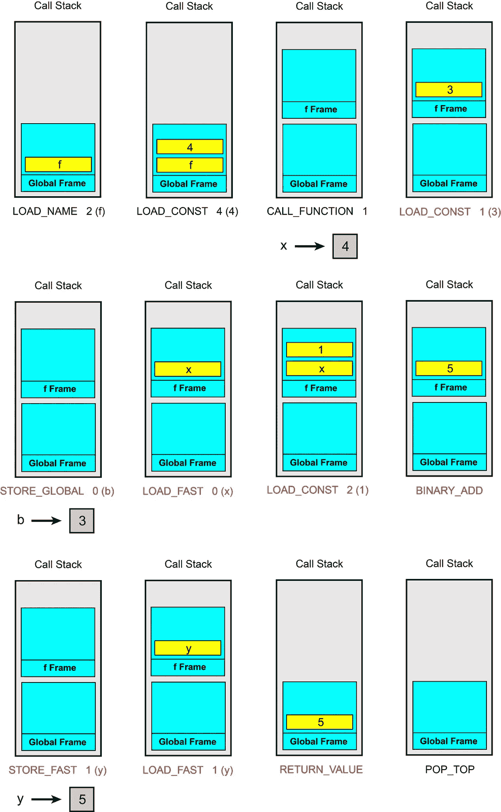

# 理解 Python 字节码

> 原文：<https://towardsdatascience.com/understanding-python-bytecode-e7edaae8734d?source=collection_archive---------2----------------------->

## 了解如何反汇编 Python 字节码


编程语言的源代码可以使用解释器或编译器来执行。在编译语言中，编译器会将源代码直接翻译成二进制机器代码。该机器代码特定于目标机器，因为每台机器可以具有不同操作系统和硬件。编译后，目标机器会直接运行机器码。

在解释语言中，源代码不是由目标机器直接运行的。还有一个程序叫做解释器，它直接读取并执行源代码。特定于目标机器的解释器将源代码的每个语句翻译成机器代码并运行它。

Python 通常被称为解释语言，然而，它结合了编译和解释。当我们执行一个源代码(扩展名为`.py`的文件)时，Python 首先将其编译成字节码。字节码是独立于平台的低级源代码表示，但是，它不是二进制机器码，不能由目标机器直接运行。事实上，它是一个虚拟机的指令集，这个虚拟机被称为 Python 虚拟机(PVM)。

编译后，字节码被发送到 PVM 执行。PVM 是运行字节码的解释器，是 Python 系统的一部分。字节码是独立于平台的，但是 PVM 是特定于目标机器的。Python 编程语言的默认实现是用 C 编程语言编写的 CPython。CPython 将 Python 源代码编译成字节码，然后这个字节码由 CPython 虚拟机执行。

**生成字节码文件**

在 Python 中，字节码存储在一个`.pyc`文件中。在 Python 3 中，字节码文件存储在一个名为`__pycache__`的文件夹中。当您尝试导入您创建的另一个文件时，会自动创建此文件夹:

```
import file_name
```

但是，如果我们不在源代码中导入另一个文件，它就不会被创建。在这种情况下，我们仍然可以手动创建它。要从命令行编译单个文件`file_1.py`到`file_n.py` ，我们可以写:

```
python -m compileall file_1.py ... file_n.py
```

所有生成的`pyc`文件都将存储在`__pycache__` 文件夹中。如果在`compileall,`之后没有提供文件名，它将编译当前文件夹中的所有 python 源代码文件。

我们还可以使用`compile()`函数来编译包含 Python 源代码的字符串。该函数的语法是:

`compile(*source*, *filename*, *mode*, *flag*, *dont_inherit*, *optimize*)`

我们只关注前三个必需的参数(其他的是可选的)。`source`是要编译的源代码，可以是字符串、字节对象或 AST 对象。`filename`是源代码所来自的文件的名称。如果源代码不是来自一个文件，你可以写你喜欢的任何东西或者留下一个空字符串。`mode`可以是:

`'exec'`:接受任何形式的 Python 源代码(任意数量的语句或块)。它将它们编译成字节码，最终返回`None`

`'eval'`:接受单个表达式，并将其编译成字节码，最终返回该表达式的值

`'single'`:只接受一条语句(或用`;`分隔的多条语句)。如果最后一条语句是一个表达式，那么产生的字节码会将该表达式的值的`repr()` 打印到标准输出中。

例如，为了编译一些 Python 语句，我们可以编写:

```
s='''
a=5
a+=1
print(a)
'''
compile(s, "", "exec")
```

或者换句话说:

```
compile("a=5 \na+=1 \nprint(a)", "", "exec")
```

要评估一个表达式，我们可以写:

```
compile("a+7", "", "eval")
```

如果您没有表达式，此模式会给出一个错误:

```
# This does not work:
compile("a=a+1", "", "eval")
```

这里`a=a+1`不是一个表达式，不返回任何东西，所以我们不能使用`eval`模式。但是，我们可以使用`single`模式来编译它:

```
compile("a=a+1", "", "single")
```

但是`compile`返回的是什么？当您运行`compile`函数时，Python 返回:

```
<code object <module> at 0x000001A1DED95540, file "", line 1>
```

所以`compile`函数返回的是一个*代码对象*(在`at`之后的地址在你的机器上可以不同)。

**代码对象**

`compile()`函数返回一个 Python 代码对象。Python 中的一切都是对象。例如，我们定义了一个整数变量，它的值存储在一个`int`对象中，您可以使用`type()`函数轻松检查它的类型:

```
a = 5
type(a)  # Output is: int
```

以类似的方式，编译函数生成的字节码存储在`code`对象中。

```
c = compile("a=a+1", "", "single")
type(c)  # Output is: code
```

code 对象不仅包含字节码，还包含 CPython 运行字节码所需的一些其他信息(稍后将讨论)。代码对象可以通过传递给`exec()`或`eval()`函数来执行或评估。所以我们可以写:

```
exec(compile("print(5)", "", "single"))  # Output is: 5
```

当你在 Python 中定义一个函数时，它会为它创建一个代码对象，你可以使用`__code__`属性来访问它。例如，我们可以写:

```
def f(n):
    return n
f.__code__ 
```

输出将是:

```
<code object f at 0x000001A1E093E660, file "<ipython-input-61-88c7683062d9>", line 1>
```

像任何其他对象一样，code 对象也有一些属性，要获得存储在 code 对象中的字节码，可以使用它的`co_code`属性:

```
c = compile("print(5)", "", "single")
c.co_code
```

输出是:

```
b'e\x00d\x00\x83\x01F\x00d\x01S\x00'
```

结果是一个前缀为`b'.`的*字节文字*，它是一个不可变的字节序列，类型为`bytes`。每个字节可以有一个 0 到 255 的十进制值。所以一个字节文字是一个不可变的 0 到 255 之间的整数序列。每个字节可由字符代码与字节值相同的 ASCII 字符显示，也可由前导`\x`后跟两个字符显示。前导`\x`转义意味着接下来的两个字符被解释为字符代码的十六进制数字。例如:

```
print(c.co_code[0])
chr(c.co_code[0])
```

给出:

```
101
'e'
```

因为第一个元素具有十进制值 101，并且可以用字符`e`来显示，该字符的 ASCII 字符代码是 101。或者:

```
print(c.co_code[4])
chr(c.co_code[4])
```

给出:

```
131
'\x83'
```

因为第 4 个元素的十进制值为 131。131 的十六进制值是 83。所以这个字节可以用一个字符码为`\x83`的字符来表示。


这些字节序列可以被 CPython 解释，但是它们对人类不友好。所以我们需要理解这些字节是如何映射到 CPython 将要执行的实际指令的。在下一节中，我们将把字节码分解成一些对人友好的指令，看看 CPython 如何执行字节码。

**字节码细节**

*在深入细节之前，重要的是要注意字节码的实现细节通常会随着 Python 版本的不同而变化。因此，您在本文中看到的内容可能并不适用于 Python 的所有版本。事实上，它包括了 3.6 版本中发生的变化，一些细节可能对旧版本无效。本文中的代码已经用 Python 3.7 进行了测试。*

字节码可以被认为是 Python 解释器的一系列指令或低级程序。在 3.6 版本之后，Python 对每条指令使用 2 个字节。一个字节用于该指令的代码，称为*操作码*，一个字节保留用于其参数，称为 *oparg。每个操作码都有一个友好的名字，叫做 *opname* 。字节码指令的一般格式如下:*

```
opcode oparg 
opcode oparg 
  .       
  .
  .
```

我们的字节码中已经有了操作码，我们只需要将它们映射到它们对应的 opname。有一个名为`dis`的模块可以帮助解决这个问题。在这个模块中，有一个名为`opname`的列表，它存储了所有的 opnames。此列表的第 *i* 个元素给出了操作码等于 *i* 的指令的 opname。

有些指令不需要参数，所以它们会忽略操作码后面的字节。值低于某个数字的操作码会忽略它们的参数。该值存储在`dis.HAVE_ARGUMENT`中，目前等于 90。于是操作码> = `dis.HAVE_ARGUMENT`有了争论，操作码< `dis.HAVE_ARGUMENT`忽略。

例如，假设我们有一个短字节码`b'd\x00Z\x00d\x01S\x00'` ，我们想反汇编它。这个字节码代表一个四字节的序列。我们可以很容易地显示它们的十进制值:

```
bytecode = b'd\x00Z\x00d\x01S\x00'
for byte in bytecode:
    print(byte, end=' ')
```

输出将是:

```
100 0 90 0 100 1 83 0
```

字节码的前两个字节是`100 0`。第一个字节是操作码。要得到它的 opname 我们可以写(`dis`应该先导入):

```
dis.opname[100]
```

而结果是`LOAD_CONST`。由于操作码大于`dis.HAVE_ARGUMENT`，它有一个 oparg，即第二个字节`0`。所以`100 0`翻译过来就是:

```
LOAD_CONST 0
```

字节码中的最后两个字节是`83 0`。我们再次写`dis.opname[83]`，结果是`RETURN_VALUE`。83 小于 90 ( `dis.HAVE_ARGUMENT`)，所以该操作码忽略 oparg，并且`83 0`被分解为:

```
RETURN_VALUE
```

此外，某些指令的参数可能太大，无法放入默认的一个字节中。有一个特殊的操作码`144`来处理这些指令。它的 opname 是`EXTENDED_ARG`，也存放在`dis.EXTENDED_ARG`。这个操作码是任何参数大于一个字节的操作码的前缀。例如，假设我们有操作码 131(它的 opname 是`CALL_FUNCTION`)，它的 oparg 需要是 260。所以应该是:

```
CALL_FUNCTION 260
```

但是，一个字节可以存储的最大数量是 255，260 不适合一个字节。所以这个操作码的前缀是`EXTENDED_ARG`:

```
EXTENDED_ARG 1
CALL_FUNCTION 4
```

当解释器执行`EXTENDED_ARG`时，它的 oparg(为 1)左移 8 位，并存储在一个临时变量中。姑且称之为`extended_arg`(不要和 opname `EXTENDED_ARG`混淆):

```
extened_arg = 1 << 8  # same as 1 * 256
```

于是二进制值`0b1`(二进制值 1)被转换为`0b100000000`。这就像在十进制系统中 1 乘以 256，`extened_arg`将等于 256。现在我们在`extened_arg`中有两个字节。当解释器执行到下一条指令时，使用按位`or`将这个双字节值添加到它的 oparg(这里是 4)中。

```
extened_arg = extened_arg | 4
# Same as extened_arg += 4
```

这就像把 oparg 的值加到`extened_arg`上。所以现在我们有:

```
extened_arg = 256 + 4 = 260
```

该值将作为`CALL_FUNCTION`的实际 oparg。所以，事实上，

```
EXTENDED_ARG 1
CALL_FUNCTION 4
```

被解释为:

```
EXTENDED_ARG 1
CALL_FUNCTION 260 
```

对于每个操作码，最多允许三个前缀`EXTENDED_ARG`，形成一个从两字节到四字节的参数。

现在，我们可以专注于 oparg 本身。这是什么意思？实际上，每个 oparg 的含义取决于它的操作码。如前所述，代码对象存储除字节码之外的一些信息。可以使用代码对象的不同属性来访问这些信息，我们需要其中的一些属性来解释每个 oparg 的含义。这些属性是:`co_consts`、`co_names`、`co_varnames`、`co_cellvars`和`co_freevars`。

**代码对象属性**

我将用一个例子来解释这些属性的含义。假设您有这个源代码的代码对象:

```
# Listing 1
s = '''
a = 5
b = 'text'
def f(x):
    return x
f(5)
'''
c=compile(s, "", "exec")
```

现在，我们可以检查每个属性中存储了什么:

1- `co_consts`:包含字节码使用的文字的元组。这里`c.co_consts`返回:

```
(5, 'text', <code object f at 0x00000218C297EF60, file "", line 4>, 'f', None)
```

所以字面量`5`和`'text'`以及函数名`'f'`都存储在这个元组中。此外，函数`f`的主体存储在一个单独的代码对象中，并被视为一个同样存储在该元组中的文字。记住`compile()`中的`exec`模式生成一个最终返回`None`的字节码。这个`None`值也被存储为一个文字。事实上，如果你像这样在`eval`模式下编译一个表达式:

```
s = "3 * a"
c1 = compile(s, "", "eval")
c1.co_consts   # Output is (3,)
```

`None`将不再包含在`co_consts`元组中。原因是这个表达式返回它的最终值而不是`None`。

如果你试图获取一个函数的目标代码的`co_const`,比如:

```
def f(x):
    a = x * 2
    return a
f.__code__.co_consts
```

结果会是`(None, 2)`。事实上，函数的默认返回值是`None`，并且总是作为文字添加。正如我后面解释的，为了提高效率，Python 不会检查你是否总是要到达一个`return`语句，所以`None`总是被添加为默认返回值。

2- `co_names`:包含字节码使用的名称的元组，可以是全局变量、函数和类，也可以是从对象加载的属性。例如，对于清单 1 中的目标代码，`c.co_names`给出了:

```
('a', 'b', 'f')
```

3- `co_varnames`:包含字节码使用的本地名称的元组(首先是参数，然后是本地变量)。如果我们对清单 1 的对象代码进行尝试，它会给出一个空元组。原因是局部名称是在函数内部定义的，清单 1 中的函数是作为一个单独的代码对象存储的，所以它的局部变量不会包含在这个元组中。为了访问一个函数的局部变量，我们应该为那个函数的代码对象使用这个属性。所以我们先写这段源代码:

```
def f(x):
    z = 3
    t = 5
    def g(y):
        return t*x + y
    return g
a = 5
b = 1
h = f(a)
```

现在`f.__code__`给出`f`的代码对象，`f.__code__.co_varnames`给出:

```
('x', 'z', 'g')
```

为什么不包括`t`？原因是`t`不是`f`的局部变量。它是一个非局部变量，因为它是由`f`中的闭包`g`访问的。实际上，`x`也是一个非局部变量，但既然是函数的自变量，那么它总是包含在这个元组中。要了解更多关于闭包和非局部变量的知识，你可以参考这篇文章。

4- `co_cellvars`:包含非局部变量名称的元组。这些是由内部函数访问的函数的局部变量。所以`f.__code__.co_cellvars`给出:

```
('t', 'x')
```

5- `co_freevars` : 包含自由变量名称的元组。自由变量是外部函数的局部变量，由内部函数访问。所以这个属性应该和闭包`h`的代码对象一起使用。现在`h.__code__.co_freevars`给出了相同的结果:

```
('t', 'x')
```

现在我们已经熟悉了这些属性，我们可以回到 opargs。每个 oparg 的含义取决于它的操作码。我们有不同类别的操作码，每个类别的 oparg 都有不同的含义。在`dis`模块中，有一些列表给出了每个类别的操作码:

1- `dis.hasconst`:此列表等于【100】。所以只有操作码 100(它的 opname 是 LOAD_CONST)属于`hasconst`的范畴。这个操作码的 oparg 给出了`co_consts`元组中一个元素的索引。例如，在清单 1 的字节码中，如果我们有:

```
LOAD_CONST  1
```

那么 oparg 就是索引为 1 的`co_consts`的元素。所以我们要把`1`换成`co_consts[1]`等于`'text'`。因此该指令将被解释为:

```
LOAD_CONST  'text'
```

类似地，在`dis`模块中有一些其他的列表定义操作码的其他类别:

2- `dis.hasname`:这个列表中操作码的 oparg 是`co_names`中一个元素的索引

3- `dis.haslocal`:该列表中操作码的 oparg 是`co_varnames`中一个元素的索引

4- `dis.hasfree`:该列表中操作码的 oparg 是`co_cellvars + co_freevars`中一个元素的索引

5- `dis.hascompare`:这个列表中操作码的 oparg 是元组`dis.cmp_op`的一个元素的索引。这个元组包含比较和成员操作符，如`<`或`==`

6- `dis.hasjrel`:这个列表中操作码的 oparg 应该替换为`offset + 2 + oparg`，其中`offset`是字节码序列中代表操作码的字节的索引。

code 对象还有一个更重要的属性应该在这里讨论。它被称为`co_lnotab`，存储字节码的行号信息。这是一个存储在字节文字中的有符号字节数组，用于将字节码偏移量映射到源代码行号。我举个例子解释一下。假设您的源代码只有三行，并且已经被编译成 24 字节的字节码:

```
1        0 LOAD_CONST             0 
         2 STORE_NAME             0 

2        4 LOAD_NAME              0 
         6 LOAD_CONST             1 
         8 INPLACE_ADD             
        10 STORE_NAME             0 

3       12 LOAD_NAME              1 
        14 LOAD_NAME              0 
        16 CALL_FUNCTION          1 
        18 POP_TOP                 
        20 LOAD_CONST             2 
        22 RETURN_VALUE
```

现在我们有了从字节码偏移量到行号的映射，如下表所示:


字节码偏移量总是从 0 开始。code 对象有一个名为`co_firstlineno`的属性，它给出了偏移量 0 的行号。对于这个例子来说`co_firstlineno`等于 1。Python 只存储从一行到下一行的增量(不包括第一行)，而不是存储偏移量和行号。所以前面的表格变成了:


这两个增量列按如下顺序压缩在一起:

```
4 1 8 1 
```

每个数字存储在一个字节中，整个序列作为一个字节文字存储在代码对象的`co_lnotab`中。因此，如果您检查`co_lnotab`的值，您会得到:

```
b'\x04\x01\x08\x01'
```

它是前一个序列的字节数。因此，通过拥有属性`co_lnotab`和`co_firstlineno`，您可以检索从字节码偏移到源代码行号的映射。`co_lnotab`是一个有符号的字节序列。所以其中的每个有符号字节可以取-128 到 127 之间的值(这些值仍然存储在取 0 到 255 的字节中。但是介于 128 和 255 之间的值被认为是负数)。负增量意味着行号在减少(这个特性用在优化器中)。但是如果行增量大于 127 会怎么样呢？在这种情况下，行增量将被分成 127 和一些额外的字节，这些额外的字节将以零偏移增量存储(如果它小于-128，它将被分成-128 和一些额外的字节，偏移增量为零)。例如，假设字节码偏移量与行号的关系如下:


那么偏移增量与行号增量之比应为:


139 等于 127 + 12。所以前一行应该写成:


并且应该存储为`8 127 0 12`。所以`co_lnotab`的值会是:`b'\x08\x7f\x00\x0c'`。

**反汇编字节码**

现在我们已经熟悉了字节码结构，我们可以编写一个简单的反汇编程序。我们首先编写一个生成器函数来解包每个指令，并生成偏移量、操作码和 oparg:

这个函数从字节码中读取下一对字节。第一个字节是操作码。通过将该操作码与`dis.HAVE_ARGUMENT`进行比较，该函数决定是将第二个字节作为 oparg 还是忽略它。使用按位 or ( `|`)将`extended_arg`的值添加到 oparg。最初，它为零，对 oparg 没有影响。如果操作码等于`dis.EXTENDED_ARG`，它的 oparg 将左移 8 位，并存储在一个名为`extended_arg`的临时变量中。

在下一次迭代中，这个临时变量将被添加到下一个 oparg 中，并向其中添加一个字节。如果下一个操作码再次是`dis.EXTENDED_ARG`，则该过程继续，并且每次将一个字节加到`extended_arg`。最后，当它到达一个不同的操作码时，`extended_arg`将被加到它的 oparg 并被设置回零。

`find_linestarts`函数返回一个字典，其中包含每个字节码偏移量的源代码行号。

它首先将`co_lnotab`字节文字分成两个序列。一个是偏移增量，另一个是行号增量。偏移`0`的行号在`co_firstlineno`中。将这两个数字相加得到字节码偏移量及其对应的行号。如果行号增量等于或大于 128 (0x80)，它将被视为减量。

`get_argvalue`函数返回每个 oparg 的友好含义。它首先检查操作码属于哪个类别，然后判断 oparg 指的是什么。

`findlabels`函数找到字节码中所有作为跳转目标的偏移量，并返回这些偏移量的列表。跳转目标将在下一节讨论。

现在我们可以使用所有这些函数来反汇编字节码。`dissassemble`函数获取一个代码对象并将其反汇编:

它将首先解包代码对象的字节码中每对字节的偏移量、操作码和 oparg。然后，它找到相应的源代码行号，并检查偏移量是否是跳转目标。最后，它查找 opname 和 oparg 的含义，并打印所有信息。如前所述，每个函数定义都存储在一个单独的代码对象中。所以在最后，函数递归地调用自己来反汇编字节码中的所有函数定义。下面是一个使用这个函数的例子。最初，我们有这样的源代码:

```
a=0
while a<10:
    print(a)
    a += 1
```

我们首先将它存储在一个字符串中，并编译它以获得目标代码。然后我们使用`disassemble`函数反汇编它的字节码:

```
s='''a=0
while a<10:
    print(a)
    a += 1
'''
c=compile(s, "", "exec")
disassemble(c)
```

输出是:

```
1         0 LOAD_CONST               0 (0)
          2 STORE_NAME               0 (a)

2         4 SETUP_LOOP              28 (to 34)
    >>    6 LOAD_NAME                0 (a)
          8 LOAD_CONST               1 (10)
         10 COMPARE_OP               0 (<)
         12 POP_JUMP_IF_FALSE       32 

3        14 LOAD_NAME                1 (print)
         16 LOAD_NAME                0 (a)
         18 CALL_FUNCTION            1 
         20 POP_TOP                    

4        22 LOAD_NAME                0 (a)
         24 LOAD_CONST               2 (1)
         26 INPLACE_ADD                
         28 STORE_NAME               0 (a)
         30 JUMP_ABSOLUTE            6 
    >>   32 POP_BLOCK                  
    >>   34 LOAD_CONST               3 (None)
         36 RETURN_VALUE
```

所以 4 行源代码被转换成 38 字节的字节码或 19 行字节码。在下一节中，我将解释这些指令的含义以及 CPython 将如何解释它们。

模块`dis`有一个名为`dis()`的函数，同样可以反汇编代码对象。实际上，本文中的`disassmble`函数是`dis.dis`函数的简化版。因此，我们可以写`dis.dis(c)`来得到类似的输出，而不是写`disassemble(c)`。

**反汇编一个 pyc 文件**

如前所述，编译源代码时，字节码存储在一个`pyc`文件中。这个字节码可以用类似的方式反汇编。但是，需要提到的是，`pyc`文件包含一些元数据和 [*编组*](https://docs.python.org/2/library/marshal.html) 格式的代码对象。封送格式用于 Python 的内部对象序列化。元数据的大小取决于 Python 版本，对于版本 3.7，它是 16 个字节。所以当你读取`pyc`文件时，首先你应该读取元数据，然后使用`marshal`模块加载代码对象。例如，要反汇编`__pycache__`文件夹中名为`u1.cpython-37.pyc`的`pyc`文件，我们可以写:

# 字节码操作

到目前为止，我们已经学习了如何反汇编字节码指令。我们现在可以关注这些指令的含义以及它们是如何被 CPython 执行的。Python 的默认实现 CPython 使用基于*栈的*虚拟机。所以首先我们应该熟悉堆栈。

**堆栈和堆**

栈是一种具有后进先出顺序的数据结构。它有两个主要操作:

*   push:将元素添加到堆栈中
*   pop:删除最近添加的元素

因此，添加或推入堆栈的最后一个元素是要移除或弹出的第一个元素。使用堆栈存储数据的好处是内存是为你管理的。读取和写入堆栈非常快，但是，堆栈的大小是有限的。

Python 中的数据表示为存储在私有堆上的对象。与堆栈相比，访问堆上的数据要慢一些，但是，堆的大小只受虚拟内存大小的限制。heap 的元素彼此之间没有依赖关系，可以随时随机访问。Python 中的一切都是对象，对象总是存储在堆中。它只是存储在堆栈中的对象的引用(或指针)。

CPython 使用*调用栈*来运行 Python 程序。在 Python 中调用一个函数时，一个新的*框架* 被推送到调用栈上，每次函数调用返回时，其框架被弹出。程序运行的模块有一个最底层的框架，称为全局框架或模块框架。

每一帧都有一个*评估栈*，在那里执行 Python 函数。函数参数及其局部变量被压入这个计算堆栈。CPython 使用评估堆栈来存储任何操作所需的参数以及这些操作的结果。在开始该操作之前，所有必需的参数都被推送到评估堆栈上。然后操作开始并弹出它的参数。当操作完成时，它将结果推回计算堆栈。

所有对象都存储在堆中，框架中的评估堆栈处理对它们的引用。因此，对这些对象的引用可以被临时推到计算堆栈上，以供后面的操作使用。Python 的大部分字节码指令都是在当前框架中操作求值栈。在本文中，每当我们谈到堆栈时，它指的是当前框架中的评估堆栈或全局框架中的评估堆栈，如果我们不在任何函数的范围内。

让我从一个简单的例子开始，反汇编以下源代码的字节码:

```
a=1
b=2
c=a+b
```

为此，我们可以写:

```
s='''a=1
b=2
c=a+b
'''
c=compile(s, "", "exec")
disassemble(c)
```

我们得到了:

```
1         0 LOAD_CONST               0 (1)
          2 STORE_NAME               0 (a)

2         4 LOAD_CONST               1 (2)
          6 STORE_NAME               1 (b)

3         8 LOAD_NAME                0 (a)
         10 LOAD_NAME                1 (b)
         12 BINARY_ADD                 
         14 STORE_NAME               2 (c)
         16 LOAD_CONST               2 (None)
         18 RETURN_VALUE
```

此外，我们可以检查代码对象的其他一些属性:

```
c.co_consts
# output is:  (1, 2, None)
c.co_names
# output is:  ('a', 'b', 'c')
```

这里代码在模块中运行，所以我们在全局框架中。第一个指令是`LOAD_CONST 0`。指令

```
**LOAD_CONST** *consti*
```

将`co_consts[consti]`的值推送到堆栈上。所以我们将`co_consts[0]` (等于`1`)压入堆栈。

值得注意的是，stack 使用对对象的引用。因此，每当我们说一个指令将一个对象或对象的值压入堆栈时，就意味着压入了对该对象的引用(或指针)。当一个对象或它的值被弹出堆栈时，也会发生同样的事情。再次弹出它的引用。解释器知道如何使用这些引用来检索或存储对象的数据。

指令

```
**STORE_NAME** *namei*
```

弹出堆栈的顶部，并将其存储到一个对象中，该对象的引用存储在代码对象的`co_names[namei]`中。所以`STORE_NAME 0`在栈顶弹出元素(也就是`1`)并存储在一个对象中。对这个对象的引用是`co_names[0]`也就是`a`。这两条指令是源代码中`a=1`的字节码等价物。`b=2`被类似地转换，现在解释器已经创建了对象`a`和`b`。源代码的最后一行是`c=a+b`。指令

```
**BINARY_ADD**
```

弹出堆栈顶部的两个元素(`1`和`2`)，将它们相加，并将结果(`3`)推送到堆栈上。所以现在`3`在栈顶。之后`STORE_NAME 2`将栈顶弹出到本地对象(引用的)`c`。现在记住`exec` 模式下的`compile`将源代码编译成最终返回`None`的字节码。指令`LOAD_CONST 2`将`co_consts[2]=None`推到堆栈上，指令

```
**RETURN_VALUE**
```

将堆栈的顶部返回给函数的调用方。当然，这里我们是在模块范围内，没有调用函数，所以`None`是最终结果，它保留在全局堆栈的顶部。图 1 显示了偏移量为 0 到 14 的所有字节码操作(同样应该注意的是，对象的引用被推送到堆栈上，而不是对象或它们的值。该图没有明确示出)。


**函数、全局和局部变量**

现在让我们看看如果我们也有一个函数会发生什么。我们将分解源代码的字节码，它有一个功能:

```
#Listing 2
s='''a = 1
b = 2
def f(x):
    global b
    b = 3
    y = x + 1
    return y 
f(4)
print(a)
'''
c=compile(s, "", "exec")
disassemble(c)
```

输出是:

```
1         0 LOAD_CONST               0 (1)
          2 STORE_NAME               0 (a)

2         4 LOAD_CONST               1 (2)
          6 STORE_GLOBAL             1 (b)

3         8 LOAD_CONST               2 (<code object f at 0x00000218C2E758A0, file "", line 3>)
         10 LOAD_CONST               3 ('f')
         12 MAKE_FUNCTION            0 
         14 STORE_NAME               2 (f)

8        16 LOAD_NAME                2 (f)
         18 LOAD_CONST               4 (4)
         20 CALL_FUNCTION            1 
         22 POP_TOP                    

9        24 LOAD_NAME                3 (print)
         26 LOAD_NAME                0 (a)
         28 CALL_FUNCTION            1 
         30 POP_TOP                    
         32 LOAD_CONST               5 (None)
         34 RETURN_VALUE               

Disassembly of<code object f at 0x00000218C2E758A0, file "", line 3>:

5         0 LOAD_CONST               1 (3)
          2 STORE_GLOBAL             0 (b)

6         4 LOAD_FAST                0 (x)
          6 LOAD_CONST               2 (1)
          8 BINARY_ADD                 
         10 STORE_FAST               1 (y)

7        12 LOAD_FAST                1 (y)
         14 RETURN_VALUE
```

此外，我们可以检查代码对象的其他一些属性:

```
c.co_consts
# output is:  (1, 2, <code object f at 0x00000218C2E758A0, file "", line 3>, 'f', 4, None)c.co_names
# Output is: ('a', 'b', 'f', 'print')
```

在第一行(偏移量 0 和 2 ),首先使用`LOAD_CONST 0`将常量`1`推入全局帧的评估堆栈。然后`STORE_NAME 0`弹出并存储在一个对象中。

在第二行中，使用`LOAD_CONST 1`将常量`2`推入堆栈。但是，使用不同的 opname 将其分配给引用。指令

```
**STORE_GLOBAL** *namei*
```

弹出栈顶并将其存储到一个对象中，该对象的引用存储在`co_names[namei]`中。所以`2`存储在`b`引用的对象中。这被认为是一个全局变量。但是为什么这个指令没有用于`a`？原因是`a`是函数`f`内部的全局变量。如果变量是在模块范围内定义的，并且没有函数访问它，那么它将通过`STORE_NAME`和`LOAD_NAME`被存储和加载。在模块范围内，全局变量和局部变量没有区别。

第三行定义了函数`f`。函数体在一个名为`<code object f at 0x00000218C2E758A0, file "", line 3>`的单独代码对象中编译，并被推送到堆栈上。然后，一个函数名为`'f'`的字符串对象被推送到堆栈上(事实上，对它们的引用被推送到堆栈上)。指令

```
**MAKE_FUNCTION** *argc*
```

用于创建函数。它需要一些应该被推到堆栈上的参数。函数名应该在栈顶，函数的代码对象应该在栈底。在这个例子中，它的 oparg 是零，但是它可以有其他值。例如，如果函数定义有一个关键字参数，如:

```
def f(x=5):
    global b
    b = 3
    y = x + 1
    return y
```

那么第 2 行的反汇编字节码应该是:

```
2         4 LOAD_CONST               5 ((5,))
          6 LOAD_CONST               1 (<code object f at 0x00000218C2E75AE0, file "", line 2>)
          8 LOAD_CONST               2 ('f')
         10 MAKE_FUNCTION            1
```

`MAKE_FUNCTION`的 oparg`1`表示该函数有一些关键字参数，一个包含默认值的 tuple 应该在该函数的 code 对象(这里是`(5,)`)之前被推送到堆栈上。创建函数后，`MAKE_FUNCTION`将新的函数对象推送到堆栈上。然后在偏移量 14 处，`STORE_NAME 2`弹出函数对象，并存储为`f`引用的函数对象。

现在让我们看看从第 5 行开始的`f(x)`的代码对象内部。语句`global a`不会转换成字节码中的独立指令。它只是指导编译器将`a`视为一个全局变量。所以`STORE_GLOBAL 0`将被用来改变它的值。指令

```
**LOAD_GLOBAL** *namei*
```

将对由`co_names[namei]`引用的对象的引用推送到堆栈上。然后使用`STORE_GLOBAL 0`将其存储在`b`中。指令

```
**LOAD_FAST** *var_num*
```

将引用为`co_varnames[var_num]`的对象的引用推送到堆栈上。在函数`f`的代码对象中，属性`co_varnames`包含:

```
('x', 'y')
```

因此`LOAD_FAST 0`将`x`推到堆栈上。然后`1`被推到堆栈上。`BINARY_ADD`弹出`x`和`1`，将它们相加，并将结果推送到堆栈上。指令

```
**STORE_FAST** *var_num*
```

弹出堆栈的顶部，并将其存储到一个对象中，该对象的引用存储在`co_varnames[var_num]`中。所以`STORE_FAST 1`弹出结果并存储在一个引用为`y`的对象中。`LOAD_FAST`和`STORE_FAST`用于函数的局部变量。因此它们不在模块范围内使用。另一方面，`LOAD_GLOBAL`和`STORE_GLOBAL`用于函数内部访问的全局变量。最后，`LOAD_FAST 1`将把`y`的值推到栈顶，而`RETURN_VALUE`将把它返回给模块函数的调用者。

但是这个函数怎么调用呢？如果你看第 8 行的字节码，首先，`LOAD_NAME` `2`将引用为`f`的函数对象推送到堆栈上。`LOAD_CONST 4`将其参数(`4`)推送到堆栈上。指令

```
 **CALL_FUNCTION** *argc*
```

用位置参数调用可调用对象。它的 oparg， *argc* 表示位置参数的数量。堆栈的顶部包含位置参数，最右边的参数位于顶部。参数下面是要调用的函数可调用对象。

`CALL_FUNCTION`首先从堆栈中弹出所有的参数和可调用对象。然后，它将在调用堆栈上分配一个新的框架，为函数调用填充局部变量，并在该框架内执行函数的字节码。一旦完成，框架将弹出调用堆栈，在前面的框架中，函数的返回值将被推到计算堆栈的顶部。如果没有前一个框架，它将被推到全局框架的评估堆栈的顶部。

在我们的例子中，我们只有一个位置参数，所以指令将是`CALL_FUNCTION 1`。在那之后，指令

```
**POP_TOP**
```

将项目弹出到堆栈顶部。这是因为我们不再需要函数的返回值。图 2 显示了偏移量为 16 到 22 的所有字节码操作。`f(x)`中的字节码指令用红色显示。



图 2

**内置函数**

在清单 2 的反汇编字节码的第 9 行，我们想要`print(a)`。`print`也是函数，不过是内置的 Python 函数。函数名是对其可调用对象的引用。因此，首先将它推送到堆栈上，然后再推它的参数。最后，它将被称为使用`CALL_FUNCTION`。`print`会返回`None`，之后返回值会弹出堆栈。

Python 使用其内置函数来创建数据结构。例如，下面一行:

```
a = [1,2,3]
```

将被转换为:

```
1         0 LOAD_CONST               0 (1)
          2 LOAD_CONST               1 (2)
          4 LOAD_CONST               2 (3)
          6 BUILD_LIST               3 
          8 STORE_NAME               0 (a)
```

最初，列表中的每个元素都被推送到堆栈上。然后是指令

```
**BUILD_LIST** *count*
```

使用堆栈中的*计数*项创建列表，并将结果列表对象推送到堆栈上。最后，栈上的对象将被弹出并存储在堆上，而`a`将成为它的引用。

**EXTENDED_ARG**

如前所述，一些指令的参数太大，无法放入默认的一个字节，它们将被加上前缀指令`EXTENDED_ARG`。这里有一个例子。假设我们想要打印 260 个`*`字符。我们可以简单地写`print('*' * 260)`。然而，我将写一些不寻常的东西来代替:

```
s= 'print(' + '"*",' * 260 + ')'
c = compile(s, "", "exec")
disassemble(c)
```

这里的`s`包含一个`print`函数，它有 260 个参数，每个参数都是一个`*`字符。现在看看反汇编后的字节码:

```
1         0 LOAD_NAME                0 (print)
          2 LOAD_CONST               0 ('*')
          4 LOAD_CONST               0 ('*')
                .                    .
                .                    .
                .                    . 518 LOAD_CONST               0 ('*')
        520 LOAD_CONST               0 ('*')
        522 EXTENDED_ARG             1 
        524 CALL_FUNCTION          260 
        526 POP_TOP                    
        528 LOAD_CONST               1 (None)
        530 RETURN_VALUE
```

这里`print`首先被推到堆栈上。然后推送它的 260 个参数。然后`CALL_FUNCTION`应该调用函数。但是它需要(目标函数的)参数个数作为它的 oparg。这里这个数字是 260，比一个字节所能容纳的最大数字还要大。记住 oparg 只有一个字节。所以`CALL_FUNCTION`是以`EXTENDED_ARG`为前缀的。实际的字节码是:

```
 522 EXTENDED_ARG             1 
        524 CALL_FUNCTION            4
```

如前所述，EXTENDED_ARG 的 oparg 将左移 8 位或简单地乘以 256，并添加到下一个操作码的 oparg 中。所以`CALL_FUNCTION`的 oparg 将被解释为`256+4 = 260`(请注意，`disassemble`函数显示的是这个被解释的 oparg，而不是字节码中实际的 oparg)。

**条件语句和跳转**

考虑下面的源代码，它有一个`if-else`语句:

```
s='''a = 1
if a>=0:
    b=a
else:
    b=-a
'''
c=compile(s, "", "exec")
disassemble(c)
```

反汇编的字节码是:

```
1         0 LOAD_CONST               0 (1)
          2 STORE_NAME               0 (a)

2         4 LOAD_NAME                0 (a)
          6 LOAD_CONST               1 (0)
          8 COMPARE_OP               5 (>=)
         10 POP_JUMP_IF_FALSE       18 

3        12 LOAD_NAME                0 (a)
         14 STORE_NAME               1 (b)
         16 JUMP_FORWARD             6 (to 24)

5   >>   18 LOAD_NAME                0 (a)
         20 UNARY_NEGATIVE             
         22 STORE_NAME               1 (b)
    >>   24 LOAD_CONST               2 (None)
         26 RETURN_VALUE
```

我们这里有一些新的指示。在第 2 行中，`a`引用的对象被推送到堆栈上，然后文字`0`被推。指令

```
**COMPARE_OP** *oparg*
```

执行布尔运算。操作名称见`cmp_op[oparg]`。`cmp_op`的值存储在一个名为`dis.cmp_op`的列表中。该指令首先弹出堆栈的顶部两个元素。我们把第一个叫做`TOS1`，第二个叫做`TOS2`。然后对它们执行由 *oparg* 选择的布尔运算`(TOS2 cmp_op[oparg] TOS1)`，结果被推到堆栈的顶部。在本例中为`TOS1=0`和`TOS2=value of a`。另外， *oparg* 为`5`和`cmp_op[5]='≥'`。因此`cmp_op`将测试`a≥0`并将结果(真或假)存储在堆栈顶部。

指令

```
**POP_JUMP_IF_FALSE** *target* 
```

执行条件跳转。首先，它弹出栈顶。如果栈顶的元素为 false，它将字节码计数器设置为*目标*。字节码计数器显示正在执行的当前字节码偏移量。所以它跳转到等于 target 的字节码偏移量，字节码从那里继续执行。字节码中的 offset 18 是一个跳转目标，所以在反汇编的字节码中在它前面有一个`>>`。指令

```
**JUMP_FORWARD** *delta*
```

将字节码计数器增加*增量*。在前面的字节码中，这条指令的偏移量是 16，我们知道每条指令占用 2 个字节。所以当这条指令结束时，字节码计数器是`16+2=18`。这里是`delta=6`和`18+6=24`，所以跳到偏移`24`。偏移 24 是一个跳转目标，它也有一个`>>`符号。

现在我们可以看到`if-else`语句是如何被转换成字节码的。`cmp_op`检查`a≥0`是否。如果结果为假，`POP_JUMP_IF_FALSE` 跳转到偏移 18，这是`else`块的开始。如果为真，将执行`if`块，然后`JUMP_FORWARD`跳转到偏移量 24，不执行`else`块。

现在让我们看一个更复杂的布尔表达式。考虑以下源代码:

```
s='''a = 1
c = 3
if a>=0 and c==3:
    b=a
else:
    b=-a
'''
c=compile(s, "", "exec")
disassemble(c)
```

这里我们有一个逻辑`and`。反汇编的字节码是:

```
1         0 LOAD_CONST               0 (1)
          2 STORE_NAME               0 (a)

2         4 LOAD_CONST               1 (3)
          6 STORE_NAME               1 (c)

3         8 LOAD_NAME                0 (a)
         10 LOAD_CONST               2 (0)
         12 COMPARE_OP               5 (>=)
         14 POP_JUMP_IF_FALSE       30 
         16 LOAD_NAME                1 (c)
         18 LOAD_CONST               1 (3)
         20 COMPARE_OP               2 (==)
         22 POP_JUMP_IF_FALSE       30 

4        24 LOAD_NAME                0 (a)
         26 STORE_NAME               2 (b)
         28 JUMP_FORWARD             6 (to 36)

6   >>   30 LOAD_NAME                0 (a)
         32 UNARY_NEGATIVE             
         34 STORE_NAME               2 (b)
    >>   36 LOAD_CONST               3 (None)
         38 RETURN_VALUE
```

在 Python 中`and`是短路运算符。所以在对`X and Y`求值的时候，只有`X`为真，它才会对`Y`求值。这在字节码中很容易看到。在第 3 行，首先对`and`的左操作数求值。如果`(a≥0)`为假，则不计算第二个操作数，并跳转到偏移量 30 执行`else` 块。但是，如果为真，第二个操作数`(b==3)`也将被求值。

**循环和块堆栈**

如前所述，每个框架内都有一个评估堆栈。另外，在每一帧中，都有一个*块堆栈*。CPython 使用它来跟踪某些类型的控制结构，如循环、`with`块和`try/except`块。当 CPython 想要进入这些结构中的一个时，一个新的项目被推到块堆栈上，当 CPython 退出该结构时，该结构的项目被弹出块堆栈。使用块堆栈 CPython 知道哪个结构当前是活动的。所以当它到达一个`break`或`continue`语句时，它知道哪些结构应该受到影响。

让我们看看循环是如何在字节码中实现的。考虑下面的代码及其反汇编的字节码:

```
s='''for i in range(3):
    print(i)
'''
c=compile(s, "", "exec")
disassemble(c)--------------------------------------------------------------------1         0 SETUP_LOOP              24 (to 26)
          2 LOAD_NAME                0 (range)
          4 LOAD_CONST               0 (3)
          6 CALL_FUNCTION            1 
          8 GET_ITER                   
    >>   10 FOR_ITER                12 (to 24)
         12 STORE_NAME               1 (i)

2        14 LOAD_NAME                2 (print)
         16 LOAD_NAME                1 (i)
         18 CALL_FUNCTION            1 
         20 POP_TOP                    
         22 JUMP_ABSOLUTE           10 
    >>   24 POP_BLOCK                  
    >>   26 LOAD_CONST               1 (None)
         28 RETURN_VALUE
```

指令

```
**SETUP_LOOP** *delta*
```

在循环开始前执行。此指令将一个新项目(也称为块)推送到块堆栈上。*增量*加到字节码计数器，确定循环后下一条指令的偏移量。这里`SET_LOOP`的偏移量是`0`，所以字节码计数器是`0+2=2`。另外， *delta* 为`24`，所以循环后下一条指令的偏移量为`2+24=26`。这个偏移量存储在推送到块堆栈上的块中。此外，评估堆栈中的当前项目数存储在该块中。

之后，应该执行功能`range(3)`。它的 oparg ( `3`)被推到函数名之前。结果是一个 [*可迭代*](https://www.w3schools.com/python/python_iterators.asp) 。Iterables 可以使用以下指令生成一个 [*迭代器*](https://docs.python.org/3/glossary.html#term-iterator) :

```
**GET_ITER**
```

它将 iterable 放在堆栈的顶部，并推送它的迭代器。说明:

```
**FOR_ITER** *delta*
```

假设栈顶有一个迭代器。它调用它的`__next__()`方法。如果它产生一个新值，这个值被推到栈顶(迭代器之上)。在循环内部，栈顶存储在其后的`i`中，执行`print`函数。然后弹出栈顶，即迭代器的当前值。在那之后，指令

```
**JUMP_ABSOLUTE** *target*
```

将字节码计数器设置为*目标*并跳转到*目标*偏移量。所以它跳到偏移量 10，再次运行`FOR_ITER`来获取迭代器的下一个值。如果迭代器指示没有其他元素可用，则弹出栈顶，并且字节码计数器增加*增量*。这里是`*delta*=12`，所以循环结束后，跳转到偏移量 24。在偏移量 24 处，指令

```
**POP_BLOCK**
```

从块堆栈顶部移除当前块。循环后下一条指令的偏移量存储在块中(这里是 26)。所以解释器会跳到那个偏移量，并从那里继续执行。图 3 显示了偏移量为 0、10、24 和 26 的字节码操作(事实上，在图 1 和图 2 中，我们只显示了每一帧中的评估堆栈)。


图 3

但是如果我们在这个循环中添加一个`break`语句会发生什么呢？考虑下面的源代码及其反汇编的字节码:

```
s='''for i in range(3):
    break
    print(i)
'''
c=compile(s, "", "exec")
disassemble(c)--------------------------------------------------------------------1         0 SETUP_LOOP              26 (to 28)
          2 LOAD_NAME                0 (range)
          4 LOAD_CONST               0 (3)
          6 CALL_FUNCTION            1 
          8 GET_ITER                   
    >>   10 FOR_ITER                14 (to 26)
         12 STORE_NAME               1 (i)

2        14 BREAK_LOOP                 

3        16 LOAD_NAME                2 (print)
         18 LOAD_NAME                1 (i)
         20 CALL_FUNCTION            1 
         22 POP_TOP                    
         24 JUMP_ABSOLUTE           10 
    >>   26 POP_BLOCK                  
    >>   28 LOAD_CONST               1 (None)
         30 RETURN_VALUE
```

我们只在前一个循环中添加了一个`break`语句。该语句被转换为

```
**BREAK_LOOP**
```

该操作码移除评估堆栈上的那些额外项目，并从块堆栈的顶部弹出该块。您应该注意到，循环的其他指令仍在使用评估堆栈。因此，当循环中断时，属于它的项应该从计算堆栈中弹出。在这个例子中，迭代器对象仍然在栈顶。请记住，在开始循环之前，块堆栈中的块存储评估堆栈中存在的项数。

因此，通过知道这个数字，`BREAK_LOOP` 从评估堆栈中弹出那些额外的项目。然后跳转到存储在块堆栈的当前块中的偏移量(这里是 28)。这是循环后下一条指令的偏移量。因此循环中断，从那里继续执行。

**创建代码对象**

code 对象是一个类型为`code`的对象，可以动态创建。模块`types`可以帮助动态创建新类型，该模块中的类`CodeType()`返回一个新的代码对象:

```
types.CodeType(co_argcount, co_kwonlyargcount,
               co_nlocals, co_stacksize, co_flags,
               co_code, co_consts, co_names,
               co_varnames, co_filename, co_name,
               co_firstlineno, co_lnotab, freevars=None, 
               cellvars=None)
```

参数构成了代码对象的所有属性。你已经熟悉了其中的一些参数(比如`co_varnames`和`co_firstlineno`)。`freevars`和`cellvars`是可选的，因为它们在闭包中使用，并且不是所有的函数都使用它们(关于它们的更多信息，请参考本文)。其他属性以下面的函数为例进行说明:

```
def f(a, b, *args, c, **kwargs):
    d=1
    def g():
        return 1
    g()
    return 1
```

`co_argcount`:如果代码对象是一个函数的对象，则是它所采用的参数个数(不包括仅关键字的参数，`*`或`**` args)。对于功能`f`，它是`2`。

`co_kwonlyargcount`:如果代码对象是函数的代码对象，则为仅关键字参数的数量(不包括`**` arg)。对于功能`f`，它是`1`。

`co_nlocals`:局部变量的个数加上代码对象中定义的函数名(自变量也被认为是局部变量)。事实上，`co_varnames`中的元素数就是`('a', 'b', 'c', 'args', 'kwargs', 'd', 'g')`。所以是`f`的`7`。

`co_stacksize`:显示此代码对象将推入计算堆栈的元素的最大数量。请记住，有些操作码需要将一些元素推送到计算堆栈上。这个属性显示了栈在字节码操作中可以增长到的最大大小。在这个例子中是`2`。让我解释一下原因。如果你反汇编这个函数的字节码，你会得到:

```
2         0 LOAD_CONST               1 (1)
          2 STORE_FAST               5 (d)

3         4 LOAD_CONST               2 (<code object g at 0x0000028A62AB1D20, file "<ipython-input-614-cb7dfbcc0072>", line 3>)
          6 LOAD_CONST               3 ('f.<locals>.g')
          8 MAKE_FUNCTION            0 
         10 STORE_FAST               6 (g)

5        12 LOAD_FAST                6 (g)
         14 CALL_FUNCTION            0 
         16 POP_TOP                    

6        18 LOAD_CONST               1 (1)
         20 RETURN_VALUE
```

在第 2 行，使用`LOAD_CONST`将一个元素推到堆栈上，并将使用`STORE_FAST`弹出。第 5 行和第 6 行类似地将一个元素推到堆栈上，稍后再弹出它。但是在第 3 行中，两个元素被推到堆栈上来定义内部函数`g`:它的代码对象和它的名字。这是这个代码对象将被推到计算堆栈上的元素的最大数量，它决定了堆栈的大小。

`co_flags`:整数，用位表示函数是否接受可变数量的参数，函数是否是生成器等。在我们的例子中，它的值是`79`。`79`的二进制值为`0b1001111`。它使用一个[小端系统](https://en.wikipedia.org/wiki/Endianness#Little-endian)，其中字节从左*到右*按重要性递增的方式写入。所以第一位是右边的第一个。你可以参考这个[链接](https://docs.python.org/3/library/inspect.html#inspect-module-co-flags)来了解这些位的含义。例如，右数第三位代表`CO_VARARGS`标志。当它是`1`时，意味着代码对象有一个可变的位置参数(`*args` -like)。

`co_filename`:字符串，指定函数所在的文件。在这种情况下，这是`'<ipython-input-59–960ced5b1120>'`，因为我正在运行 Jupyter 笔记本中的脚本。

`co_name`:定义该代码对象的名称。这里是函数的名字`'f'`。

**字节码注入**

现在我们已经完全熟悉了代码对象，我们可以开始改变它的字节码了。需要注意的是，代码对象是不可变的。所以一旦创造了，我们就不能改变它。假设我们想要更改以下函数的字节码:

```
def f(x, y):
    return x + yc = f.__code__
```

这里我们不能直接改变函数的代码对象的字节码。相反，我们需要创建一个新的代码对象，然后将它分配给这个函数。为此，我们需要更多的函数。`disassemble`函数可以将字节码分解成一些对人类友好的指令。我们可以随心所欲地修改它们，但是我们需要将它们组装回字节码，以将其分配给新的代码对象。`disassemble`的输出是一个格式化的字符串，易于阅读，但难以更改。所以我将添加一个新函数，它可以将字节码分解成一系列指令。它与`disassemble`非常相似，但是，它的输出是一个列表。

我们可以在之前的函数上尝试一下:

```
disassembled_bytecode = disassemble_to_list(c)
```

现在`disassembled_bytecode`等于:

```
[['LOAD_FAST', 'x'],
 ['LOAD_FAST', 'y'],
 ['BINARY_ADD'],
 ['RETURN_VALUE']]
```

我们现在可以很容易地更改该列表的说明。但是我们还需要将它组装回字节码:

函数`get_oparg`类似于`get_argvalue`的逆函数。它接受一个 argvalue，这是 oparg 的友好含义，并返回相应的 oparg。它需要 code 对象作为它的参数，因为 code 对象的属性如`co_consts`是将 argvalue 转换成 oparg 所必需的。

函数`assemble`获取一个代码对象和一个反汇编的字节码列表，并将其组装回字节码。它使用`dis.opname`将 opname 转换成操作码。然后它调用`get_oparg` 将 argvalue 转换成 oparg。最后，它返回字节码列表的字节文字。我们现在可以使用这些新函数来改变前面函数`f`的字节码。首先，我们改变`disassembled_bytecode`中的一条指令:

```
disassembled_bytecode[2] = ['BINARY_MULTIPLY']
```

指令

```
**BINARY_MULTIPLY**
```

弹出堆栈顶部的两个元素，将它们相乘，并将结果推送到堆栈上。现在我们组装修改后的反汇编字节码:

```
new_co_code= assemble(disassembled_bytecode, c.co_consts,
                      c.co_varnames, c.co_names,
                      c.co_cellvars+c.co_freevars)
```

之后，我们创建一个新的代码对象:

```
import types
nc = types.CodeType(c.co_argcount, c.co_kwonlyargcount,
                    c.co_nlocals, c.co_stacksize, c.co_flags,
                    new_co_code, c.co_consts, c.co_names, 
                    c.co_varnames, c.co_filename, c.co_name, 
                    c.co_firstlineno, c.co_lnotab, 
                    c.co_freevars, c.co_cellvars)
f.__code__ = nc
```

我们使用`f`的所有属性来创建它，只替换新的字节码(`new_co_code`)。然后我们将新的代码对象分配给`f`。现在，如果我们再次运行`f`，它不会将其参数加在一起。相反，它会将它们相乘:

```
f(2,5)  # Output is 10 not 7
```

**注意**:`types.CodeType`函数有两个可选参数`freevars`和 `cellvars`，但是使用时要小心。如前所述，代码对象的`co_cellvars`和`co_freevars`属性仅在代码对象属于具有自由变量或非局部变量的函数时使用。所以函数应该是一个闭包，或者闭包应该已经在函数内部定义了。例如，考虑以下函数:

```
def func(x):
    def g(y):
        return x + y 
    return g
```

现在如果检查它的代码对象:

```
c = func.__code__
c.co_cellvars  # Output is: ('x',)
```

事实上，这个函数有一个非局部变量`x`，因为这个变量是由其内部函数访问的。现在我们可以尝试使用相同的属性重新创建它的代码对象:

```
nc = types.CodeType(c.co_argcount, c.co_kwonlyargcount,
                    c.co_nlocals, c.co_stacksize, c.co_flags,
                    new_co_code, c.co_consts, c.co_names, 
                    c.co_varnames, c.co_filename, c.co_name, 
                    c.co_firstlineno, c.co_lnotab, 
                    cellvars = c.co_cellvars,
                    freevars = c.co_freevars)
```

但是如果我们检查新代码对象的相同属性

```
nc.co_cellvars  Output is: ()
```

结果是空的。所以`types.CodeType`不能创建相同的代码对象。如果你试图将这个代码对象赋给一个函数并执行那个函数，你会得到一个错误(这个已经在 Python 3.7.4 上测试过了)。

**代码优化**

理解字节码指令可以帮助我们优化源代码。考虑以下源代码:

```
setup1='''import math
mult = 2
def f():
    total = 0
    i = 1
    for i in range(1, 200):
        total += mult * math.log(i)
    return total
'''setup2='''import math
def f(): 
    log = math.log
    mult = 2
    total = 0
    for i in range(1, 200):
        total += mult * log(i)
    return total
'''
```

这里我们定义一个函数`f()`来计算一个简单的数学表达式。它有两种不同的定义。在`setup1`中，我们在`f()`中使用全局变量`mult`，并直接使用`math`模块中的`log()`函数。在`setup2`中，`mult`是`f()`的局部变量。另外，`math.log`首先存储在本地变量`log`中。现在我们可以比较这些函数的性能:

```
t1 = timeit.timeit(stmt="f()", setup=setup1, number=100000)
t2 = timeit.timeit(stmt="f()", setup=setup2, number=100000)
print("t1=", t1)
print("t2=", t2)
--------------------------------------------------------------------
t1= 3.8076129000110086
t2= 3.2230119000014383
```

你可能会得到不同的`t1`和`t2`的数字，但底线是`setup2`比`setup1`快。现在让我们比较一下它们的字节码，看看为什么它更快。我们只看`setup1`和`setup2`的反汇编代码中的第 7 行。这是这一行的字节码:`total += mult * log(i)`。

在`setup1`中，我们有:

```
7        24 LOAD_FAST                0 (total)
         26 LOAD_GLOBAL              1 (mult)
         28 LOAD_GLOBAL              2 (math)
         30 LOAD_METHOD              3 (log)
         32 LOAD_FAST                1 (i)
         34 CALL_METHOD              1 
         36 BINARY_MULTIPLY            
         38 INPLACE_ADD                
         40 STORE_FAST               0 (total)
         42 JUMP_ABSOLUTE           20 
    >>   44 POP_BLOCK
```

但是在`setup2`中我们得到:

```
7        30 LOAD_FAST                2 (total)
         32 LOAD_FAST                1 (mult)
         34 LOAD_FAST                0 (log)
         36 LOAD_FAST                3 (i)
         38 CALL_FUNCTION            1 
         40 BINARY_MULTIPLY            
         42 INPLACE_ADD                
         44 STORE_FAST               2 (total)
         46 JUMP_ABSOLUTE           26 
    >>   48 POP_BLOCK
```

如您在`setup1`中所见，`mult`和`math`均使用`LOAG_GLOBAL`加载，但在`setup2`中，`mult`和`log`使用`LOAD_FAST`加载。因此两个`LOAD_GLOBAL`指令被替换为`LOAD_FAST`。事实是`LOAD_FAST`顾名思义比`LOAD_GLOBAL`快得多。我们提到的全局和局部变量的名称都存储在`co_names`和`co_varnames`中。但是在执行编译后的代码时，CPython 解释器是如何找到值的呢？

局部变量存储在每一帧的数组中(为了简单起见，前面的图中没有显示)。我们知道局部变量的名字存储在`co_varnames`中。它们的值将以相同的顺序存储在该数组中。因此，当解释器看到类似于`LOAD_FAST 1 (mult)`的指令时，它读取索引`1`处的数组元素。

模块的全局和内置存储在一个字典中。我们知道他们的名字存储在`co_names`中。因此，当解释器看到类似于`LOAD_GLOBAL 1 (mult)`的指令时，它首先从`co_names[1]`获得全局变量的名称。然后，它将在字典中查找这个名称以获得它的值。与简单的局部变量数组查找相比，这是一个非常慢的过程。因此，`LOAD_FAST`比`LOAD_GLOBAL`快，用`LOAD_FAST`代替`LOAD_GLOBAL`可以提高性能。这可以通过简单地将内置变量和全局变量存储到局部变量中或者直接改变字节码指令来实现。

**示例:在 Python 中定义常数**

这个例子说明了如何使用字节码注入来改变函数的行为。我们将编写一个装饰器，为 Python 添加一个 *const* 语句。在一些编程语言如 C、C++和 JavaScript 中，有一个 *const* 关键字。如果使用这个关键字将一个变量声明为 const，那么改变它的值是非法的，我们不能再在源代码中改变这个变量的值了。

Python 没有 const 语句，我也没有说 Python 中真的有必要有这样的关键字。此外，定义常量也可以在不使用字节码注入的情况下完成。所以这只是一个展示如何将字节码注入付诸实施的例子。首先，让我展示一下如何使用它。const 关键字是使用名为`const`的函数装饰器提供的。一旦用`const`修饰了一个函数，就可以用关键字`const.`将函数内部的变量声明为常量(最后的`.`是关键字的一部分)。这里有一个例子:

```
@const
def f(x):
    const. A=5
    return A*x
f(2)  # Output is: 10
```

`f`中的变量`A`现在是一个常量。现在，如果您尝试在`f`中重新分配这个变量，将会引发一个异常:

```
@const
def f(x):
    const. A=5
    A = A + 1
    return A*x
--------------------------------------------------------------------# This raises an exception :
**ConstError**: 'A' is a constant and cannot be reassigned!
```

当变量被声明为 const 时。，应该赋给它的初始值，它将是那个函数的局部变量。

现在让我向你展示它是如何实现的。假设我这样定义一个函数(没有修饰):

```
def f(x):
    const. A=5
    A = A + 1
    return A*x
```

它将被适当地编译。但是如果您尝试执行这个函数，您会得到一个错误:

```
f(2)
--------------------------------------------------------------------**NameError**: name 'const' is not defined
```

现在让我们来看看这个函数反汇编后的字节码:

```
2         0 LOAD_CONST               1 (5)
          2 LOAD_GLOBAL              0 (const)
          4 STORE_ATTR               1 (A)

3         6 LOAD_FAST                1 (A)
          8 LOAD_CONST               2 (1)
         10 BINARY_ADD                 
         12 STORE_FAST               1 (A)

4        14 LOAD_FAST                1 (A)
         16 LOAD_FAST                0 (x)
         18 BINARY_MULTIPLY            
         20 RETURN_VALUE
```

当 Python 试图编译函数时，它将`const`作为一个全局变量，因为它没有在函数中定义。变量`A`被认为是全局变量`A`的一个属性。事实上，`const. A=1`和`const.A=1`是一样的，因为 Python 忽略了点运算符和属性名之间的空格。当然，我们在源代码中确实没有名为`A`的全局变量。但是 Python 不会在编译时检查它。只有在执行过程中，才会发现名称`const`没有被定义。所以我们的源代码在编译时会被接受。但是我们需要在执行这个函数的代码对象之前改变它的字节码。我们首先需要创建一个函数来更改字节码:

这个函数接收由`assemble_to_list`生成的字节码指令列表作为它的参数。它有两个名为`constants`和`indices`的列表，分别存储声明为 const 的变量的名称和它们第一次被赋值的偏移量。第一个循环搜索字节码指令列表，找到所有的`['LOAD_GLOBAL', 'const']`指令。变量名应该在下一条指令中。在本例中，下一条指令是`['STORE_ATTR', 'A']`，名称是`A`。该指令的名称和偏移量存储在`constants`和`indices`中。现在我们需要去掉全局变量`const`及其属性，并创建一个名为`A`的局部变量。指令

```
**NOP**
```

是“什么都不做”的代码。当解释器到达`NOP`时，它将忽略它。我们不能简单地从指令列表中删除操作码，因为删除一条指令会减少后面所有指令的偏移量。现在，如果字节码中有一些跳转，它们的目标偏移量也应该改变。所以简单地用`NOP`替换不需要的指令要容易得多。现在我们用`NOP`代替`['LOAD_GLOBAL', 'const']`，然后用`['STORE_FAST', 'A']`代替`['STORE_ATTR', 'A']`。最终的字节码如下所示:

```
2         0 LOAD_CONST               1 (5)
          2 NOP
          4 STORE_FAST               1 (A)

3         6 LOAD_FAST                1 (A)
          8 LOAD_CONST               2 (1)
         10 BINARY_ADD                 
         12 STORE_FAST               1 (A)

4        14 LOAD_FAST                1 (A)
         16 LOAD_FAST                0 (x)
         18 BINARY_MULTIPLY            
         20 RETURN_VALUE
```

现在第 2 行相当于源代码中的`a=2`，执行这个字节码不会导致任何运行时错误。该循环还检查同一个变量是否被声明为 const 两次。因此，如果声明为 const 的变量已经存在于`constants`列表中，它将引发一个自定义异常。现在唯一剩下的事情是确保常量变量没有被重新分配。

第二个循环再次搜索字节码指令列表，寻找常量变量的重新赋值。任何像`['STORE_GLOBAL', 'A']`或`['STORE_FAST', 'A']`这样的指令都意味着重分配在源代码中，所以它会引发一个定制的异常来警告用户。需要常量初始赋值的偏移量，以确保初始赋值不被视为再赋值。

如前所述，字节码应该在执行代码之前更改。所以需要在调用函数`f`之前调用函数`add_const`。为此，我们将它放在一个装饰器中。装饰函数`const`接收目标函数`f`作为它的参数。它将首先使用`add_const`更改`f`的字节码，然后用修改后的字节码创建一个新的代码对象。该代码对象将被分配给`f`。

当我们创建新的代码对象时，需要修改它的一些属性。在原始函数中,`const`是一个全局变量,`A`是一个属性，所以它们都被添加到了`co_names`元组中，它们应该从新代码对象的`co_names`中移除。另外，当一个像`A`这样的属性变成局部变量时，它的名字要加到`co_varnames`元组中。属性`co_nlocals`给出了局部变量(加上定义的函数)的数量，也应该被更新。其他属性保持不变。装饰器最终返回带有新代码对象的目标函数，现在目标函数已经准备好执行了。

理解 Python 的字节码可以让你熟悉 Python 编译器和虚拟机的底层实现。如果您知道源代码是如何转换成字节码的，那么您就可以在编写和优化代码方面做出更好的决策。字节码注入也是代码优化和元编程的有用工具。在本文中，我只涉及了少量的字节码指令。可以参考`[dis](https://docs.python.org/3/library/dis.html)` [模块的网页](https://docs.python.org/3/library/dis.html)查看 Python 的字节码指令完整列表。我希望你喜欢阅读这篇文章。本文的所有代码清单都可以作为 Jupyter 笔记本下载，网址:[https://github . com/Reza-bag heri/Understanding-Python-Bytecode](https://github.com/reza-bagheri/Understanding-Python-Bytecode)