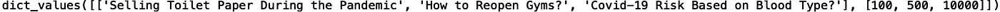

# 理解 Python 字典

> 原文：<https://towardsdatascience.com/understanding-python-dictionaries-cd0b91c0d38?source=collection_archive---------75----------------------->

## Python 词典简介


[来源](https://www.pexels.com/photo/black-and-white-book-browse-dictionary-6997/)

在 python 中，字典是一种包含无序的键/值对集合的数据结构。在这篇文章中，我们将讨论如何在 python 中定义和使用字典。

我们开始吧！

python 中的字典是用花括号“{}”定义的。我们将从定义一个包含两个键的字典开始。第一个键称为“News ”,它将映射到新闻标题列表。第二个键将被称为“点击”,它将映射到一个包含文章被点击次数的列表:

```
news_dict = {"News":["Selling Toilet Paper During the Pandemic", "How to Reopen Gyms?", "Covid-19 Risk Based on Blood Type?"] , "Clicks":[100, 500, 10000] }
```

如果我们印刷字典，我们有:

```
print(news_dict)
```


现在我们已经定义了字典，让我们看看字典对象可用的方法:

```
print(dir(news_dict))
```


我们将讨论方法“clear()”、“copy()”、“get()”、“items()”、“pop()”、“update()”和“values()”。

第一种方法“clear()”非常简单。它只是清除字典:

```
news_dict.clear()
print("Cleared dictionary: ", news_dict)
```


接下来我们有“copy()”方法。此方法返回字典的浅层副本:

```
copy_dict = news_dict.copy()
```

这允许我们修改副本，同时保持原始字典不变:

```
copy_dict['Clicks'] = [100, 100, 100]
print(news_dict)
print(copy_dict)
```


“get()”方法将一个键作为输入，并返回该键的值:

```
print(news_dict.get("News"))
```


我们可以对“点击”键进行同样的操作:

```
print(news_dict.get("Clicks"))
```


我们还可以使用以下方法获得相同的结果:

```
print(news_dict['News'])
print(news_dict['Clicks'])
```


“items()”方法返回一组键/值对。我们可以在 for 循环中迭代键值对:

```
for key, value in news_dict.items():
    print(key, value)
```


我们还可以使用 key 方法来获取键的名称:

```
print(new_dict.keys())
```


接下来，“pop()”方法允许我们删除键及其值:

```
news_dict.pop('Clicks')
print(news_dict)
```


此外，“update()”方法允许我们用新值覆盖字典中的键和值:

```
news_dict.update(News = "New York City Begins to Reopen", Clicks = 30000)
print(news_dict)
```


最后，“values()”方法返回字典值的新视图:

```
print(news_dict.values())
```



我就说到这里，但是您可以自己随意使用这些字典方法。

## 结论

总之，在这篇文章中，我们讨论了如何在 python 中定义和使用字典。我们讨论了如何清除值、访问键和值、更新字典以及复制字典。我希望你觉得这篇文章有用/有趣。这篇文章的代码可以在 [GitHub](https://github.com/spierre91/medium_code/blob/master/basic_python/understanding_dictionaries.py) 上找到。感谢您的阅读！