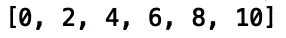

# 理解 Python 生成器

> 原文：<https://towardsdatascience.com/understanding-python-generators-741d33f177b7?source=collection_archive---------26----------------------->

## Python 中的生成器简介


[来源](https://www.pexels.com/photo/alternative-alternative-energy-clouds-eco-energy-433308/)

生成器函数是 python 中的函数，它提供了一种执行迭代的简单方法。这很有用，因为处理列表要求我们将每个值存储在内存中，这对于大量输入来说是不实际的。此外，与生成器的简单实现相比，从头构建迭代器需要大量代码。例如，在构建迭代器类时，需要定义 dunder 方法“__iter__()”和“__next__()”，跟踪内部状态，并在没有其他值要返回时引发“StopIteration”。为了演示生成器函数的强大功能，我们将比较一个用于生成从 0 到 *n* 的正整数的函数的不同实现。

我们开始吧！

首先，让我们定义一个函数，它接受一个整数作为输入，并返回一个小于或等于输入的正整数列表:

```
def generate_list(input_value):
    number, numbers = 0, []
    while number <= input_value:
        numbers.append(number)
        number += 2
    return numbers
```

现在，让我们用我们的函数定义一个从 0 到 *n* = 10 的正整数列表:

```
values = generate_list(10)
```



我们可以使用内置的 sum 方法对结果列表进行求和:

```
print("Sum of list: ", sum(values))
```


这里的问题是完整的列表是在内存中构建的。当您处理大量数据时，这就成了问题。我们可以使用生成器模式来修正这个问题。

接下来，让我们将生成器实现为迭代器对象。我们的类将需要 dunder 方法“__init__()”、“__iter__()”和“__next__()”。当没有额外的值要返回时，我们还需要引发“StopIteration”。让我们首先定义我们的“__init__()”方法:

```
class iterator_object(object):
    def __init__(self, input_value):
        self.input_value = input_value
        self.numbers = 0
```

在我们的“__init__()”方法中，我们初始化了类属性。接下来，让我们定义 dunder 方法' __iter__()':

```
class iterator_object(object):
    ...
    def __iter__(self):
        return self
```

现在，让我们添加我们的“__next__()”方法:

```
class iterator_object(object):
    ...
    def __next__(self):
       return self.next()
```

最后，我们可以定义类方法“next()”:

```
class iterator_object(object):
   ...
   def next(self):
        if self.number <= self.input_value:
            current, self.number = self.number, self.number + 2
            return current
        else:
            raise StopIteration()
```

现在，我们可以定义一个输入值为 10 的类实例，并打印出结果迭代器对象的总和:

```
value = iterator_object(10)
print("Sum using an Iterator Object: ", sum(value))
```


这是我们所期望的结果。注意，为了将我们的生成器实现为迭代器对象，我们需要编写相当多的代码:

```
class iterator_object(object):
    def __init__(self, input_value):
        self.input_value = input_value
        self.number = 0

    def __iter__(self):
        return self
    def __next__(self):
       return self.next()

    def next(self):
        if self.number <= self.input_value:
            current, self.number = self.number, self.number + 2
            return current
        else:
            raise StopIteration()
```

幸运的是，python 提供了‘yield’关键字，当使用时，它提供了构建迭代器的捷径。我们可以用 yield 来定义同样的函数:

```
def generator_function(input_value):
    number = 0
    while number <= input_value:
        yield number
        number += 2
```

让我们调用输入值为 10 的生成器，并打印结果的总和:

```
value = generator_function(10)
print("Sum using a Generator: ", sum(value))
```


正如我们所看到的，我们用比迭代器对象实现少得多的代码实现了相同的结果，同时保留了迭代器的优点。我就讲到这里，但是您可以自己随意摆弄代码。

## 结论

总之，在这篇文章中，我们讨论了 python 中的生成器函数。我们概述了同一个函数的三个实现，以展示生成器函数的强大功能。我们讨论了在列表上执行一些操作对于大量输入来说是如何成为问题的。我们通过构建一个生成器函数的迭代器对象实现解决了这个问题。这个解决方案需要大量代码。最后，我们讨论了使用 yield 语句来定义生成器函数，这为构建迭代器提供了一条捷径。我希望你对这篇文章感兴趣/有用。这篇文章中的代码可以在 [GitHub](https://github.com/spierre91/medium_code/blob/master/basic_python/generators_tutorial.py) 上找到。感谢您的阅读！