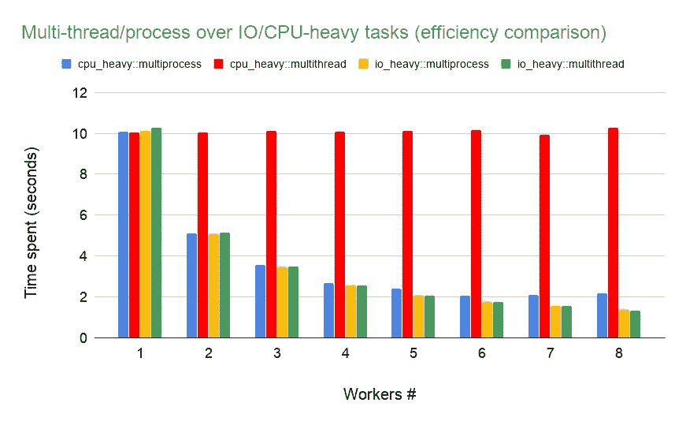
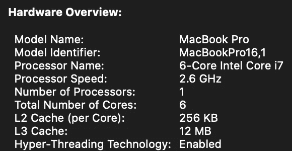

# 通过模拟了解 Python 多线程和多重处理

> 原文：<https://towardsdatascience.com/understanding-python-multithreading-and-multiprocessing-via-simulation-3f600dbbfe31?source=collection_archive---------26----------------------->

## 边做边学:简单的模拟有助于更好地理解复杂的想法，如多线程和多重处理。

由 [Unsplash](https://unsplash.com/?utm_source=unsplash&utm_medium=referral&utm_content=creditCopyText) 上的 [hue12 摄影](https://unsplash.com/@hue12_photography?utm_source=unsplash&utm_medium=referral&utm_content=creditCopyText)拍摄

Python 是一种优秀的通用语言，在各个领域都有应用。然而，有时候你只是希望它能进一步加速。提高速度的一个方法是用多线程或多重处理来并行工作。

有许多很好的资源可以解释这两者的概念。为了避免重复劳动，这里有一些我认为非常有用的方法。

*   [https://stack overflow . com/questions/18114285/线程与多处理模块的区别是什么](https://stackoverflow.com/questions/18114285/what-are-the-differences-between-the-threading-and-multiprocessing-modules)
*   [https://medium . com/content square-engineering-blog/multi threading-vs-multi processing-in-python-ECE 023 ad 55 a](https://medium.com/contentsquare-engineering-blog/multithreading-vs-multiprocessing-in-python-ece023ad55a)
*   [https://www . geeks forgeeks . org/difference-between-multi threading-vs-multi processing-in-python/](https://www.geeksforgeeks.org/difference-between-multithreading-vs-multiprocessing-in-python/)
*   [https://docs.python.org/3/library/concurrent.futures.html](https://docs.python.org/3/library/concurrent.futures.html)

在本文中，我想为那些想进一步探索概念并在自己的笔记本电脑上进行测试的人提供一个简单的模拟。所以我们开始吧！

# 模拟设置

概括地说，我通过以下步骤创建了一个模拟:

*   创建两个函数来模拟 IO 密集型和 CPU 密集型任务
*   使用“ [concurrent.futures](https://docs.python.org/3/library/concurrent.futures.html) ”模块创建一个“中枢”函数，在不同的并行化设置下模拟执行一个任务 100 次
*   使用 Python 的“timeit”函数执行“hub”函数 5 次，以获得给定并行化设置下的平均花费时间

下面是包含设置细节的代码块。

# 性能比较

我在本地笔记本电脑上的测试结果在这里分享。请注意，在不同的硬件环境下，确切的模拟数字会有所不同，但原则应该始终适用。

我在下面的图表中显示了模拟结果:x 轴是工作人员的数量(例如线程号或进程号)，y 轴是完成计算所花费的时间。四种不同的颜色标记了不同的设置:CPU 繁重任务的多处理(蓝色)，CPU 繁重任务的多线程(红色)，IO 繁重任务的多处理(黄色)，IO 繁重任务的多线程(绿色)。

从图表中可以很容易地看出一些发现:

1.  “多线程”和“多处理”在 IO 繁重任务中同样有效。随着工作人员的增加，总任务花费的时间从大约 10 秒(1 个工作人员)减少到 1.3 秒(8 个工作人员)，这意味着速度提高了大约 8 倍。
2.  **“多线程”在 CPU 繁重的任务上表现不佳。**红色条形图显示，无论使用多少“线程”,总花费时间始终在 10 秒左右。
3.  **“多处理”在 CPU 繁重的任务上是有效的，然而，它在硬件限制下达到了一个平台。**在我的例子中，当 worker #大于等于 5 时，它的最大加速仍然是 5X (~2 秒)，小于他们的实际 worker #(例如 6、7、8)。这是因为我的笔记本电脑有 6 个内核，鉴于系统需要 1 个内核来维持其功能，其余 5 个内核可用于计算，因此最大速度提升是 5X。

看一下硬件概述，您会发现我的笔记本电脑的 6 核特性以及启用的“超线程技术”,因此线程数不限于处理器数 6。

我的笔记本电脑硬件概述

希望你喜欢这篇短文，并自己练习。更重要的是，您现在应该对 Python 中多线程和多处理的区别有了更好的理解。

边做边学既有趣又有效。尽情享受吧！

— — — — — — — — — — — — — —

如果你喜欢这篇文章，通过点赞、分享和评论来帮助传播。潘目前是 LinkedIn 的数据科学经理。可以看之前的文章，关注他上[*LinkedIn*](https://www.linkedin.com/in/panwu/)*。*