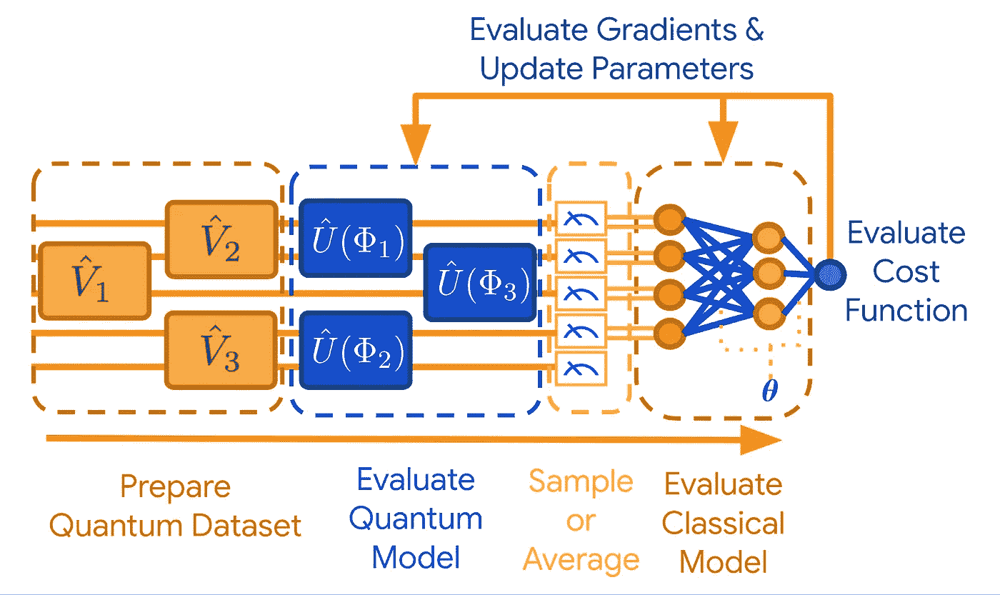

# 使用张量流量子了解量子 ML

> 原文：<https://towardsdatascience.com/understanding-quantum-machine-learning-using-tensorflow-quantum-examples-5a59133e8930?source=collection_archive---------18----------------------->

## 通过探索 TensorFlow 量子示例开始您的量子机器学习之旅

**上图** : Forest Stearns(谷歌人工智能量子艺术家常驻)展示了安装在低温恒温器上的 Sycamore 量子处理器。图片来源:[使用可编程超导处理器的量子优势](http://ai.googleblog.com/2019/10/quantum-supremacy-using-programmable.html)。**底部** : TensorFlow 量子标志，[来源](https://github.com/tensorflow/quantum/blob/master/docs/images/logo/tf_quantum_circle.jpg)

这篇文章是为量子机器学习的初学者准备的，这是当前经典机器学习思想的必然未来。本文的重点是介绍结合机器学习和量子计算有利于解决特定领域问题的领域。文章的结构是，首先描述与问题相关的量子计算概念，然后描述谷歌人工智能量子团队对问题的解决方案。此外，它遵循了谷歌人工智能量子团队最近与滑铁卢大学、Alphabet 的 X 和大众汽车合作发表的关于使用 Tensorflow Quantum 进行量子机器学习的工作。

在进入一些问题之前，有责任介绍一下 [Tensorflow Quantum](https://www.tensorflow.org/quantum) ，这是一个开源库，用于对量子数据进行计算，以及创建混合量子经典学习模型。与 Tensorflow 量子库相关的[白皮书](https://arxiv.org/abs/2003.02989)可访问了解更多技术细节。

量子计算所必需的量子电路被定义为一个模型，其中一个计算是一系列[量子门](https://en.wikipedia.org/wiki/Quantum_gate)。TensorFlow Quantum 使用 [Cirq](https://cirq.readthedocs.io/en/stable/index.html) 设计这些量子电路的逻辑。在继续之前，我建议您浏览一下 TensorFlow Quantum 和 Cirq 的 API，或者将这些站点加入书签，以便在需要理解时参考。

# 量子数据的二元分类

为此，我们设计了一个混合量子经典神经网络，用于在量子数据源之间进行分类。量子数据从[布洛赫球](https://en.wikipedia.org/wiki/Bloch_sphere)生成。在 Bloch 球体中，我们首先选择 XZ 平面中的两条射线，然后选择随机分布在这些射线周围的点。因此，任务是分离由于选择上述光线而产生的两个斑点。下面是对应两个不同角度的图像:θ和ϕ.这两个角度都位于 XZ 平面内，并相对于正 X 轴进行测量。在下图中，θ对应于蓝色光线与 XZ 平面中的正 x 轴所成的角度，而ϕ以类似的方式对应于橙色光线。

**θ= 3&φ= 0**

**θ= 2&φ= 7**

总之，我们可以在布洛赫球中利用 X 旋转和 Z 旋转来制造任何量子态。

针对上述分类任务，设计了一种混合量子经典神经网络模型。典型的混合量子-经典神经网络的示意图如下所示。

**“对用于 TensorFlow Quantum 中量子数据的混合量子经典判别模型的推理和训练的端到端管道中涉及的计算步骤的高级抽象概述。”—** *图片鸣谢:* TensorFlow Quantum 中的图 5:量子机器学习的软件框架 [arXiv:2003.02989，2020](https://arxiv.org/abs/2003.02989) 。

首先，生成一个量子数据，在我们的例子中是布洛赫球表面上的点，然后使用 Cirq 的量子门创建一个量子电路，以φ作为它们各自的参数，之后从 Tensorflow 量子库中选择一个层来对量子模型本身中的量子位执行计算。一旦量子计算完成，通过采样或测量从量子位获得的值的平均值来获得层输出的期望。这种测量行为去除了量子位的量子本质，产生了一个经典变量。这个经典变量然后服从经典神经网络模型，最终输出预测概率。在下面的图中，我们给出了混合神经网络的训练损失图，该混合神经网络被训练来对布洛赫球表面上两条射线周围的点进行分类。在正在进行的训练期间分类误差的下降和在训练结束时 0.00085 的最终损失表明所提出的混合神经网络在分类量子数据方面是成功的。

**混合量子经典神经网络相对于用于对θ= 2&φ= 7**的布洛赫球表面上的点进行分类的训练时期的分类交叉熵损失

# 量子图递归神经网络

在本节中，我们旨在使用 QGRNN 学习给定[伊辛模型](https://en.wikipedia.org/wiki/Transverse-field_Ising_model)的目标[哈密顿量](https://en.wikipedia.org/wiki/Hamiltonian_(quantum_mechanics))的动力学。这里使用的横场伊辛模型是热力学和磁学中使用的经典伊辛模型的量子再现。伊辛模型的目标哈密顿量如下:

**伊辛量子模型的目标哈密顿量。**图片鸣谢:TensorFlow Quantum:量子机器学习的软件框架 [arXiv:2003.02989，2020](https://arxiv.org/abs/2003.02989) 。

量子计算中的伊辛模型基本上是一个格子-格子结构，量子位的自旋用 **Z** 表示，如上图所示。 **J** 是耦合系数，表示量子位的自旋对之间的相互作用强度，而 **B** 是量子位拥有特定自旋的偏置系数。添加术语 **X** 是为了传达任何外部场对特定量子位相对于 Ising 模型主要的最近邻自旋对相互作用的影响。除了伊辛模型的可变耦合强度之外，自旋之间的相互作用有利于模拟几个机器学习模型，如 [Hopfield networks](https://en.wikipedia.org/wiki/Hopfield_network) 和[Boltzmann machines](https://en.wikipedia.org/wiki/Boltzmann_machine)([Schuld&Petruccione(2018)](https://www.springer.com/gp/book/9783319964232))。此外，伊辛模型密切模拟计算问题子类的基本数学，称为[二次无约束二元优化(曲波)](https://en.wikipedia.org/wiki/Quadratic_unconstrained_binary_optimization)问题。

在介绍了伊辛模型及其哈密顿量之后，我们在下面介绍实现上述同化伊辛模型动力学的目标的步骤。

## 用 Ising 模型上的变分量子本征解算器制备量子数据

具有棕色到蓝绿色色图的图中的节点描绘了具有特定自旋的量子位的偏置系数 B，而具有红色到蓝色色图的图中的边示出了两个最近的相邻量子位之间的耦合系数 J。彩色条显示了 B 和 J 系数对目标 Ising 模型动力学的影响。

现在，我们将构建一个[变分量子本征解算器](https://grove-docs.readthedocs.io/en/latest/vqe.html) (VQE)，寻找一个靠近基态的低能态，使其可以作为伊辛模型& QGRNN 的初态。[变分法](https://en.wikipedia.org/wiki/Variational_method_(quantum_mechanics))提供了一种找到近似基态能量状态的方法。下面是通过训练 VQE 获得的低能量状态以及同样的训练损失图。

**训练 VQE 建议的低能状态及其训练损失图**

## 构造伊辛模型和 QGRNN

我们需要取哈密顿量的指数来构造伊辛模型。然而，一般来说，两个不可交换的可观测量的幂不等于它们的和的幂。为了解决这个问题，我们选择[铃木-特罗特展开式](https://en.wikipedia.org/wiki/Time-evolving_block_decimation#The_Suzuki-Trotter_expansion)，因为它可以得出易于计算的近似解。

现在我们需要初始化一个 QGRNN 模型。由于 QGRNN 不知道目标哈密顿量，我们在 QGRNN 内部初始化了一个随机图。

**在 QGRNN 内部初始化随机图**

## 使用互换测试构建保真度

在这一步，我们已经从伊辛模型的真实哈密顿量生成了量子数据，以及从 QGRNN 预测的量子数据。众所周知，对量子比特的测量导致对其量子信息的拆解；因此，我们用[交换测试](https://en.wikipedia.org/wiki/Swap_test)实现[保真度](https://en.wikipedia.org/wiki/Fidelity_of_quantum_states)，用于比较真实和预测的量子态。该交换测试用于计算用于训练 QGRNN 的平均不忠损失函数。

## QGRNN 的培训和结果

从上面的练习可以得出结论，在这种情况下，QGRNN 从其量子数据中学习给定目标哈密顿量的时间演化动力学，类似于 Ising 模型。

# 变分量子热化器

在本节中，我们将利用 TensorFlow Quantum 探索量子计算和经典的基于能量的模型的结合。在这里，我们将研究 [2D 海森堡模型](https://en.wikipedia.org/wiki/Heisenberg_model_(quantum))，并应用变分量子热化器(VQT)来生成模型的近似热态。VQT 在随后的[白皮书](https://arxiv.org/abs/1910.02071)中被介绍。

**目标 2D 海森堡模型的** [**密度矩阵**](https://en.wikipedia.org/wiki/Density_matrix#Definition) **。**类似 TensorFlow Quantum 中图 24 的图像:量子机器学习的软件框架 [arXiv:2003.02989，2020](https://arxiv.org/abs/2003.02989) 。

为了跟踪我们基于能量的学习模型的性能，我们使用了一个叫做[保真度](https://en.wikipedia.org/wiki/Fidelity_of_quantum_states)的易处理的量。

## 基于能量的学习模型

基于物理学和指数族的概念，我们将使用基于能量的[玻尔兹曼机](https://en.wikipedia.org/wiki/Boltzmann_machine)来学习 2D·海登伯格模型的动力学。玻尔兹曼机经典模型可以通过用泡利 z 算符替换每个比特，并将自旋映射到量子比特，即 1 to|0⟩和-1 |1⟩.，而快速转换成量子力学伊辛模型

当一个 [ansatz](https://en.wikipedia.org/wiki/Ansatz) 关于量子位之间的零相关性被建立时，玻尔兹曼机器被简化为具有简化特征的量子位集合上的独立伯努利分布的乘积。因此，我们将首先在 VQT 实施伯努利循证医学。我们使用 VQT 白皮书中提到的经典 VQT 损失函数。

## VQT 通过将伯努利 EBM 转换成伊辛模型得出结果

**历元 1 估计密度矩阵，损失:3.1398983，最佳状态保真度:0.0356728676646754**

**历元 20 估计密度矩阵，损失:-1.3389935，最佳状态保真度:0.16234265428802852**

**历元 40 估计密度矩阵，损失:-10.262356，最佳状态保真度:0.59447319578201**

**历元 60 估计密度矩阵，损失:-15.053259，最佳状态保真度:0.8891700468979**

**历元 80 估计密度矩阵，损失:-15.950613，最佳状态保真度:0.92273758099982**

**Epoch 100 估计密度矩阵，损耗:-16.35294，最佳状态保真度:0.946553737877106**

**VQT (Bernoulli EBM)培训损失**

**VQT (Bernoulli EBM)保真度与最优状态**

## VQT 通过将玻尔兹曼机 EBM 转换成伊辛模型得出结果

**历元 1 估计密度矩阵，损失:-2.9771433，最佳状态保真度:0.053690879554551**

**历元 20 估计密度矩阵，损失:-13.478342，最佳状态保真度:0.664609698510499**

**历元 40 估计密度矩阵，损失:-16.392994，最佳状态保真度:0.9318277209146**

**历元 60 估计密度矩阵，损失:-17.340147，最佳状态保真度:0.9984435197535**

**历元 80 估计密度矩阵，损失:-17.391596，最佳状态保真度:0.9940862273719**

**历元 100 估计密度矩阵，损耗:-17.400259，最佳状态保真度:0.999360266561525**

**VQT (Boltzmann machine EBM)培训流失**

**VQT(玻尔兹曼机 EBM)保真度与最优状态**

毫无疑问。从结果可以推断，基于能量的方法在学习 2D 海森堡模型的哈密顿量的动力学方面是成功的。参考[受限玻尔兹曼机器](http://deeplearning.net/tutorial/rbm.html) (RBM)对 MNIST 的分类，进一步阅读基于能源的模型。

在概述了三个例子以及对它们的量子计算和机器学习概念的理解之后，不要不知所措是非常必要的。我向初学者介绍量子机器学习的目标，除了将量子计算应用于各种特定领域的问题，只有作为读者的你坚持不懈并不断更新关于量子机器学习的知识，才会成功。下面我提出一个有趣的方法，用量子机器学习来解决组合优化问题。

# 进一步阅读

[量子近似优化算法](https://qiskit.org/textbook/ch-applications/qaoa.html) (QAOA)

[使用 QAOA 的元学习](https://arxiv.org/abs/1907.05415)

[PennyLane](https://pennylane.ai/) : *一个跨平台的 Python 库，用于量子机器学习、自动微分和混合量子经典计算的优化。*

[Strawberry Fields](https://strawberryfields.readthedocs.io/en/stable/index.html#) : *一个用于设计、优化和利用光子量子计算机的全栈 Python 库。*