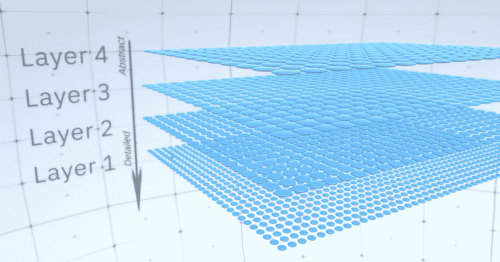
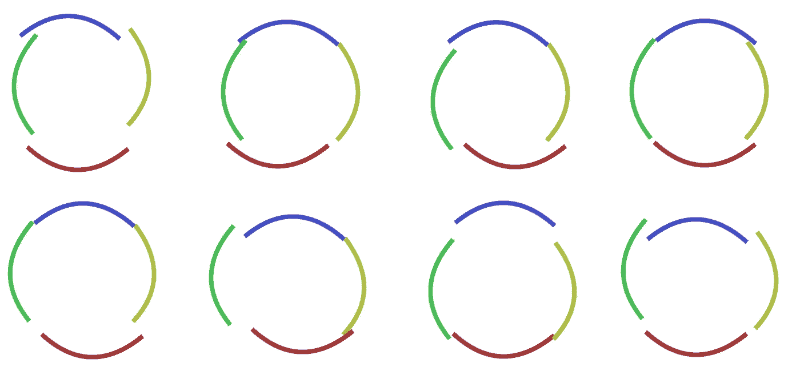
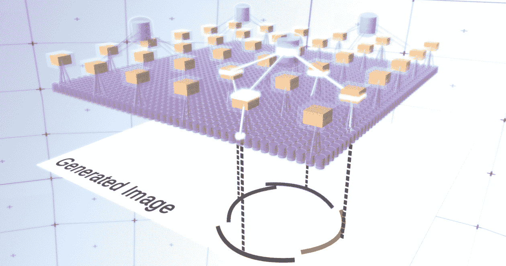
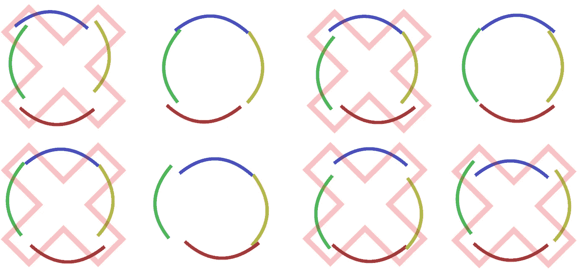
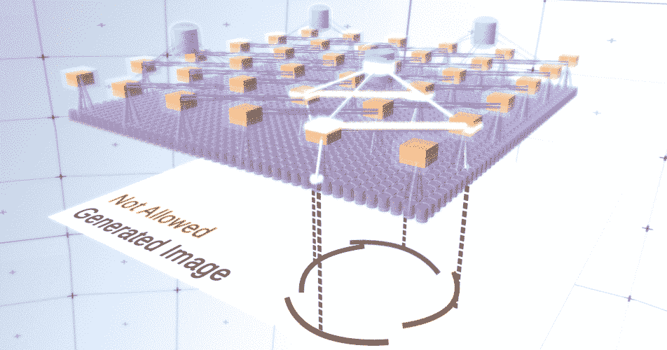
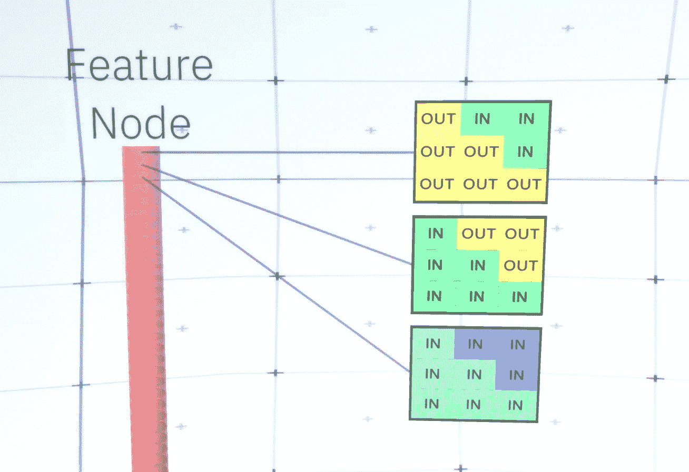
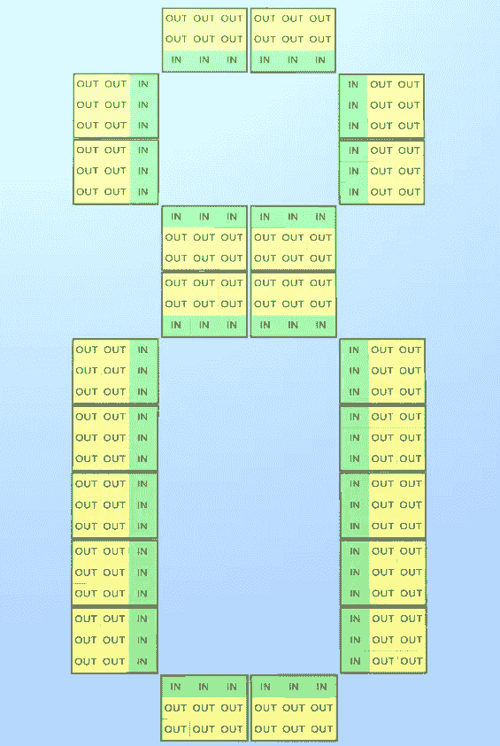

# 理解破解验证码的人工智能模型

> 原文：<https://towardsdatascience.com/understanding-rcns-structure-ec4b51b9c257?source=collection_archive---------17----------------------->

## 皇家护理学院

## 对递归皮层网络结构的深入探究

计算机视觉是人工智能[1]研究最多的主题之一，然而目前应对其挑战的解决方案 ConvNets 最近因容易被愚弄而受到批评。举几个例子，这些网络可能会以很高的可信度输出错误的类别预测:缺少 ConvNets 依赖的统计线索的自然发生的图像[2]，它们正确分类但改变了单个像素的图像[3]，或者在场景中添加了不应改变预测类别的物理对象的图像[4]。因此，如果我们想建造真正智能的机器，至少应该努力探索新的想法。

其中一个相当新的想法是 Vicarious 的递归皮层网络(RCNs ),它从神经科学中获得灵感。这种模式声称以极高的数据效率破解了基于文本的验证码[5]，并吸引了一些围绕[it](https://www.reddit.com/r/MachineLearning/comments/dxg0kb/d_lets_talk_about_vicarious_inc/)的[评论](http://fastml.com/yann-lecuns-answers-from-the-reddit-ama/)和[争论](https://news.ycombinator.com/item?id=4413568)[。然而，我还没有看到一篇文章彻底解释这个有趣的新模型。因此，我决定写两篇文章，每一篇都解释这个模型的一个特定方面。在本文中，我们将讨论它的结构以及它如何生成图像，如 RCN 主要论文的补充材料所述[5]。](https://www.reddit.com/r/MachineLearning/comments/8hcbas/d_question_has_anyone_tried_to_use_vicarious/)

*本文假设我们对 ConvNets 有基本的了解，因为我们对它进行了大量的类比。*

为了让你的大脑为 RCN 的细节做好准备，你需要理解 RCN 是基于将形状(物体的草图)与外观(其纹理)分开的神经启发的想法，并且它是一个生成模型，而不是一个鉴别模型，所以我们可以像 GANs 一样从中生成/采样图像。此外，它是一个并行的层次结构，就像 ConvNets 一样，它首先在第一层生成目标对象的形状，然后在最后一层添加外观。然而，与 ConvNets 相反，它依赖于来自图形模型的大量文献，而不是依赖于加权和以及梯度下降。现在，让我们深入研究 RCN 结构的细节。

# 要素图层

RCN 中的第一类图层称为要素图层。我们将逐步理解该模型，因此，现在让我们假设该模型的整个层次结构由这种类型的层组成，这种类型的层只是堆叠在彼此的顶部，从顶层的抽象概念到更详细的概念，随着我们越来越靠近底层，如图 1 所示。这种类型的图层由覆盖 2D 空间的多个节点组成，就像 ConvNets 中的要素地图一样。

*图 1:多个要素层堆叠在一起，节点跨越 2D 空间。从第 4 层移动到第 1 层是从抽象概念移动到更详细的底层概念。*

每个节点由多个通道组成，每个通道代表一个独特的功能。通道是二进制变量，可为真或假，表示对应于该通道的特征是否存在于最终生成的影像中的节点(x，y)坐标处。在任何特定层，所有节点都有相同的信道列表。

让我们以一个中间层为例，让我们对其通道和上层提出一些假设，以便于解释。该层的通道列表将表示一条双曲线、一个圆和一条抛物线。在生成图像的某一次运行中，上面各层的计算需要在(x，y)坐标(1，1)处画一个圆。因此,( 1，1)处的节点将对应于特征“圆形”的通道设置为真。这将直接影响它下面的层中的一些节点；它将触发与(1，1)的邻域中的圆相关联的较低级特征被设置为真。仅作为示例，那些较低级别的特征可以是具有不同取向的四个弯曲段。当这些较低的功能被触发时，它们还会触发甚至更低的层中的通道，直到我们到达生成图像的最终层。我们可以想象这种触发操作，如图 2 所示。

你可能想知道圆怎么知道它需要 4 个曲线段来表示自己？RCN 如何知道它需要一个通道来表示一个圆？通道及其与其他层的连线将在 RCNs 的学习阶段建立。

图 2:要素层中的信息流。特征节点是包含表示通道的圆盘的胶囊。为了简明起见，一些上层和下层被表示为长方体，但是它们由作为中间层的特征节点组成。触发的连接和通道正在发光。请注意，顶部中间层由 3 个通道组成，第二层由 4 个通道组成。

您可能想要反对模型采用的高度僵化和确定性的生成方法；对于人类来说，如图 3 所示，圆的曲率的微小扰动仍然被认为是圆。

*图 3:通过扰动图 2 中的四个曲线段，圆的多种变化。*

在我们的层中，将这些变化中的每一个单独视为一个新的通道是很困难的。类似地，当我们后来将 rcn 用于分类而不是生成时，将这些变体归入同一概念将大大有助于推广到新的变体。但是，我们如何将 rcn 改变为具有这种能力呢？

# 池层

为了实现这一点，引入了一种新的层，即池层。它位于任意两个要素图层之间，充当它们之间的中介。它也将由通道组成，但它们将是整数值而不是二进制。

为了说明，让我们回到我们的圆的例子。圆形要素不是从其下方的要素图层请求 4 条固定坐标的曲线段，而是从池图层请求这些曲线段。然后，池层中的每个激活的通道将在其邻域中选择低于它的级别的节点，以允许其特征的小扰动。因此，如果我们将邻域设置为池节点正下方的 9 个节点，那么池通道无论何时被激活，都将对这 9 个节点中的一个进行统一采样并触发它，并且它选择的节点的索引将是该池通道的状态，一个整数。您可以在图 4 中看到多次运行，其中每次运行对一组不同的低级节点进行采样，从而允许圆的不同变化。

*图 4:池化层的操作。这个 GIF 中的每一帧都是不同的运行。汇集节点是立方体。在此 GIF 中，池节点有 4 个通道，相当于其下要素图层的 4 个通道。为了清楚起见，上面的&下面的层已经被完全移除。*

尽管我们的模型中需要可变性，但是如果这种可变性得到更多的约束和协调，那就更好了。在前面的两个图中，一些圆太怪异了，不能认为是圆，因为它们的曲线段是不连续的，如图 5 所示，我们想拒绝它们的生成。因此，如果我们可以添加一种机制来汇集通道，以协调它们对特征节点的采样，从而专注于更连续的可变性，我们的模型将更合适。

*图 5:一个圆的多种变化，我们不希望这些变化被打上一个红叉。*

RCN 的作者在池层中引入了横向连接来实现这一点。本质上，池通道将与它们附近的其他池通道连接，这些连接不允许一些状态对同时在两个通道中出现。简单的限制这两个通道的采样空间是不会允许的。例如，在圆的变体中，这些连接将不允许两个相邻的线段彼此远离。这种机制如图 6 所示。同样，这些联系将在学习阶段建立。值得注意的是，当代的普通人工神经网络在它们的层中没有任何类型的横向连接，尽管生物神经网络有横向连接，并且被认为在视觉皮层的轮廓整合中起作用[6](但是，老实说，视觉皮层比前面的陈述可能表明的更混乱)。

图 6: GIF 展示了 rcn 在横向连接下的操作。当两端的状态不能同时出现时，横向连接会发出红光。应该注意的是，一个工作的 RCN 首先实际上不会产生不允许的状态；我们只是生成它们来理解哪些变化被丢弃了。为了清楚起见，上面的&下面的几层已经完全去掉了。

到目前为止，我们一直在谈论 rcn 的中间层；剩下的是最顶层和最后一层，与生成的图像的像素接口。最顶层只是一个普通的要素图层，其中每个结点的通道都是我们的标注数据集的类。在生成时，我们只需选择位置和我们想要生成的类，转到具有所选位置的节点，并告诉它激活我们选择的类的通道。这将触发它下面的池层中的一些通道，然后是下面的要素层，以此类推，直到我们到达最后一个要素层。根据您对 ConvNets 的了解，您可能会认为最顶层只有一个节点，但这里的情况并非如此，实际上这是 rcn 的优点之一，但讨论这一点超出了本文的范围。

最后一个要素图层将是唯一的。还记得我说过 RCNs 把外形和外观分开吗？嗯，这一层将负责输出要生成的对象的形状。因此，这一层应该具有非常低级的特征，任何形状的最基本的构建块，这将允许我们生成任何我们想要的形状。以不同角度旋转的微小边缘是很好的候选，这实际上是作者所利用的。

作者选择用最后一级的特征来表示一个 3x3 的窗口，该窗口的边缘有一定的旋转，他们称之为面片描述符。他们选择的旋转数是 16。此外，为了能够在以后添加外观，每次旋转将有两个方向，以便能够区分背景是位于边缘的左侧还是右侧(如果是外部边缘)，以及一个额外的方向用于内部边缘(即对象内部)。在图 7 中，您可以看到最后一个要素层的一个节点，在图 8 中，您可以看到这些面片描述符是如何形成某种形状的。

图 7:最后一个要素层的节点。有 48 个硬编码(未学习)通道，对应于 16 个边缘旋转* 3 个方向。所示的面片描述符是 45°边的所有可能方向。“IN”表示内部区域，而“OUT”表示外部区域。

图 8:使用不同的补丁描述符形成字母“I”形状的例子。

现在，当我们到达最后一个要素图层时，我们有了一个指定对象边缘以及边缘周围区域是内部还是外部的蓝图。剩下的工作是添加外观，将图像中的每个剩余区域指示为入区或出区，然后为所有区域添加颜色。这将通过使用条件随机场来完成。不涉及数学术语，接下来要发生的是，我们将为最终图像中的每个像素分配一个颜色和状态(入或出)的概率分布。该分布将反映从边缘图提供的信息。例如，如果有两个相邻像素，其中一个在内，另一个在外，则它们具有不同颜色的概率会大大增加。如果两个相邻像素位于内边缘的相对侧，则它们具有不同颜色的概率会增加。如果像素在内部，它们之间没有内边缘，那么它们具有相同颜色的概率增加，但是允许外部像素彼此偏离，等等。为了产生最终的图像，你只需要从我们刚刚建立的联合概率分布中*取样*。为了使生成的图像更丰富，我们实际上可以用纹理代替颜色。我们不打算进一步讨论这一层，因为 rcn 可以在没有外观的情况下执行分类。

本文到此为止。如果你想了解更多关于 RCN 的知识，你可以查看它的论文[5]和附带的补充材料文档，或者你可以阅读我的其余文章，其中谈到了[推理](https://medium.com/@iahmedmaher/understanding-the-inference-mechanism-of-rcns-ba1f00416b63)、[学习](https://medium.com/@iahmedmaher/how-do-rcns-learn-1b65561f2e38)、[在不同数据集上应用 RCN 的结果](https://medium.com/@iahmedmaher/examining-the-performance-of-rcns-on-popular-datasets-1d6a2a8852c1)。

# 参考

[1] [R.Perrault，Y. Shoham，E. Brynjolfsson 等，人工智能指数 2019 年度报告(2019)，以人为中心的人工智能研究所-斯坦福大学。](https://hai.stanford.edu/sites/g/files/sbiybj10986/f/ai_index_2019_report.pdf)

[2] [D. Hendrycks，K. Zhao，S. Basart 等著《自然对抗性实例》(2019)，arXiv:1907.07174。](https://arxiv.org/abs/1907.07174)

[3] [J.Su，D. Vasconcellos Vargas，S. Kouichi，愚弄深度神经网络的一个像素攻击(2017)，arXiv:1710.08864。](https://arxiv.org/abs/1710.08864)

[4] [M. Sharif，S. Bhagavatula，L. Bauer，带有目标的对抗性例子的一般框架(2017)，arXiv:1801.00349。](https://arxiv.org/abs/1801.00349)

[5] [D. George，W. Lehrach，K. Kansky 等，一种以高数据效率训练并打破基于文本的验证码的生成视觉模型(2017)，科学杂志(第 358 卷—第 6368 期)。](https://science.sciencemag.org/content/358/6368/eaag2612.full?ijkey=DmvGldXIEXVoQ&keytype=ref&siteid=sci)

[6] [H. Liang，X. Gong，M. Chen，等，初级视皮层中反馈与侧连接的相互作用(2017)，美国国家科学院院刊。](https://www.ncbi.nlm.nih.gov/pmc/articles/PMC5559040/)