# 了解感兴趣区域—(投资回报池)

> 原文：<https://towardsdatascience.com/understanding-region-of-interest-part-1-roi-pooling-e4f5dd65bb44?source=collection_archive---------2----------------------->

## 理解 ML

## 快速简单地解释什么是投资回报池及其工作原理？为什么我们在快速 R-CNN 中使用它？

*独创快速 R-CNN 架构。来源:*

> **我们将讨论****Fast R-CNN****论文中描述的原始 RoI 合并(上图中的浅蓝色矩形)。这个过程有第二个和第三个版本，叫做****ROI align****和****ROI warp****。**
> 
> **如果你对那两个感兴趣请查看* [***这篇文章***](https://medium.com/@kemalpiro/understanding-region-of-interest-part-2-roi-align-and-roi-warp-f795196fc193)*

# *什么是 RoI？*

***RoI** (感兴趣区域)是从原始图像中提出的区域。我们不打算描述如何提取这些区域，因为有多种方法可以做到这一点。我们现在唯一应该知道的是，有多个这样的区域，所有这些区域都应该在最后进行测试。*

# *R-CNN 的工作速度有多快？*

# *特征抽出*

***快速 R-CNN** 不同于基本 **R-CNN** 网络。它只有一个卷积特征提取(在我们的例子中，我们将使用 VGG16)。*

*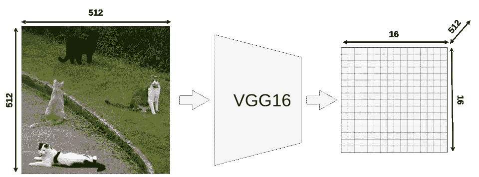*

**VGG16 特征提取输出尺寸**

*我们的模型接受大小为 **512x512x3** (宽 x 高 x RGB)的图像输入，VGG16 将它映射到一个 **16x16x512** 特征图中。您可以使用不同的输入大小(通常较小，Keras 中 VGG16 的默认输入大小是 224x224)。*

*如果你查看输出矩阵，你应该注意到它的宽度**和高度**正好是输入图像的 32 倍(512/32 = 16)。这一点很重要，因为所有 ROI 都必须按比例缩小。*****

# *样本 ROI*

*这里我们有 4 个不同的 ROI。在实际的快速 R-CNN 中，你可能有成千上万个这样的图片，但是把它们都打印出来会使图片不可读。*

*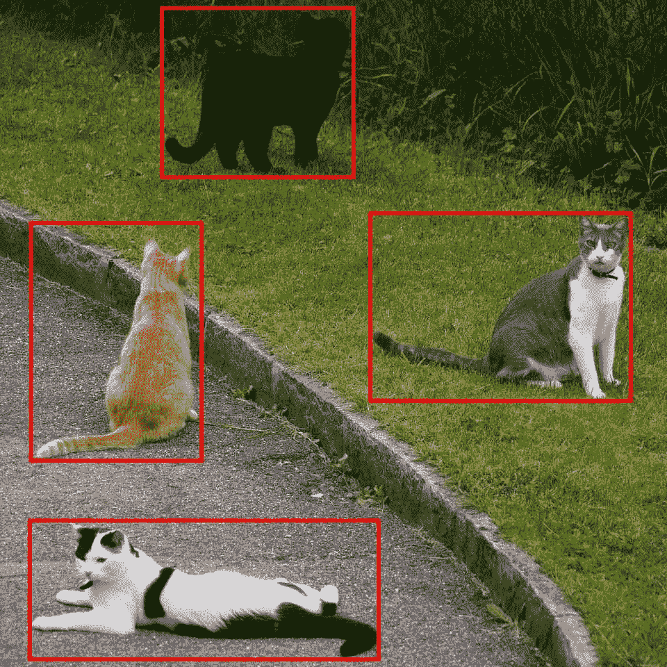*

**感兴趣区域，图片来源:*斯蒂芬妮·布斯*[https://www.flickr.com/photos/bunny/](https://www.flickr.com/photos/bunny/)**

**重要的是要记住 **RoI 不是一个边界框**。它可能看起来像一个，但它只是一个进一步处理的建议。许多人认为这是因为大部分的论文和博客文章都是在创造提案而不是实物。这样更方便，我在我的图片上也是这样做的。这是一个不同的提案领域的例子，也将由快速 R-CNN 检查(绿框)。**

**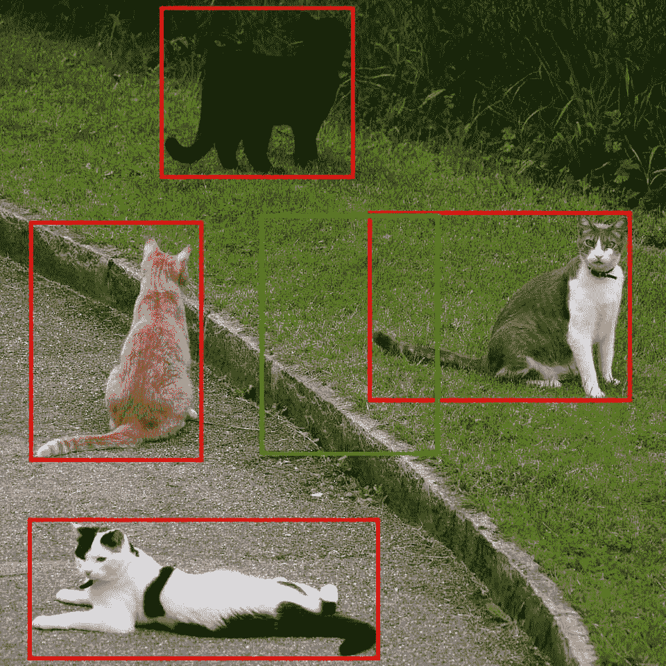**

***没有意义的感兴趣区域:)***

**有一些方法可以限制 ROI 的数量，也许我会在以后写出来。**

# **如何从特征图中获取 ROI？**

**现在，当我们知道什么是 RoI 时，我们必须能够将它们映射到 VGG16 的输出特征图上。**

**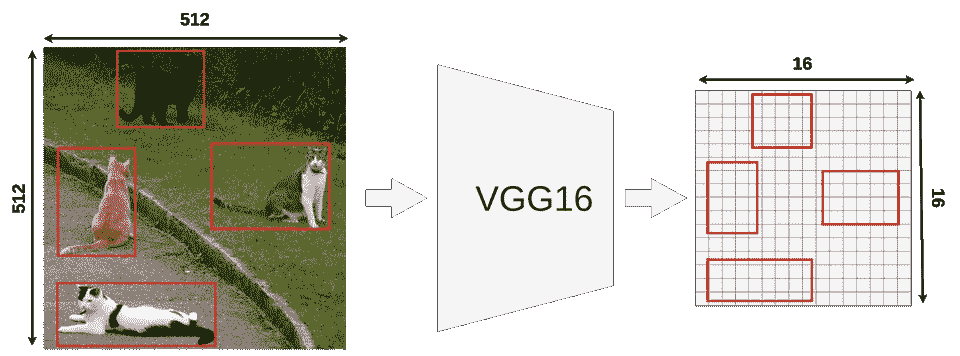**

***将我们的 ROI 映射到 VGG16 的输出上***

**每个 RoI 都有其原始坐标和大小。从现在开始，我们将只关注其中之一:**

**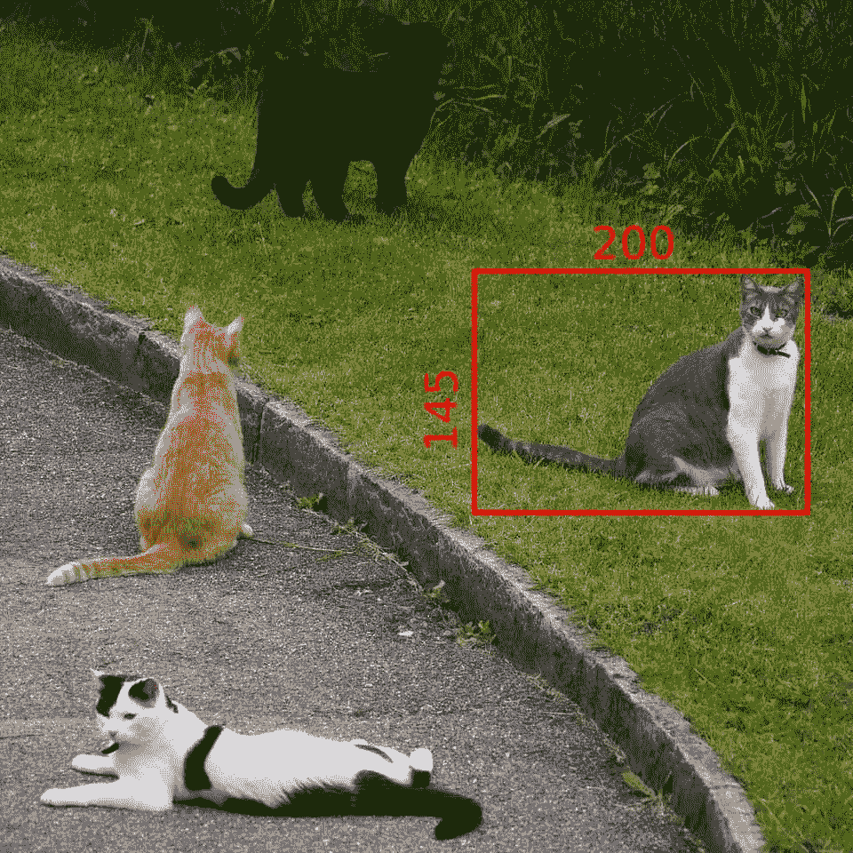**

***我们的投资回报目标***

**其原始尺寸为 **145x200** ，左上角设置在 **(192，296)** 。正如你可能知道的，我们不能用 **32** (比例因子)来划分这些数字。**

*   **宽度:200/32 = 6.25**
*   **身高:145/32 = ~4.53**
*   **x: 296/32 = 9.25**
*   **y: 192/32 = 6**

**只有最后一个数字(左上角的 Y 坐标)才有意义。这是因为我们现在正在处理一个 **16x16** 的网格，我们只关心整数(更准确地说:自然数)。**

# **特征图上坐标的量化**

> *****量化*** *是将输入从一大组数值(如* ***实数*** *)约束到一个离散集合(如* ***整数*** *)* 的过程**

**如果我们将原始 RoI 放在特征图上，它看起来会像这样:**

****

***特征图上的原始 RoI***

**我们不能真正地在它上面应用池层，因为一些“单元”是分开的。量化所做的是，在将结果放入矩阵之前，将每个结果向下舍入。 **9.25** 变为 **9** , **4.53** 变为 **4** 等。**

**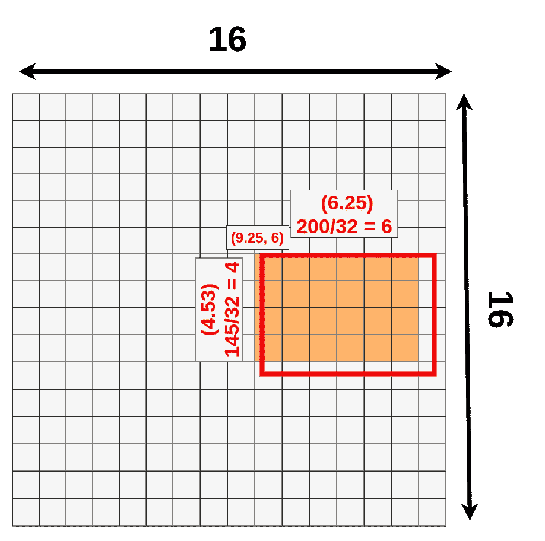**

***量化 RoI***

**您可以注意到，我们刚刚丢失了一堆数据(深蓝色)并获得了新数据(绿色):**

**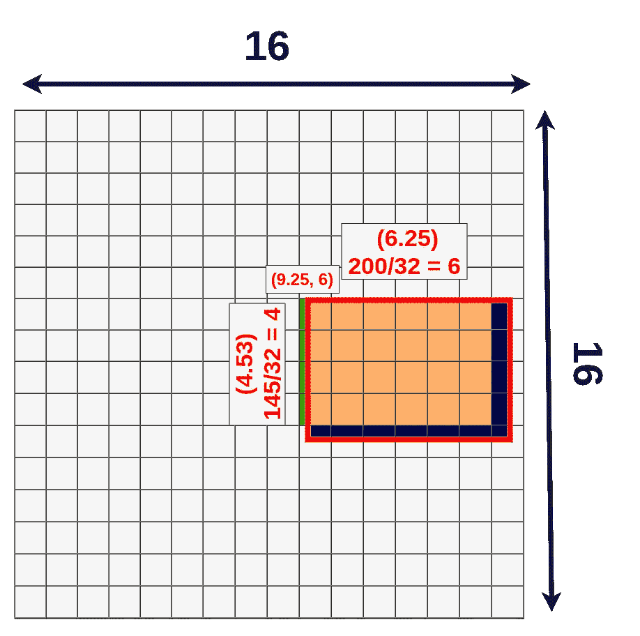**

***量化损失***

**我们不必处理它，因为它仍然会工作，但有一个不同版本的过程称为 **RoIAlign** 可以修复它。**

# **投资回报池**

**现在，当我们将 RoI 映射到特征图上时，我们可以在其上应用池化。为了方便起见，我们将再次选择 **RoI Pooling** 层的大小，但请记住大小可能会有所不同。你可能会问“为什么我们还要应用投资回报池？”这是个好问题。如果你看看快速 R-CNN 的原始设计:**

**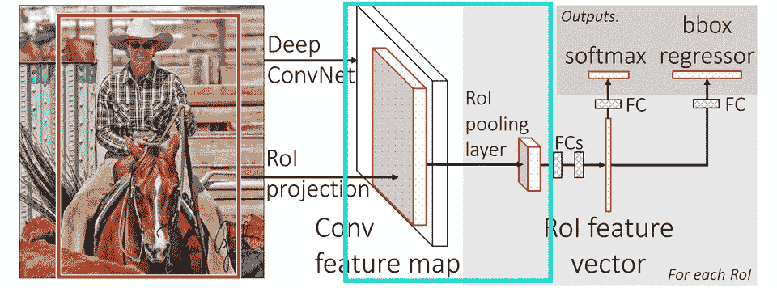**

***独创快速 R-CNN 架构。来源:***

***在 **RoI 汇集层**之后，有一个固定大小的**全连接层**。因为我们的 ROI 具有不同的大小，所以我们必须将它们汇集成相同的大小(在我们的示例中为 **3x3x512** )。此时，我们绘制的 RoI 大小为 **4x6x512** ，正如您所想象的，我们**无法将 4 除以 3** :(。这就是量子化再次出现的地方。***

***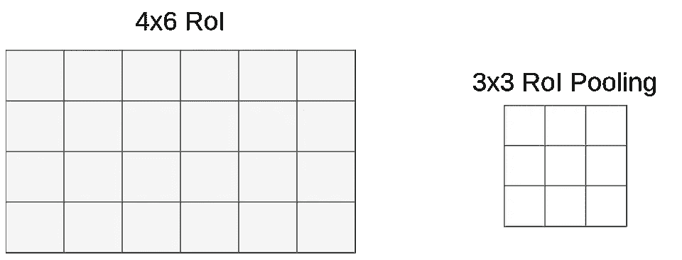***

****映射的 RoI 和池层****

**这次我们不用处理坐标，只用大小。我们很幸运(或者只是方便的池层大小)的是 **6** 可以被 **3** 除，得到 **2** ，但是当你用 **3** 除 **4** 时，我们剩下的是 **1.33** 。应用同样的方法(**向下舍入**)后，我们得到了一个 **1x2 向量**。我们的映射如下所示:**

**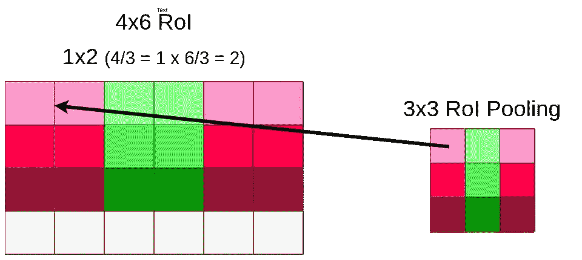**

***数据池映射***

**因为量子化，我们又一次失去了最下面一行:**

**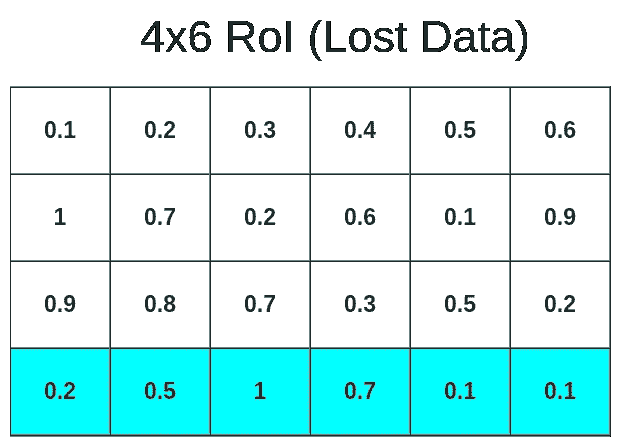**

***数据池映射***

**现在我们可以**将数据汇集成 3x3x512 矩阵****

**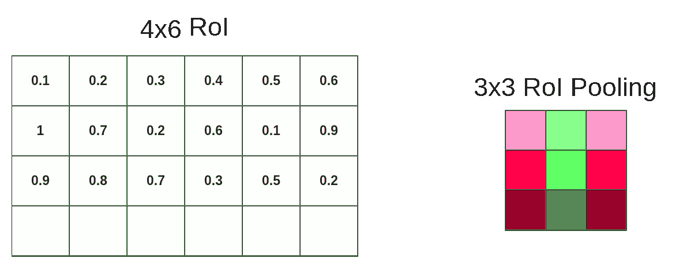**

***数据汇集过程***

**在这种情况下，我们应用了**最大池**，但在您的模型中可能会有所不同。Ofc。这个过程是在整个 RoI 矩阵上完成的，而不仅仅是在最顶层。所以最终结果看起来是这样的:**

**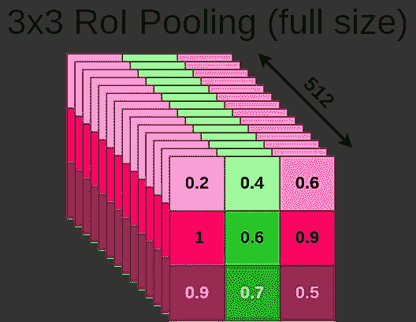**

***全尺寸池输出***

**同样的过程被应用到我们原始图像的每一个 RoI，所以最后，我们可能有数百甚至数千个 3x3x512 矩阵。这些矩阵中的每一个都必须通过网络的其余部分发送(从 FC 层开始)。对于它们中的每一个，模型分别生成 bbox 和 class。**

# **接下来呢？**

**在池化完成后，我们确定我们的输入大小为 **3x3x512** ，这样我们就可以将它送入 FC 层进行进一步处理。还有一件事要讨论。由于量化过程，我们丢失了很多数据。准确地说，是这么多:**

****

***量化中的数据丢失(深蓝色和浅蓝色)，数据增益(绿色)***

**这可能是一个问题，因为每个“单元”都包含大量的数据(特征图上的 1x1x512，粗略地转换为原始图像上的 32x32x3，但请不要使用该参考，因为卷积层不是这样工作的)。有一种方法可以解决这个问题(RoIAlign ),我将很快就此写第二篇文章。**

> ***编辑:这里是第二篇关于 RoIAlign 和 ROI warp*[https://medium . com/@ Kemal piro/understanding-region-of-interest-part-2-ROI-align-and-ROI-warp-f 795196 fc 193](https://medium.com/@kemalpiro/understanding-region-of-interest-part-2-roi-align-and-roi-warp-f795196fc193)**

****参考文献:****

1.  **快速 R-CNN[https://arxiv.org/pdf/1504.08083.pdf](https://arxiv.org/pdf/1504.08083.pdf)**

***最初发布于*[*https://erdem . pl*](https://erdem.pl/2020/02/understanding-region-of-interest-ro-i-pooling)*。***