# 了解感兴趣区域— (RoI 对齐和 RoI 扭曲)

> 原文：<https://towardsdatascience.com/understanding-region-of-interest-part-2-roi-align-and-roi-warp-f795196fc193?source=collection_archive---------1----------------------->

## 理解 ML

## 直观解释 RoI Align 的工作原理，以及为什么它优于标准 RoI 合并？

*独创快速 R-CNN 架构。来源:*

> **如果你不熟悉 RoI 的概念，先阅读一下*[***了解感兴趣区域— (RoI 汇集)***](https://medium.com/@kemalpiro/understanding-region-of-interest-part-1-roi-pooling-e4f5dd65bb44)***可能会有所帮助。本文不包括对什么是 RoI 的介绍，而只集中在****RoI align****和* ***RoIWarp 上。******

# ***为什么我们要修改投资回报池？***

***正如您在本系列的第一部分中所记得的，RoI Pooling 有一个主要问题。在此过程中，它会丢失大量数据。***

******

****RoI 集中量化损失(深蓝色和浅蓝色)，数据增益(绿色)****

***每当它这样做时，关于该对象的部分信息就会丢失。这降低了整个模型的精度，很多真正聪明的人都考虑过这个问题。***

# ***设置***

***开始之前，我需要快速解释一下我们的模型。***

***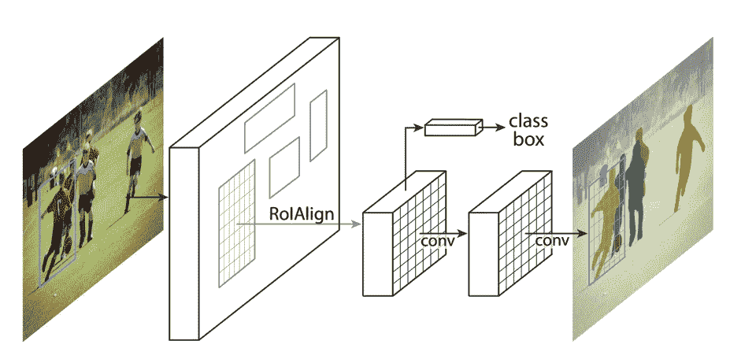***

****原创 Mask R-CNN 架构。来源:*[*https://arxiv.org/pdf/1703.06870.pdf*](https://arxiv.org/pdf/1703.06870.pdf)***

***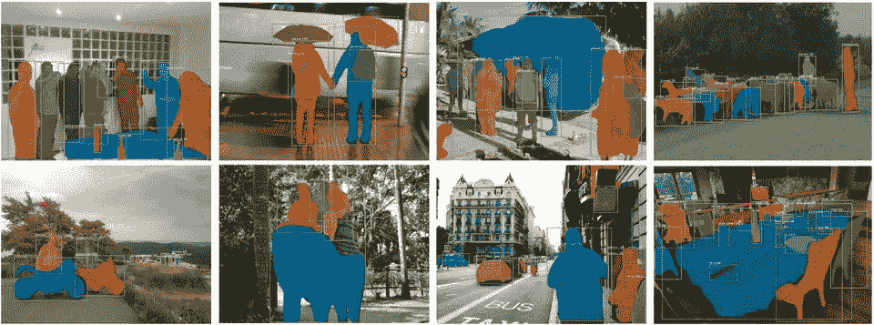***

****屏蔽 R-CNN 输出。来源:*[*https://arxiv.org/pdf/1703.06870.pdf*](https://arxiv.org/pdf/1703.06870.pdf)***

***我们将使用**屏蔽 R-CNN** 网络进行测试。我们使用它的唯一原因是这种网络更多地受益于精确的池层，因此更容易显示 RoI Align 和 RoI Pooling 之间的**差异**。在实现投资回报池之前，我们使用哪个网络并不重要。因此，我们的设置保持不变，如下所示:***

***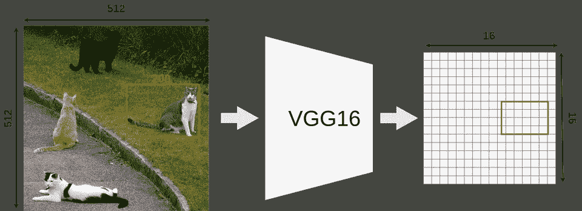***

****模型特征映射过程。猫 i* 法师来源:斯蒂芬妮·布斯[https://www.flickr.com/photos/bunny/](https://www.flickr.com/photos/bunny/)***

***我们的模型接受大小为 **512x512x3** (宽 x 高 x RGB)的图像输入，VGG16 将它映射到一个 **16x16x512** 特征图中。比例因子是 **32** 。***

***接下来，我们使用一个建议的 ROI(**145 x200**框)并尝试将其映射到特征图上。因为不是所有的物体尺寸都可以除以 32，所以我们放置的 RoI 不与网格对齐。***

***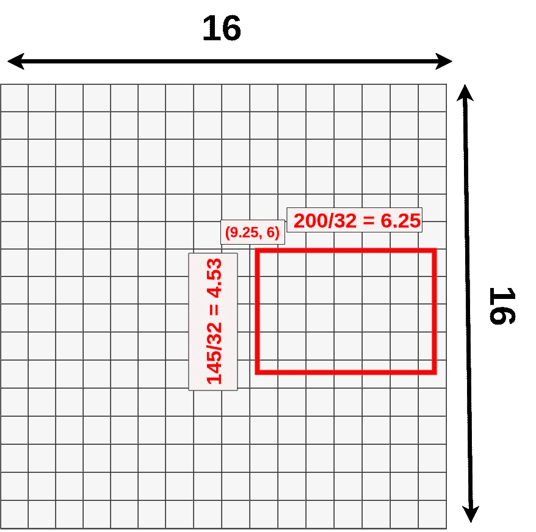***

****RoI 放置****

*   *****(9.25，6)** —左上角***
*   *****6.25** —宽度***
*   *****4.53** —高度***

***我们再次选择我们的池层大小为 **3x3** ，因此最终结果形状为 **3x3x512** (这只是一个任意的例子，以便更容易在图像上显示。您的池层可能会有不同的大小)。***

***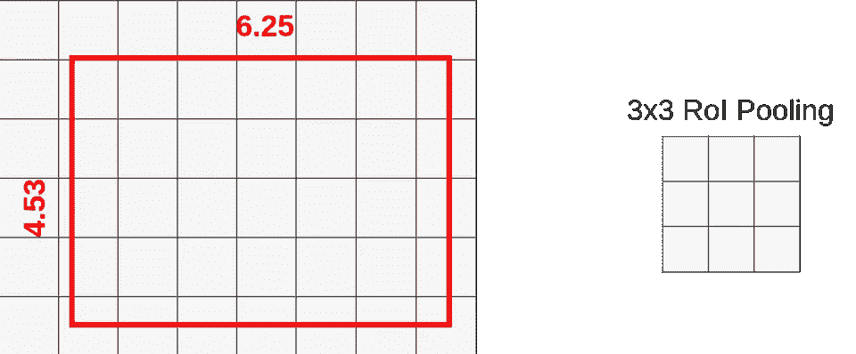***

****汇集层****

***至此，一切看起来与 [RoI Pooling](https://medium.com/@kemalpiro/understanding-region-of-interest-part-1-roi-pooling-e4f5dd65bb44) 中的完全相同。***

# ***RoI Align 简介***

***RoI Pooling 和 RoI Align 的主要区别在于量化。 **RoI Align 不使用量化**进行数据汇集。你知道快速 R-CNN 是两次应用量化。第一次在映射过程中，第二次在汇集过程中。***

******

****映射和汇集时的量化****

***我们可以跳过这一步，将原始 RoI 分成 9 个大小相等的方框，并在每个方框内应用双线性插值。让我们来定义盒子:***

***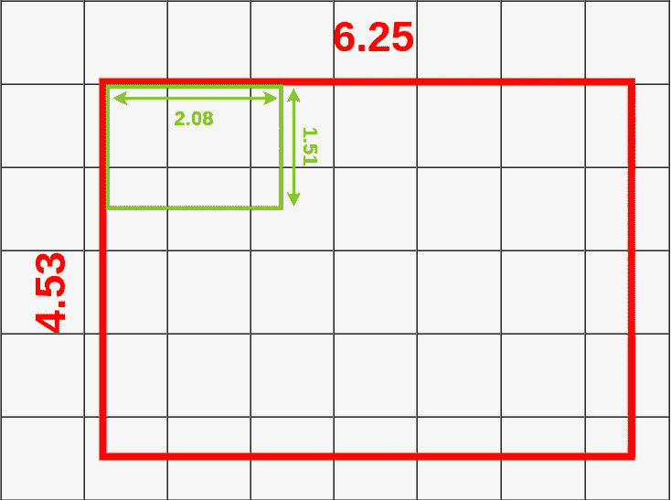***

****RoI 框尺寸****

***每个框的大小由映射的 RoI 的大小和汇集层的大小决定。我们使用的是 **3x3** 池层，所以我们必须将映射的 RoI ( **6.25x4.53** )除以 3。这给了我们一个高度为 **1.51** 和宽度为 **2.08** 的盒子(这里我将数值四舍五入以使其更简单)。现在，我们可以将我们的盒子放入映射的 RoI 中:***

***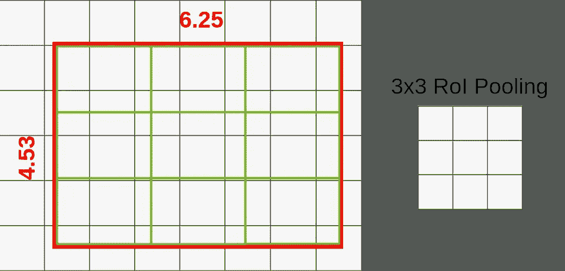***

****RoI 被分成多个方框****

***如果您查看第一个框(左上角)，您会注意到它覆盖了六个不同的网格单元。为了提取池层的价值，我们必须从中抽取一些数据。为了对数据进行采样，我们必须在那个盒子里创建四个采样点。***

***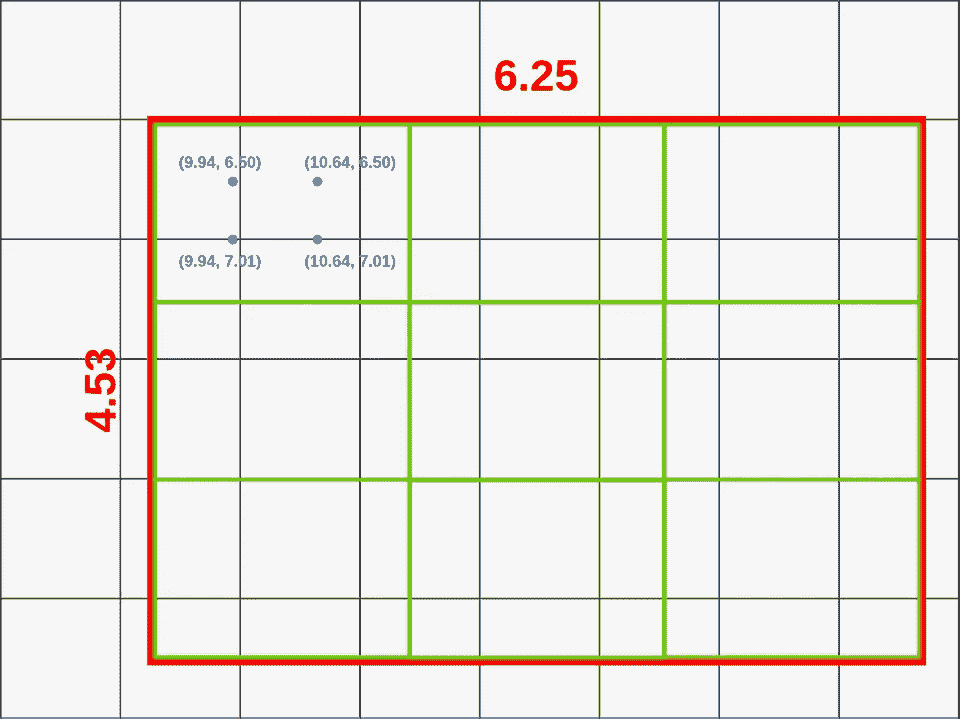***

****采样点分布****

***你可以通过**将盒子的高度和宽度除以 3** 来计算这些点应该在哪里。***

***在我们的例子中，我们像这样计算第一个点(左上角)的坐标:***

*   ***X = X_box +(宽度/3) * 1 = 9.94***
*   ***Y = Y_box +(高度/3) * 1 = 6.50***

***为了计算第二个点(左下角),我们只需改变 Y:***

*   ***X = X_box +(宽度/3) * 1 = 9.94***
*   ***Y = Y_box +(高度/3) * 2 = 7.01***

***现在，当我们有了所有的点，我们可以应用双线性插值来采样这个盒子的数据。双线性插值通常用于图像处理中对颜色进行采样，其公式如下所示:***

***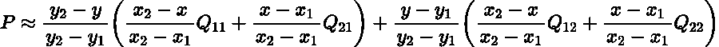***

****双线性插值方程****

***请不要试图理解这个等式，而是看一看它是如何工作的图形解释:***

***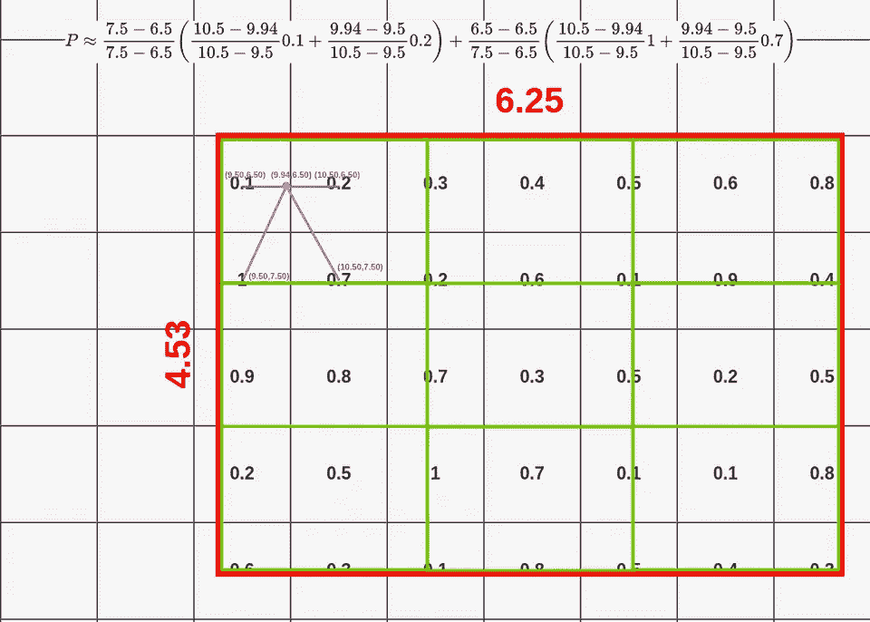***

****第一点的双线性插值****

***当你从我们的盒子中取出第一个点时，你把它和最近的相邻单元连接起来(正好在中间)，除非它已经被取了。在这种情况下，我们的点有坐标 **(9.44，6.50)** 。左上方向上最接近单元格中间的是 **(9.50，6.50)** (如果我们的点在网格上仅高出 0.01，则为(9.50，5.50))。然后我们必须选择一个左下方的点，最接近的点是 **(9.50，7.50)** 。遵循同样的规则，我们选择 **(10.50，6.50)** 和 **(10.50，7.50)** 作为右上角和右下角的点。在 RoI 上方，您可以看到获得第一个点的值(0.14)的整个计算过程。***

***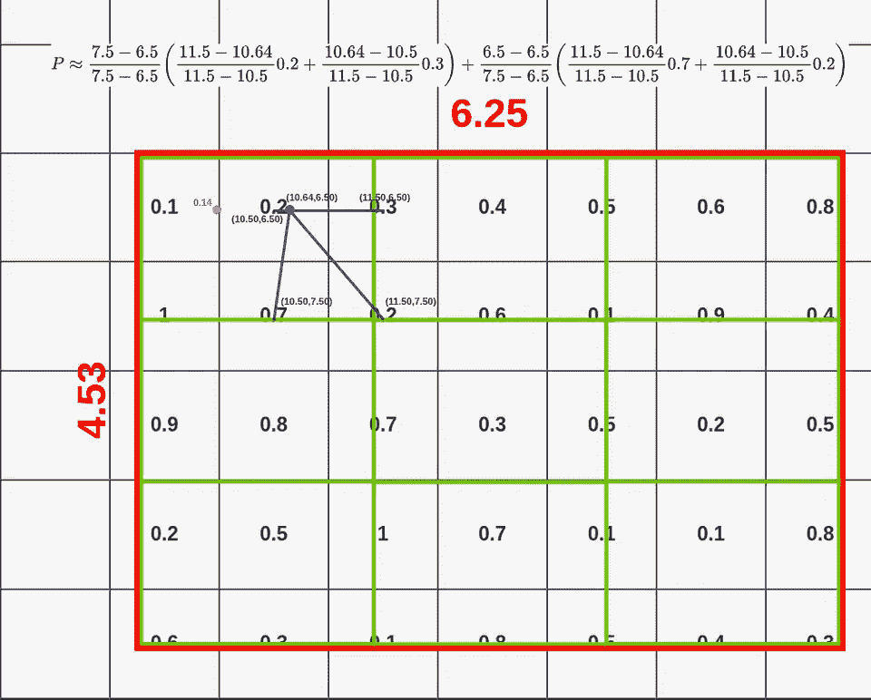***

****第二点的双线性插值****

***这次我们从以下位置开始插值:***

*   ***左上:(10.50，6.50)***
*   ***左下方:(10.50，7.50)***
*   ***右上:(11.50，6.50)***
*   ***右下:(11.50，7.50)***

***你应该在这里开始看到一个模式:)。以下是其他几点:***

***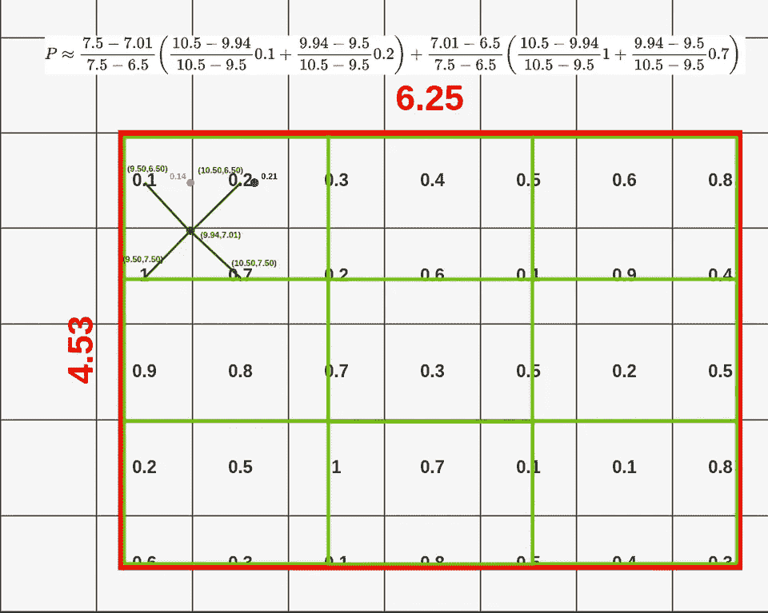***

****第三点的双线性插值****

*   ***左上:(9.50，6.50)***
*   ***左下方:(9.50，7.50)***
*   ***右上:(10.50，6.50)***
*   ***右下:(10.50，7.50)***

***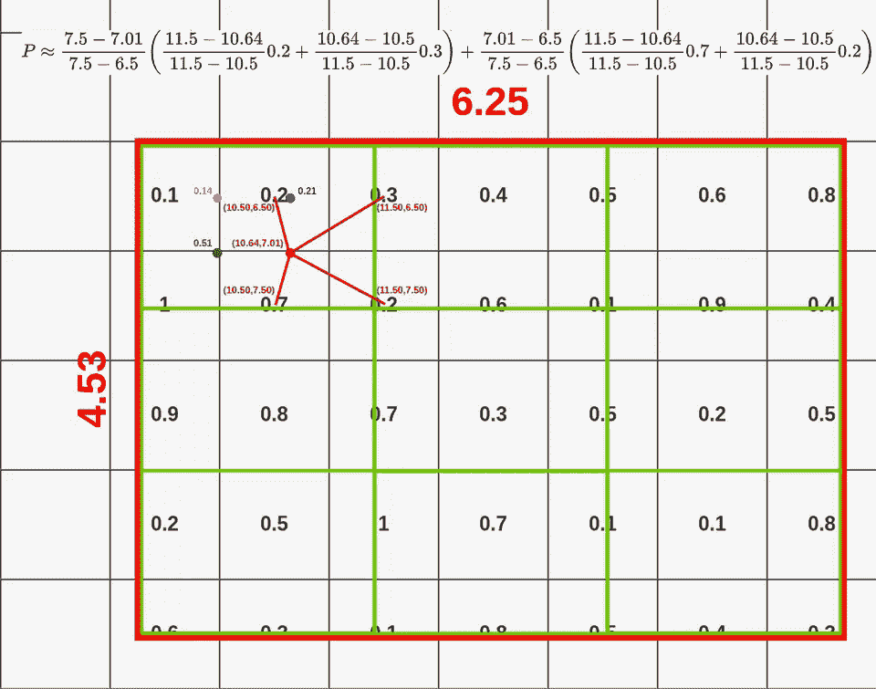***

****第四点的双线性插值****

*   ***左上:(10.50，6.50)***
*   ***左下方:(10.50，7.50)***
*   ***右上:(11.50，6.50)***
*   ***右下:(11.50，7.50)***

***现在我们已经计算了所有的点，可以对它们应用**最大池**(如果你愿意，也可以是平均池):***

***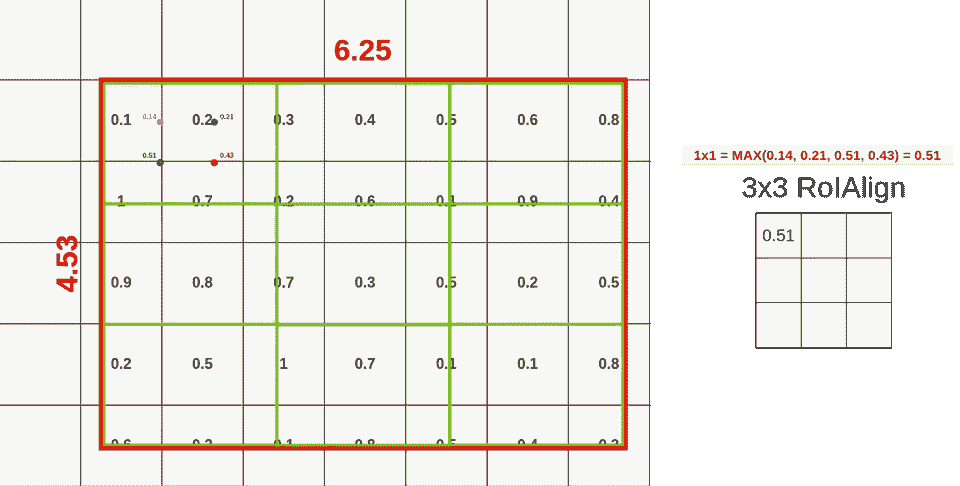***

****第一箱统筹****

***我不会给你看所有的插值，因为这会花很长时间，你可能已经知道如何做了。我将向您展示使用 RoIAlign 从该 RoI 汇集数据的整个过程:***

***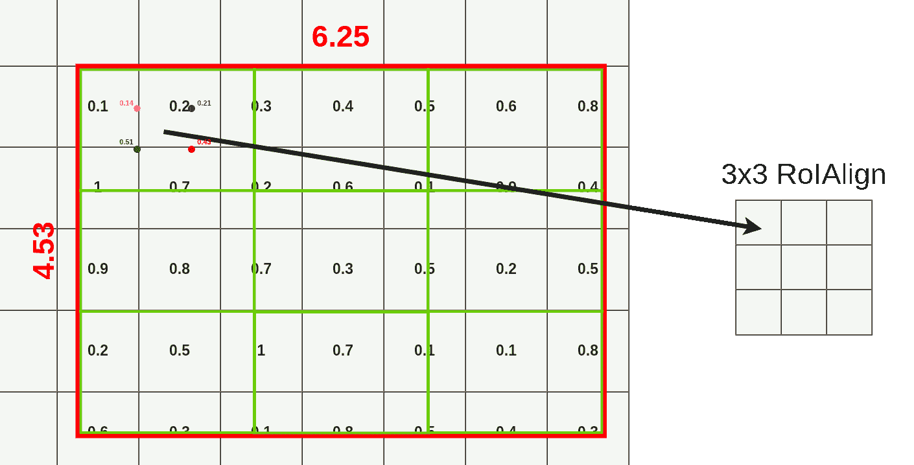***

****RoIAlign 池化过程(在新标签中打开图像以检查所有计算)****

***还有 ofc。此过程适用于所有图层，因此最终结果包含 512 个图层(与要素地图输入相同)***

***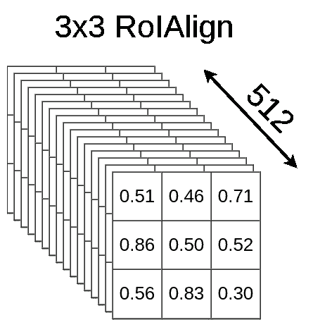***

****RoIAlign 全尺寸****

***请注意，即使我们没有将采样点放置在要素地图的所有像元内，我们也是通过双线性插值从这些像元中提取数据。***

***在这种情况下，单元格 11x6、11x7、11x8、11x9、11x10、13x6、13x7、13x8、13x9、13x10、15x6、15x7、15x8、15x9、15x10 中不会有任何点。如果您查看第二个点计算(第一个框)，它仍然使用 11x6 和 11x7 单元进行双线性插值，即使该点位于 10x6 单元中。***

***如果您比较 RoIAlign 和 RoIPooling 的数据损失/数据增加，您应该看到 RoIAlign 使用整个区域来汇集来自以下区域的数据:***

***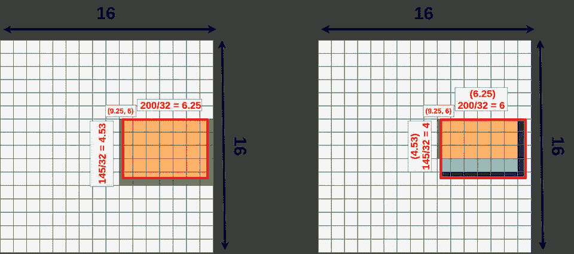***

****比较 RoIAlign(左)和 RoIPooling(右)数据源。****

*   ***绿色表示用于池化的附加数据。***
*   ***蓝色(两种阴影)表示数据在汇集时丢失。***

# ***洛奇普——在中间见我***

***通过多任务网络级联 在 [*实例感知语义分段中引入了第三种汇集数据的方法，这种方法被称为 **RoIWarp** 。RoIWarp 的想法与 RoIAlign 或多或少是一样的，唯一的区别是 **RoIWarp 是将 RoI 映射量化到特征映射上**。*](https://arxiv.org/pdf/1512.04412.pdf)***

***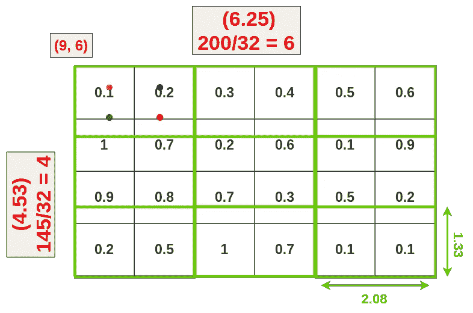***

****RoI 翘曲****

***如果从数据丢失/数据增加的角度来看:***

***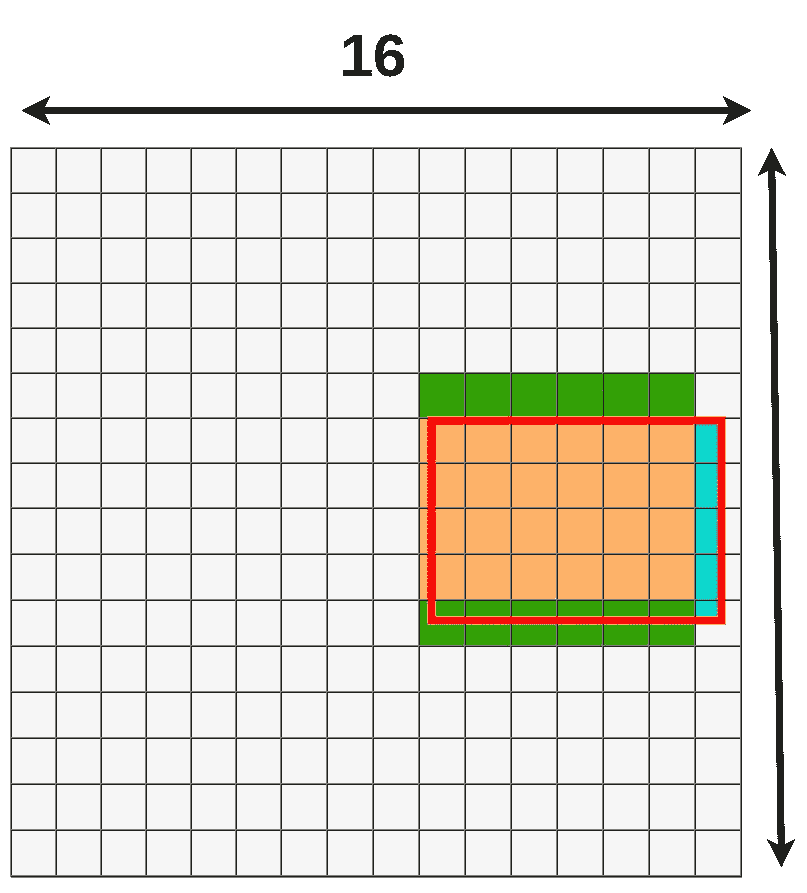***

****RoI 翘曲数据丢失/数据增加****

***由于双线性插值，我们只损失了一小部分。***

# ***RoIAlign 和 RoIWarp 如何影响精度***

***如果我们看一下 Mask R-CNN 的论文，有一些重要的数字需要讨论。第一个是在步幅为 16 的 ResNet-50-C4 上应用不同 RoI 层时**平均精度**的变化:***

***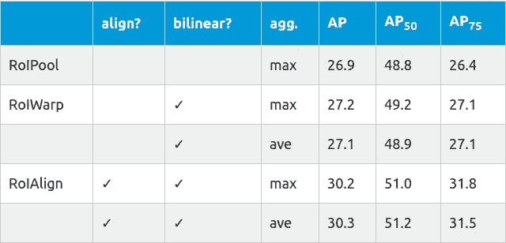***

***当应用 RoIWarp 时，只有很小的改进，但是应用 RoIAlign 使我们在精度上有了显著的提高。这种提升随着步幅的增加而增加:***

***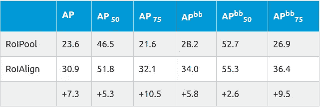***

***其中 **APbb** 是检测边界框的平均精度。测试在 ResNet-50-C5 上进行，步幅为 32。***

# ***摘要***

***当我们想提高我们的 R-CNN 类模型的准确性时，理解 RoI 池是很重要的。在 2014 年关于快速 R-CNN 的论文中提出的标准方法和 2018 年关于屏蔽 R-CNN 的论文中提出的新方法之间存在显著差异。这并不意味着这些方法只适用于特定的网络，我们可以很容易地在快速 R-CNN 中使用 RoIAlign，在 Mask R-CNN 中使用 RoIPooling，但你必须记住，RoIAlign 平均来说可以提供更好的精度。***

***我真的希望我的解释很容易理解，因为我已经看到了很多关于投资回报池的帖子，而没有进入计算。在我看来，更直观的方法总是更好，尤其是如果你不想花一整天的时间一遍又一遍地阅读原始论文以最终理解它的作用。***

# ***参考资料:***

*   ***R.吉斯克。快速 R-CNN。2014 年[https://arxiv.org/pdf/1504.08083.pdf ICCV](https://arxiv.org/pdf/1504.08083.pdf)***
*   ***J.戴，贺国强，孙军。基于多任务网络级联的实例感知语义分割。2016 年[https://arxiv.org/pdf/1512.04412.pdf CVPR](https://arxiv.org/pdf/1512.04412.pdf)***
*   ***K.何、g .基约萨里、p .杜尔和 r .吉希克。面具 R-CNN 在 ICCV，2018[https://arxiv.org/pdf/1703.06870.pdf](https://arxiv.org/pdf/1703.06870.pdf)***

****原载于*[*https://erdem . pl*](https://erdem.pl/2020/02/understanding-region-of-interest-part-2-ro-i-align)*。****