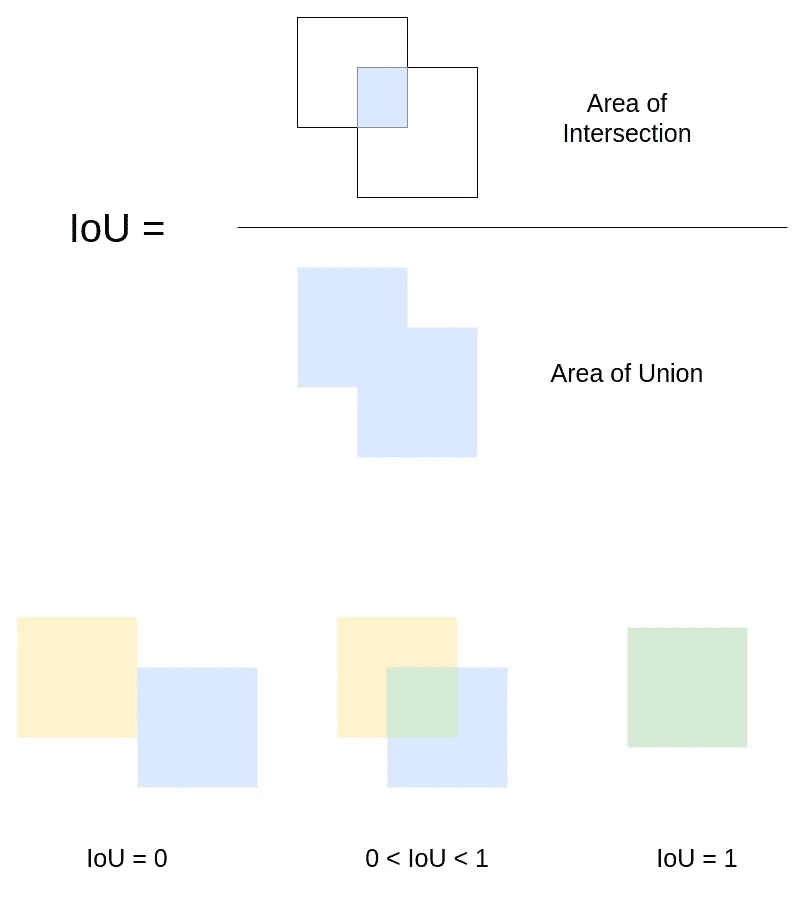
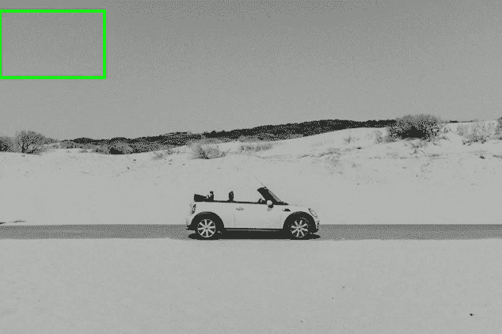
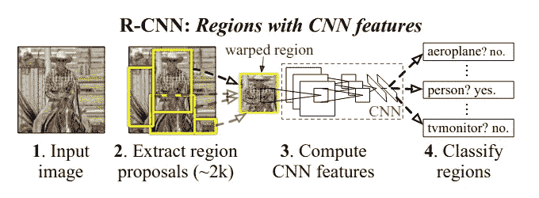
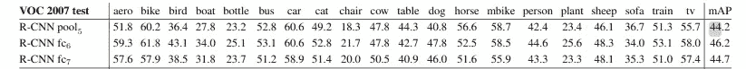
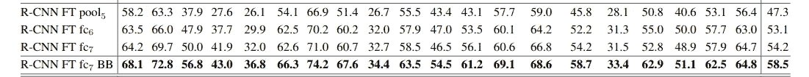
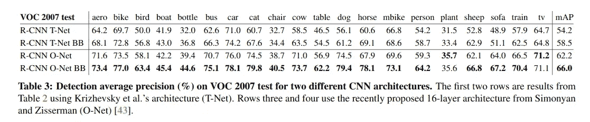

# 了解具有 CNN 功能的区域(R-CNN)

> 原文：<https://towardsdatascience.com/understanding-regions-with-cnn-features-r-cnn-ec69c15f8ea7?source=collection_archive---------38----------------------->

## R-CNN 物体探测完全指南

## R-CNN 的架构细节以及模型设计和论文的关键要点

由 [Unsplash](https://unsplash.com?utm_source=medium&utm_medium=referral) 上的 [Pietro Jeng](https://unsplash.com/@pietrozj?utm_source=medium&utm_medium=referral) 拍摄

在这篇博文中，我解释了关于“用于精确对象检测和语义分割的丰富特征层次”这篇文章的架构细节。虽然这篇文章已经发表了一段时间，但是除了架构之外，还有很多东西需要从这篇文章中学习。我首先简要介绍了过量饮食网络，然后介绍了 RNN 网络。如果你对过食网一无所知，那么不用担心！！你仍然不会错过任何东西。

还有，博客的结构有点不一样。这更像是学生和老师之间的对话(尝试用费曼技巧学习😃).学生端的问题用粗体突出显示(以防你赶时间)。

## **学生**

我精通著名的对象分类算法，比如 VGG、AlexNet、ResNet、InceptionNet、MobileNet(以及它们所有的变体)等等。我对这种方法的架构感到惊讶，并希望进一步扩展我在这一领域的知识。然而，我脑海中有一个问题，这些模型只能判断图像中是否包含物体。然而，我想研究还能判断物体在图像中的位置的模型？

## **老师**

你希望冒险进入的深度学习部分也已经分类如下:图像定位、对象检测和图像分割。

> **物体检测:**预测多类多个物体的包围盒。也可以包含许多属于同一类的对象。
> **图像定位:**预测图像中单个类别的单个对象的边界框
> **图像分割:**为图像中的每个对象创建逐像素的掩模。

在这三者中，我们将讨论对象检测。在深入研究 R-CNN 架构细节之前，我想让您了解一下 Union 上的交集的概念。两个框之间的相交面积除以两个框所占面积的并集，定义为并集上的交集。在下图中，上半部分显示了公式的可视化表示。

并集上的交集(IoU)——作者在 [draw.io](https://app.diagrams.net/) 的帮助下创作的图片

设上面图像下半部的蓝色方框是物体边界方框的预测，黄色方框是另一个预测。所以，当两个盒子完全重叠时，IoU 为 1，当它们完全不重叠时，IoU 为 0。所有其他情况都在 0 和 1 之间，精确值可以通过使用边界框坐标来确定。在训练和评估性能时，其中一个框可以被标记为基础事实，如果 IoU 低于特定阈值，则预测可以被认为是假阳性。记住这个解释，我们一会儿会需要它。

此外，网络中使用的性能测量是[平均精度](https://medium.com/@jonathan_hui/map-mean-average-precision-for-object-detection-45c121a31173) (mAP)。平均精度的本质就像准确性一样，地图越多越好。在跳到 R-CNN 之前，我们先来看看 R-CNN 之前流行的一个模型。

使用卷积神经网络进行对象检测的第一篇论文之一是 [OverFeat](https://arxiv.org/pdf/1312.6229.pdf) 。他们使用滑动窗口方法来检测图像中不同位置的物体。他们还使用了图像金字塔，以便在放大的图像中检测较小的对象，在较小的图像中检测较大的对象。下面的 gif 将让你对滑动窗口的使用有一个直观的了解。

用于对象检测的滑动窗口方法—作者 gif，照片由 [Sonnie Hiles](https://unsplash.com/@sonniehiles?utm_source=medium&utm_medium=referral) 在 [Unsplash](https://unsplash.com?utm_source=medium&utm_medium=referral) 上拍摄

OverFeat 的作者使用 AlexNet 作为他们的基础架构，并提供了两个网络，一个快速，另一个精确。他们用 1 x 1 卷积层取代了 CNN 的全连接层(这是一个好主意)，减少了计算量，提高了训练和测试的速度。它们还有一个回归层，从 Pool5 层获取输入，并通过两个密集层传递它们，然后最终输出有 4 个单元来确定边界框。

> **注意:**我过度简化了对超喂纸的解释，并且有许多关于架构的微妙细节，这些细节请参考[纸](https://arxiv.org/pdf/1312.6229.pdf)

## **学生**

我没有时间深入研究过厚的纸张，但是根据你展示的 gif，看起来是不是窗口选择的图像的许多子部分不会检测到任何对象？像这些区域将被检测器选择，通过整个 CNN 架构发送，并且仍然不产生任何对象并且增加计算成本？**如果我们能以某种方式给模型一个提示，这些地方可能有一些物体，而模型只会告诉我在特定的位置是否有物体，这不是更好吗？**

## **老师**

你强调的问题确实是过度饮食的警告。R-CNN 的论文做了一些类似于你直觉认为应该做的事情。它使用[选择性搜索](https://www.learnopencv.com/selective-search-for-object-detection-cpp-python/)算法来检测图像中某个对象的可能位置，并只将这些图像部分(大约 2000 个区域建议)发送到 AlexNet 网络。他们用 SVM 层替换了最后一个 Softmax 层，并在 Pascal VOC 2007 上只训练了用于分类的 SVM 层(关于训练的细节将在后面解释)。此外，Pascal VOC 数据集有 20 个类，但他们为 SVM 训练了 21 个类，其中额外的类对应于没有对象的背景类。通过这种方法，他们能够获得 44.7%的 mAP。看看建筑吧！

R-CNN 网络架构— [论文](https://arxiv.org/pdf/1311.2524.pdf)

## **学生**

对于 Pascal VOC 上的对象检测来说，这些确实是很好的结果，因为它们比当时的当代模型好得多。然而，我有这样一个查询，**由于 ImageNet 数据集与 Pascal VOC 数据集相比来自不同的分布，作者难道不应该对模型进行微调吗？**根据我所知的文献，如果数据集分布发生变化，我们通常会对模型进行微调。此外，**卷积网络接受固定大小的输入，例如，在 AlexNet 的情况下为 227 x 227，那么它们如何在选择性搜索算法提出的区域上应用约束呢？**

## **老师**

作者首先**将图像扭曲**到 227 x 227 大小，然后将它们传递给输入，这时他们在训练 SVM 后得到了 44.7%的地图。扭曲图像时，图像中的对象可能会被**拉伸、拉长、挤压等**，它们甚至可能会妨碍性能。因此，作者首先微调整个 AlexNet 网络进行分类。之后，作者用 SVM 层替换了 Softmax 层，只训练这一层。由于这种微调，地图从 44.7%增加到 54.2%。

还有一个关于用于微调和 SVM 训练的数据的细节。在 ImageNet 数据集上训练预训练网络。在微调模型时，作者使用了 Pascal VOC 2007 数据集。在微调过程中，即 softmax 层位于顶部时，包含 IoU ≥ 0.5 的图像被用作地面实况正框，其余图像被用作负类(背景，无对象)。然而，为了训练 SVM，他们仅使用真实的图像作为训练，并带有 IoU < 0.3 as negative class. The remaining grey zone proposals were ignored. The authors also replaced the SVM with 21 way Softmax and the mAP dropped from 54.2% to 50.9%.

> **注意:**关于为 Softmax 和 SVM 选择阳性和阴性样本的详细信息在本文的附录 B 中提供

## **学生**

这是我第一次遇到这样的微调方法。**RCNN 的论文还有其他特点吗？**

## **老师**

是的，有。作者对他们的建筑做了详尽的烧蚀研究。大部分讨论都围绕着密集层和微调网络的必要性。让我们这样来看。

***无需微调*** 作者从网络的 Pool5 层提取特征，然后从 fc6 层，再从 fc7 层提取特征。对于提取的每个要素，他们分别训练 SVM 图层并生成地图。看看下面的图片。

没有微调的地图— [纸](https://arxiv.org/pdf/1311.2524.pdf)

从上图的最后一列中，我们看到删除两个 FC 层并没有对性能造成太大影响。此外，来自 fc6 层的特征比来自 fc7 层的特征是更好的预测器。以下是作者在观察后所说的话。

> 这意味着 CNN 的 29%，即大约 1680 万个参数可以在不降低 mAP 的情况下被删除。更令人惊讶的是，移除 fc7 和 fc6 产生了相当好的结果 7，尽管 pool5 特征仅使用 6%的 CNN 参数来计算。

*作者们现在已经用各种方式对网络进行了微调。首先，当他们直接使用 Pool5 的功能并将其发送到 SoftMax 以微调整个网络时。在这种情况下，他们发现 Pool5 的功能在没有微调的情况下增加了 3%。接下来，他们对 fc6 和 fc7 层也做了同样的事情，分别增加到 53%和 54.2%。*

**

*带微调的地图— [纸](https://arxiv.org/pdf/1311.2524.pdf)*

*您可以将调优后获得的结果图与上图中共享的未调优结果图进行比较。微调大大改善了结果。但是，第四排有一些特殊之处，我们来讨论一下！！*

****使用包围盒回归器***
作者已经添加了一个包围盒回归器到池 5 层的输出中。这样做之后，他们发现 58.5% mAP 的性能有了相当大的提高。这是一个未经微调的模型在地图上几乎 14%的提升。这个包围盒回归用 l2 损失来训练，并且用λ= 1000 来惩罚。*

> ***注:**关于边界框回归器的详细信息见本文附录 C。*

*作者还尝试用 VGG-16 代替 AlexNet，发现使用边界框回归器时 mAP 增加了 8%。*

**

*具有不同模型架构的地图— [论文](https://arxiv.org/pdf/1311.2524.pdf)*

*我现在建议您阅读这篇文章，以便更深入地了解这篇文章和实现细节。他们还提供了 ILSVRC2013 探测数据集的详细说明，并将他们的模型与其他模型进行了比较。*

## ***学生***

*这是作者做的非常详尽的分析。这篇文章可能有点旧了，但是模型架构的分析方法是值得注意的。**这些通过实验验证层对精度提高的贡献的策略，可以在设计任何其他类型的模型时使用，甚至可以用于一些其他任务。***

## *教师*

*是的，他们已经对他们的模型进行了详细而全面的分析，并与当代模型进行了比较。最后一点，出于定义的原因，像 R-CNN 这样的模型被称为**两阶段**模型。这种模型具有用于检测物体的可能位置的独立算法/模型(选择性搜索)和用于检测物体存在的独立模型(AlexNet)。并且这个模型(包括包围盒回归器)的训练是一个**的三阶段过程**，其中第一阶段，模型被微调，第二阶段，SVM 分类器被训练，第三阶段，包围盒回归器被训练。*

> ***注意:**我已经讨论了 R-CNN 论文中 Pascal VOC 2007 数据集的分数和分析。该文件还显示了对其他数据集的深入分析。*

# *参考*

*R.Girshick，J. Donahue，T. Darrell，J. Malik，[用于精确对象检测和语义分割的丰富特征层次，](https://arxiv.org/pdf/1311.2524.pdf)计算机视觉和模式识别，2014 年*

*X.张，M. Mathieu，R. Fergus，Y. LeCun， [OverFeat:使用卷积网络的集成识别、定位和检测](https://arxiv.org/pdf/1312.6229.pdf)，计算机视觉与模式识别，2014*