# 使用新冠肺炎数据集了解回归-详细分析

> 原文：<https://towardsdatascience.com/understanding-regression-using-covid-19-dataset-detailed-analysis-be7e319e3a50?source=collection_archive---------10----------------------->

## 确诊 COVID 病例的计数是否取决于检测？


每个数字都讲述一个故事(图片由 Unsplash 提供)

希望你们都平安健康！新冠肺炎已经完全改变了 2020 年的进程，使全球经济大幅萎缩。在这篇博客中，我们将深入探讨回归分析，以及我们如何使用芝加哥 COVID 数据集来推断令人难以置信的见解。微积分和线性代数的一些直觉会让你的旅程更容易。欢迎来到我的第一个博客！

# 概念

线性回归不仅仅是一种机器学习算法，它在统计学中发挥着巨大的作用。来自一个监督学习的家族，这里的每个输入都与一个目标标签相关联。模型的任务是基本理解模式，并找到覆盖每个(输入、目标)对的最佳拟合线。

**概括地说，可以根据执行的任务和产出的性质对 ML 模型进行分类:**

> **回归**:产量是一个连续变量。
> **分类**:输出是分类变量。
> **聚类**:没有输出的概念。
> 
> 回归和分类属于**监督学习**，而聚类属于**非监督学习。**

回归是预测建模技术的一种形式，我们试图找到因变量和一个或多个自变量之间的重要关系。有各种类型的回归技术:线性，逻辑，多项式，岭，套索，Softmax。

# 线性回归

根据术语本身，您可以猜测模型沿直线运行，其中 y 可以通过输入变量 x 的线性组合来计算。线性回归假设函数可以表示为:

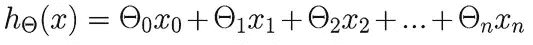

线性回归假设函数(图片作者提供)

**θ**此处存储输入特征 **x** 的系数/权重，与 **x** 的维度完全相同。注意，为了在我们的模型中添加对常数项的支持，我们在向量 **x** 前面加上了 **1** 。

对于单个输入和输出变量，该方法称为简单线性回归，而对于多个输入/特征，该方法称为多元线性回归。对于这两者，我们的目标是找到最佳拟合线，使我们的目标变量(y)和所有样本的预测输出之间的误差平方和(SSE)或均方误差(MSE)最小化。

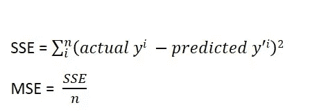

SSE 和 MSE 计算(图片由作者提供)

为了继续，我们需要找到最佳拟合线的参数/系数。有多种方法可以得出直线的几何方程，例如最小绝对偏差(最小化残差绝对值的总和)和 Theil–Sen 估计量(找到一条直线，该直线的斜率是由成对样本点确定的斜率的中值)，但是，统计学家通常使用*普通最小二乘法(OLS)* 。OLS 只不过是一种最小化生产线和实际输出之间距离的方法。如果要手工计算回归线，它用了一个略显吓人的公式，求斜率' **θ1** '和线截距' **θ0** '。

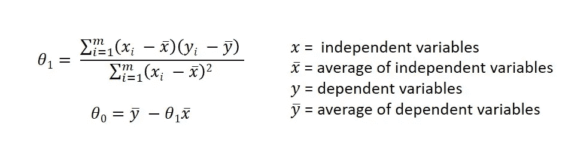

使用 OLS 寻找截距和斜率(图片由作者提供)

有两种方法/解决方案使用最小二乘法来实现线性回归模型:

*   封闭解—正规方程
*   优化算法(梯度下降、牛顿法等。)

## 正态方程

重要的是要明白，θ，在这里基本上可以打破或建立模型。我们的目标基本上是寻找有助于实现模型最低成本的θ。

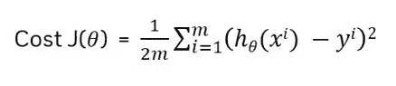

著名的成本函数(图片由作者提供)

目标/成本函数 J(θ)的选择可以根据手头的问题有很大的不同。一般来说，均方误差最适合回归，交叉熵最适合分类。所以，回到正规方程，它使用一种分析方法来寻找方程的参数。我花了一些时间才明白为什么事情会这样发展。希望这个简短的证明能让你掌握概念。

如果我们取残差向量为 **e =Xθ — y** ，那么向量形式的成本函数/残差平方和将为:

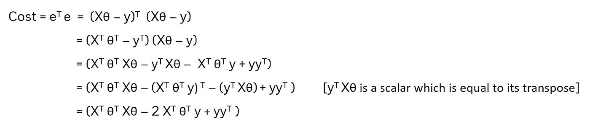

正规方程推导(图片由作者提供)

对于刚接触线性代数的人来说，请注意我们不能简单地平方**xθ—y。**向量乘法属性声明向量/矩阵的平方不等于其每个值的平方。所以为了得到平方值，我们把向量和它的转置相乘。

现在，为了找到最小化残差平方和的 **θ** ，我们需要对上面的成本函数求关于 **θ的导数。**

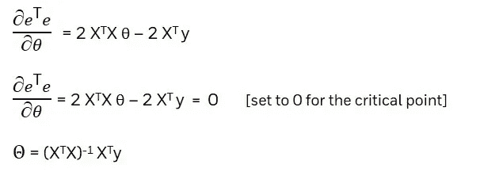

法方程估计系数 **θ向量**(图片由作者提供)

这就是正规方程所能提供的一切。一个非常直接和优雅的方法来找到确切的 **θ** 参数，这将创造奇迹，适合您的数据！然而，这里有一个问题。矩阵反函数不适用于较大的数据集(较大的 X 值)或逆矩阵可能不存在的数据集(矩阵不可逆或奇异)。即使是当今最有效的逆算法也只能给出 T2 的三次方时间复杂度 T3。对于“较小”的数据集，可以首选正规方程解，如果计算“昂贵”的矩阵求逆不是问题，但对于真实世界的数据集，则首选梯度下降或 SGD 等方法。

## 梯度下降

这里的目标类似于我们对正常方程的目标。梯度下降算法通过对θ0 和θ1 应用各种参数来计算出最小成本函数，直到它达到收敛。它被认为是最小化残差的最佳迭代优化算法之一。


作者图片

**直觉**

将一个碗或任何凸形物体视为您的成本函数。如果你从碗的四周扔出任何物体，它会走最短的最佳路线，并且会到达底部。该最低点将为我们提供最低成本和 **θ** 参数，以获得最佳拟合模型。

如果我们有许多局部极小值而不是一个全局极小值，很少会有挑战。成本函数通常不是一个普通的碗。它可能会过早停止，或者需要不确定的时间来收敛。不过还好！线性回归中的代价函数是凸的，因此没有任何经过两点之间的直线与曲线相交。

这是一个非常简单的过程。GD 的过程从初始化一些随机的 **θ** 值开始。我们通过将这些值代入成本函数来计算成本。成本函数的导数将给出该点的斜率，这样我们就知道为了获得更低的成本，下一步应该朝哪个方向走。这是怎么发生的？我们使用该导数值来更新每一步的所有 **θ** 系数，直到我们达到最低水平并且不再有成本降低。简单！不是吗？

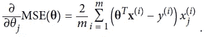

成本函数的偏导数(图片来自作者)

要一次性计算所有这些参数，我们可以使用包含每个模型参数的偏导数的梯度向量。

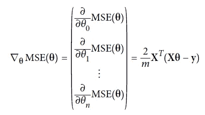

成本函数的梯度向量(图片由作者提供)

注意，这个梯度向量指向上坡，所以下坡我们需要反方向走。一旦我们有了梯度向量，我们需要找到学习率 ***η*** 来确定下坡台阶的量。

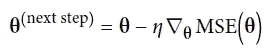

每步后更新权重(图片由作者提供)

在尝试不同的 eta ***η值时，有一些事情需要记住。*** 如果学习率太低，可能需要不确定的时间才能收敛到最优值。然而，将它保持在高位可能会让它跳到另一边，并无限振荡。所以， ***η*** 应该保持在两者之间。为了找到一个好的学习率，我们可以应用网格搜索。通过这样，我们尝试和测试各种 ***η*** 值，保持对迭代次数的限制。收敛较快的将是问题的良好学习速率。该方法被称为**批量梯度下降**，因为它在整个训练集 x 上执行计算。

还有两种没有太大区别的梯度下降—

## 随机梯度下降

如果我们有非常大的数据集，批量梯度下降会爆炸。可能要花很长时间才能完成。random 的工作方式与 Batch GD 类似，但是它在训练集中选择一个**随机实例**，并仅基于该实例计算梯度。所有其他的计算都是一样的。它比批处理更快，因为在操作时我们的数据少了。

然而，这种算法没有被经常使用，因为它随机地获取实例，这使得成本函数反复地变高变低。即使收敛到最优，也会继续反弹。此外，它经常不止一次地选择实例，所以建议继续混排数据。
**提示:**
所以，最好一开始就有较大的学习率，然后慢慢降低。

## 小批量梯度下降

它需要小规模的随机实例集。但有时，摆脱局部最小值可能会变得更加困难。就不规则性而言，它优于随机梯度下降。

> 摘要
> 
> 三者都接近最小值，但是批量梯度下降实际上在最小值停止。
> 
> 对于较大的数据集，批量梯度下降将需要较长的时间。如果我们知道如何改变学习速率，随机和小批量将更快地达到最小值。

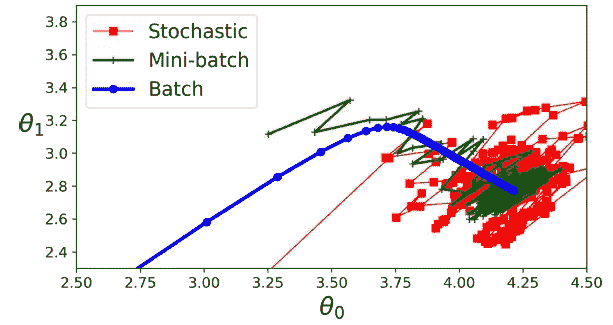

GD，SGD，Mini GD 的对比(来源:Book[Aur _ lien _ G _ Ron]_ Hands-On _ Machine _ Learning _ with _ Sc)

# 线性回归模型示例— COVID

让我们首先浏览一下芝加哥的新冠肺炎数据集。你可以从[这里](https://github.com/Ayushijain09/Regression-on-COVID-dataset)下载数据集。

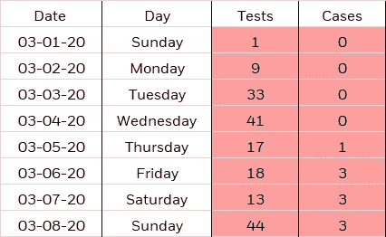

数据集(作者提供的图片)

网上 80%的 COVID 数据集是时间序列格式，显示每天的病例数。因此，只有死亡和测试计数，我只能想象是否已经达到峰值，或者是否还在增加等等。但是为了进行预测，我希望拥有案例计数可以依赖的特性。我们还知道，在许多国家，检测工作做得不充分，因此病例数量较少。因此，我把重点放在可以获得测试和案例特征的数据集上，以弄清楚这两者之间是否存在巨大的相关性。

幸运的是，我找到了这个小型的芝加哥数据集，它具有测试与案例计数等特性。您可以观察到数据如何在散点图上显示略微呈线性的模式，从而显示相关性。

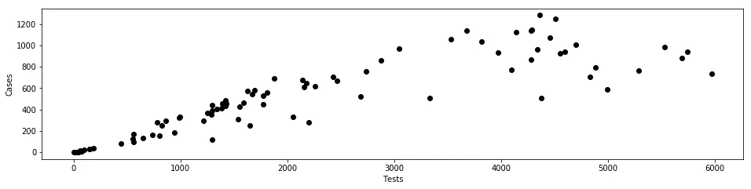

散点图(图片由作者提供)

如你所见，**自变量是测试** (x)和**因变量是案例(y)** 。我们的数据集中还有一些特征，给出了 30 岁以上或更年轻的人以及拉丁人的数量，等等。我个人无法推断出我们可以用这样的特征分析什么。你可以试试看，让我知道我们是否能推断出什么。

开始编码吧:)

*   **导入所有需要的库**
    - pandas & numPy 用于执行科学运算
    -线性回归&多项式特征用于构建模型
    - train_test_split 用于将数据集划分为训练和测试子集
    - MSE & r2_score 度量用于分析模型性能
    - seaborn 和 pyplot 用于可视化图形

```
import pandas as pd
import numpy as npfrom sklearn.linear_model import LinearRegression
from sklearn.preprocessing import PolynomialFeatures
from sklearn.model_selection import train_test_splitfrom sklearn.metrics import mean_squared_error
from sklearn.metrics import r2_scoreimport seaborn as sns
import matplotlib.pyplot as plt
```

*   **使用 pandas 导入 CSV 数据集。**它输出一个数据帧，一个二维标记的数据结构。
    *data.head()* 显示数据集中的前 5 行，让我们了解对象中是否有正确的数据类型。

```
data = pd.read_csv("COVID-19_Daily_Testing.csv")
data.head()
```

*   以获得数据集的**简明摘要**。
    *Info()* 方法打印关于数据帧的信息，如索引数据类型和列数据类型、非空值和内存使用情况。

```
print(data.info())
```

*   是时候清理一些**数据了！** 案例和测试计数是字符串格式，因此我们在千位值中有一个逗号(例如 1，468)
    *PD . to _ numeric()*会将类型从 string 转换为 int32。

```
data['Cases'] = data['Cases'].str.replace(',', '')
data['Tests'] = data['Tests'].str.replace(',', '')data['Cases'] = pd.to_numeric(data['Cases'])     
data['Tests'] = pd.to_numeric(data['Tests'])
```

*   通常，在真实世界的数据集中，有许多要素，很难检查哪对要素显示出良好的相关性。此外，检查是否存在任何多重线性问题。下面的代码基本上绘制了数据集中的成对关系，这样每个变量在 x 轴和 y 轴上都是共享的。

```
data_numeric = data.select_dtypes(include=['float64', 'int64'])
plt.figure(figsize=(20, 10))
sns.pairplot(data_numeric)
plt.show()
```

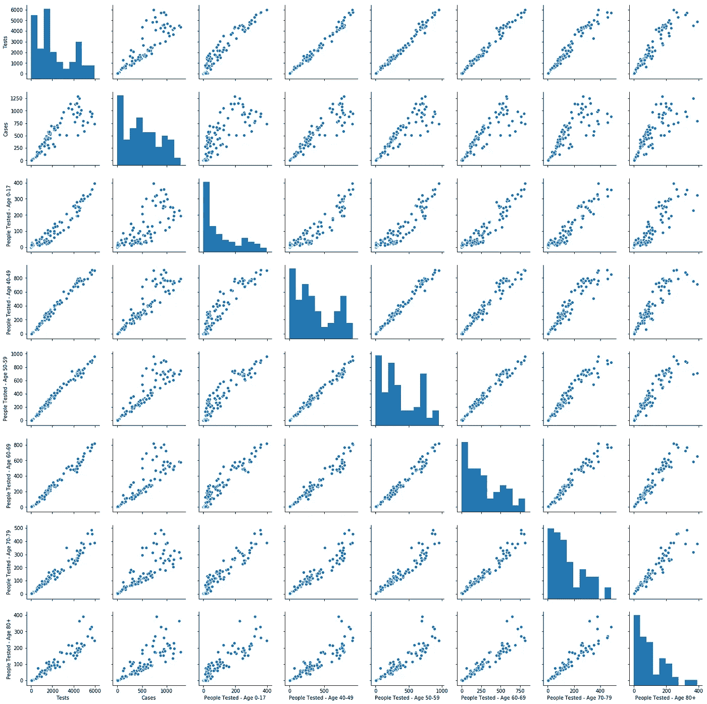

特征对图(图片由作者提供)

大多数情况下，它们都呈现出一种不应该发生的线性模式！这就产生了著名的多重线性问题。

**多重线性问题**是当回归模型中的独立变量表现出相关性时。自变量应该是独立的。通俗地说，你可以认为几个变量本质上衡量同一件事。没有必要用一个以上的变量来衡量一个模型中的同一事物。这基本上降低了估计系数 **θ** 的精度，削弱了你的**回归**模型的统计能力。

为了诊断多重共线性**，**，我们使用一种叫做方差膨胀因子(VIF)的方法。方差膨胀因子(VIF)用于测量与预测变量不线性相关时相比，估计回归系数的方差膨胀了多少。经验法则是，如果我们有 **VIF > 10** ，模型具有高度多重线性。

您可以在上图中看到，我们的数据集中存在高度多重线性。好的一面是，我在我的模型中只采用了 2 个特征，但在将来，如果你创建任何回归模型，检查 Vif 并删除彼此相关的独立变量。

*   **缩放数据集** 特征值可能有不同的比例。因此，为了更好地进行分析和预测，最好将它们转换为相同的比例

```
X = data['Tests'].values.reshape(-1,1)
y = data['Cases'].values.reshape(-1,1)
```

*   **应用线性回归**

```
reg = LinearRegression()
reg.fit(X, y)
predictions = reg.predict(X)
print("The linear model is: Y = {:.5} + {:.5}X".format(reg.intercept_[0], reg.coef_[0][0]))plt.figure(figsize=(16, 8))
plt.scatter(
    X,
    y,
    c='black'
)
plt.plot(
    X,
    predictions,
    c='blue',
    linewidth=2
)
plt.xlabel("Tests")
plt.ylabel("Cases")
plt.show()
```

我们得到这条直线 **Y = 97.777 + 0.18572X**

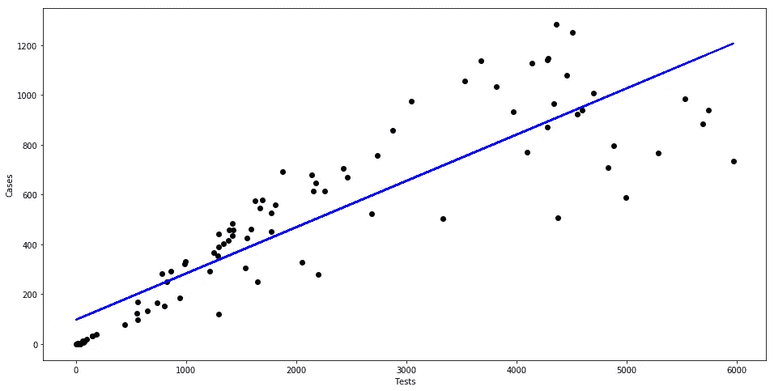

线性回归图(图片由作者提供)

**线性回归的均方根误差= > 171.8**

正如你所看到的，我们有许多异常值，因为它不能很好地拟合数据。在数据复杂的情况下，我们可以尝试通过应用多项式回归来减少 RMSE。

# 多项式回归

线性回归的特殊情况，我们试图用一个 n 次多项式方程来拟合数据。它**在发现特征间关系的能力上胜过 LR** 。在这里，我们为每个特性添加了能力，并将它们添加到我们现有的特性中。将在这个扩展的特征集上进行训练，以获得目标变量和独立变量之间的曲线关系。

```
poly = PolynomialFeatures(degree =4) 
X_poly = poly.fit_transform(X) 

poly.fit(X_poly, y) 
lin2 = LinearRegression() 
lin2.fit(X_poly, y) 
pred = lin2.predict(X_poly)
new_X, new_y = zip(*sorted(zip(X, pred)))plt.figure(figsize=(16, 8))
plt.scatter(
    X,
    y,
    c='black'
)
plt.plot(
    new_X, new_y,
    c='blue'
)
plt.xlabel("Tests")
plt.ylabel("Cases")
plt.show()
```

Scikit learn PolynomialFeatures 类由一个度数参数组成，我们可以将其添加为应用于数据的最大功率。你需要尝试和测试哪个学位最大程度地减少 RMSE。在尝试了不同的程度值后，我发现程度 4 给了我最好的解决方案。

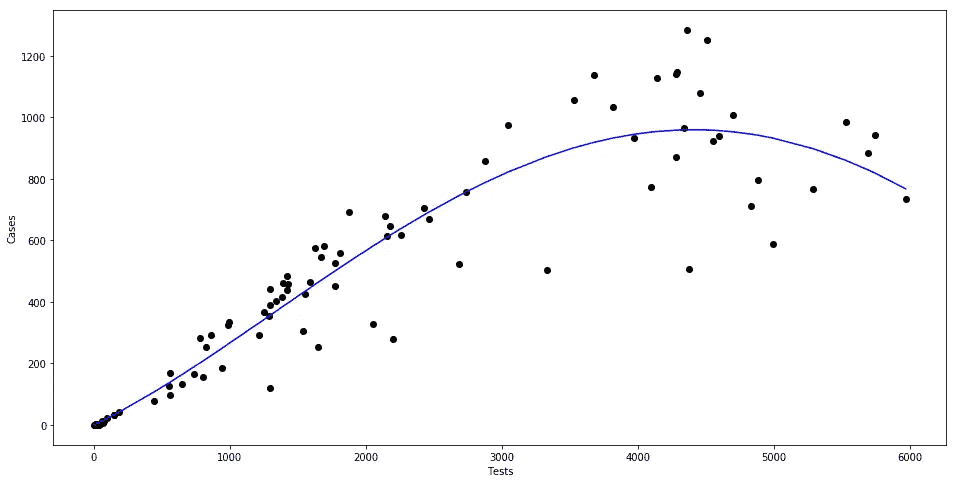

多项式回归图(图片由作者提供)

**多项式回归的均方根误差= > 131.08。** 观察这个图如何完美地拟合数据，至少比线性回归好。此外，RMSE 下降了很大程度，这又一次证明了它的善良。要获得模型的性能，还需要更多的概念，比如它是过拟合还是欠拟合，偏差/方差权衡。我们肯定会在下一篇博客中讨论这个问题！

## 评估指标

> RMSE 为 0 意味着你的模型是输出的一个**完美的**预测器(但是这几乎不会发生)。

回归和分类问题有各种各样的评价标准。如果误差非常大且不理想，可以使用 RMSE，因为它通过平方根进行补偿。

我们拥有的另一个指标是 **R 平方(R2)** ，它给出了用于预测的回归线的整体模型拟合过程的相对度量。其值介于 0 和 1 之间。值越高，模型越好。R 可以被认为是模型解释的方差的百分比。它有一个更好的版本，叫做**调整的 R 平方**，甚至考虑到了功能是否被删除或添加。r 的平方要么保持不变，要么增加。调整后的 R 平方将变化考虑在内，这就是为什么当您有许多功能需要试验时，此指标更可靠。

暂时就这样了。

希望你很好地理解了在现实世界中寻找一条完美拟合的线！衰退无处不在，是时候开始注意它了！如果您有任何问题/想法，请在下面的评论区留下您的反馈，或者您可以通过 [Linkedin](https://www.linkedin.com/in/ayushijain09/) 联系我。到那时，等待下一个职位！:D

# 参考

 [## OLS 回归

### 假设我们有$m$个训练示例$(\mathbf x_i，y_i)$ $n$个特征，$\mathbf x_i = \big[x_{i1}，\ …

mlwiki.org](http://mlwiki.org/index.php/OLS_Regression) [](/linear-regression-simplified-ordinary-least-square-vs-gradient-descent-48145de2cf76) [## 简化线性回归—普通最小二乘法与梯度下降法

### 什么是线性回归？线性回归是一种统计方法，用于找出独立变量之间的关系

towardsdatascience.com](/linear-regression-simplified-ordinary-least-square-vs-gradient-descent-48145de2cf76)