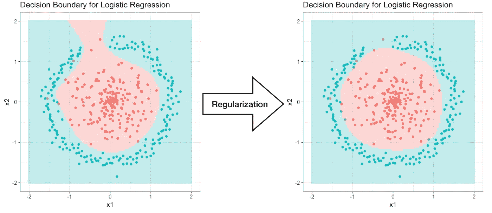
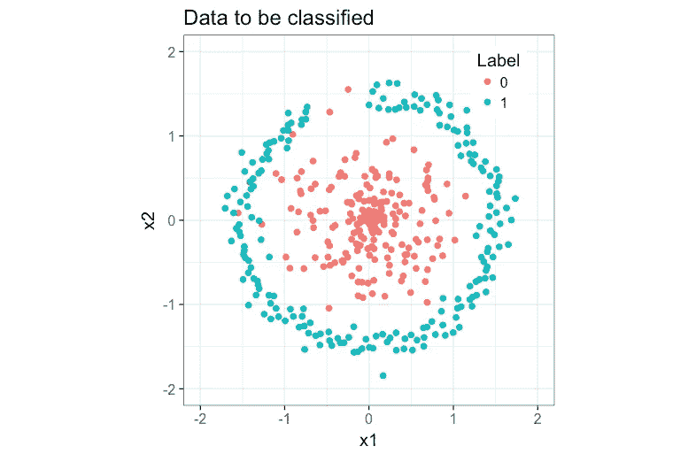

# 理解逻辑回归中的正则化

> 原文：<https://towardsdatascience.com/understanding-regularization-in-machine-learning-5a0369ac73b9?source=collection_archive---------17----------------------->

## 如何使用正则化处理过拟合

# 介绍

在我上一篇[帖子](/logistic-regression-from-scratch-in-r-b5b122fd8e83)中，我只使用了两个特征( ***x* 1， *x* 2** )，判定边界是 2D 坐标上的一条直线。在大多数真实世界的情况下，数据集将具有更多的特征，并且决策边界更加复杂。有了这么多的特性，我们经常会过度拟合数据。过度拟合是与数据集紧密拟合的函数中的建模错误。它捕获数据集中的噪声，可能不适合新的输入数据。

为了克服这个问题，我们主要有两个选择:1)删除不太有用的特征，2)使用正则化。这里我们将重点讨论正规化。

我们将分类的数据创建如下:

生成的数据无法通过线性方程进行分类，因此我们必须添加高阶项作为特征。然而，更多的特征将允许模型拾取数据中的噪声。

# 逻辑回归的正则化

以前，为了预测 logit(概率对数),我们使用以下关系:

随着我们添加更多功能，等式的 ***RHS*** 变得更加复杂。正则化用于通过施加惩罚来降低预测函数的复杂性。在线性关系的情况下，正则化将以下项添加到成本函数中:

其中 ***D*** 为特征尺寸。它惩罚特征的系数(不包括偏差项)。现在成本函数变成了:

利用我们对[逻辑回归](/logistic-regression-from-scratch-in-r-b5b122fd8e83)的先验知识，我们现在可以开始构建带有正则化的模型。

# R 中的正则化

同样，我们需要首先创建一些助手函数。注意`%*%`是 **R** 中的点积。如果你想了解更多的模型细节，你可以在这里阅读我以前的文章。

逻辑回归函数，原本以训练数据 ***X*** ，标签 ***y*** 作为输入，现在需要多加一个输入:正则化强度 ***λ*** *。*

由于我们希望使用一个包含许多特征的示例来演示过拟合和正则化的概念，因此我们需要通过包含多项式项来扩展特征矩阵。

现在，我们可以像以前一样定义预测函数。

# 分类和决策边界

接下来，让我们在上面的数据集上训练模型。我使用了 6 次方的多项式特征矩阵。降低功率也有助于过拟合。实际上，我们正在删除不必要的功能。

首先，不使用正则化( ***λ*** =0)，结果如下。该模型明显过度拟合了数据，并错误地将该区域分类为 11 点钟。另一种模型用正则化( ***λ*** =5)训练，更能代表总趋势。

左:无正规化；右图:正则化模型。

# 结论

正则化对于克服过度拟合非常有用。它允许我们保留甚至稍微有用的特征，并自动降低这些特征的系数。

你可以访问我的 github 获取 R 中的[源代码。同样的主题还有一个](https://github.com/JunWorks/Understanding-Regularization-in-Machine-Learning) [Python 版本](https://github.com/JunWorks/ML-Algorithm-with-Python/blob/master/logistic_regression/logistic_regression.ipynb)。