# 理解机器学习中的正则化

> 原文：<https://towardsdatascience.com/understanding-regularization-in-machine-learning-d7dd0729dde5?source=collection_archive---------10----------------------->

## 通过防止过度拟合来优化预测模型

杰克逊·乔斯特在 [Unsplash](https://unsplash.com?utm_source=medium&utm_medium=referral) 上的照片

W 在训练机器学习模型时，一个主要方面就是评估模型是否过拟合数据。过度拟合通常发生在模型试图拟合所有的数据点时，在此过程中捕获噪声，导致模型的不准确发展。

机器学习模型的性能可以通过成本函数来评估。通常，成本函数由实际值和预测值之差的平方和表示。

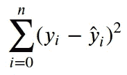

这里“y”代表实际值，而“ŷ”代表预测值。

这也被称为“**残差平方和**或“**误差平方和**”。预测模型在被训练时试图以最小化该成本函数的方式来拟合数据。

当一个模型通过所有的数据点时，它开始过度拟合。在这种情况下，尽管成本函数的值等于零，但是考虑了数据集中的噪声的模型并不代表实际的函数。在这种情况下，根据训练数据计算的误差较小。然而，在测试数据上，误差仍然很大。

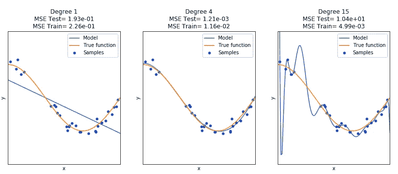

本质上，模型通过使用高度复杂的曲线来过度拟合数据，这些曲线具有自由度大的项以及为每一项提供权重的相应系数。

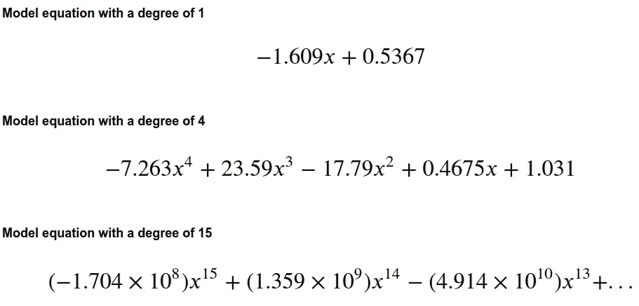

我们可以从方程中清楚地观察到曲线越来越复杂。

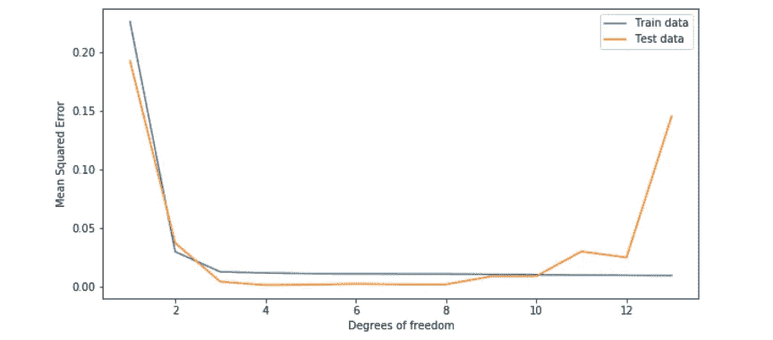

从上图可以看出，对于较高的自由度，测试集误差比训练集误差大。

正则化是一个概念，通过它可以防止机器学习算法过度拟合数据集。正则化通过在成本函数中引入惩罚项来实现这一点，该惩罚项为复杂曲线分配更高的惩罚。

基本上有两种类型的正则化技术

1.  **L1 正则化或拉索回归**
2.  **L2 正则化或岭回归**

让我们首先从理解 L2 正则化或岭回归开始。

# L2 正则化或岭回归

岭回归的成本函数由下式给出:

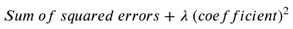

这里λ(*𝜆*)是一个超参数，它决定了惩罚的严厉程度。λ的值可以从 0 变化到无穷大。可以观察到，当λ的值为零时，罚项不再影响成本函数的值，因此成本函数降回误差平方和。

为了理解惩罚项的意义，让我们深入研究一个例子。

假设我们仅仅根据“误差平方和”来评估我们模型的性能，我们会得到下图中左侧图形所表示的曲线。

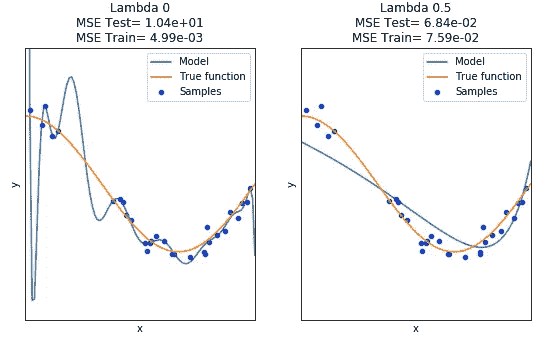

如前所述，惩罚项不再影响成本函数的值。因此，我们得到相同的过拟合曲线。然而，当 lambda 的值增加时，我们会得到一条更简单的曲线，如上图右侧的图表所示。

比较两个模型的均方误差，我们观察到，对于过拟合曲线，训练集上的误差最小，但是对于更简单的曲线，测试集上观察到的误差显著下降。

因此，通过简化我们的曲线，我们在训练集中引入了一些误差，但这使我们能够走向更一般化的模型。

需要强调的一个重要方面是，通过改变λ的值并将我们的复杂曲线转换为简单曲线，我们正在处理相同的 15 次多项式模型。直到 15 度的项仍然存在于简单模型的方程中，但是模型的复杂性已经降低。

# 这是如何实现的？

答案在于刑罚本身的机制。我们再来看看成本函数。

λ是一个超参数，决定惩罚的严厉程度。随着罚值的增加，系数的值收缩，以便最小化成本函数。由于这些系数也充当多项式项的权重，缩小这些系数将减少分配给它们的权重，并最终减少其影响。因此，对于上述情况，分配给高次多项式项的系数已经缩小到这样的程度，即这些项的值不再像以前那样严重地影响模型，因此我们有一条简单的曲线。

在确定了λ的最佳值后，我们将其应用到模型中，得到下面的曲线。

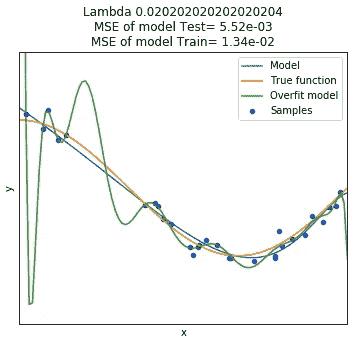

# 改变λ值的影响

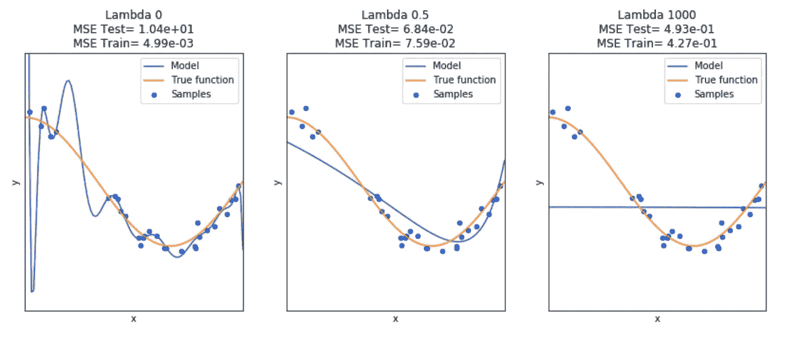

我们观察到，随着λ值的增加，模型变得更加简单，直到它渐近平行于 x 轴。换句话说，对于很高的λ值，我们有一个高度偏差的模型。

# λ的值如何选择？

这让我们左右为难。对于非常低的λ值，获得过拟合曲线，而对于非常高的λ值，获得欠拟合或高度偏差的模型。那么怎样才能达到λ的最佳值呢？

这个问题的答案是交叉验证。通常，10 倍交叉验证可以帮助我们确定最佳λ值。

# 多维数据集

假设我们试图预测一种动物的身体大小。假设这个尺寸取决于它的体重和年龄。在这种情况下，我们模型的功能可以表示为:-

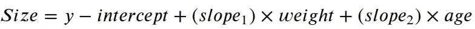

由于我们有多种取决于尺寸的功能，成本可由下式给出:-

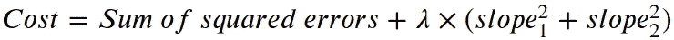

如果我们的训练集中的数据点数量有限，岭回归可以通过减少方差并使模型对“训练数据”分布不太敏感，从而使曲线对噪声不太敏感，来改进根据数据做出的预测。

# L1 正则化或套索回归

LASSO 代表**最小绝对收缩和选择算子**。

Lasso 回归的成本函数由下式给出:

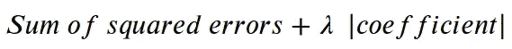

与岭回归相似，lambda 也是一个超参数，它决定惩罚的严厉程度。成本函数的区别在于岭回归采用斜率的平方，而套索回归采用斜率的绝对值。

# 改变λ的影响

随着λ值的增加，系数的值将越来越接近 0，直到该值最终为 0。

注意，在岭回归中，当λ增加时，系数的值收缩，直到模型渐近平行于 x 轴。在 lasso 回归中，对于较大的λ值，模型实际上会变得与 x 轴平行。

为了理解这一点，让我们举一个例子。

假设动物的大小由以下等式给出

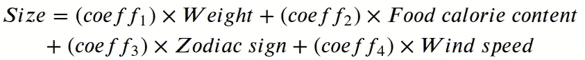

套索回归的工作方式是保留最相关的要素，而缩小其他要素。

上述等式的成本函数可以给出如下

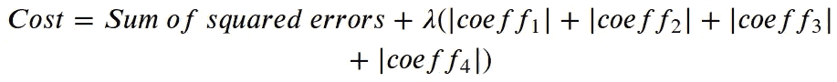

在上面的例子中,“体重”和“食物卡路里含量”与体型最相关，而“星座”和“风速”最不相关。因此，“coeff1”和“coeff2”会缩小一点，而“coeff3”和“coeff4”会一直缩小到零。

因此，我们只剩下等式:-

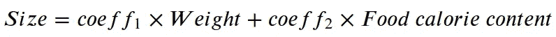

由于 lasso 回归可以从方程中排除无关紧要的变量，因此在减少包含大量无用变量的模型中的方差方面，它比岭回归稍好一些。换句话说，套索回归有助于特征选择。

相比之下，当大多数变量都有用时，岭回归往往做得更好一点。

# 套索和岭回归的另一个有趣的区别

前面提到过，随着岭回归中λ值的不断增加，模型曲线变得越来越平坦，直到它渐近平行于 x 轴。

为了理解这一点，为了简单起见，我们将参考线性回归模型。

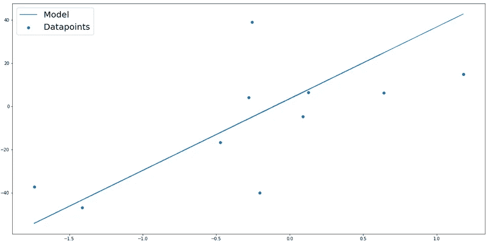

点代表数据点，线代表回归模型。因为这是一条直线，所以它有一个斜率和一个 y 截距。

随着λ值的增加，线性回归模型的斜率将持续降低。

在较大的λ值下，我们观察到回归模型的以下曲线。

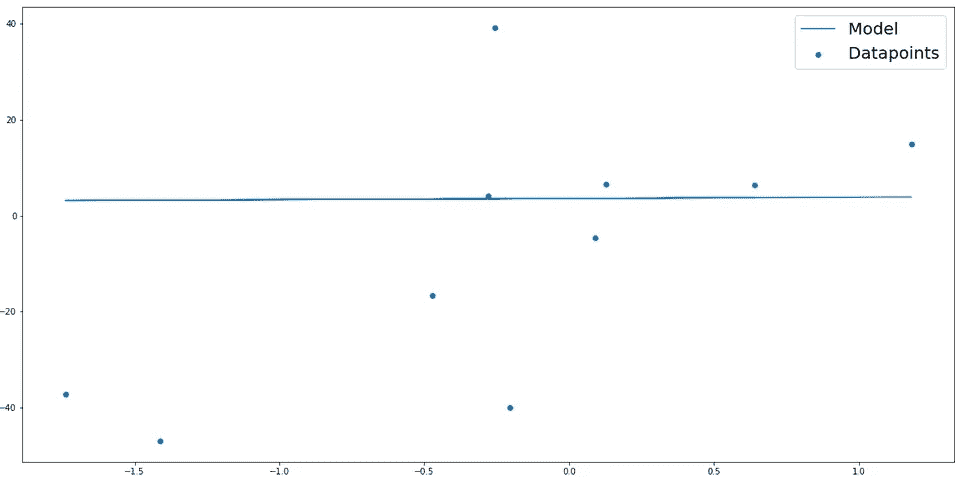

虽然看起来这条线平行于 x 轴，但实际上，线性模型的斜率值略大于零。

这种行为可以通过下图直观地观察到。x 轴表示模型的斜率，y 轴表示模型的成本函数值。每个图的左侧是λ值的范围。

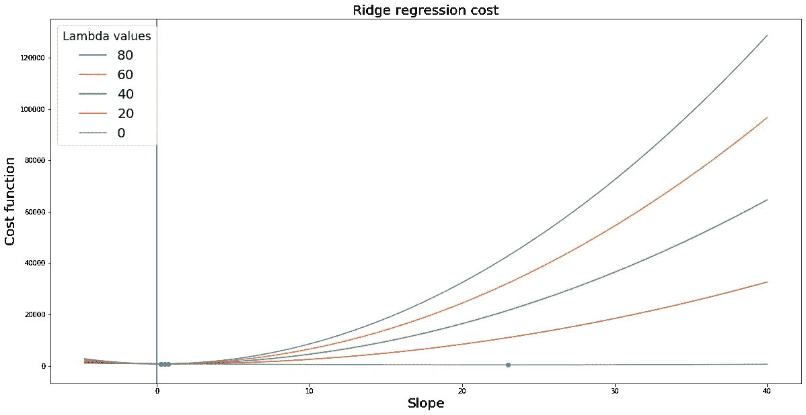

曲线中的蓝点代表模型成本函数的最小值。随着 lambda 值的增加，岭回归模型的成本函数的最低值不断向零斜率值移动，但最低值永远不会与零重合。

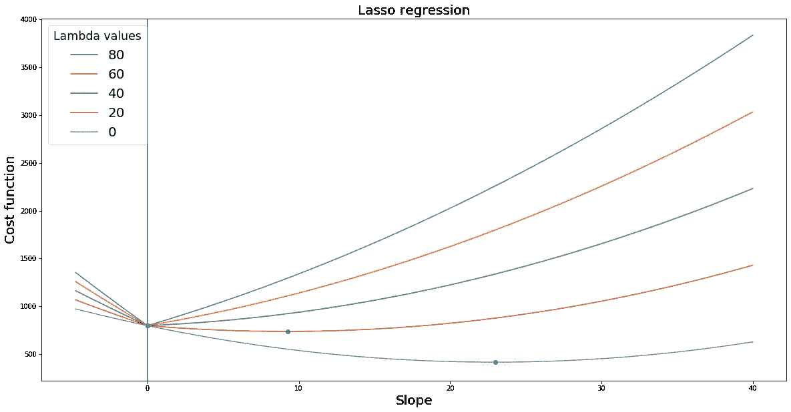

相反，在 lasso 回归模型中，随着λ值的增加，我们观察到类似的趋势，其中成本函数的最低值逐渐向零斜率值移动。然而，在这种情况下，对于大的λ值，当斜率的值与零一致时，实现了成本函数的最低值。特别是对于等于 40、60 和 80 的λ值，我们在曲线图中观察到一个明显的拐点，其中斜率值等于零，这恰好也是λ等于 80 时成本函数的最低值。

因此，对于较大的λ值，lasso 回归模型可以具有等于零的斜率。

# 套索回归对特征选择有什么帮助？

让我们看看每种正则化技术的成本函数。

对于套索回归:-

对于岭回归:-

套索回归的一种解释方式是解一个系数的模之和小于或等于常数“c”的方程。类似地，岭回归可以解释为求解一个系数的平方和小于等于常数“c”的方程。

假设我们的模型结合了两个特征来预测某个实体，并且这些特征的系数由β1 和β2 给出。

在这种情况下，岭回归可以表示为:-

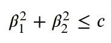

类似地，套索回归可以表示为

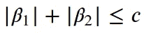

岭回归方程类似于圆的方程，因此约束区域位于圆的圆周内和圆周上，类似地，套索回归方程类似于菱形方程，约束区域位于该形状的内部和圆周上。

这些方程在下面的图片中被可视化了。

约束区域由浅蓝色区域表示，而红色椭圆是表示“误差平方和”的轮廓。在任何特定的给定轮廓中,“误差平方和”的值都是相同的。轮廓离中心越远，“误差平方和”的值越高。

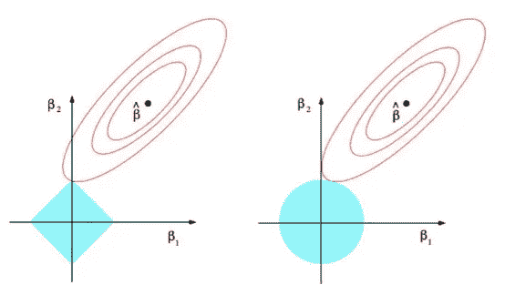

资料来源:统计学习导论，作者:加雷斯·詹姆斯，丹妮拉·威滕，特雷弗·哈斯蒂，罗伯特·蒂布拉尼

如果“c”的值足够大，约束区域将包含由β (hat)表示的轮廓的中心，因此岭回归和套索回归的值将与“误差平方和”的最小值相同。这对应于λ= 0 的情况。

岭和套索回归的系数估计由轮廓接触约束区域的第一个点给出。由于岭回归具有圆形约束区域，接触点通常不会出现在轴上。因此，系数估计将主要是非零的。

但是，由于套索回归约束区域有突出的角，所以轮廓与轴上的约束区域相交的可能性更大。在这种情况下，其中一个系数的值将等于零。在高维空间中，我们有两个以上的特征，许多系数估计可能同时等于零。

# 结论

正则化是防止模型过度拟合的有效技术。它允许我们减少模型中的方差，而不会显著增加模型的偏差。这种方法允许我们开发一个更一般化的模型，即使我们的数据集中只有几个数据点。

在确定模型的参数或特征已知的情况下，岭回归有助于缩小模型的系数。

相反，套索回归可以有效地从模型方程中排除无关紧要的变量。换句话说，套索回归有助于特征选择。

总的来说，这是一项重要的技术，可以极大地提高我们模型的性能。

感谢您阅读这篇博客。我希望听到你对此的想法。

*如果你渴望在一群志同道合的人的陪伴下踏上高质量的学习之旅，我强烈推荐你加入最有吸引力的社区:* [*共同学习休息室*](https://www.linkedin.com/company/30951747/) *关于* [*电报*](https://t.me/ColearningLounge_AIRoom) *和访问*[*colearninglounge.com*](http://colearninglounge.com/)*了解更多信息。*

# 参考

1.  Josh Starmer， *StatQuest:正则化第一部分:岭回归*。[https://youtu.be/Q81RR3yKn30](https://youtu.be/Q81RR3yKn30)
2.  Josh Starmer， *StatQuest:正则化第二部分:Lasso 回归。*[https://youtu.be/NGf0voTMlcs](https://youtu.be/NGf0voTMlcs)
3.  Josh Starmer， *StatQuest: Ridge vs Lasso 回归，可视化！！！https://youtu.be/Xm2C_gTAl8*T2
4.  普拉尚·古普塔，*机器学习中的正则化*。[https://towards data science . com/regulation-in-machine-learning-76441 ddcf 99 a](/regularization-in-machine-learning-76441ddcf99a)
5.  统计学习导论