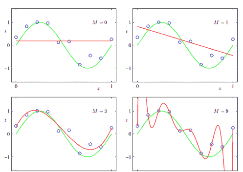
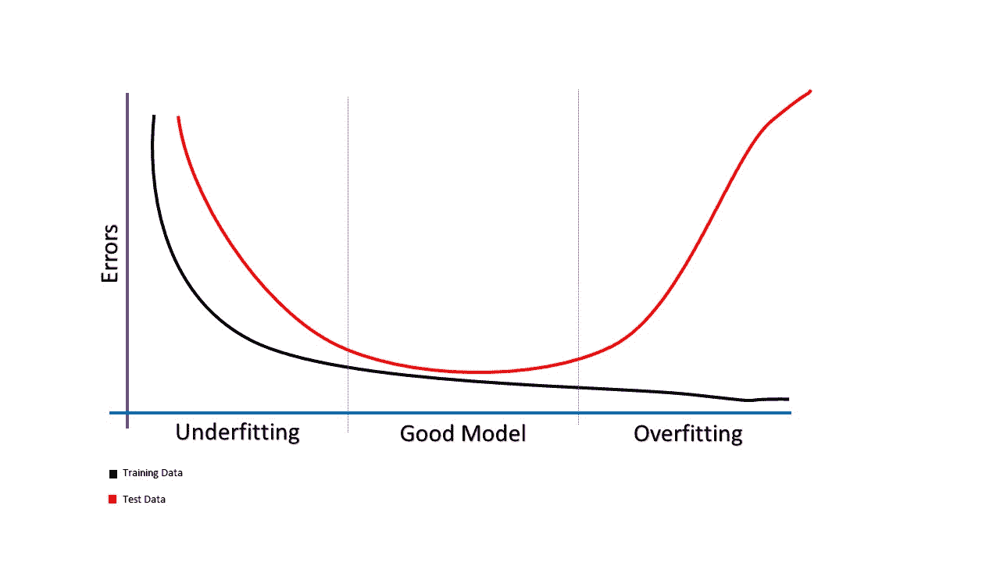
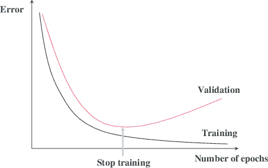
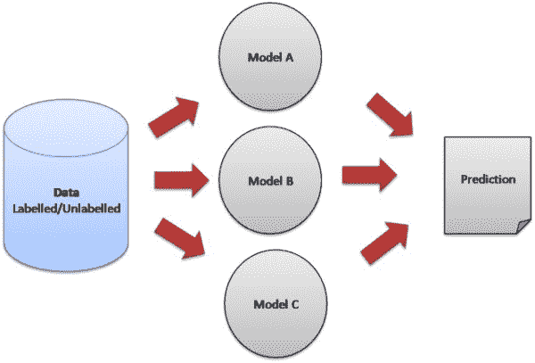
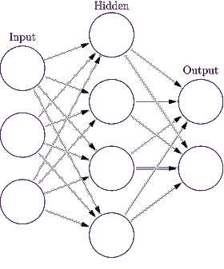
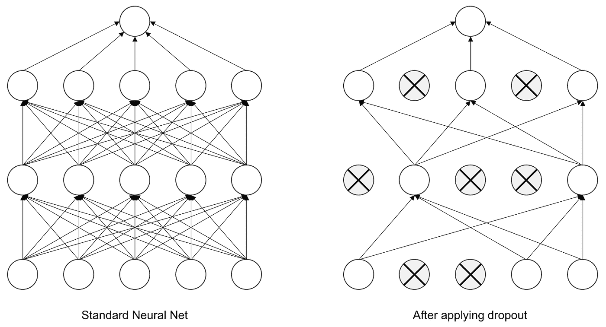

# 理解 ML 和 DL 中的正则化技术

> 原文：<https://towardsdatascience.com/understanding-regularization-techniques-in-ml-and-dl-dd4669b613ac?source=collection_archive---------53----------------------->

## 洞察正则化技术

## 对减少计算时间和训练 ML 和 DL 模型投入的工时的技术的简单而全面的展望。

乔·加德纳在 [Unsplash](https://unsplash.com?utm_source=medium&utm_medium=referral) 上的照片

**概述:**

现在，随着各行业开始接受“人工智能”作为预测其公司成功的重要组成部分，机器学习和深度学习技术正在进入公司的职位简介列表。但是我们经常看到，公司的实际决策者(发号施令的人:cxo)对这些技术能做什么以及如何让他们的公司受益有一个非常误导的概念。对于那些不完全理解 ML 真相的人来说，ML 经常被视为一种有潜力解决任何和所有工业问题的技术。下图让 ML 目前的状态变得相当清晰。

这不是讽刺而是对 ML 相当准确的理解。它是计算机在提供一组前兆事件的同时预测事件的非硬编码能力。我会尽量保持这篇博客的非数学性，但是在这里我想包括这样一个事实，ML，本质上，是在给定多个这样的方程的情况下，预测 x 和 y 之间的函数关系 F 的行为。

但是很多时候，我们看到，即使在训练了一个模型并且达到了可接受的训练精度之后，当这个模型被用来处理测试用例时，它还是悲惨地失败了。

这是由于过度拟合或使函数过度逼近训练数据的现象而发生的。这导致模型不是理解如何解决问题的一般想法，而是死记硬背训练数据。下图说的很清楚。

真正的函数是正弦曲线(绿色)，我们正试图从给定的数据中预测它。直到第三个数字，我们看到模型学习得很好。即使不是所有的数据点都令人满意，这也是一个近乎完美的函数近似值。但是随着训练的继续，我们看到这个函数塑造了自己来适应所有的数据点，并且采取了与我们期望的完全不同的形式。这太合身了。其中训练损失为零，但是测试损失增加

**理解偏差-方差权衡和正则化的需要:**

**偏差**在数学上是函数的期望值和实际值之间的差值。我们不会深入偏见的基本统计数据，但我会负责任地留给你一个看起来很可怕的等式:

为了说明问题，简单的线性模型的偏差较高，而复杂的多维模型的偏差较低。这是因为复杂的模型更适合所有的训练数据。

**方差**是训练数据和测试数据之间 ML 模型的预测精度的变化。方差导致的误差是一个训练集的预测值与所有训练集的预期值之间的差异量。换句话说，根据模型，不同预测的值彼此相差有多远。另一个等式会让你害怕，伙计们。

简单的模型方差低，而复杂的模型方差高。

下图可以用来清楚地建立偏差和方差的概念。图的左端是具有高偏差的区域，因为训练和测试误差都很高。这是拟合不足的区域，或者是模型学习不够的区域。

模型的右端是一个高方差区域，其中训练误差较低，但测试误差较高。这是过度拟合的区域，在这里我们看到，尽管模型已经达到了很高的训练精度，并且看起来模型接近完美，但它在测试数据上的表现很差。这纯粹是浪费计算能力和工程师的时间。

中间区域，偏差和方差都很低，即使不是最低的也是模型的最佳区域。实现这种模型训练状态的行为被称为**偏差-方差权衡。**

有多种方法可以实现偏差方差权衡。这些方法或技术被称为**正则化技术**。

一些常见的有:

*   L2 正则化
*   提前停止
*   数据集扩充
*   集成方法
*   拒绝传统社会的人
*   批量标准化

**L2 正规化:**

为了让事情尽可能简单，我将 L2 正则化定义为“不让模型驱动训练误差为零的技巧”。如果事情有那么简单就好了…

在训练模型期间，我们不断更新各种变量(权重和偏差；试图预测我们的原始函数。这种更新是基于“更新规则”进行的，比如梯度下降(我们不会谈到这一点)。该更新规则取决于“损失函数”，该损失函数是这些变量的函数。如果事情变得复杂，请原谅我。我们的目的是最小化这个“损失函数”。这很直观，不是吗？在任何有利可图的工业情况下，你都努力使损失最小化。简单，初始化？

因此，我们在训练过程中最小化损失函数。L2 技术的特别之处在于，我们不是最小化训练损失，而是最小化它的不同版本。

上面等式中的第一项是“损失项”,即衡量模型与数据拟合程度的项。最后一项是数学专家提出的“权重高斯分布可能性的对数”。这度量了模型的复杂性。对于我们这些外行来说，就是所有特征权重的平方和(w)。在这里，我再次负责任地告诉你们:

这种模型的复杂性通过 L2 技术来量化。在这种情况下，接近零的要素权重不会受到变换的太大影响，但异常值会产生巨大影响。而上述项的值越大，我们看到的偏倚的增加和方差的减少就越多。从上图可以明显看出，在训练结束时，偏差非常低，方差很高。因此，如果我们增加偏差并减少方差，我们将有效地到达图表中“好模型”区域的某处。所以现在，我们有了一个很好的模型！耶！

**提前停止:**

这是迄今为止最简单的正则化技术(它们都是，但是你不会相信我，对吧)。这个过程包括记录最小损失值下的变量(w & b)值。在整个训练过程中，我们记录 w & b 的值，在该值处我们获得最小的验证误差。当我们看到验证错误再次上升时，我们**停止训练**。这是一个非常有用的过程，但它的缺点是，在训练非常深的神经网络或非常复杂的模型期间，这在写入和重写最小值期间使用了大量的处理能力。

**数据集扩充:**

只有当我们有大量数据对模型进行训练时，才有可能将模型训练到良好的预测状态。换句话说，如果数据太少，很容易使训练误差为零。让我们以训练一个关于图像分类的神经网络为例。假设我们有 1000 张图片来训练模型。如果我们有 3000 张图片来训练它不是更好吗？无需获取额外数据，我们可以轻松地“扩充”当前图像并创建“新”图像。事实上，这些对我们来说并不新鲜，但对模型来说，它们是新的。

那么什么是**增强**？它是一种行为，即通过在现有数据中引入某些差异，同时保留原始标签，从现有数据中人为生成新数据。这些差异取决于我们正在处理的数据类型。对于音频，加速采样或引入一些背景噪声是一种增强技术。这不会改变标签值。对于文本，我们可以用同义词替换一个单词，而不改变其传达的信息。对于图像，我们可以改变视角、缩放、照明和其他改变图像但保留其标签的技术。这里有一些可爱的东西来抵消你阅读这篇博客的无聊，并使图像增强变得清晰。

因此，当我们现在有更多的数据输入到我们的模型中时，这使得它更难记住整个事情，因此，训练误差不会变为零。有点像你的历史考试，init？

**合奏方式:**

**集成方法**是一种元算法，它将几种机器学习技术结合到一个预测模型中，以减少方差、偏差或改善预测。

上面这一段是 Google 对系综方法的定义，我试着给你分解一下。在这种技术中，我们使用多个模型架构来预测输出，无论是分类还是回归。假设模型 A、B 和 C 被赋予给一只狗分类的任务:模型 A 说它是一只猫，但模型 B 和 C 说它是一只狗。因此，如果我们相信大多数人所说的，我们会得到正确的输出，但如果我们相信第一个模型的输出，我们就错了。回归或价值预测也是如此。我们对给定的 3 个模型的预测进行加权平均，以得出我们的最终输出。这减少了出错的机会并提高了准确性。

有趣的是，我们也不需要在 3 个型号上花费资源。我们可以用不同批次的数据在同一个模型上训练 3 次。这也能达到目的。但是你明白了，不是吗？

**辍学:**

辍学也被归类为一个整体方法的类别。但是我，为了好玩，认为它是相反的。在集合方法中，你“询问”其他模型的意见以得出结论，但在这里，它基本上是让其他贡献者保持沉默。让我说清楚。

这是一个非常简单的神经网络，其目的是作为一个真/假分类器。查看输出图层(绿色)。它有两个 blobs，一个给出输出为真的概率，另一个给出输出为假的概率。两个值之和:你猜对了:1！你不聪明吗？XD。

这里的想法是让你明白这些“斑点”被称为**节点**。每个节点内部都有大量复杂的计算。还记得我在《L2 正规化》中提到的东西吗？一切都发生在这里。所以这些节点是输出的实际贡献者。

**退出**包括随机关闭某些节点。这改变了模型的体系结构和信息在节点间流动的方式。这样做可以使模型成为更可靠的预测器。该模型必须预测相同的输出，其中一些贡献者被关闭。这就像说你需要在没有你的顶级朋友在身边的情况下完成你的测验。你得学会。明白了吗？XD。

**结论:**

这总结了我关于正则化技术的博客。我故意没有向您提供关于批处理规范化的信息，因为这将需要我向您提供训练神经网络的整个过程，并且这将违背本博客背后的主要思想:保持事情简单。

如果您想知道如何使用 PyTorch 在 Python 上编写这些代码，请参考 GitHub 上的以下资源库。batchnorm_dropout.ipynb 文件可能会有帮助。我也将在另一个回购上上传 TensorFlow 文件，以便在这两个框架上都有代码。

[https://github.com/sreyan-ghosh/pytorch_files](https://github.com/sreyan-ghosh/pytorch_files)

我花了很长时间为你们写下这些，我希望你们能从中有所收获。如果你喜欢，留下掌声。如果你没有，你可能会离开这一页很久了。如果你有任何疑问，请在下面留言。我期待着消除你的疑虑。

我喜欢交新朋友，所以这是我的 LinkedIn ID。如果你想聊天或者不想，请连接。XD。

[https://www.linkedin.com/in/sreyan-ghosh-b0722a18b/](https://www.linkedin.com/in/sreyan-ghosh-b0722a18b/)