# 理解强化学习实践:马尔可夫决策过程

> 原文：<https://towardsdatascience.com/understanding-reinforcement-learning-hands-on-markov-decision-processes-7d8469a8a782?source=collection_archive---------33----------------------->

## 描述和理解复杂的环境，一次一张图

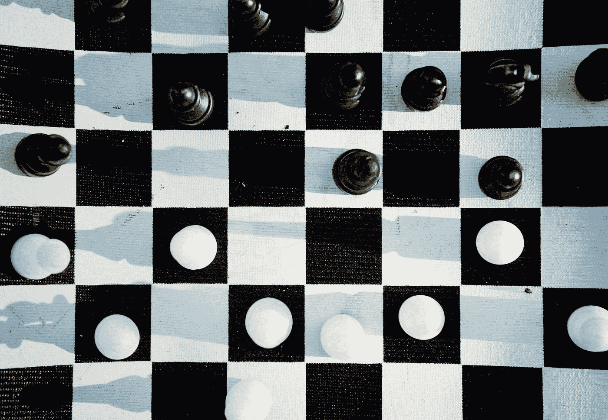

蒂姆·福斯特在 [Unsplash](https://unsplash.com?utm_source=medium&utm_medium=referral) 上的照片

# “系列”链接:

1.  [简介](https://medium.com/@alejandro.aristizabal24/understanding-reinforcement-learning-hands-on-part-1-introduction-44e3b011cf6)
2.  [多臂土匪](https://medium.com/@alejandro.aristizabal24/understanding-reinforcement-learning-hands-on-part-2-multi-armed-bandits-526592072bdc) | [笔记本](https://github.com/aristizabal95/Understanding-Reinforcement-Learning-Hands-On/blob/master/Multi-Armed%20Bandits.ipynb)
3.  [非静止的](/understanding-reinforcement-learning-hands-on-part-3-non-stationarity-544ed094b55) | [笔记本](https://github.com/aristizabal95/Understanding-Reinforcement-Learning-Hands-On/blob/master/Non-Stationarity.ipynb)
4.  **马尔可夫决策过程** | [笔记本](https://github.com/aristizabal95/Understanding-Reinforcement-Learning-Hands-On/blob/master/Markov%20Decision%20Processes.ipynb)
5.  [贝尔曼方程 pt。1](https://medium.com/@alejandro.aristizabal24)

欢迎回到我们的强化学习系列。这是第四篇文章，所以我们鼓励你回头看看前面的文章。之前，我们谈到了一个非常基本的情况，叫做多臂强盗场景，这让我们开始思考如何通过互动来学习。

今天，我们将开始探索新的环境，使用一个非常强大的工具，马尔可夫决策过程(MDPs)。我们将为描述环境打下坚实的基础，并建立一些术语来帮助我们更深入地研究 RL。

# 多臂匪徒的陷阱:

我们已经谈了很多关于多支武装匪徒的情况，并发展了强有力的想法和策略来对付他们。然而，我们周围的世界看起来并不像我们目前所呈现的那样简单。终于到了讨论为什么这种环境被认为是“基本”的时候了，以及我们如何描述更复杂的场景。

多支武装匪徒的场景向我们展示了一个单一的情况:站在许多武装匪徒面前，每支武装匪徒都是我们可以采取的独立行动。这种情况在互动后不会改变；我们仍然面临同样的情况和同样的行动。最复杂的变化是不稳定的情况，但我们的决定仍然只关注相同的情况，我们的行动不会影响未来的任何事情。

在现实世界中，我们总是会遇到新的情况，我们的行为会影响我们未来的定位。如果我们想要开发能够处理真实世界的代理，我们需要为环境做一个更健壮的定义。这里是马尔可夫决策过程来拯救！

# 马尔可夫决策过程:

为了描述和理解更复杂的场景，引入了 MDP(马尔可夫决策过程的缩写)。MDP 框架在一些基本概念下将环境形式化:**状态**、**行动、奖励**和**过渡模型**。

## 州

从前面的文章中，我们已经对奖励和行为有了一些了解，所以让我们从状态开始。状态可以理解为描述可以找到代理的情况的任何信息。例如，假设我们在一个赌场处理强盗场景，我们有 5 个行动可以采取。在一些互动之后，我们了解到第二只手会产生最高的回报。如果我们去另一个赌场，我们应该期待这是真的吗？当然不是！改变赌场改变了这种情况，所以我们现在可以说我们有两个州，每个赌场一个。这是到目前为止我们的问题的可视化表示。

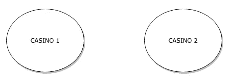

有两个州可以找到我们的特工。作者图片

状态不受物理位置或对象的限制。让我们回到餐馆的情况。作为提醒，我们提供了一个相当于多臂强盗的例子，让一个人在餐馆里试图从多个选项中选择一道菜。在这里，如果我们考虑代理人是否饥饿，我们可以定义一个更复杂但更现实的场景。这将再次创建两种状态，一种是代理饥饿时的状态，另一种是代理不饥饿时的状态。

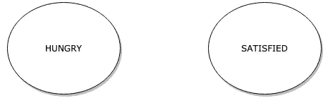

餐馆示例的两个新状态。作者图片

必须注意的一个重要警告是，状态必须包含代理采取行动所需的所有信息。例如，我们的代理人不记得它以前是满足还是饥饿，也不记得他以前是否选择了某道菜。如果这不是状态的一部分，那么我们就不会使用马尔可夫决策过程。这个约束是必需的，因为我们希望能够将每个状态视为一个孤立的情况。如果代理人发现自己处于这种状态，它应该能够采取行动，不管它是否是第一个被访问的国家。

这听起来可能是一个巨大的限制，也是一个不现实的限制，因为我们通常是根据我们以前的轨迹或决策路径来做决定的。例如，餐馆里的人或代理人可能记得他刚刚吃了某道菜，出于无聊不想重复自己。但是，也要考虑状态的数量和状态包含的信息是没有限制的。如果有必要，您可以创建保存以前信息的状态。例如:

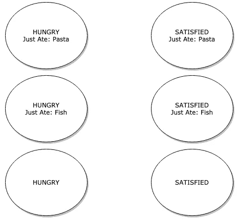

状态列表，其中一些状态包含以前选择(或吃)的信息。作者图片

这里，我们根据代理在之前的交互中选择的内容来定义新的状态。这听起来像是一个黑客，但也离现实不远。你可以认为自己处于一种状态，在这种状态下，你处于当前的位置，你持有当前的信念和经历。改变你的信仰或经历会改变你目前的状态。

最后，请记住，尽管对您拥有的状态数量没有硬性限制，但是状态越多，我们的代理就越难学习。我们希望在我们的代理可以从环境(也就是州内)访问的信息量和环境拥有的状态数量之间取得良好的平衡。

## 行动

行动是我们的代理与环境交互的方式。代理可以采取的操作取决于它发现自己所处的状态，每个状态可以包含一组唯一的操作。让我们看看当我们用状态和动作来表示它时，多臂强盗是什么样子的。

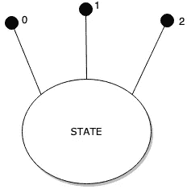

3-有状态和行动的武装匪徒。作者图片

这里，我们用 3 个动作(0，1，2)来表示多臂强盗，每个动作都是一个连接到国家的黑点。任何其他状态都可以有不同数量的操作。在两个赌场的情况下，它可能看起来像这样:

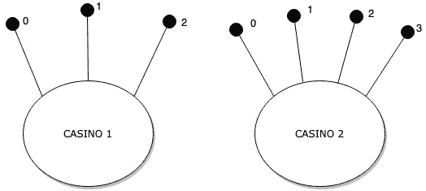

多个赌场的场景，每个赌场都有自己的一套行动

现在，动作不仅允许我们与世界互动，还定义了我们如何从一种状态转移到另一种状态。到目前为止，我们的状态彼此完全隔离，但现在我们可以添加路径，以便在采取特定行动时改变状态。让我们以赌场为例，并修改它，以便我们可以看到如何行动可以推动我们通过国家。

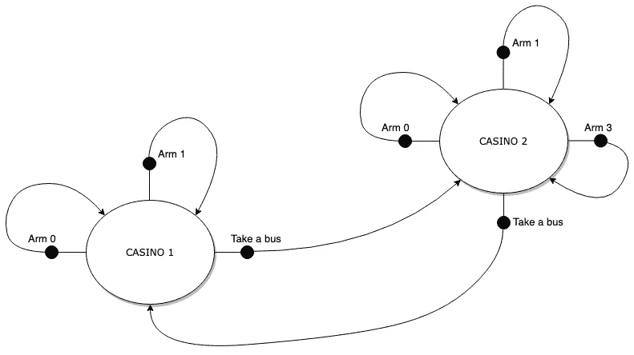

两个赌场场景的几乎完整的 MDP。作者图片

现在，对于每一个动作，我们都有一个指向下一个状态的箭头。对于每个状态，我们有一些动作代表拉一只胳膊，还有另一个动作我们称之为“乘公共汽车”，它把代理从一个状态带到另一个状态。请注意，所有的动作都指向一个状态，但并不是所有的动作都将我们从一个状态转移到另一个状态。

## 奖励

奖励是代理在采取行动后获得的标量值，它可以被认为是代理在环境中做得好坏的度量。我们在选择一个行动后所走的每一条路都有一个相关的回报，它可以是积极的、消极的或零。代理的目标是通过在正确的状态下采取正确的行动来最大化这个值。让我们把它添加到上面的图表中

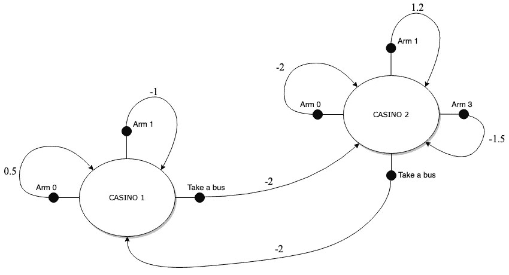

赌场场景的 MDP，现在有奖励。作者图片

在上图中，我们为每条路径添加了一个奖励，用每个箭头旁边的数字表示。例如，乘坐公共汽车给予奖励 ***-2*** ，以表示从一个州到另一个州是有成本的。每只手臂也有固定的奖励，虽然我们也可以像最初的多臂强盗一样使用随机分配。

奖励的概念很简单，但是给环境分配奖励是强化学习中最困难和最关键的任务之一。由于奖励塑造了我们的代理人的行为，奖励和潜在目标之间的任何不一致都会导致意想不到的行为，以及奖励黑客行为(也称为规范游戏)，即代理人利用环境的一些机制来获得高奖励，而不必完成手头的任务。如果你感兴趣的话，DeepMind 安全研究有一篇[很棒的文章，介绍了一些规范游戏的案例](https://medium.com/@deepmindsafetyresearch/specification-gaming-the-flip-side-of-ai-ingenuity-c85bdb0deeb4)。我们稍后将讨论奖励系统或奖励函数，但现在请记住，这不是一个微不足道的赋值问题。

## 过渡模型

使用之前建立的工具，我们已经可以构建完全描述多个场景的 MDP。最后展示的图表可以被完美地认为是一个完整的 MDP。但是，到目前为止，环境的机制是决定性的。采取行动将总是带你走过同样的路，得到同样多的回报。在许多情况下，情况并非如此。有时，一个主体试图采取行动，希望达到一个特定的状态，因为环境会因不可预见或未知的变量而随机做出反应。例如，假设我们的代理试图“乘公共汽车”去另一个赌场。在真实生活场景中，在采取这样的行动时可能没有公共汽车，或者公共汽车可能是满的。所以，有可能采取这样的行动不会让你达到想要的状态。

为此，我们使用转换模型。这个模型代表了环境对代理交互的响应方式，并决定了从一种状态到另一种状态的可能性。现在，让我们用转换模型表示的总线问题来绘制我们的 MDP。

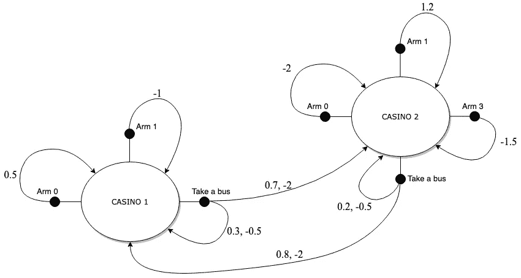

赌场环境中的完全随机 MDP。作者图片

在这里，我们做了一个小小的改变。现在乘坐公交车的行为有两条相关的路径。一个指向下一个状态，而另一个将代理返回到当前状态。另外，请注意，现在我们在每条路径上都有两个数字。这两个数字分别代表走这条路的可能性和回报。因此，在这种情况下，我们最有可能从赌场 2 的州，而不是从赌场 1 赶上公共汽车。

过渡模型通常被表示为一个名为 ***p*** 的函数，最常见的是这样写的:

转换模型方程。作者图片

其中***s’***是下一个状态， ***r*** 是奖励， ***s*** 是当前状态，*是当前状态下采取的动作。这个函数返回到达下一个状态(s ')并获得期望奖励(r)的概率，假设我们当前处于某个状态(s)并采取了指定的行动(a)。例如，使用我们到目前为止开发的 MDP，我们将从转换模型中获得:*

*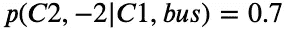*

*使用转移函数的特定转移及其概率。作者图片*

*在这里，我们说的是到达**赌场 2** (C2)并获得 **-2** 奖励的概率是**赌场 1** 和**乘车**的 0.7 或 70%。另一个例子是:*

*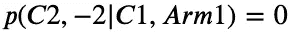*

*概率为 0 的转移。作者图片*

*这里我们问的是同样的情况，但是我们没有乘公共汽车，而是拉手臂 1。现在，转换模型说我们没有机会到达赌场 2，因为我们选择的行动不会以任何方式将我们带到那里。您可以将转换模型视为游戏规则、物理引擎或现实世界机制的准确表示。可悲的是，在大多数情况下，我们无法获得这样一个精确的模型，这使得学习变得复杂。我们稍后将开发能够处理转换模型不可用的环境的策略。*

> *作为一个旁注，我想让你，读者，试着用上面的图表找出在赌场环境中采取的最佳行动。有了这个，如果你发现自己在第一个赌场，最好的行动是什么？如果你只考虑眼前的回报，你会选择这条路吗？这应该让你知道我们的代理必须能够考虑采取最佳行动。*

# *健身房的实施*

*最后，这里有一个使用 gym 接口的上述 MDP 的实现。为了使文章简短，我们不打算在这里讨论实现的细节，而是在附带的[笔记本](https://github.com/aristizabal95/Understanding-Reinforcement-Learning-Hands-On/blob/master/Markov%20Decision%20Processes.ipynb)中讨论。如果你想知道我们是如何将 MDP 图转变成一个可以用于强化学习的完整的工作环境的，我们强烈建议你看看它。话虽如此，下面是完工的环境。*

*使用这个实现，以及一个在其上随机选择动作的代理，我们获得了这样的交互:*

*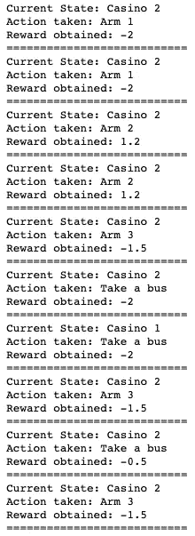*

*赌场环境和随机代理之间的互动链的图像。作者图片*

*应该可以看出，MDP 和由此产生的相互作用是相容的。*

# *结论*

*在本文中，我们提出了一个描述场景的框架，称为马尔可夫决策过程。这个框架允许我们想象一个代理如何使用动作遍历不同的状态，以及每次交互会得到什么样的回报。从那以后，我们开发了一个多臂强盗的变体，在这个变体中，我们现在有两种状态，以及从一种状态到另一种状态的转换动作。最后，我们展示了如何使用 gym 环境实现这样的 MDP。*

*将问题转化为 MDP 是在现实世界中应用强化学习的第一步，因此鼓励你尝试并思考如何描述你作为 MDP 人在日常生活中所做的不同事情。你可能会惊讶于你可以正式描述的事物的数量。接下来的几篇文章将涉及贝尔曼方程，该方程基于马尔可夫决策过程，以定义代理如何理解环境并对其采取行动。那里涵盖的原则也可以应用到我们的日常生活中，所以即使你对开发 RL 代理不感兴趣，它仍然是一本有趣的读物。到时候见！*

# *“系列”链接:*

1.  *[简介](https://medium.com/@alejandro.aristizabal24/understanding-reinforcement-learning-hands-on-part-1-introduction-44e3b011cf6)*
2.  *[多臂土匪](https://medium.com/@alejandro.aristizabal24/understanding-reinforcement-learning-hands-on-part-2-multi-armed-bandits-526592072bdc) | [笔记本](https://github.com/aristizabal95/Understanding-Reinforcement-Learning-Hands-On/blob/master/Multi-Armed%20Bandits.ipynb)*
3.  *[非静止](/understanding-reinforcement-learning-hands-on-part-3-non-stationarity-544ed094b55) | [笔记本](https://github.com/aristizabal95/Understanding-Reinforcement-Learning-Hands-On/blob/master/Non-Stationarity.ipynb)*
4.  ***马氏决策流程** | [笔记本](https://github.com/aristizabal95/Understanding-Reinforcement-Learning-Hands-On/blob/master/Markov%20Decision%20Processes.ipynb)*
5.  *[贝尔曼方程 pt。1](https://medium.com/@alejandro.aristizabal24)*

# *参考资料:*

*   *没有引用的图像由作者生成。*
*   *Coursera 的[强化学习专业化](https://www.coursera.org/specializations/reinforcement-learning)由阿尔伯塔大学提供。*
*   *萨顿和巴尔托(2018 年)。 [*强化学习:入门*](https://web.stanford.edu/class/psych209/Readings/SuttonBartoIPRLBook2ndEd.pdf) 。剑桥(麻省。):麻省理工学院出版社。取自斯坦福档案馆。*