# 理解强化学习实践:多臂强盗

> 原文：<https://towardsdatascience.com/understanding-reinforcement-learning-hands-on-part-2-multi-armed-bandits-526592072bdc?source=collection_archive---------23----------------------->

马库斯·斯皮斯克在 [Unsplash](https://unsplash.com?utm_source=medium&utm_medium=referral) 上的照片

# “系列”链接:

1.  [简介](https://medium.com/@alejandro.aristizabal24/understanding-reinforcement-learning-hands-on-part-1-introduction-44e3b011cf6)
2.  **多臂土匪** | [笔记本](https://github.com/aristizabal95/Understanding-Reinforcement-Learning-Hands-On/blob/master/Multi-Armed%20Bandits.ipynb)
3.  [非平稳性](/understanding-reinforcement-learning-hands-on-part-3-non-stationarity-544ed094b55) | [笔记本](https://github.com/aristizabal95/Understanding-Reinforcement-Learning-Hands-On/blob/master/Non-Stationarity.ipynb)
4.  [马尔可夫决策过程](https://medium.com/@alejandro.aristizabal24/understanding-reinforcement-learning-hands-on-markov-decision-processes-7d8469a8a782) | [笔记本](https://github.com/aristizabal95/Understanding-Reinforcement-Learning-Hands-On/blob/master/Markov%20Decision%20Processes.ipynb)
5.  [贝尔曼方程 pt。1](https://medium.com/@alejandro.aristizabal24)

这是强化学习系列的第二篇文章，我们在其中探索和发展了在交互式场景中学习背后的思想。在之前的文章中，我们介绍了什么是强化学习，它与其他学习框架有何不同，以及为什么它值得关注。在本文中，我们将探索一个最基本的场景，从中我们可以开始构建强化学习代理如何从环境中学习和行动的理论。

在本文中，我们将涵盖理论和代码。这里将展示一些代码片段，但是我强烈建议大家跟随我为这篇文章准备的笔记本一起阅读。

# 多臂强盗场景

我们发现自己身处赌场，希望策略和运气都能给我们带来丰厚的利润。在这个赌场里，我们可以从已知数量的武装匪徒那里试试运气。所有盗匪的行为都是随机的，但平均下来，他们每个人都会返回指定的利润。一些强盗有更高的回报，因此必然有一个强盗会给比其他强盗更高或相等的回报。你怎么去找这样的武装匪徒？假设我们想最大化我们的利润(因此也最小化我们的损失)，最好的策略是什么？

武装匪徒或者赌场里的老虎机。你会选择哪一个？Benoit Dare 在 [Unsplash](https://unsplash.com?utm_source=medium&utm_medium=referral) 上的照片

让我们从创建这样的场景开始。我们将使用 [OpenAI 的健身房](https://gym.openai.com/)来建立一个行为类似于上面解释的赌场的环境。

多武装匪徒环境的实现。

从上面的实现中，我们可以创建一个环境，在这个环境中，我们可以定义我们的赌场拥有的强盗数量，以及他们的平均利润和与平均值的偏差。每当我们与环境交互时，我们都必须指定我们选择拉哪个土匪，并且环境为那个行动返回一个奖励。这里有一个小例子:

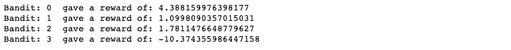

互动的结果。我们和所有的强盗一起行动，看看他们的报酬是什么。

从上面的例子中，我们创建了四个强盗，其中第一个强盗的平均利润最高为 5，而最后一个强盗的平均利润最低为-10。我们与每一个强盗互动，看看它给了我们什么奖励。奖励是随机的，但是他们接近每个强盗的平均水平。偏差决定了每个强盗的随机奖励有多远。请注意，第二个 bandit (Bandit 1)的偏差非常小，因此随机值非常接近平均值。第三个 bandit (Bandit 2)具有更高的标准差，这意味着我们可以找到与平均值相差很远的值。

在这种情况下，随机性的影响至关重要。有时我们很幸运，在一个强盗身上获得很高的价值，但有时我们就没那么幸运了。与每个强盗互动一次并不能告诉我们这个强盗总体上有多好。有时，一个平均水平低但方差高的强盗可能会给我们带来幸运的头奖，但其他强盗可能会给我们一个整体更好的结果。

这是一个非常熟悉的情况。即使你不喜欢赌博，你也会发现自己不得不一直做这样的决定。无论何时你在餐馆，你必须决定你想要什么菜。你应该去吃那道你已经尝过并且知道你喜欢的菜吗？还是会用另一道菜来一炮？你有机会找到新的最爱，或者后悔没有选择更安全的食物。这就是所谓的探索-开发困境。

## 探索与开发的困境

每当代理想要优化与未知(甚至部分已知)环境的交互时，就会出现这种困境。代理人希望尽可能采取最优行动，但不知道哪种行动是最优的，因为他不完全知道哪种行动对他最有利。最佳行动的唯一方法是采取次优行动，以充分了解环境。通过探索，我们更多地了解了我们的环境，但牺牲了获得已知回报的机会。通过开发，我们利用现有的知识来获得最佳结果，但是由于知道得不够多，我们可能会采取次优的行动。这种困境几乎存在于我们在强化学习中遇到的每一个现实生活中。制定良好的应对策略至关重要，这正是我们在这里要做的。

## 评估我们的行动

在我们开始提出策略之前，我们需要知道如何评估我们的行动。看待这个问题的一个好方法是看我们如何评价一家餐馆的菜肴。

每次我们得到一道菜，我们都会评估我们的选择有多好。好吃吗？我对食物有多满意？对于每一个盘子，我们赋予一些值来表示这个选择对我们有多好。每次我们选择这道菜时，这个值都会更新。我们经常选择的菜肴最终会达到平均满意度。

这也是代理评估其行为的方式。在我们的场景中，对于我们可以从多臂强盗那里得到的每一只手臂，我们都有一个我们期望从这样的行动中得到的价值。起初，我们什么都不知道，因此也不期待什么，但是每次我们采取行动，我们都会更新我们的期望。

例如，假设我们拉第一只手臂 5 次。对于我们的行为，我们收到了这份奖励清单。

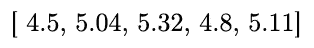

拉第一臂 5 次获得的奖励列表

因此，该臂的预期值是我们到目前为止看到的所有值的平均值。

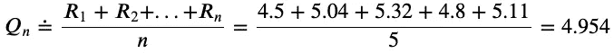

根据以前的知识计算拉第一臂的期望值。这是一个简单的平均数

因此，根据我们之前的互动，我们期望获得奖励 **4.954** 。如果我们再拉一次手臂，我们需要再次计算平均值。如果我们必须为所有可能的行动存储所有以前看到的奖励，这可能会变得乏味和不切实际。通过将平均函数重新表述为更新规则，我们可以做得更好。经过一些[在](https://math.stackexchange.com/questions/106700/incremental-averageing#answer-106720)周围扭来扭去，我们得到:

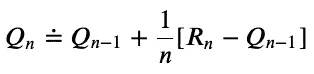

增量平均更新规则

在英语中，这意味着每当我们想要更新一个行为的值时，我们就取我们之前的期望值，加上我们期望的回报和我们获得的回报之间的差，除以我们实际采取该行为的次数。例如，如果我们第六次拉第一臂，获得奖励 **5.18** ，那么我们可以计算我们的新期望值为:

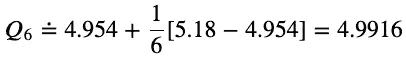

使用平均更新规则获得的新期望值

我们会为所有可能的行动这样做。请注意，随着我们采取行动的次数增加，更新规则将最终收敛。这是因为随着 *n* 变大，数值变化越来越小。

# 贪婪的代理人

我们的第一个策略将完全集中在开发上。贪婪的代理人总是会根据其现有的知识选择最佳行动。也就是说，代理将总是选择具有当前最大期望值的动作。例如，如果这是我们的代理为每个操作计算的值列表，那么它将选择操作 1:

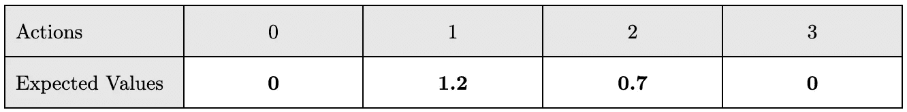

显示每项行动的预期值的表格。

这在数学上可以表示为取期望值的 ***argmax*** 。如果两个或更多的动作被认为是最佳的(也就是说，它们具有相同的值，并且该值是最大的整体动作)，那么代理在这些动作中随机选择。例如，这里它会随机选择动作 1 或动作 3:

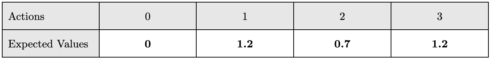

显示每项行动的预期值的表格。行动 1 和 3 被认为是最好的。

这个行为对于 ***argmax*** 函数来说并不是默认的，所以我们需要自己编写一个可以任意中断联系的函数。

Argmax 任意中断连接

现在，我们需要做的就是实现我们贪婪的代理。为此，我们需要指定代理如何采取行动，以及代理如何从交互中学习。如上所述，代理基于哪个动作产生最大期望值来采取动作。另一方面，它通过使用增量平均更新规则更新每个动作的值来学习。

贪婪代理的实现

在我们进行任何测试之前，我们希望我们的代理在这项任务中表现如何？起初，我们的代理人对这个世界一无所知，因此期望每个动作都是一样的。在采取第一个行动后，有两种情况可能发生:代理人要么赔钱(负回报)，要么获利(正回报)。如果代理人赔钱，那么它会认为采取的行动是一个不好的行动，并选择另一个。如果在后一种情况下，它赢了钱，对这种行动的期望增加，并成为所有行动中最大的行动。这意味着，它将继续采取行动，除非他失去足够的钱来看起来不好的行动。

回到我们餐厅的例子，一个贪婪的顾客试了一道菜，如果他喜欢，他一辈子只会点那道菜。只有当顾客有足够的不愉快经历不喜欢这道菜时，他才会尝试另一道菜。

你认为这是获得最佳结果的好策略吗？我们的代理肯定不会做得很差，但也不会做得最好。对我们的代理人来说，能找到最好的行动，而不是另一个看起来不错的行动，这将是非常幸运的。让我们来测试一下！

代理和环境之间交互的简化实现

上面的代码实现了代理和环境之间的交互。代理有 1000 次尝试来获得尽可能多的奖励。让我们看看这种互动是如何进行的。下面你会发现 6 个不同的代理与 6 个不同的环境互动。该环境由代理可以采取的 8 个单独行动(或武装匪徒)组成。红点表示每个操作的真实期望值，而蓝条表示代理的估计值。

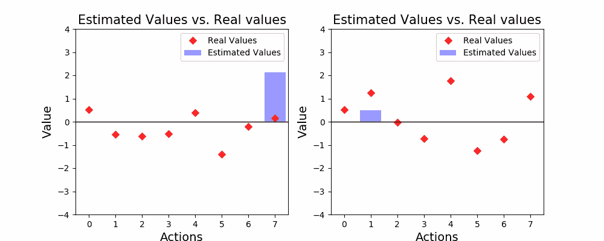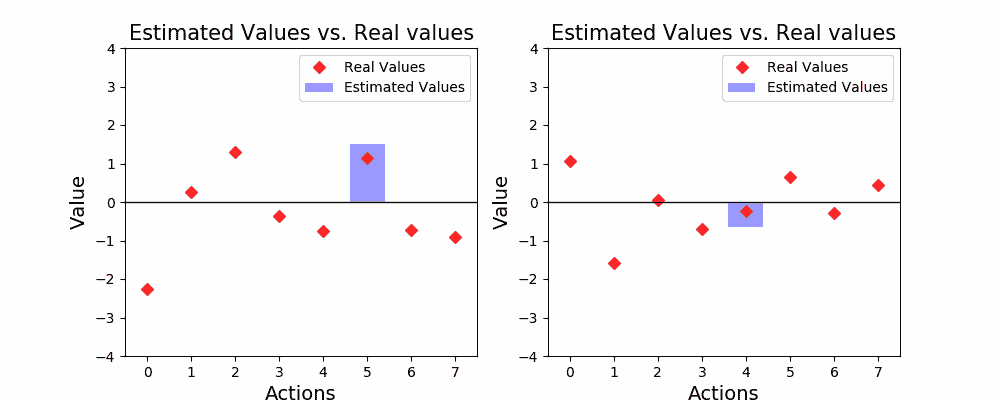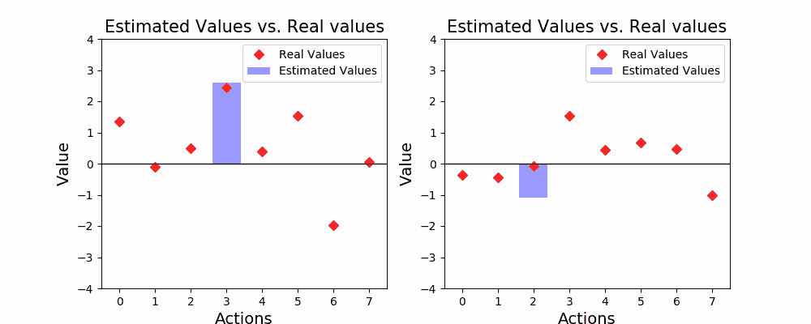

6 个不同的贪婪代理与多臂土匪问题互动。有 8 个不同的动作

如你所见，探索不是我们代理人的主要目标。只有当所有其他行为看起来比它更糟糕时，代理人才会探索新的行为。有时候，我们的代理很幸运，并降落在最高价值的行动(如第五代理)，但大多数时候，它最终在一个次优的行动。事实上，有时我们的代理是如此不幸，当它与正确的选择进行交互时，它收到了一个糟糕的结果！看看第四个代理，它与动作 0 交互，动作 0 是最好的动作，但从中得到了损失。在那之后，我们的代理人就没有机会再尝试那个行动了，即使它会比其他任何行动带来更高的平均回报！

我们刚刚看到一些代理商使用贪婪策略，这看起来并不好。但整体表现如何？我们实际上可以做很多实验，观察平均行为。

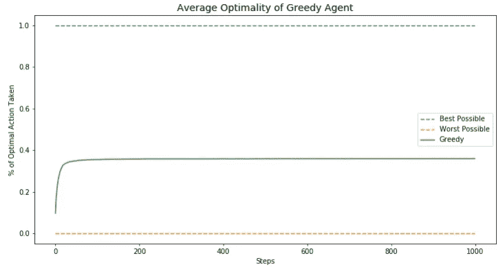

贪婪策略的平均最优性。只会在 40%的情况下落在最佳动作上。

上图显示了 10，000 多次单个实验的平均值，即代理采取最佳行动(即，对环境的最佳行动)的次数百分比。上面的图表明，平均来说，40%的时候我们的贪婪策略会让我们采取最优行动。我们还可以得出结论，经过几次尝试，代理人并没有得到任何改善。只有前十几次尝试对我们的代理人来说很重要，因为之后通常会坚持一次行动。显然，纯粹的开发技术远非最佳。如果我们引入一些探索呢？

# ɛ-greedy 代理

这个新策略给动作选择过程增加了一点随机性。一般来说，代理的行为就像上面看到的贪婪代理一样。但是，每隔一段时间，它会随机选择一个动作。我们的代理人采取随机行动的概率是由一个叫做ε(ɛ).)的新参数决定的因此，ε是 0 和 1 之间的值。

其工作方式是，每当我们的代理想要采取行动时，它就“掷骰子”，并根据结果决定是贪婪地行动还是随机地行动。例如，如果ɛ被分配到 1/6，那么这就等于说，每当代理人在骰子上掷出 1，它就会随机行动。这是我们代理的新实现:

ɛ-greedy 代理的实现。

我们实际上是基于贪婪实现的代理，只是改变了代理如何选择要采取的动作。

现在我们的代理将允许一些勘探，但是勘探的数量是基于我们分配给ɛ.的数量如果ε是 0，那么我们的代理将充当贪婪的实现。另一方面，如果ε是 1，那么我们的代理只不过是一个随机机器。现在，我们将使用ε值 0.1，但稍后我们将探索其他值。因此，我们的代理人在 90%的时间里会贪婪地行动，而探索性的时间只有 10%。

让我们来看看这一战略的实施情况:

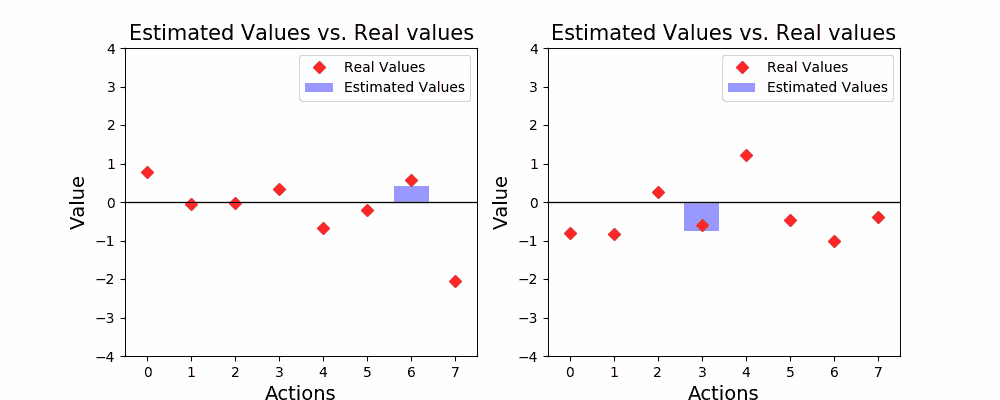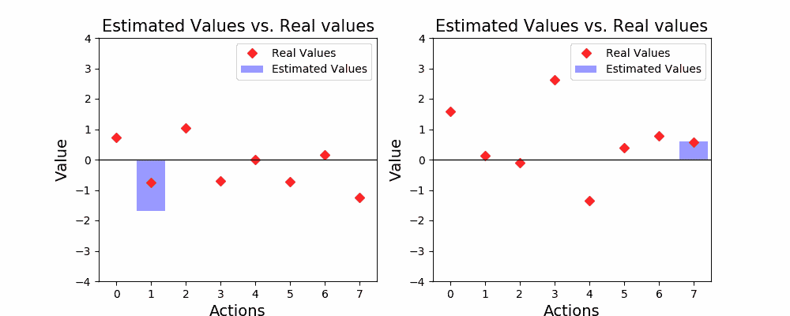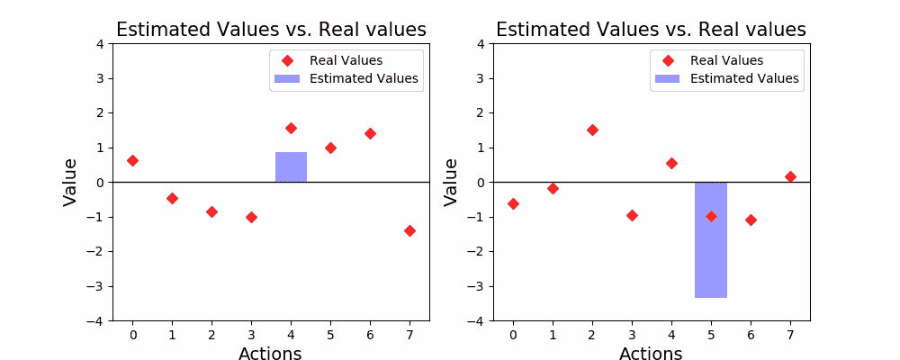

事情开始有希望了！在上面几乎所有的例子中，我们的代理都能找到最佳行动。事实上，如果有足够的时间，我们的代理最终会为所有的行为找到一个好的估计值。注意蓝色条现在如何显示更接近红点的值？我们的代理现在可以足够自信地知道哪个动作是最佳的。同样，让我们看看这个策略平均起来是什么样的:

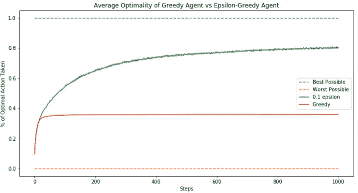

ɛ-greedy 代理与贪婪代理的最优性

与贪婪策略相比，ɛ-greedy 代理做得更好！经过 1000 步之后，ɛ-greedy 策略在 80%的情况下都能接近选择正确的行动。此外，我们看到这种策略如何随着时间的推移增加其最优性，这意味着它总是从互动中学习。

那么，我们应该为ɛ选择什么样的价值观呢？好吧，让我们测试ε的多个值，看看它们平均获得多少奖励:

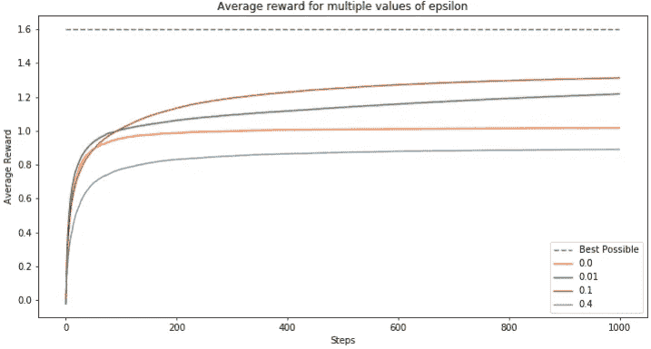

这里，我们看到在这种情况下ε的最佳值是 0.1。原因是因为它足够小，让我们的代理人大多表现贪婪，因此优先考虑高回报，但又足够大，让我们的代理人快速探索环境。更高的ε值将开始妨碍我们的代理人，因为时间探索是不能获得高回报的时间。较低的值意味着我们的代理将需要更长的时间来了解环境，这意味着它可能需要很长时间才能找到最佳行动。

# 包扎

到目前为止，我们已经呈现了一种在最佳行动和探索性行动之间进退两难的局面。我们已经看到这种困境如何极大地影响我们学习和与环境互动的方式。基于这种情况，我们定义了一些方法，让我们的代理可以评估它的行为，并从环境中学习。本文揭示并比较了解决勘探开发困境的两种策略，即贪婪代理和ɛ-Greedy 代理。这些策略背后的思想将贯穿我们的强化学习之旅，理解它们背后的概念，以及它们的优点和缺点将在以后为我们服务。

在下一篇文章中，我们将探索当我们的策略用于非稳定环境时会发生什么。也就是说，当从我们的行为中获得的平均回报不是静态的，而是在我们的代理人与之互动时发生轻微变化。因此，我们将提出一些修改，可以使我们的代理在这种情况下表现得更好。如果你走到了这一步，给自己一个鼓励。这不是一个容易的阅读，我希望你在这个过程中学到了一些东西。

# “系列”链接:

1.  [简介](https://medium.com/@alejandro.aristizabal24/understanding-reinforcement-learning-hands-on-part-1-introduction-44e3b011cf6)
2.  **多臂土匪** | [笔记本](https://github.com/aristizabal95/Understanding-Reinforcement-Learning-Hands-On/blob/master/Multi-Armed%20Bandits.ipynb)
3.  [非平稳性](/understanding-reinforcement-learning-hands-on-part-3-non-stationarity-544ed094b55) | [笔记本](https://github.com/aristizabal95/Understanding-Reinforcement-Learning-Hands-On/blob/master/Non-Stationarity.ipynb)
4.  [马尔可夫决策过程](https://medium.com/@alejandro.aristizabal24/understanding-reinforcement-learning-hands-on-markov-decision-processes-7d8469a8a782) | [笔记本](https://github.com/aristizabal95/Understanding-Reinforcement-Learning-Hands-On/blob/master/Markov%20Decision%20Processes.ipynb)
5.  [贝尔曼方程 pt。1](https://medium.com/@alejandro.aristizabal24)

# 参考资料:

*   没有引用的图像由作者生成。
*   Coursera 的[强化学习专业化](https://www.coursera.org/specializations/reinforcement-learning)由阿尔伯塔大学提供。
*   萨顿和巴尔托(2018 年)。 [*强化学习:入门*](https://web.stanford.edu/class/psych209/Readings/SuttonBartoIPRLBook2ndEd.pdf) 。剑桥(麻省。):麻省理工学院出版社。取自斯坦福档案馆。