# 理解强化学习实践:非静态

> 原文：<https://towardsdatascience.com/understanding-reinforcement-learning-hands-on-part-3-non-stationarity-544ed094b55?source=collection_archive---------25----------------------->

## 探索动态世界以及如何应对它们

乔纳森·彼得森在 [Unsplash](https://unsplash.com?utm_source=medium&utm_medium=referral) 上拍摄的照片

# “系列”链接:

1.  [简介](https://medium.com/@alejandro.aristizabal24/understanding-reinforcement-learning-hands-on-part-1-introduction-44e3b011cf6)
2.  [多臂土匪](https://medium.com/@alejandro.aristizabal24/understanding-reinforcement-learning-hands-on-part-2-multi-armed-bandits-526592072bdc) | [笔记本](https://github.com/aristizabal95/Understanding-Reinforcement-Learning-Hands-On/blob/master/Multi-Armed%20Bandits.ipynb)
3.  **非固定式** | [笔记本](https://github.com/aristizabal95/Understanding-Reinforcement-Learning-Hands-On/blob/master/Non-Stationarity.ipynb)
4.  [马尔可夫决策过程](https://medium.com/@alejandro.aristizabal24/understanding-reinforcement-learning-hands-on-markov-decision-processes-7d8469a8a782) | [笔记本](https://github.com/aristizabal95/Understanding-Reinforcement-Learning-Hands-On/blob/master/Markov%20Decision%20Processes.ipynb)
5.  [贝尔曼方程 pt。1](https://medium.com/@alejandro.aristizabal24)

欢迎来到强化学习系列的第三篇文章。在[上一篇文章](/understanding-reinforcement-learning-hands-on-part-2-multi-armed-bandits-526592072bdc)中，我们探索了我们将要应对的一系列场景中的第一个，多臂匪徒。在这种情况下，我们面对的是一个有固定数量行动的环境，我们的任务是找到能产生最大回报的行动。我们提出了一些策略，并测量了它们在这个简单任务中的表现。

在本文中，我们将修改之前呈现的环境，使其更具动态性。我们将看到我们以前的策略如何处理非稳定环境，以及我们如何能做得更好。

# 静止与非静止:

上次我们在一个赌场开始了我们的故事，那里到处都是供我们支配的强盗。利用这个例子，我们建立了一个简化的环境，并制定了一个强有力的策略来获得高回报，即 **ɛ-greedy 代理**。使用这种策略，我们能够在足够的时间内找到最佳行动，并因此获得大量奖励。我们的代理表现得很好，因为它在探索环境和利用其知识之间取得了良好的平衡。这种平衡使代理人能够了解环境的行为方式，同时也能获得高回报。但是，有一个小的假设，我们的代理正在做的能够表现得如此最佳，那就是环境是静态的，不变的。我们这么说是什么意思，我们的代理人在哪里做出这样的假设？

## 静止的

当我们提到“静止”这个词时，我们谈论的是我们环境的潜在行为。如果你还记得上节课，环境被定义为有一组行动，在互动中，产生随机的回报。即使回报是随机的，它们也是由每个行为的中心值或平均值产生的，我们称之为**真实值**。为了理解我所说的，让我们来看看我们在上一篇文章中看到的一个动画交互。

ɛ-greedy 代理与静态环境交互的示例。作者图片

观察真实值(红点)是如何静态的。尽管环境会产生随机的回报，但是每个行为都有一个真实的期望值，这个期望值永远不会改变。这是一个很大的假设，而且几乎没有有价值的真实世界场景会随之而来。例如，如果我们的赌场类比是静态的，那么赌场将很快倒闭！那么，我们如何在不使问题变得更复杂的情况下描绘出一个更现实的场景呢？

## 非平稳的

让多臂强盗场景变得不稳定实际上很简单，我们需要做的就是确保我们所有行动的期望值总是变化的。现在，这种变化不应该是完全不稳定的，因为没有任何策略能够处理完全随机的情况。相反，我们希望期望值慢慢远离。这是为了让我们的代理仍然可以考虑以前的经验对未来的决策有意义。下面是我们如何实现这样的环境

有一些微妙的变化。现在，每次我们的代理与环境交互时，每个动作的真实值都会发生微小的随机变化。当我们创造环境时，可以控制它的变化程度。这是为了我们以后可以用它做实验。现在环境表现如何？我们可以像以前一样进行同样的可视化，但是使用我们的新环境。因为我们对代理不感兴趣，所以我们不打算绘制它的交互。

不稳定的环境。每个动作的值随机变化一定的量。作者图片

为了便于说明，前面的图是用大量的非平稳数据生成的。请注意，在某些情况下，最高值的动作会因随机移动而改变。因为我们感兴趣的是一个行为尽可能优化的代理，所以我们希望代理能够观察到这种变化并相应地采取行动。

## 当前性能

声明了我们的新环境之后，让我们看看ɛ-greedy 代理在这里的表现。知道我们的代理有探索的空间，代理注意到环境改变应该只是时间问题。

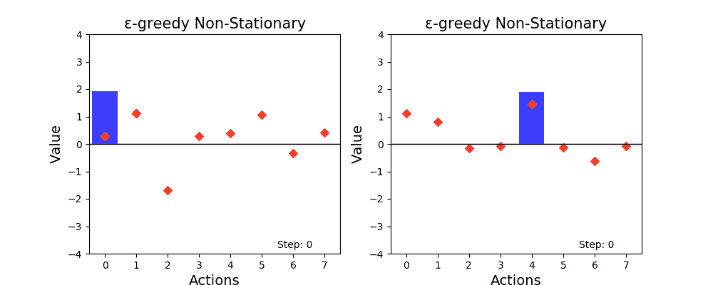

ɛ-greedy 智能体与非平稳环境的相互作用。作者图片

为了使可视化更加清晰，我添加了一些颜色来显示哪个动作具有最大值(橙色点)以及代理认为哪个动作最好(蓝色条)。对于这个动画，经过的时间延长到 800 步。起初，代理能够迅速适应环境的变化，但过一会儿，估计值停滞不前，往往移动缓慢。这使得很难赶上未来的变化，并导致代理人停留在次优行动更长时间。像往常一样，让我们通过平均许多实验的性能来绘制这种策略的最优性。

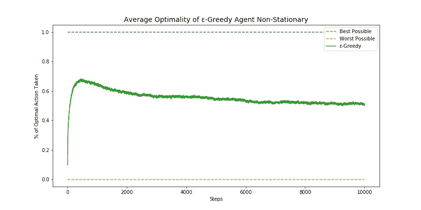

ɛ-greedy 代理在非稳定环境中的一般性能。作者图片

正如我们所看到的，起初我们的代理很快适应了环境，但是随着时间的推移，它的性能开始下降。尽管我们的代理总是在收集经验，并且总是在探索环境，但它似乎不能处理一个动态的世界。我们如何确保我们的代理在未来适应更大的变化？

# 更新规则问题

回到上一篇文章，我们展示了一种方法，在这种方法中，我们可以很容易地评估对多武器土匪场景采取行动的价值。这个评估是使用一个基本平均值来完成的，这个平均值在给定的时间后会收敛到预期的行动值。如果你曾经处理过取平均值，你应该知道你加起来的项目越多，结果就越稳健。假设我们想要取三个值列表的平均值:

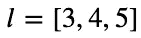

要平均的小数值列表。作者图片

那么平均值将等于 **4** 。给定这样一个小列表，任何输入的变化都会使结果平均值发生一定程度的变化。

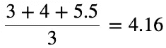

l 的平均值，修改了最后一个值。作者图片

如果我们使用更大的值列表，那么输入中的相同变化将导致输出中的较小变化。

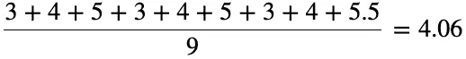

更大列表的平均值，输入的变化量相同。作者图片

总而言之，我们计算平均值的信息越多，结果就越不容易出现异常值或偏差。在我们之前实现的增量平均更新规则中也可以看到这种影响:

增量平均更新规则。作者图片

**1/n** 的表达式导致相同的效果，假定随着 **n** 变得更大**，**，那么 Q 值变化越来越小。这就是导致我们的代理停滞不前的原因。一旦积累了足够的经验，就很难让我们的代理人改变主意。要解决这个问题，我们必须修改更新规则，这样以后的体验才不会被丢弃或忽略。

# 一般更新规则

那些通常对机器学习有一些经验或知识的人可能已经看到了上述更新规则背后的模式。如果你没有，让我简单解释一下:

通常，对于要学习的机器学习模型，我们使用一种称为误差或损失函数的度量。这种测量确定了我们的模型的性能与预期结果相比有多差。为了改进我们的模型，我们通过逆着误差移动参数来更新它的参数。我们应该移动或修改我们的参数多少？那是由**学习率决定的。**下面是上述语句的一个过于简化的演示。

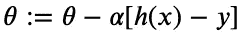

梯度下降更新规则的过于简单的例子。作者图片

看起来很眼熟，对吧？ **h(x)** 代表我们模型的输出，而 **α** 代表学习率。这是梯度下降的粗略简化版本，梯度下降是大多数机器学习任务中改进模型的标准方法。如果对这个话题感兴趣，我觉得这是一篇很棒的[关于梯度下降](/understanding-the-mathematics-behind-gradient-descent-dde5dc9be06e)的文章。

对比增量平均更新规则和梯度下降，我们的直觉会说 **1/n** 等价于学习率 **α** ，那就对了。因此，我们可以将我们使用的更新规则修改为更通用的版本。

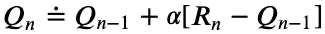

通用更新规则。作者图片

这是做什么的？好了，现在我们可以将 **α** 定义为除了 **1/n 之外的任何值。**使用常数作为学习速率是其他机器学习范例中使用的一种简单而有效的方法，因此我们也可以在这里尝试一下。让我们实现我们的新代理！

我们的新实现基于ɛ-greedy 代理。有一些小的变化。首先，我们添加了一个名为 *ss_func* 的新参数，它允许我们根据需要更改步长函数。默认情况下，该函数返回值 0.1，这将是这里使用的常量步长。此外，在更新估计值时，我们执行 *ss_func* 函数，并使用返回值作为我们的步长。为了让事情更清楚，下一行代码相当于声明一个使用这个新实现的ɛ-greedy 代理。

像估计值和ε这样的变量以前已经被假定存在。

让我们看看这个新的代理如何在我们的动态多臂土匪场景中表现，与以前的ɛ-greedy 策略相比。

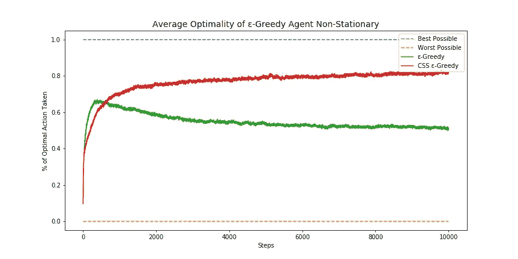

动态环境下ɛ-Greedy 和等步长ɛ-Greedy 策略的比较。图片作者。

就这样，我们的代理现在能够适应一个动态的世界！通过使用恒定的步长(或学习速率)，代理将不再停滞不前。相反，每一个新的经历都是同等重要的，所以用新的知识去克服以前的经历是可能的。

## 步长参数:

最后，我想简要地了解一下这个新参数 **α** ，它的行为方式以及什么值对它是合理的。我们已经看到， **0.1** 的值在这个场景中给出了很好的结果，但是它在其他值下会有什么表现呢？

步长参数可以被认为是对新知识的置信度的度量。α的高值类似于说我们相信我们最近的经验是手头问题的良好代表。因此，步长参数应介于 0 和 1 之间，其中 1 表示完全信任，0 表示不信任之前的交互对理解潜在问题的代表性。让我们看看这两个值是如何影响学习结果的。

置信度为 1 会将我们的更新规则变成这样:

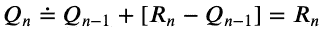

更新学习率为 1 的规则。相当于将我们的估计值分配给最近收到的奖励。作者图片

在这里，我们基本上是说，我们的估计应该等于最近获得的回报，不考虑任何以前的经验。只有当我们知道(或者真的有信心)我们得到的回报是确定的、稳定的时，这才会起作用。由于现实世界中并非如此(因为交互通常是随机的，而不是随机的交互通常不需要学习算法)，因此不应考虑步长值为 1。

置信度为 0 将取消更新规则的更新部分:

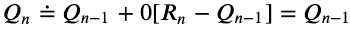

对我们最近互动的零信心会使我们先前的估计保持不变。作者图片

由于步长为零，我们排除了代理从经验中学习的可能性。因此，恒定的步长 0 对于强化学习来说是没有意义的。

至于 0 和 1 范围内的其他值，它们决定了我们的代理对方差的反应有多快或多慢，以及它的收敛速度有多快。接近 1 的值将快速更新估计值，并试图跟上环境的变化，但它也容易受到噪声的影响。另一方面，较小的值需要更长的时间来收敛，并且对动态环境的反应较慢。让我们比较一下这个场景的一些值。

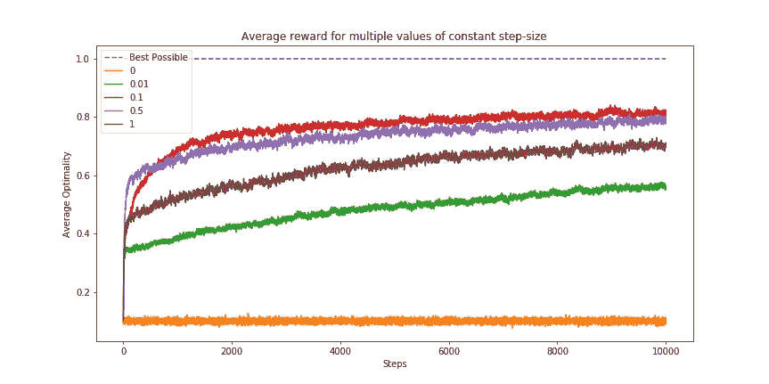

动态环境下不同步长的多个代理的性能比较。图片作者。

正如预测的那样，极值不太适合这个问题，低值收敛较慢，高值收敛较快。与机器学习的其他领域不同，在其他领域中，学习速率或步长主要影响收敛时间和达到最佳结果的准确性，在强化学习中，步长与环境的动态程度密切相关。一个真正动态的世界(一个经常快速变化的世界)将要求我们的步长有很高的值，否则我们的代理将不能足够快地跟上世界的变化。

# 包裹

在本文中，我们介绍了非固定的概念，并将其实现到多臂强盗场景中。然后我们探索了我们之前的竞争者，ɛ-greedy 代理商，在这种新的情况下是如何表现的，并揭示了是什么使它的行为次优。然后，通过借用其他机器学习领域的一些概念，我们定义了一种评估我们行为的新方法。这种新的更新规则允许恒定的步长，这是解决非平稳问题的关键。最后，简要说明了步长参数如何影响学习结果。

本文旨在讨论几个主题，这些主题太长，无法添加到上一篇文章中，但是仍然有足够的价值，可以在本系列文章中介绍。通用更新规则将在以后发挥作用，因此必须涵盖它。有了这个，我们就可以告别多臂大盗，开始触及其他话题了。下一篇文章将讨论马尔可夫决策过程，并为著名的贝尔曼方程奠定基础。这两个概念是强化学习的支柱，理解它们可以真正改变对世界的看法。到时候见！

# “系列”链接:

1.  [简介](https://medium.com/@alejandro.aristizabal24/understanding-reinforcement-learning-hands-on-part-1-introduction-44e3b011cf6)
2.  [多臂土匪](https://medium.com/@alejandro.aristizabal24/understanding-reinforcement-learning-hands-on-part-2-multi-armed-bandits-526592072bdc) | [笔记本](https://github.com/aristizabal95/Understanding-Reinforcement-Learning-Hands-On/blob/master/Multi-Armed%20Bandits.ipynb)
3.  **非固定式** | [笔记本](https://github.com/aristizabal95/Understanding-Reinforcement-Learning-Hands-On/blob/master/Non-Stationarity.ipynb)
4.  [马氏决策流程](https://medium.com/@alejandro.aristizabal24/understanding-reinforcement-learning-hands-on-markov-decision-processes-7d8469a8a782) | [笔记本](https://github.com/aristizabal95/Understanding-Reinforcement-Learning-Hands-On/blob/master/Markov%20Decision%20Processes.ipynb)
5.  [贝尔曼方程 pt。1](https://medium.com/@alejandro.aristizabal24)

# 参考资料:

*   没有引用的图像由作者生成。
*   Coursera 的[强化学习专业](https://www.coursera.org/specializations/reinforcement-learning)由阿尔伯塔大学提供。
*   萨顿和巴尔托(2018 年)。 [*强化学习:入门*](https://web.stanford.edu/class/psych209/Readings/SuttonBartoIPRLBook2ndEd.pdf) 。剑桥(麻省。):麻省理工学院出版社。取自斯坦福档案馆。