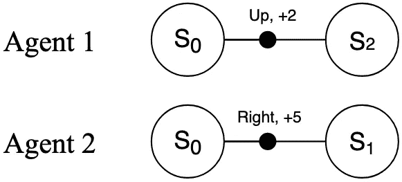
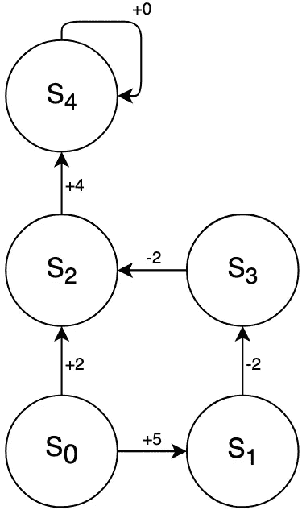
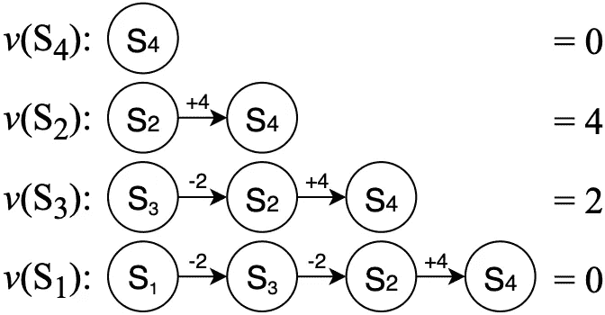
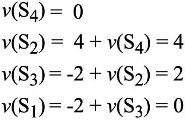
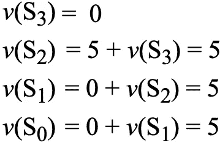
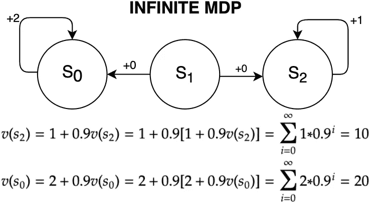
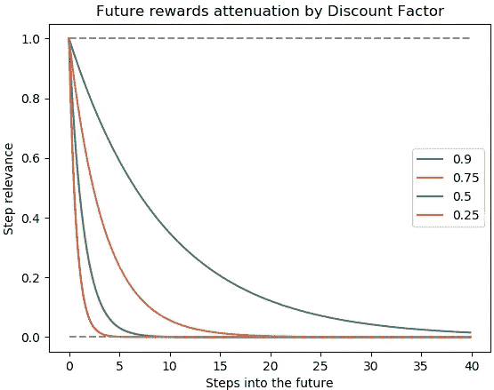

# 理解强化学习实践:贝尔曼方程第 1 部分

> 原文：<https://towardsdatascience.com/understanding-reinforcement-learning-hands-on-the-bellman-equation-pt-1-869290c8a5cd?source=collection_archive---------40----------------------->

## 了解代理如何评估环境

Javier Allegue Barros 在 [Unsplash](https://unsplash.com?utm_source=medium&utm_medium=referral) 上拍摄的照片

# “系列”链接:

1.  [简介](https://medium.com/@alejandro.aristizabal24/understanding-reinforcement-learning-hands-on-part-1-introduction-44e3b011cf6)
2.  [多臂土匪](https://medium.com/@alejandro.aristizabal24/understanding-reinforcement-learning-hands-on-part-2-multi-armed-bandits-526592072bdc) | [笔记本](https://github.com/aristizabal95/Understanding-Reinforcement-Learning-Hands-On/blob/master/Multi-Armed%20Bandits.ipynb)
3.  [非静止的](/understanding-reinforcement-learning-hands-on-part-3-non-stationarity-544ed094b55) | [笔记本](https://github.com/aristizabal95/Understanding-Reinforcement-Learning-Hands-On/blob/master/Non-Stationarity.ipynb)
4.  [马尔可夫决策过程](https://medium.com/@alejandro.aristizabal24/understanding-reinforcement-learning-hands-on-markov-decision-processes-7d8469a8a782) | [笔记本](https://github.com/aristizabal95/Understanding-Reinforcement-Learning-Hands-On/blob/master/Markov%20Decision%20Processes.ipynb)
5.  **贝尔曼方程第一部分**

欢迎来到强化学习系列的第五篇文章。在上一篇文章中，我们介绍了描述复杂环境的 MDP 框架。这允许我们为基本的多武器强盗问题创建一个更加健壮和多样化的场景，我们称之为赌场环境。然后，我们使用 OpenAI 的 gym 实现了这个场景，并制作了一个简单的代理，它随机地展示了在 MDP 框架下交互是如何实现的。

今天，我们将把注意力放回到代理人身上，并展示一种我们可以描述代理人在复杂场景中的行为的方法，在复杂场景中，过去的行为决定了未来的回报。这将通过提出贝尔曼方程来实现，该方程概括了理解代理如何在 MDPs 上行为所需的所有内容。本文的目标是提供推导贝尔曼方程的第一步，贝尔曼方程可以被认为是机器学习这一分支的基石。在接下来的文章中，我们将继续开发这个等式背后的直觉。这篇文章将重点放在理论上，但已经被淡化，使一切都有直观的感觉和意义。

# 一个特工看待世界的新方式

我们现在面临更复杂的环境。一个包含多种状态的世界，在这个世界中采取某些行动会导致不同的结果。我们的决定不再对我们周围的世界没有影响，目光短浅也不再一定会导致最佳解决方案。我们的特工不再处理简单的多武装匪徒的情况，我们必须适应他们，如果我们想让他们成功。

以前，我们开发了基于确定代理行为价值的策略。知道了每个行为的价值，代理人就可以通过选择价值最高的行为来优化自己的行为。这是可能的，因为采取的每一个动作都是相互独立的，并且无论代理选择什么动作，它总是面临相同的情况。然而，这一次，仅仅选择呈现给代理的最佳动作在将来可能是有害的。让我们看一个例子。

我们将探索生活在两个完全相同的环境中的两个不同的代理人。环境对我们来说是未知的，所以我们能够从中学习的唯一方法是通过观察这些代理所做的交互。我们将一步一步地跟踪他们，并试图确定哪一个表现得更好。

两个特工在同一个环境中迈出了第一步。作者图片

这里，两个代理都从我们称为 *S0* 的任意状态开始。第一个代理采取行动**向上**，而第二个**向右**。到目前为止，第二个代理似乎表现得更好，因为它获得了 **+5** 的奖励，而第一个代理获得了 **+2** 。让我们继续追踪。

两个特工开始了他们对环境的第二步。作者图片

现在第二名特工的情况看起来不太妙。尽管正确的行动在第一步看起来是最好的选择，但它会导致一个非常糟糕的状态，我们最终会失去一些之前获得的奖励。另一方面，第一个代理人没有选择眼前的最优行动，而是从长远来看得到了回报。显然，把我们的行为仅仅建立在行动的价值上并不是一个最佳策略。我们怎样才能做得更好？

# 评估状态

是时候揭示上述互动背后的环境了。这是一个描述所有状态、动作和奖励的 MDP。

MDP 对于前面例子的底层环境。作者图片

注意这个 MDP 后面真的只有一个选择，是在 *S0* 拍的。每一个其他的状态都为你指明了一条预定的道路。还要注意的是， *S4* 只有一个动作，既没有任何奖励也没有转换到另一个状态。这种状态被称为**终端状态**，因为它们表示没有进一步的交互改变代理的情况的地方。

现在假设您可以指定代理开始交互的位置。查看环境图，哪个州是放置我们的代理的最佳位置？哪个会是最糟糕的？很容易得出这样的结论:最糟糕的状态是 S1，因为从长远来看，我们最终会赚多少赔多少。另一方面， *S2* 似乎是一个很好的起点，因为我们最终会赚到+4。 *S0*

我们刚才所做的是查看每个状态，并累积如果我们从该状态开始将获得的奖励。我们只是给了 MDP 上的每个位置一个内在的值。我们可以通过绘制所有路径并显示累积奖励来使这一点更清楚。我们将一个状态的值 **s** 定义为 ***v(s)*** 。

每个州的轨迹和累积奖励的图表。作者图片

你注意到我们是从顶部开始的吗？如果您查看每条路径，您可能会注意到许多重复的计算。 *S1* 的值取决于 *S3* 的值，后者取决于 *S2* 的值，后者取决于 *S4* 的值。我们可以通过陈述每个状态的值取决于下一个状态的值，以及收到的直接奖励来简化这一点。这样，我们可以将每个状态的值定义为:

使用先前计算的值计算每个状态的值。

这个过程可以概括成一个基本公式:

其中 **s** 是当前状态，**s’**是下一个状态， **r** 是转换到**s’**获得的奖励。到目前为止，我们没有做任何不寻常的事情。我们只是给每个状态分配了一个值，表明如果一个代理从那里开始它的交互，我们期望得到多少奖励。有了这个，代理将能够评估它的行为，考虑未来的回报。

## 延迟奖励和无限互动

我们对价值的定义看起来不错，但仍有一些细节必须涵盖进来，以使其更加稳健。为此，我们将简要介绍其他 MDP，它们会指出我们当前定义的一些问题。别担心，我们稍后会回到前面的例子。

一个基本的 MDP，代理人只在最后一步得到奖励。作者图片

这里我们有一个新的 MDP，其中所有的转换都没有奖励，除了最后一个，我们得到 **+5** 。这是一个具有延迟回报的 MDP，因为代理人直到最后一刻才收到对其行为的反馈。看上面的图片，哪个州最适合我们的代理？我们的直觉告诉我们 S2 是最好的状态，因为它就在奖励旁边，但是每个状态的值说明了什么呢？

延迟奖励 MDP 的每个状态的值。作者图片

根据我们目前对价值的定义，除了 S3 之外的每一个州都同样有价值，这并没有错……但是为什么会有这种感觉呢？看来我们的代理人没有紧迫感，他不在乎现在或以后是否会收到报酬。让我们看看另一个 MDP:

一个有两个州无限期奖励特工的 MDP。作者图片

这里我们有一个 MDP，我们的代理人将从 S1 州开始。然后代理人可以选择去一个无限期奖励 **+2** 或者无限期奖励 **+1** 的状态。你会走哪条路？很明显，走每一步都有更高回报的路会更好。选择 *S0* 会给我双倍于 *S2* 的奖励。这似乎是显而易见的，但是价值函数又是怎么说的呢？

无限奖励的自我指向状态的价值。作者图片

这两种状态的价值是相等的，因为它们迟早都会达到无穷大。同样，我们看到我们的代理没有紧迫感，因为它假设它的交互可以无限延长。我们如何解决这个问题？

我们可以改变环境或互动来增强紧迫感。在延迟奖励 MDP 的例子中，我们可以使每一个转变都有一个小的负奖励，这将因此使代理尝试采取尽可能少的步骤来达到最后的状态。在无限相互作用的情况下，我们可以简单地通过强制实施代理可以采取的最大步骤数来将无限从等式中移除。如果代理只能运行 10 个交互，那么很明显哪个选择更好。但是，有一个简单的数学技巧可以解决这两个问题，而不必改变环境或限制其行为。

## 折扣系数

到目前为止，我们已经看到了代理评估环境的两种极端方式。第一个是着眼于眼前的回报，忽视任何未来的结果。第二个是考虑到所有可能获得的奖励，直到无穷远。在现实生活中，代理人在优先考虑现在和长远的回报之间有一个平衡。我们通常向前看到某一点，看得越远，就越不关心未来的结果。我们需要做什么改变来获得与我们的代理相同的行为？让我们再来看看我们的广义价值函数

我们在这里声明，一个状态的价值是由眼前的奖励 **r** 和未来的奖励定义的，它们是由***v*(s)**捕获的。如果我们告诉我们的代理人少关心一点未来的回报会怎么样？这可以通过简单地简化这个术语来实现，如下所示:

这个小小的改变看似微不足道，却有着级联效应。让我们看看添加这个值如何改变我们的代理看待这两个有问题的例子的方式。

延迟奖励 MDP 及其各州的价值，折扣系数为 0.9。作者图片

看起来很有希望！我们离眼前的回报越远，这种状态就越不受重视。由于我们要求代理人减少对未来奖励的优先考虑，它显示了对即时奖励的偏好，同时仍然考虑未来事件。无限的 MDP 呢？

贴现因子为 0.9 的无限 MDP 及其各州的值。作者图片

没有必要去理解公式，但是要意识到，通过从价值函数中削弱未来的回报，即使是无限的互动也有一个确定的值，我们的直觉是正确的。现在， *S0* 价值更高(20)，因为它产生的回报是 S2 (10)的两倍。

我们添加到公式中的这个数字被称为**贴现因子(𝛾)** ，可以是 0 到 1 之间的任何值。这就是广义价值函数加上贴现因子后的样子。

带折扣因子的价值函数。作者图片

这个修改之所以有效，是因为加入了贴现因子，把价值函数转化成了一个[几何级数](https://www.varsitytutors.com/hotmath/hotmath_help/topics/infinite-geometric-series#:~:text=An%20infinite%20geometric%20series%20is,of%20all%20finite%20geometric%20series.)，在上一段建立的条件下总会收敛。

你可以把这个数字看作是代理人在做决定时目光短浅和目光远大程度的衡量标准。折扣因子为 0 意味着代理只考虑即时回报，而值为 1 意味着将其决策一直投射到无穷远处。这个值离 0 越近，它越不向前看。我们可以使用比较多个折扣因子的图表来大致了解代理人提前计划了多远。

根据所选折扣系数比较未来奖励相关性的图表。作者图片

这里我们画出了一个代理人对未来观察到的每个奖励的关心程度，这取决于所选择的贴现因子。例如，折扣系数 **0.25** (红色)意味着代理人将展望未来 5 步。折扣系数为 **0.75** (橙色)时，代理将提前计划大约 20 步。

# 包裹

在今天的文章中，我们开始分析代理如何使用价值函数评估复杂的环境。这个函数允许代理人给每个状态添加一个内在值，这个值代表代理人长期期望看到多少回报。我们还通过在价值函数中加入一个折扣因子来平衡代理提前计划的能力。这个折扣因子解决了一些在不同 MDP 上可能遇到的问题，比如延迟奖励和无限奖励累积。

到目前为止，我们只研究了简单的 MDP，其中代理基本上别无选择，只能遵循一系列状态，并且每个动作都有确定的结果。下一篇文章我们将考虑这些复杂因素，这将引导我们推导出完整的贝尔曼方程。我们还会回到 MDP 在这里提出的第一个例子，这样我们就可以解决它了。到时候见！

# “系列”链接:

1.  [简介](https://medium.com/@alejandro.aristizabal24/understanding-reinforcement-learning-hands-on-part-1-introduction-44e3b011cf6)
2.  [多臂土匪](https://medium.com/@alejandro.aristizabal24/understanding-reinforcement-learning-hands-on-part-2-multi-armed-bandits-526592072bdc) | [笔记本](https://github.com/aristizabal95/Understanding-Reinforcement-Learning-Hands-On/blob/master/Multi-Armed%20Bandits.ipynb)
3.  [非静止](/understanding-reinforcement-learning-hands-on-part-3-non-stationarity-544ed094b55) | [笔记本](https://github.com/aristizabal95/Understanding-Reinforcement-Learning-Hands-On/blob/master/Non-Stationarity.ipynb)
4.  [马氏决策流程](https://medium.com/@alejandro.aristizabal24/understanding-reinforcement-learning-hands-on-markov-decision-processes-7d8469a8a782) | [笔记本](https://github.com/aristizabal95/Understanding-Reinforcement-Learning-Hands-On/blob/master/Markov%20Decision%20Processes.ipynb)
5.  **贝尔曼方程第一部分**

# 参考资料:

*   没有引用的图像由作者生成。
*   Coursera 的[强化学习专业化](https://www.coursera.org/specializations/reinforcement-learning)由阿尔伯塔大学提供。
*   萨顿和巴尔托(2018 年)。 [*强化学习:入门*](https://web.stanford.edu/class/psych209/Readings/SuttonBartoIPRLBook2ndEd.pdf) 。剑桥(麻省。):麻省理工学院出版社。取自斯坦福档案馆。