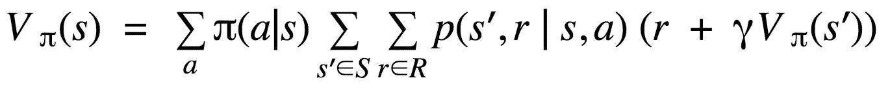
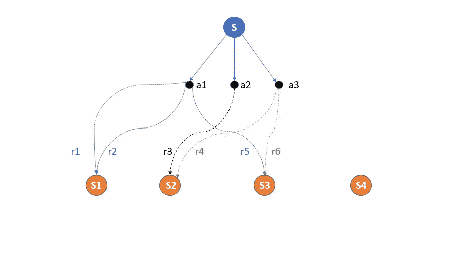
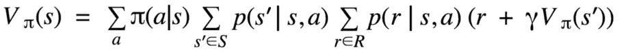
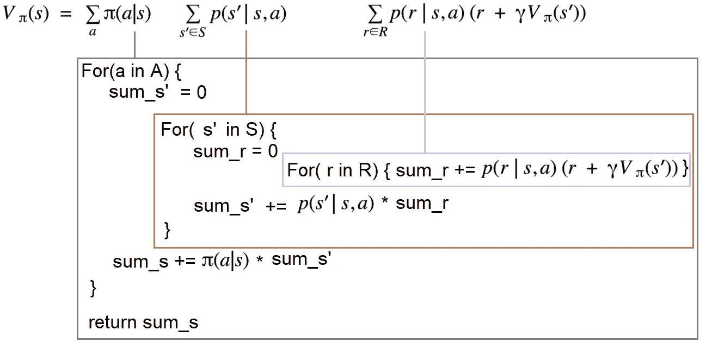

# 理解强化学习数学，面向开发人员

> 原文：<https://towardsdatascience.com/understanding-reinforcement-learning-math-for-developers-b538b6ef921a?source=collection_archive---------23----------------------->

## 开发人员破译强化学习数学公式的温和方法


在 [Unsplash](https://unsplash.com?utm_source=medium&utm_medium=referral) 上由[Tine ivani](https://unsplash.com/@tine999?utm_source=medium&utm_medium=referral)拍摄的照片

**更新**:学习和练习强化学习的最好方式是去[http://rl-lab.com](http://rl-lab.com/)

如果你是一个数学知识不足的开发人员，你可能很难掌握强化学习的基本公式。



对于没有足够数学背景的人来说，理解这个等式可能很有挑战性。然而，除了神秘的符号之外，理解起来并不困难。

归结起来就是问一个问题:在 S 状态下有什么价值？
更具体地说，假设你在一个电视节目中，放在两扇门前，一扇门后面有 5000 美元，另一扇门有 1000 美元，要求你选择一扇门打开。


罗伯特·阿纳施在 [Unsplash](https://unsplash.com?utm_source=medium&utm_medium=referral) 上拍摄的照片

你不知道哪个是哪个，所以你有相同的概率打开其中任何一个。现在的问题是，出演这部电视剧值多少钱？答案相当简单。在最坏的情况下，它值 1000 美元(因为你可以赢得最少 1000 美元)，在最好的情况下，它值 5000 美元(因为你可以赢得最多 5000 美元)。为了只有一个值，我们计算平均值为 3000 美元。

所以这种情况或状态的价值，就是你可以期望得到的(平均而言)未来的奖励或回报。

让我们稍微修改一下假设。你被告知左边的门包含 5000 美元，右边的门包含 1000 美元，但是要打开其中任何一扇门，你必须用球击中锁，有 20%的机会击中左边门的锁，有 80%的机会击中右边门的锁。

这种情况的价值是什么？

这将是未来的回报乘以获得它们的概率，所以:
.2 * 5000 + .8 * 1000 = 1800 美元

直观上，我们可以把状态 V(S)的价值想象成贴现的未来回报的总和，用得到它们的概率来加权。

需要贴现因子( **γ)** ，来源于你在遥远的未来得到的一个奖励，比你在下一步得到的奖励更没有价值，所以会按照达到它所需的步数来贴现，例如: **γ*γ*…。*γ*r，**其中 **γ** 的乘法次数等于达到奖励的步数。

数学细节可以在本文中找到[强化学习背后的数学，简单易行的方法](/math-behind-reinforcement-learning-the-easy-way-1b7ed0c030f4)

下图显示了状态、行动、奖励和目标状态之间的关系。



状态 S 有 3 个可能的动作(a1，a2，a3)。每个行动将导致一个或多个目标状态(S1、S2、S3)和不同的奖励(r1、r2、r3、r4、r5、r6)。注意，从 s 到 S4 是不可达。每条边(或箭头)代表沿其路径的一种可能性。

你可以看到状态 S 有 3 种可能的行动，每一种都导致一种或多种不同概率和不同回报的状态。值得注意的是，州 S4 从 S 是不可到达的，但是如果采取行动 a1，S1 是可到达的，并且将导致 2 个可能的奖励。如果采取了动作 a2 或 a3，则可以从 S 到达州 S2。实际上 a2 肯定会到达 S2，而 a3 可能以不同的概率到达 S2 或 S3。

一个状态 ***s*** 的值 V(s)，将是采取一个动作 ***a*** ，的概率乘以到达状态***‘s’***，乘以获得一个奖励的概率 ***r*** ，乘以期限(t)
但是因为在每个阶段我们可能有几个选项，意味着几个动作可供选择，这导致几个可能的状态***‘s’***和几个可能的奖励 ***r*** 。我们需要总结所有这些不同的选择。

初始公式可以改写如下。



# 翻译成代码

这个公式如何转化成代码相当简单。
每个 sum(σ)转换成一个循环，如下图所示。



其中 A 是所有动作的集合，S 是所有状态的集合，R 是所有可能的奖励的集合，

代码显示的内容对开发人员来说可能很奇怪。它在动作集合 A 中的所有动作、状态集合 S 中的所有状态以及奖励集合 r 中的所有奖励上循环。然而，我们知道，有时并非所有动作在所有状态下都可用，并且并非所有状态都可以从当前状态到达，当然，并非所有类型的奖励对于每个动作和每个状态都可用。
所以循环遍历所有这些集合纯粹是浪费精力和时间。
有一些方法可以优化代码以提高性能。

# 最佳化

看上面的图，很容易看出嵌套循环的数量。
从编程角度来说，可以进行一些优化。没有必要循环所有动作、所有状态和所有奖励。但是我们将只遍历可能的选项，忽略不可用的选项。

例如，并不是所有的动作集都出现在所有的状态上，所以我们不是在一个上循环，而是在该状态下可用的动作上循环，例如 state.getAvailableActions()。
同样，代替整个状态集 S，我们循环遍历从当前状态可达的状态，state.getAccessibleStates()，代替所有奖励 R，我们循环遍历与当前状态和所选动作相关的可能奖励，getRewards(state，a)。

下面的伪代码创建了一个描述状态行为的接口(IState)。这个接口将在下面的算法中使用。

```
interface IState {

// returns list of states accessible from the current state
function getAccessibleStates() // returns list of actions that can be performed in current state
function getAvailableActions()

// return probability of taking action 'a' in the current state
function getActionProbability(IAction a)// returns the probability of arriving at state s' when performing
// action a
function getStateProbability(IState s', IAction a)// get value of the state
function getValue()// set value to the state
function setValue(double v)}
```

类 R 表示在给定状态 ***s*** 和动作 ***a*** 的情况下返回奖励的实用程序类。函数 getReward(s，a)只返回一个奖励，而 getPossibleRewards(s，a)返回一个奖励列表。
函数 getrewardpability(r，s，a)返回在状态 ***s*** 和执行动作 ***a*** 时获得奖励 ***r*** 的概率。

在许多情况下，奖励系统很简单，也就是说每个州和每个行动只有一个奖励。所以 getReward(s，a)和 getPossibleRewards(s，a)返回相同的奖励，getrewardpability(r，s，a)返回 1。

```
class R {// returns the reward when at state s and performing action a static static function getReward(IState s, IAction a)// returns list of rewards when at state s and performing action a
static function getPossibleRewards(IState s, IAction a)// get the probability of getting reward r when at state s 
// and performing action a
static function getRewardProbability(IReward r, IState s, IAction a)}
```

函数 computeStateValue(s)计算一个状态的值*在最一般的情况下，我们假设奖励系统可能不简单，对于同一个状态/动作对可能有几种可能的奖励。*

```
*function computeStateValue(IState s){
 sum_s = 0

 for( a in ){
  sum_s' = 0

  for(s' in s.getAccessibleStates()){
   sum_r = 0

   for(r in R.getPossibleRewards(s, a)){
    sum_r += R.getRewardProbability(r, s, a) * (r + gamma 
             * s.getValue())
   }

   sum_s' += s.getStateProbability(s', a) * sum_r
  }

  sum_s += s.getActionProbability(a) * sum_s'
 }

 return sum_s
}*
```

*假设奖励系统很简单，函数 computeStateValueSinpleReward(s)计算状态 s 的值。所以不需要循环遍历可能的奖励，只是我们简单的调用 R.getReward(s，a)，得到的概率是 1。*

```
*function computeStateValueSinpleReward(IState s){
 sum_s = 0

 for( a in s.getAvailableActions()){
  sum_s' = 0

  for(s' in s.getAccessibleStates()){
   sum_s' += s.getStateProbability(s', a) * (R.getReward(s, a) 
             + gamma * s.getValue())
  }
  sum_s += s.getActionProbability(a) * sum_s'
 }

 return sum_s
}*
```

*不难注意到，上面的代码涉及一个状态的计算。为了计算所有状态的值，我们对所有状态集进行循环，如伪代码函数 computeValueForAllStates()所示*

```
*function computeValueForAllStates(){
 for( s in S){
  v = computeStateValue(s)
  s.setValue(v)
 }
}*
```

# *结论*

*该公式的实现非常简单。然而，这本身是不够的，因为许多参数在现实生活中是未知的。出于这个原因，有很多其他技术可以用来帮助估计这个公式的每个组成部分。*

# *相关文章*

*   *[强化学习背后的数学，最简单的方法](/math-behind-reinforcement-learning-the-easy-way-1b7ed0c030f4)*
*   *[开发者强化学习政策](https://medium.com/@zsalloum/revisiting-policy-in-reinforcement-learning-for-developers-43cd2b713182)*
*   *[Q vs V 在强化学习中，最简单的方法](https://medium.com/p/9350e1523031)*
*   *[数学背后的强化学习，最简单的方法](https://medium.com/p/1b7ed0c030f4)*
*   *[动态编程在强化学习中的简便方法](https://medium.com/@zsalloum/dynamic-programming-in-reinforcement-learning-the-easy-way-359c7791d0ac)*
*   *[蒙特卡洛强化学习中的简单方法](https://medium.com/@zsalloum/monte-carlo-in-reinforcement-learning-the-easy-way-564c53010511)*
*   *[TD 在强化学习中，最简单的方法](/td-in-reinforcement-learning-the-easy-way-f92ecfa9f3ce)*