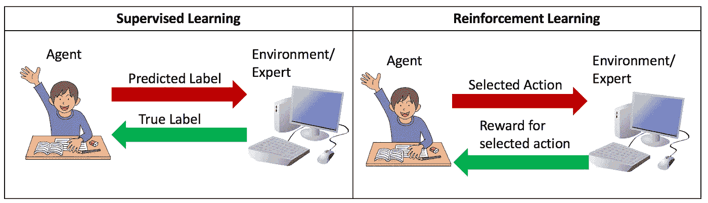
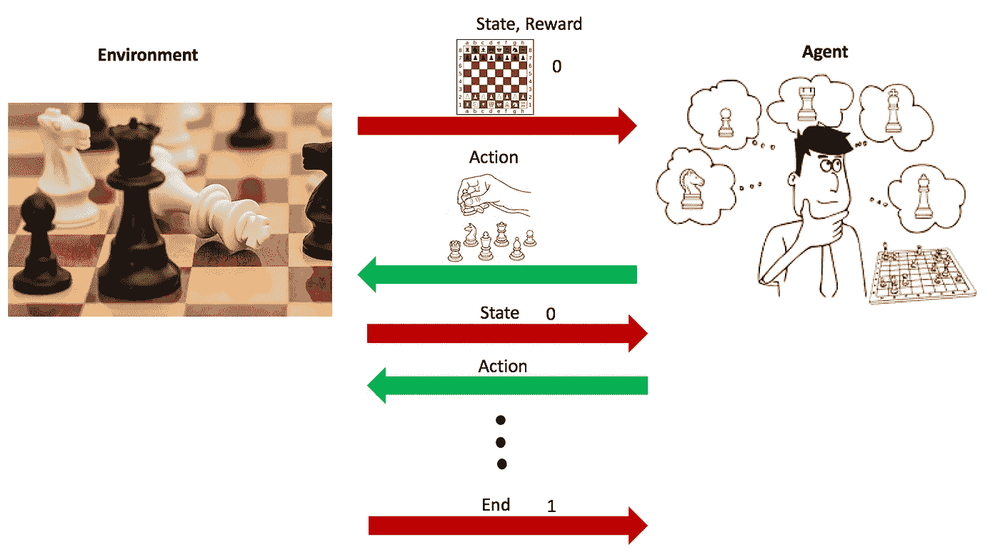
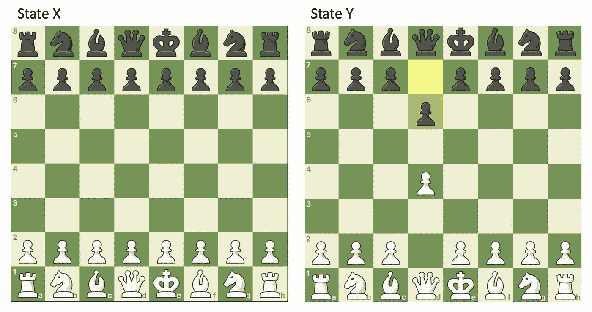
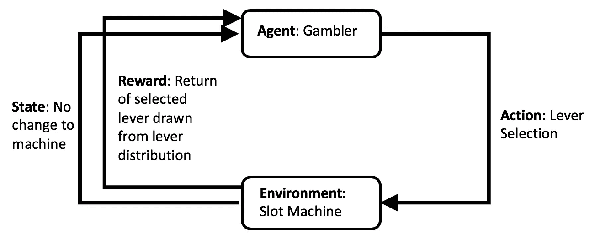

# 通过多武装匪徒理解强化学习

> 原文：<https://towardsdatascience.com/understanding-reinforcement-learning-through-multi-armed-bandits-39095dee6846?source=collection_archive---------23----------------------->

# 强化学习

强化学习(RL)是机器学习的一个方向，源于观察人类如何与环境互动。

为了更好的介绍 RL，我们先把它放在人类学习的背景下来理解。当一个孩子进入一个新的环境(即充满玩具的房间)，他不知道环境中的目标是什么。相反，他执行基本上是随机的任务，在行动中学习周围环境的新事物。例如，他随机拿起一个尖锐的玩具，并意识到尖锐的玩具会引起疼痛。他选择了一个盒子，发现里面有一份快餐。通过这一集，孩子在学习。孩子知道尖锐的物体会引起疼痛，盒子里可能会有有用的物品，从而发展出一套规则来帮助指导他以后在这个环境中的决定。孩子通过环境的强化来学习。

强化学习的特点是一种学习框架。学习目标是指导代理通过与环境交互来实现目标。**强化学习与监督学习的不同之处在于从专家监督者那里获得的信息的指导性。**

作者图解。插图通过[公共领域矢量](https://publicdomainvectors.org/en/free-clipart/Raised-hand-student/82848.html)和[免费 SVG](https://freesvg.org/cartoon-desktop-computer-vector-image) 。

在监督学习中，我们可以将使用(例如，标签)对的训练视为一个学习代理，向专家监督器提供给定训练示例的预测标签，专家监督器返回真实标签。专家的标签是**完整的**反馈，其中包含要采取的正确行动(真实标签)。

另一方面，强化学习中的环境 oracle 只提供**不完整的**反馈。RL 代理不是接收正确的(真实的)动作，而是仅获得与他们选择的动作相对应的奖励。代理不知道是否存在更好的行动，并且必须依赖于过去奖励的一些历史来比较他们收到的奖励，以便获得所选行动是否有利的感觉。完整的信息只有通过与环境的反复互动才能获得。

现在，让我们定义一个强化学习系统的主要元素:政策、奖励函数、价值函数和环境模型。例如，我们将考虑的环境是一盘棋。

作者图解。照片由 [stevepb](https://pixabay.com/users/stevepb-282134/) 通过 [Pixabay](https://pixabay.com/photos/checkmate-chess-resignation-1511866/) 拍摄。经由[公共领域载体](https://publicdomainvectors.org/en/free-clipart/Chess-coloring-book/60712.html)的说明。

代理和环境在序列中的离散时间步骤上相互作用。在每一个时间步，代理接收环境的状态的一些表示。

这是国际象棋环境的两种不同状态。这盘棋有 [10 个⁰](https://en.wikipedia.org/wiki/Shannon_number) 不同的状态。截图来自[棋牌在线](https://www.chess.com/play/computer)。

基于环境的状态，代理从其可能的动作集中选择一个**动作**。一个时间步长后，环境会发生变化，以反映所选操作产生的下一个状态。随着环境的变化，代理人从环境中收到一个数字奖励**。**

1.  **代理**是通过强化执行学习的系统的参与者。
2.  **策略**是学习代理的行为方式:它们用来在环境的不同状态下选择动作的一套规则。例如，国际象棋选手选择下哪一枚棋子的算法。
3.  奖励函数定义了环境中的目标。它将状态(或状态-动作对)映射到单个实数值。在国际象棋的例子中，当游戏进行时，所有状态的奖励可能是 0，一旦游戏结束(将死)，如果代理赢了，奖励是 1，如果他输了，奖励是-1。RL 代理的目标是最大化长期回报。
4.  **价值函数**概括了每个行动对最大化长期回报目标的影响。价值函数将环境的状态映射到单个值——如果从该状态开始游戏，代理可以预期获得的奖励总额。价值函数有助于在博弈过程中指导代理人。在国际象棋中，一些走法(如危及你的国王)通常是不利的，即使它们不会导致输掉比赛，价值函数捕捉这些信息以向学习者提供比简单的奖励函数更多的信息，而奖励函数通常是不够的。
5.  环境的**模型是代理在与环境交互后对环境如何运行的预测。该模型将状态-动作对映射到状态。在国际象棋的例子中，环境模型可以简单地是选择一个动作移动棋盘上的选定棋子，并且当着陆位置在对手棋子的顶部时消除对手棋子。**

图片来自理查德·萨顿和安德鲁·巴尔托的强化学习[1]

# 多股武装匪徒问题

这导致我们现在的多武装匪徒问题，最简单的强化学习问题的公式。

多臂土匪。(图片来源:[微软研究院](http://research.microsoft.com/en-us/projects/bandits/))

问题如下。考虑一个带 *n* 操纵杆的老虎机。你会反复面对拉动 *n* 控制杆的选择。每拉一次杠杆，你就会从基于你选择的杠杆的固定概率分布中得到一些奖励。你的目标是通过杠杆拉动的总次数来最大化你的长期累积回报。这就是 **N 臂土匪问题**。

强化学习框架中的多武装匪徒问题。形象的灵感来源于[1]。

作为玩家，最好的解决方案是什么？如果你找到一个能提供积极回报的杠杆，那很好，但这是最好的杠杆吗？是否有其他更好的选择能带来更高的平均回报，寻找其他杠杆是否值得？或者你应该坚持你所知道的，拉你知道是体面的杠杆，但可能不会提供最高的回报？这些问题定义了期望-探索的权衡。

**期望-探索权衡**是在重复决策中的两难问题，在这种情况下，对世界有不完全了解的代理人必须决定是重复以前行之有效的决策(利用)还是选择新的、未探索的决策，以期获得更大的回报(探索)。选择重复过去最有效的决策被称为**贪婪**行动。

解决期望-探索权衡问题的一种方法是在利用迄今为止的最佳行动和探索其他行动之间交替进行。这些近乎贪婪的方法被称为 **ɛ-greedy 方法**。大多数时候，代理人的行为是贪婪的，但偶尔，用概率ɛ，我们在所有可能的行为中随机地、均匀地随机选择一个行为。一种变化是基于不确定性从分布中随机选择动作。因此，代理更有可能选择过去不常选择的动作。汤普森采样是另一种解决多武装匪徒问题的算法。这篇帖子的重点不是解决多股武装匪徒的问题，因此我推荐康纳·麦克唐纳的[帖子](/solving-multiarmed-bandits-a-comparison-of-epsilon-greedy-and-thompson-sampling-d97167ca9a50)来解决多股武装匪徒的问题。

这篇文章通过强化学习的视角展示了多臂土匪框架。强化学习代理，如多臂强盗，在没有任务先验知识的情况下进行优化，使用来自环境的奖励来理解目标并更新其参数。

## 参考

[1]理查德·萨顿和安德鲁·巴尔托。强化学习导论。麻省理工学院出版社，美国马萨诸塞州剑桥，第一版，1998 年。

[2][https://towards data science . com/solving-multi armed-bottons-a-comparison-of-epsilon-greedy-and-Thompson-sampling-d 97167 ca9a 50](/solving-multiarmed-bandits-a-comparison-of-epsilon-greedy-and-thompson-sampling-d97167ca9a50)